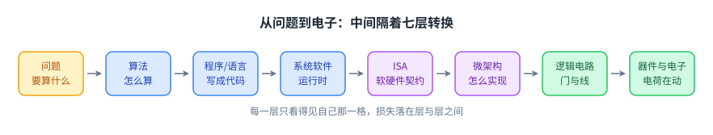
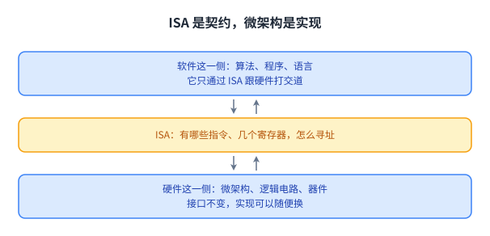
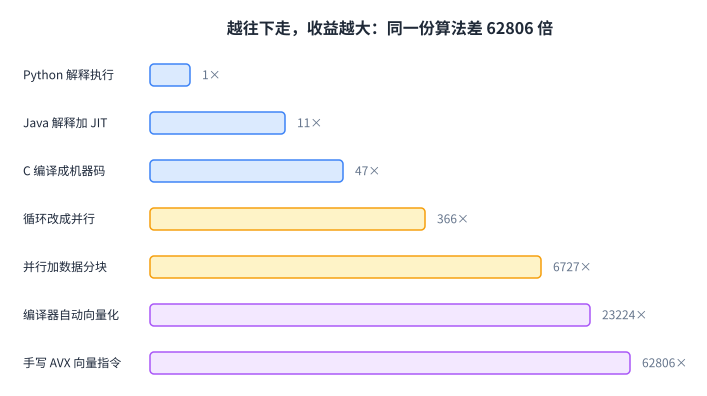
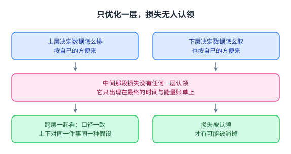
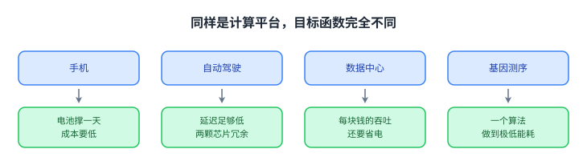
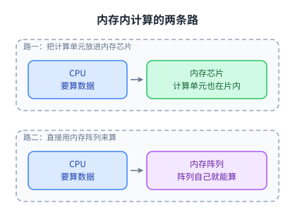
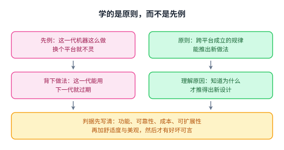
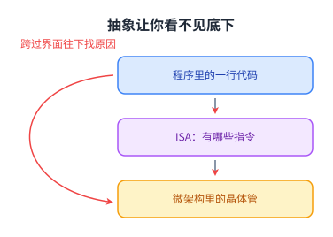
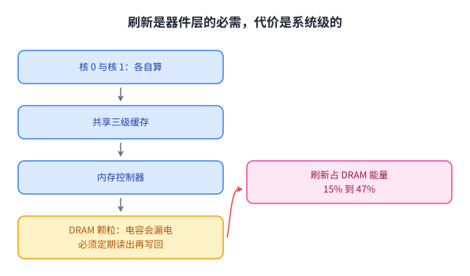

+++
title = "导论与基础：体系结构在解决什么问题"
lecture = 1
slug = "lecture1-intro"
status = "reviewed"
source_kind = "notes"
source_url = "https://safari.ethz.ch/architecture/fall2022/lib/exe/fetch.php?media=onur-comparch-fall2022-lecture1-intro-afterlecture.pdf"
source_title = "Lecture 1: Introduction and Basics (Fall 2022, afterlecture)"
output_mode = "explanation"
+++

> 来源课程：ETH Zürich **Computer Architecture**（Onur Mutlu 主讲，Fall 2022）；
> 对应讲义：Lecture 1 — Introduction and Basics（`onur-comparch-fall2022-lecture1-intro-afterlecture.pdf`，335 页）；
> 讲义链接：<https://safari.ethz.ch/architecture/fall2022/lib/exe/fetch.php?media=onur-comparch-fall2022-lecture1-intro-afterlecture.pdf> ；
> 上游许可：该课程 wiki 每一页的页脚都带站点级许可块，原文为 CC BY-NC-SA 4.0 —— <https://creativecommons.org/licenses/by-nc-sa/4.0/deed.en> ；
> 本页由 CourseLingo 用中文重新讲解，按源讲义的推进顺序组织，**不是逐字翻译**，也不转载原讲义里的任何图片；
> 页内配图全部由我们自绘（原讲义里只有图、没有字的页，我们把它要讲的机制重画出来）。
> 本页为非官方材料，与 ETH Zürich 及课程教学团队无隶属关系；如与原文有出入，以原文为准。

## 这一讲要回答什么问题

先看一组真实测量。两个 4096×4096 的矩阵相乘，用 Python 写要跑 25552.48 秒，也就是 7 个多小时。同一份算法用 C 写是 542.67 秒。把循环改成并行是 69.80 秒。再让编译器自动向量化是 1.10 秒。最后手写 AVX 向量指令，变成 0.41 秒。

从 7 小时到 0.41 秒，差了 62806 倍。**算法一次都没改**，改的只是它在机器上怎么落地。

初学体系结构时最常见的误解，是把这种差距记在「语言快慢」或者「编译器好不好」的账上。语言和编译器确实有影响，但它们只是链条上的两环。真正决定上限的，是底下那几层硬件被设计成什么样，以及上面那几层有没有顺着它去写。

这一讲要解决的就是这个：把「一个程序到电子流动」之间的层铺开成一张地图，然后说明为什么这些层必须放在一起看。

程序慢的时候，原因可能落在其中任何一层，而每一层能看到的都只是自己那一格。

源讲义在这一页之后列了「为什么要学体系结构」的四条理由：让计算机更快、更便宜、更小、更可靠；让新的应用成为可能，比如二十年前只存在于想象里的三维可视化、虚拟现实、自动驾驶、个人基因组；让问题有更好的解法，因为软件的每一次创新都建立在体系结构提供的新能力上；以及理解计算机为什么是这样工作的。

这四条里最后一条最容易被跳过，也最重要。前三条都是「能做出什么」，最后一条是「出了问题时你知道该往哪儿看」。

顺便说明这份讲义的构成。它是 afterlecture 版，335 页，其中第 190 至 285 页被整段标注为 Further Slides for Your Own Study，也就是留给课后自己看的补充材料，课上不一定会讲到。本页按讲授主线组织，凡有内容出自那一段，该节开头会点明。

## 从算法到电子：一个计算系统有哪些层

源讲义给这张地图起的名字是[[term:transformation-hierarchy]]（转换层次）。从最上面往下数：问题、算法、程序与语言、系统软件（虚拟机、操作系统、内存管理）、[[term:ISA]]、[[term:microarchitecture]]、逻辑电路、器件与电子。

每一层都有自己的说法。算法是一个一步步执行、保证会终止、每一步都能被计算机照做的过程，它要求有限性、确定性、可有效计算。同一个问题可以有很多个算法。程序与语言这一层负责把算法写成机器能执行的形状。

初学者最容易混的是中间那两层，所以单独说清楚。

[[term:ISA]]是软件和硬件之间的契约。它规定有哪些指令、几个寄存器、内存怎么寻址，但**不规定这些指令怎么被实现**。源讲义的原话是：

> Interface/contract between SW and HW. What the programmer assumes hardware will satisfy.
>
> 它是软硬件之间的接口与契约，也就是程序员假定硬件一定会满足的那些事。

[[term:microarchitecture]]才是实现。讲义对它的定义只有一句「ISA 的一种实现」；具体到今天的芯片，几级[[term:pipeline]]、要不要乱序执行、[[term:cache]]做多大、分支怎么预测，都写在这一层（这几个例子是我们补的，讲义只给了那句定义）。同一个 ISA 可以有差别很大的微架构，同一份程序因此可以跑在从省电到极速的不同芯片上。

打个比方。ISA 是菜单，微架构是厨房。你可以换掉整个厨房的设备和流程，只要端出来的菜和菜单一致，点菜的人就不需要知道任何变化。

这张契约之所以重要，是因为它把「换实现」和「改程序」解耦了：软件投资不会因为硬件换代而作废，硬件也可以在不破坏软件的前提下逐代改进。

## 同一条矩阵乘法，为什么差了 6 万倍

现在回到开头那组数字，把它按层次摊开看。

Python 慢在语言这一层。它的三重循环有 4096 的三次方次迭代，每次迭代都要经过解释器：取对象、判断类型、再调用。上百亿次解释开销叠起来，就吃掉了 7 小时。

C 把这层去掉了，同样的循环直接编译成机器指令，拿到 47 倍。这一步的收益来自「少做无用功」，而不是来自更聪明的算法。

并行循环动的是算法这一层：把可以同时做的事分给多个核。它拿到 366 倍，但前提是这份计算本身可切分。切不开的部分不会因为核多而变短，这解释了为什么并行循环只有 366 倍而不是 47 乘以核数。

并行分治换了个切法，让每个核处理的数据更贴近自己的[[term:cache]]，于是拿到 6727 倍。这个倍数并不对应上面那五个实测时间里的任何一个（讲义在另一处给出它），差额来自访存模式，而不只是并行度。到这一步，瓶颈已经从处理器搬到了内存这一侧。

向量化的 23224 倍和 AVX 的 62806 倍，动的是微架构这一层。AVX 让一条指令一次处理一整个向量，硬件里本来就存在的向量单元这才被用上。前面几层做的是「少做无用功」，这一层做的是「一次做更多」。

这张阶梯里没有哪一层包打天下。语言那一层只能拿到几十倍，越往下收益越大，但要求你对硬件知道得越多。

这也是为什么体系结构这门课不站在任何单独一层上，而是问：这一层给了上面什么，又从下面拿到了什么。

## 公理：只优化一层，拿不到最好的结果

源讲义在这一页上写了一条公理，值得逐字看一下。

> To achieve the highest energy efficiency and performance: we must take the expanded view of computer architecture.
>
> 要达到最高的[[term:energy-efficiency]]与性能，我们必须采用「扩展视野」的体系结构观。

它后面跟了两句话，解释了扩展视野要做什么：跨越从算法到器件的所有层一起协同设计，并且在设计目标允许的范围内尽量特化。

这里的逻辑并不神秘。每一层都只能看到自己的接口，所以它做出的选择对邻居来说必然是外部给定的。当上面把数据排布成一种形状、下面却按另一种形状去取，中间那段损失没有任何一层会认领，它只出现在最终的时间与能量账单里。

源讲义把这件事写成「上面和下面都有很大空间，但当你让上下沟通良好、一起优化时，空间要大得多」。它引用的是两条相隔六十年的观察：费曼 1959 年说底部还有很大空间，指的是在更小的尺度上做器件；Leiserson 等人在 2020 年说顶部还有很大空间，指的是摩尔定律之后性能要靠上层的新做法来驱动。

跨层设计不是「把每一层都做得更强」，而是让上下两层对同一件事取同一种假设。取不到一致，就白做。

## 平台不一样，目标就不一样

源讲义接着用一整段幻灯片展示各种平台：无人机、手机、自动驾驶汽车、数据中心、超级计算机、ML 加速器、基因测序仪、以及把计算放进内存的系统。

它们的目标并不相同，而且这些目标常常写成了具体的数字。

手机要的是装在口袋里、电池撑一天、成本低于某个数。自动驾驶要的是在够低的延迟下做到够可靠：源讲义给出的例子是 260 mm²、60 亿晶体管、一个 600 GFLOPS 的 GPU 加 12 个 2.2 GHz 的 ARM CPU，而且为了安全用了两颗互为冗余的芯片。

数据中心的 ML 加速器要的是吞吐与能效。源讲义给的例子是 Google 的 [[term:TPU]]：2021 年一代每颗芯片 250 TFLOPS，而上一代 TPU3 是 90 TFLOPS，一块板子做到 1 ExaFLOPS。它的核心是一个脉动阵列，用数据在阵列里流动来完成矩阵乘，专门为神经网络服务。

超级计算机要的是在某类科学计算上做到地球最快，测序仪要的是把一个特定算法做到极低的能耗，甚至做成握在手里的小设备。同一份讲义还展示了把内存芯片直接变成计算场所的系统，一块板子上并列着几十颗内存芯片。

所以「设计一个计算机体系结构」这句话本身不完整，它必须带着一串目标一起说。源讲义对体系结构的定义正是这样写的：

> The science and art of designing, selecting, and interconnecting hardware components and designing the hardware/software interface to create a computing system that meets functional, performance, energy consumption, cost, and other specific goals.
>
> 它是一门科学与手艺：设计、挑选并互连硬件部件，设计软硬件接口，做出一个满足功能、性能、能耗、成本等特定目标的系统。

一门课如果只讲「怎么让机器更快」，就会漏掉后面那串目标。这也是本课程后面反复回到取舍的原因：同一个改动，在一个平台上叫优化，在另一个平台上叫退步。

## 当前的体系结构面对什么

源讲义把当下的困难列成一串：数据量暴涨、功耗与散热受限、设计复杂度、工艺缩放变难、内存瓶颈、可靠性、可编程性、安全与隐私。它对这些问题的结论只有一句：没有清楚、确定的答案。

到了第 285 页的 Takeaways，同一件事被总结成五堵墙：能量、可靠性、复杂度、安全、可扩展性。这一页同样在课后自学那一段里。

能量这一堵墙最直观。这里先说清依据：源讲义对五堵墙只给了名字，正文里各堵墙的机理说明是我们按标准教科书补的；其中可靠性与安全另有两页讲义的补充幻灯片可依。过去几十年，工艺每进步一代，电压就能跟着降一档，频率还能往上提，功耗密度大体不变，于是性能和功耗可以同时改善。这条规律停下来之后，电压降不动了，频率也不敢再往上拉，芯片上就出现了「有些区域必须在某个时刻关掉」的局面。省能量不再是附带好处，而是设计的第一约束。

可靠性来自器件变小本身：同样的电荷代表的差别越来越小，外界扰动更容易把它翻过去。安全墙的源头常常也在底层，源讲义在补充幻灯片里花了很长篇幅讲 [[term:RowHammer]]、Meltdown 与 Spectre：反复激活内存的同一行会让相邻行出错，而处理器的[[term:speculation]]会把不该被看到的数据带进[[term:cache]]。这两类问题都不是软件层面的疏忽，是硬件机制被反过来利用。

复杂度这一堵墙来自验证成本（这一句同样是我们补的背景）。一个设计只有在能被证明正确时才有价值，而核数、缓存层次、一致性协议、加速器都在增加，需要验证的状态空间随之爆炸。

可扩展性这一堵墙指的是：把核数、缓存层次与内存带宽一起往上加的收益在递减，能加的东西越多，协调它们的代价涨得越快。源讲义只给了这个名字，我们也没有可依的展开，这里只点到为止。

五堵墙的麻烦在于它们互相拉扯。为了省能量就得降频率、减少搬运，而减少搬运往往要靠更复杂的硬件，复杂度本身就是其中一堵墙。为了可靠性要加冗余，冗余又反过来吃能量和面积。这里没有「全都要」的解。

一个顺手可查的例子：Cerebras 的 WSE-2 把 2.6 万亿个晶体管做进 46225 mm² 的一块硅片，而当时最大的 GPU 是 542 亿个晶体管、826 mm²。芯片可以做到这么大，但散热、良率、以及这么大一块怎么喂饱，立刻变成新问题。

## 真正的瓶颈是数据搬运

源讲义在第 267 页写了一句话：计算被数据卡住了。这一节依据的幻灯片（第 267 至 274 页）落在上面说的课后自学段里。它不是修辞，有两个可量的依据。

第一个依据来自 Dally 在 HiPEAC 2015 上给的那张图：**一次内存访问消耗的能量，约等于一次复杂加法的 100 到 1000 倍。** 注意单位是能量而不是时间。算得再多也只是烧一点点电，把数据搬来搬去才是账单上的大项。

第二个依据来自对 Google 移动端负载的实测：系统总能量里有 62.7% 花在[[term:data-movement]]上。也就是说，手机耗电的大头不是运算，而是把数据在存储和处理器之间来回搬。同一种现象在网页浏览器、机器学习框架、视频编解码上都出现过，源讲义把它们并排放在相邻两页上。

这两条合起来解释了为什么课程后面的很多内容都在做同一件事：让计算离数据更近。

把这件事换个角度说，就是[[term:memory-wall]]的另一面。处理器每代都能塞进更多计算单元，内存这一侧的[[term:latency]]和[[term:bandwidth]]却没有同等幅度地改善。差距拉大之后，处理器大部分时间在等数据，那些新增的计算单元就闲置了。

至于为什么搬运代价这么高，答案在物理上：数据要出芯片就得驱动片外引脚和长导线，那些导线的电容要充放电。片内走线的电容小得多，所以同样的数据，多走几毫米就多花一笔能量。

## 内存内计算的两条路

既然搬运是瓶颈，一个自然的想法是[[term:processing-in-memory]]：把一部分计算搬进内存，或者干脆用内存本身来算。

源讲义把这类做法分成两种，而且反复强调这个区分。第一种是 processing near memory，把计算单元放到内存旁边，可以放在内存芯片内部，也可以放在与内存同一封装里的逻辑裸片上。数据不用经过片外总线走远路，省下的正是上面那笔搬运能量。

第二种是 processing using memory，直接用内存阵列本身做运算。做法之一是同时激活多行，让它们在位线上按物理规律产生与、或、非的结果，也就是用 [[term:DRAM]] 内部本来就存在的模拟行为做按位运算。这类做法不需要额外放计算单元，但要重新设计内存的命令与时序。

源讲义用同一组标题反复讲这两种做法，说明它们不是同一件事：一个改变的是计算单元在哪儿，另一个改变的是谁来算。前者的实现相对直接，后者更依赖器件特性，也就更难做稳。

课程后面有整整两讲（第 3、4 讲）展开这两条路。这里只要记住它们的区别在于搬的是计算还是运算部件。补一句限定：配图只画了「把计算单元放进内存芯片」这一种放法，另一种（放进与内存同一封装里的逻辑裸片）没有画出来。

## 建筑师给的类比：原则、取舍与评估标准

源讲义用了一个很长的类比来讲「设计」这件事。它先放苏黎世的一座火车站 Bahnhof Stadelhofen，说这是圣地亚哥·卡拉特拉瓦早期的作品，直线和直角很少见，再放另一座火车站做对比，让读者自己找差别。

这一讲的第一个作业就是这个：去看那座车站，列出两个设计各自的强项、弱项与设计目标。作业的截止时间是学期里任意时刻，但讲义建议晚一点做，因为学过之后你才会有判据。

接着它给出评估一份设计的清单：功能是否满足规格、可靠性、空间占用、成本、可扩展性、用户舒适度、用户满意度、美观。最后一句是重点：怎么判定一个设计好不好，永远是个关键问题。

清单本身比其中任何一条都重要。它说明「好」不是一个标量，你必须先选定看哪个维度，再谈这个设计好不好。

源讲义引了卡拉特拉瓦自己的一句话：

> To me, there are two overriding principles to be found in nature which are most appropriate for building: one is the optimal use of material, the other the capacity of organisms to change shape, to grow, and to move.
>
> 对我来说，自然里有两条最适合建造的原则：一是材料的最优使用，二是生物改变形状、生长与运动的能力。

再用另一位建筑师的话把「原则」和「先例」分开：

> Architecture […] based upon principle, and not upon precedent. —— Frank Lloyd Wright
>
> 建筑应当基于原则，而不是基于先例。

这一讲要说明的是：体系结构里的原则就是那些跨平台都成立的取舍规律，而先例是某一代机器上的具体做法。只学先例，换个平台就不管用了。

源讲义还借库恩的书补了一层：常规科学阶段大家用同一套理论解释和改进，遇到例外就当成异常；革命科学阶段则回头检查最底层的假设。计算机体系结构现在正处在后一种状态里，所以它才需要一堆原则来判断哪个方向值得走。

## 抽象的力量，以及什么时候必须跨过它

层次带来的直接好处是[[term:abstraction]]：上一层只需要知道下一层的接口，不需要知道它怎么实现。源讲义举的例子很直白：写 Java 的人不需要知道 ISA，更不需要知道每个周期里晶体管怎么翻转。

抽象带来的是生产率。不用操心底下那些决定，你才能把注意力放在要解决的问题上。一门语言能跨过那么多代硬件继续用，靠的也正是这层契约。

代价是：一旦出问题，你就看不见原因了。源讲义列了一串「如果」：程序跑得慢、跑得不对、太费电、系统突然关机、被人攻破，而你完全不知道是为什么。硬件那一侧也有对称的一串：做出来的硬件太难编程，或者因为没给软件提供对的接口而太慢。

所以本课程给自己定了两个目标：一是搞清软件层底下处理器怎么工作、硬件的决定怎么影响写程序的人；二是让你在跨越层边界做决定时心里有底。

讲义最后给了两个必须跨层的例子。

第一个是多核系统。单核时代靠提高频率就能变快，频率上不去之后改成多核。于是[[term:cache]]一致性、内存带宽分配、并行编程全都跟着变了。一个器件层的限制，改写了从操作系统到应用的每一层。多核芯片的版图也说明了这件事：几个核各自带二级[[term:cache]]，共享三级[[term:cache]]，再往下是内存控制器与内存条。任何一层改动，都会沿着这条链传到别处。

第二个是[[term:refresh]]。DRAM 一个电容存一位，电容会漏电，所以必须周期性读出再写回。这个动作在器件层完全必要，却是纯粹的开销。源讲义在这里引了 Liu 等人在 ISCA 2012 的 RAIDR 工作，那一页的文本层上只有两个数字：15% 与 47%，加上这篇工作的出处，并没有写这两个数字是什么的比例。下面这层含义是我们按这篇工作补的解读：这两个数字是刷新占 DRAM 能量的比例，现在大约在 15% 这一档，容量继续增长之后会逼近 47%。

一个器件层的必需动作，变成了系统级的能量大项。要把它压下去，只能回到「数据放在哪儿、什么时候必须保留」这些上层问题上去，这正是跨层设计的样子。

## 小结：这一讲要带走的东西

第一，体系结构不是画 [[term:CPU]] 框图。它是一门在功能、性能、能耗、成本之间做取舍的手艺，取舍的判据必须和目标一起给出。同一个改动在两个平台上可以是优化，也可以是退步。

第二，从问题到电子之间有[[term:transformation-hierarchy]]，ISA 是其中的契约，[[term:microarchitecture]]是它的实现。同一份算法在不同层上的落地方式可以差 62806 倍，这就是这张地图值得记住的理由。

第三，当下的困难可以概括成五堵墙：能量、可靠性、复杂度、安全、可扩展性。它们互相拉扯，所以没有单一的解。

第四，最有分量的瓶颈是[[term:data-movement]]：一次内存访问的能量约是一次复杂加法的 100 到 1000 倍，而移动端实测有 62.7% 的系统能量花在这上面。把计算搬到数据旁边、或者直接用内存来算，是课程后面反复出现的两条路。

第五，[[term:abstraction]]让你不必知道底下发生了什么，但性能、能耗、正确性和安全出问题时，你必须能跨过层边界去看。这门课后面每一讲，基本都是在某一层上打开一个这样的口子。
