+++
title = "内存系统：挑战与机会"
lecture = 2
slug = "lecture2a-memory-trends"
status = "draft"
source_kind = "notes"
source_url = "https://safari.ethz.ch/architecture/fall2022/lib/exe/fetch.php?media=onur-comparch-fall2022-lecture2a-memory-trends-challenges-opportunities-afterlecture.pdf"
source_title = "Lecture 2a: Memory Systems: Challenges and Opportunities (Fall 2022, afterlecture)"
output_mode = "explanation"
+++

> 来源课程：ETH Zürich **Computer Architecture**（Onur Mutlu 主讲，Fall 2022）；
> 对应讲义：Lecture 2a — Memory Systems: Challenges and Opportunities（`onur-comparch-fall2022-lecture2a-memory-trends-challenges-opportunities-afterlecture.pdf`，139 页，2022-09-30）；
> 讲义链接：<https://safari.ethz.ch/architecture/fall2022/lib/exe/fetch.php?media=onur-comparch-fall2022-lecture2a-memory-trends-challenges-opportunities-afterlecture.pdf> ；
> 上游许可：该课程 wiki 每一页的页脚都带站点级许可块，原文为 CC BY-NC-SA 4.0 —— <https://creativecommons.org/licenses/by-nc-sa/4.0/deed.en> ；
> 本页由 CourseLingo 用中文重新讲解，按源讲义的推进顺序组织，**不是逐字翻译**，也不转载原讲义里的任何图片；
> 页内配图全部由我们自绘（原讲义里只有图、没有字的页，我们把它要讲的机制重画出来）。
> 本页为非官方材料，与 ETH Zürich 及课程教学团队无隶属关系；如与原文有出入，以原文为准。

## 这一讲要回答什么问题

1996 年，Richard Sites 在一篇文章里留下一句话：问题出在内存上，笨蛋。这话不是情绪，而是当时就已经能测出来的结论。

本世纪初有一项工作专门对付这件事。处理器停下来等内存的时候，与其干等，不如先往后跑一段，把后面那些不依赖当前数据的访存都发出去，等数据回来了再重放一次。这项叫 runahead execution 的工作在 2021 年拿到了 HPCA 的 Test of Time 奖，说明「等内存」在二十年前就已经严重到值得用一整套机制去绕。

二十多年过去，问题没有变轻。Google 在 2015 年对自己全部数据中心负载做过一次画像，结论是这些负载大多被内存卡住。处理器那一侧的改进一直在继续，而内存这一侧跟不上，差距就变成了处理器空转的时间。

这一讲要解决的就是这个问题：内存到底卡在哪，为什么会卡住，以及现在有哪几条路可以走。

关于取材范围说明一句：这份讲义 139 页，第 125 页之后主要是论文清单、处理内存计算的教程与后续几讲的安排，本页只取其中与内存趋势直接相关的部分（例如第 138 页那份挑战清单）。

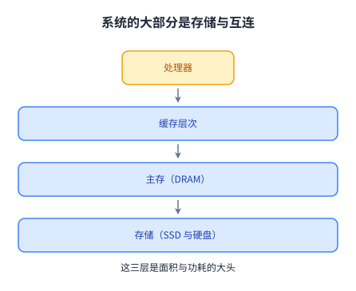

左边是真正在计算的部件，右边是围着它转的存储与互连。面积的大头在右边，瓶颈也在右边。

## 主存系统在整机里的位置

源讲义先用三页把位置摆清楚：处理器与缓存在一头，主存（main memory）在中间，存储设备（SSD 与硬盘）在另一头。后面它又补上两张：GPU 与 FPGA 也挂在同一份主存上。

这两组图的差别只有一处，但很关键：从「处理器加缓存加主存加存储」这条直线，变成了一张有多个主子的星形。GPU 与 FPGA 不像缓存那样只服务一个核心，它们是独立的主体，各自按自己的节奏向主存取数据。

源讲义给主存系统的定位是一句很有分量的话：它是所有计算系统的关键部件，服务器、手机、嵌入式、桌面、传感器都算。而它必须在容量、技术、效率、成本与管理算法上同时跟上，否则性能增长与技术缩放带来的好处都会停住。

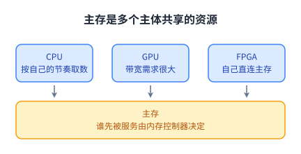

共享这件事后面会反复出现：只要资源是多个人抢的，就会有人被饿死，这就是后面「内存干扰」一节的由来。

源讲义还顺手用一组芯片照片说明了「现代系统的大部分是内存」：1995 年的 Intel Pentium Pro 把[[term:cache]]做成同一封装里的另一块芯片；2021 年的 Apple M1 直接把内存放到处理器旁边；同年 AMD 用硅通孔把一块额外的 64 MB 三级缓存芯片叠在处理器上，把 8 核的三级缓存从 32 MB 提到 96 MB。同一时期 IBM POWER10 的共享三级缓存是 120 MB，Nvidia Ampere 的二级缓存是 40 MB。缓存越做越大、越叠越高，原因就是主存太慢。

## 需求在涨，供给在掉队

源讲义把影响主存的趋势列成五组幻灯片，反复回到同样的三条。

第一条是需求：容量、带宽、[[term:qos]]的要求都在涨。原因有三个，而且它们同时发生。核数在涨，于是同时向内存提要求的主体变多；数据密集的应用越来越主流，于是每次要的量变大；整合也在推进，云、GPU、手机都倾向于把更多东西塞进同一台机器，于是争抢变得更激烈。

第二条是能量：主存是系统设计的关键约束。源讲义在这里给了两组数字：片外存储层次要花掉系统约 40% 到 50% 的能量，而 [[term:DRAM]] 本身要占掉超过 40% 的功耗。更要紧的是 DRAM 在不用的时候也耗电，因为它必须周期性刷新。

第三条是 DRAM 的工艺缩放正在走到尽头。缩放本来是三份好处一起拿：容量更大、成本更低、每比特能量更低。源讲义引用 ITRS 的判断，说 DRAM 在 40 到 35 纳米以下（对应 2013 年前后）就很难继续缩，于是这三份好处同时变难。

把第一条趋势量化，会得到一个反直觉的结论。源讲义引的是 Lim 等人在 ISCA 2009 的分析，原文给的是两个速率：内存条的容量大约每三年翻一番，而每核能分到的内存容量大约每两年下降 30%。这两个速率放在一起，隐含的结论就是核数大约每两年翻一番（这一句是我们按两个速率推的，讲义原文只写了容量与每核容量两个速率）。差距会逐年累积，[[term:bandwidth]]那一侧更糟，因为它本来就没有容量涨得快。

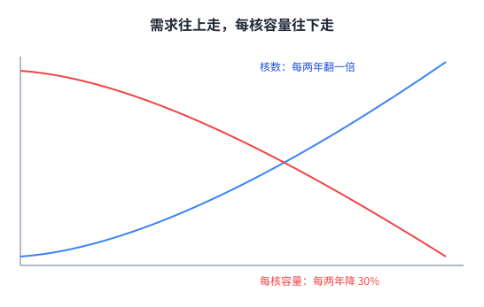

两条线的斜率差看起来不大，但它是按年复合的，十年下来就是数倍的差距。

同一个结论还有一组更直观的数字。1999 年到 2017 年，DRAM 的容量涨了 128 倍，带宽涨了 20 倍，而[[term:latency]]只从 1 变成 1.3 倍。

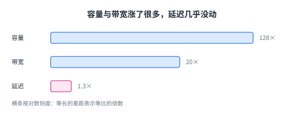

这张图解释了为什么[[term:memory-wall]]这个说法一直没被淘汰：容量与带宽可以靠并排更多颗粒、加宽总线去补，而延迟是另一回事，它由电荷被读出来的物理过程决定，不能靠加宽解决。

## 内存墙具体长什么样

延迟不降，处理器就只能等。源讲义在引用 Richard Sites 那句话的同一页上，把 runahead execution 作为应对方式列了出来：既然要等，就把等待期利用起来。

它的做法是给处理器加一个「跑在前面」的模式。当一条取数指令长时间不返回，处理器进入 runahead 模式，把之后那些与这个缺失数据无关的指令提前发出去。这些指令的结果不算数，只是为了把后面的访存提前发起，让内存侧忙起来。等真正的数据回来，处理器丢掉这些结果，从头再执行一遍，这时后面的数据大多已经在缓存里了。

这不需要把指令窗口做得极大，也不需要猜对分支，代价是重复执行一段指令，收益是把等待时间换成有用的访存预取。

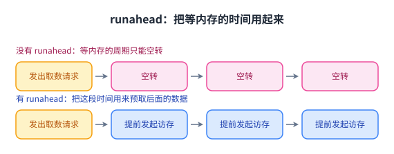

上半段是处理器发出请求后停住，下半段是同样的等待时间被用来预取。收益大小取决于等待有多长，等得越久越划算。

## 能量账：搬一次数据比算一次贵得多

如果说延迟决定「慢不慢」，那么能量决定「能不能一直这么干下去」。源讲义在这里给了两组互相印证的测量。

第一组来自 Dally 在 HiPEAC 2015 的报告：一次内存访问消耗的能量约等于一次复杂加法的 100 到 1000 倍。

第二组来自 Han 等人在 ISCA 2016 给出的逐项数字，单位是皮焦（pJ）。一次整数加法 0.1 pJ，一次浮点加法 0.9 pJ，访问一次寄存器文件 1 pJ，整数乘法 3.1 pJ，浮点乘法 3.7 pJ，访问一次片上 SRAM 缓存 5 pJ，而访问一次 DRAM 是 640 pJ。

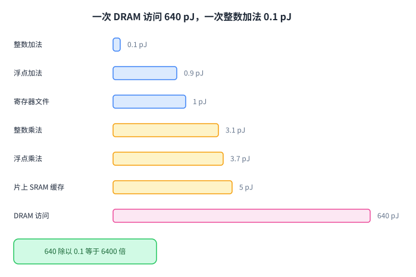

640 比 0.1，差了 6400 倍。也就是说，少算几次几乎不省电，少搬一次数据才是省电的大头。

源讲义在移动端把这个账算到了系统层面。对 Google 消费级设备负载的实测显示，系统总能量里有 62.7% 花在[[term:data-movement]]上；同一种现象在网页浏览器、机器学习框架、视频编解码上都出现过。

## DRAM 为什么缩放不动了

要理解缩放为什么停，得先看 DRAM 的一位是怎么存的。

一个 DRAM 单元只有一个晶体管加一个电容，数据以电荷的形式存在电容里，读出时看电容上的电压够不够被判成 0 还是 1。这个结构简单到了极致，所以它便宜、密度高，这正是主存要的东西。

麻烦也在同一个地方。电容必须足够大，才能在读出时留下可区分的信号；晶体管必须足够大，漏电才够慢，数据才能存得够久。工艺继续缩小时，这两个「必须足够大」都越来越难满足。

源讲义把这一节的标题直接写成「电荷存储的极限」：电荷越来越难放准、越来越难控制；而存储单元越小，保持时间与可靠读出就越难。这也解释了为什么 [[term:refresh]] 这件事甩不掉：电荷会漏，就必须周期性读出再写回。这不是某一代工艺的临时问题，而是这种存储方式本身的天花板。

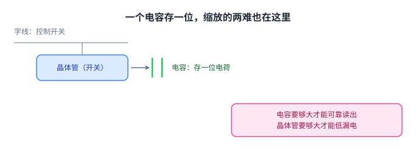

一个直接后果是：DRAM 不再像过去那样，缩一代就同时拿到更大容量、更低成本、更低能量。

## 缩放不动的两个后果：可靠性下降与 RowHammer

器件变小之后，同样的电荷代表的差距变小，外界扰动更容易把它翻过去。这类错误不是偶发的坏运气，而是可以统计、可以建模的趋势。

源讲义引的是 Meza 等人在 DSN 2015 的工作：他们分析了 Facebook 全球服务器集群里实际发生的内存错误，并对这些错误做了建模。同一节还列出了理解这类问题所需的实验基础设施，其中 SoftMC 是开源的，用来在真实 DRAM 芯片上做实验。

这里要留意一个思路上的转弯。过去「内存出错」被当成小概率事件，交给纠错码去兜底；而一旦错误率随工艺上升，它就从「小概率事件」变成「设计时必须假设的常态」，于是纠错码要加、代价要算、容量与可靠性之间要做取舍。后面的异构可靠性内存就是这笔账的产物。

同一批实验基础设施还带来一个更麻烦的发现。Kim 等人在 ISCA 2014 的工作标题就是结论：可以不去访问那些位，就把它们翻转。做法是反复激活同一行 DRAM。行每被激活一次，相邻行的电荷就被扰动一次；激活得足够频繁，在两次刷新之间就能攒够扰动，让相邻行真的翻转。

源讲义把这种机制叫 [[term:RowHammer]]，并给了它一句话的定位：一个简单的硬件失效机制，可以变成一个大范围的安全漏洞。说它简单，是因为触发它的程序只有几行：读一个地址、读另一个不同行的地址、把两者都从缓存里清掉、然后循环。

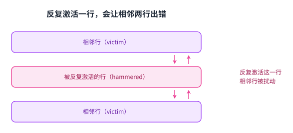

关键在于「把缓存清掉」这一步：不清缓存，处理器根本不会一次次真的去访问内存，也就扰动不起来。攻击者需要的是对访存时机的控制权，而不是什么特殊权限。

源讲义给了三家公司（讲义上就是 A、B、C company）共 129 个模块的实测覆盖率：86%（37/43）、83%（45/54）、88%（28/32）。最严重的那一家，单个模块上能造出多达 1.0×10^7 次错误。2012 到 2013 年生产的模块全部中招。

到了 2020 年，同一组作者重做了实验，结论更不乐观：新一代芯片比老一代更脆弱。衡量指标是最弱单元第一次翻转所需的激活次数，DDR3 从 69200 次降到 22400 次，DDR4 从 17500 次降到 10000 次，LPDDR4 从 16800 次降到 4800 次。有些芯片的最弱单元只要 4800 次就翻。

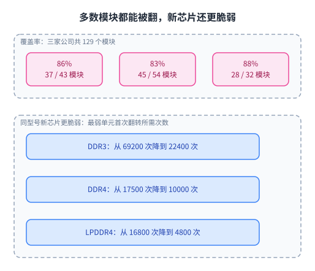

源讲义在 Takeaways 上只留了两句话：RowHammer 到现在仍然是一个开放问题；靠别人不知道细节来保证安全，大概不是个好办法。

## 面对内存问题的三条路

到这一步，问题已经清楚：DRAM 的缩放停了，可靠的代价在涨，延迟不降，能量又贵。源讲义给出的应对被整理成三条并列的路，它们不是三选一，而是同时在走。

第一条是修它：让内存与内存控制器更聪明。这需要新的接口、新的功能、新的架构，也就是系统与内存一起设计。

第二条是换掉它，或者更现实一点，补上它：用别的技术替代一部分 DRAM。这里说的不只是换存储介质，还包括把内存与存储的边界重新想一遍。

第三条是接受它：承认没有一种内存是完美的，那就把几种内存凑成一个[[term:heterogeneous-memory]]系统，再把数据按它的性质映射到合适的那一种上。这条路要求新的数据管理模型，也需要软件配合。

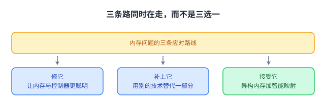

源讲义对三条路的总结是一句提醒：解决内存缩放问题，需要软件、硬件与器件三方面合作。任何单独一层都做不到。

## 例子：异构可靠性内存

第三条路有一个很具体的例子，来自微软与作者团队在 DSN 2014 的工作，叫异构可靠性内存。

它的出发点是一个观察：不同数据的容错程度并不一样。有些数据错一位就是事故，有些数据错了一位只影响一小段体验，甚至可以被上层重算出来。

于是这个方案分两步。第一步是刻画并分类应用数据的容错度，也就是逐份数据回答「它错得起吗」。第二步是把数据映射到两类内存上：可靠内存用纠错码保护、只挑选测试充分的芯片；低成本内存则不配纠错码或只配奇偶校验，用测试不那么充分的芯片，靠软件恢复兜底。

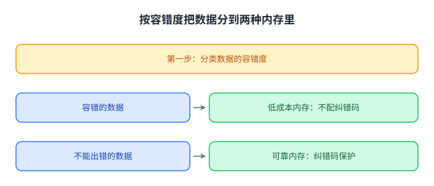

在微软的网页搜索负载上，这个方案把服务器硬件成本降低了 4.7%，同时仍然达到单机 99.90% 的可用性目标。源讲义特意补了一句：异构可靠性内存正是那条跨层公理的例子，因为它同时动了应用、软件与器件三层。

## 内存控制器：干扰、公平与服务质量

还有一条与上面三条都正交的线索：问题同样出在内存，但根源不在器件，而在「谁来排队」。

现代系统里同时向主存提要求的主体很多：多个 [[term:CPU]] 核、GPU、以及各种硬件加速器。源讲义把这种现象叫内存干扰：核与核之间在访问共享主存时会互相影响，而如果没有任何管理，后果是不公平、饿死与整体性能下降，系统会变得不可预测。

更麻烦的是这种干扰可以被故意利用。源讲义引的是 2007 年的一项工作，标题是「多核系统中的内存服务拒绝」：一个恶意程序只要生成足够多、足够密集的访存请求，就能把别人的带宽抢光。这说明内存调度器不只是性能部件，它还是安全边界。

于是有了一个研究谱系，本讲的幻灯片把它排成一条线：2007 年按停顿时间做公平的 STFM，2008 年同时照顾并行度与公平的 PAR-BS（它的变体进了三星 SoC 的内存控制器），2010 年针对多个内存控制器的 ATLAS，同年按访存行为差异给线程分组的线程聚簇调度，2014 年的黑名单调度器 BLISS，2012 与 2016 年面向 CPU 与 GPU 异构场景的分级调度与 DASH。再往前一步，是给应用提供可预测性的 MISE 与 ASM。

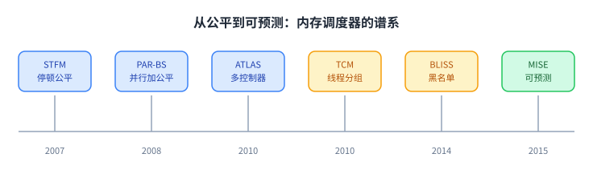

本讲的最后几页提到另一个方向：用机器学习来做内存控制，早在 2008 年就有人试过用强化学习让[[term:memory-controller]]自己找策略。源讲义对未来的判断是一句话：内存控制器会变得越来越重要，因为约束、目标与指标都在变多。它把控制器的难处概括成一句：目标多、约束多、指标多，而这些目标还互相冲突。

## 小结：这一讲要带走的东西

第一，内存的问题可以用三个视角看：性能上它是瓶颈，能量上它是大头，可缩放性上它正在停下来。三个视角指的是同一件事。

第二，几组关键数字值得记住：DRAM 的容量 18 年涨了 128 倍、带宽 20 倍，而延迟只涨了 1.3 倍；一次 DRAM 访问是 640 pJ，一次整数加法是 0.1 pJ；移动端 62.7% 的系统能量花在数据搬运上。

第三，DRAM 缩放停下来的物理原因就在「一个电容存一位」这个结构本身：电容要够大才能可靠读出，晶体管要够大才能低漏电。器件越小，这两件事越难同时满足。

第四，RowHammer 说明可靠性与安全是同一件事的两面：一个简单的扰动机制，可以让绝大多数模块出错，而且新一代芯片更脆弱。靠保密换安全不是办法。

第五，出路是三条同时走的路：让内存与控制器更聪明、用别的技术补上 DRAM、接受异构并按数据性质映射。源讲义对三条路的共同前提说得很清楚：需要软件、硬件与器件三方面合作。
