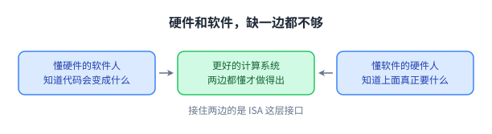
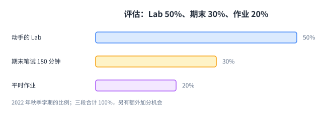
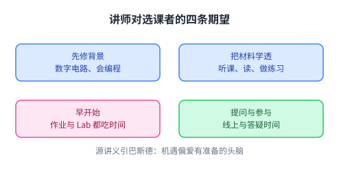

+++
title = "这门课怎么上：目标、评估与学法"
lecture = 3
slug = "lecture2b-courselogistics"
status = "draft"
source_kind = "notes"
source_url = "https://safari.ethz.ch/architecture/fall2022/lib/exe/fetch.php?media=onur-comparch-fall2022-lecture2b-courselogistics-afterlecture.pdf"
source_title = "Lecture 2b: Course Info & Logistics (Fall 2022, afterlecture)"
output_mode = "explanation"
+++

> 来源课程：ETH Zürich **Computer Architecture**（Onur Mutlu 主讲，Fall 2022）；
> 对应讲义：Lecture 2b — Course Info & Logistics（`onur-comparch-fall2022-lecture2b-courselogistics-afterlecture.pdf`，20 页，2022-09-30）；
> 讲义链接：<https://safari.ethz.ch/architecture/fall2022/lib/exe/fetch.php?media=onur-comparch-fall2022-lecture2b-courselogistics-afterlecture.pdf> ；
> 上游许可：该课程 wiki 每一页的页脚都带站点级许可块，原文为 CC BY-NC-SA 4.0 —— <https://creativecommons.org/licenses/by-nc-sa/4.0/deed.en> ；
> 本页由 CourseLingo 用中文重新讲解，**不是逐字翻译**，也不转载原讲义里的任何图片；
> 本页只讲课程的组织方式与学习路径。**作业与考试的题面、解答一律不在我们发布的范围之内**，原讲义里涉及具体作业的内容我们也不转载。
> 本页为非官方材料，与 ETH Zürich 及课程教学团队无隶属关系；课程规则以官方页面为准。

## 这一讲要解决什么问题

打开一门硬课，多数人先问「考什么」，而很少先问「我该用什么方式学」。这门课的讲师把「怎么学」单独讲了一节，占整整一讲的篇幅。

这个安排本身值得留意。一门课的评估方式会反过来决定学生把时间花在哪里：如果分数大头在期末笔试，复习就会变成刷题；如果大头在动手的 Lab 上，你就会被迫把东西真正跑起来。

所以这一页要解决的是一个很实际的问题：这门课要你成为什么样的人、用什么方式衡量、以及讲师明确期望你做什么。

源讲义给出的课程目标有两条。第一条是让对计算机系统设计有兴趣的人熟悉处理器、内存与平台架构的基本工作原理与设计取舍，重点在基础、取舍、以及当前与未来的关键问题。第二条是提供设计与实现一个现代处理器所需的背景与经验，方式是**亲手实现一个模拟器**，重点在功能、动手实现与效率。这里说的「实现一个处理器」，落在 [[term:microarchitecture]] 这一层。

这两条目标合起来说明了这门课的性格：它不是一门只讲原理的概论课，也不是一门只教写代码的实验课，而是要求你既能说清原理，又能把它做出来。

顺带给出整门课的地图（这一句是我们按后续讲次的安排整理的，不是源讲义上的原话）：后面会依次走到处理器（[[term:CPU]]）、主存（[[term:DRAM]]）、图形处理器（GPU）与可编程门阵列（FPGA）这几块硬件，它们都属于[[term:accelerator]]要照顾的对象，也都要通过软硬件接口与软件打交道。

三块缺一块都不完整：只会原理的人做不出东西，只会实现的人换一个场景就说不清为什么这么做。

## 为什么硬件和软件要一起学

源讲义专门用一页提醒：这门课看起来只讲硬件，但只掌握一边的人，能力是有上限的。

理由是三句话。懂硬件的软件工程师，能写出更好的软件，因为他知道自己的代码最后会变成什么样；懂软件的硬件工程师，能设计出更好的硬件，因为他知道上面真正需要什么；两边都懂的人，才能设计出更好的计算系统。

把两边接起来的地方，就是 [[term:ISA]] 这一层接口。软件通过 [[term:ISA]] 提要求，硬件通过它做承诺。前面几讲讲过的[[term:transformation-hierarchy]]，在这里变成了一个很实际的学习建议：不要把自己锁在一边。

中间那格是这门课想让你站的位置：既能向下看实现，也能向上看需求。

## 怎么被评估

源讲义给出的权重是这样的：动手的 Lab 占 50%，期末笔试（180 分钟）占 30%，平时作业占 20%。此外作业、Lab 与考试里都安排了额外加分的机会。

这组数字的教学含义比数字本身更重要。**一半的分数在 Lab 上**，说明「能跑起来、能测出来」比「能背下来」更被看重。考试只占三成，但它有 180 分钟，题量不会小。

要提醒一句：这是 2022 年秋季学期的规则，每一年都可能调整。如果你正在修这门课，请以官方课程页面上的当前说明为准，不要拿这一页去对照你自己的学期。

条形长度按百分比直接画，三段加起来正好是 100%。

## 讲师期望你做什么

源讲义把期望写成了一页清单，我把它归成四条，前两条关于准备，后两条关于节奏。

关于准备：先修背景要求是数字电路、会编程，以及一颗愿意接受新概念的心。请注意最后一条不是客套话，这门课后面的内容会出现很多反直觉的结论。

关于节奏：把材料学透的方式是听课、读材料、做练习、做 Lab，四件事都得做；并且**早开始**，因为作业与 Lab 都会吃时间，堆到最后一周是来不及的。

关于参与：讲义反复提到提问、记笔记、参与线上讨论与答疑时间。它还给了一句引文：「机遇偏爱有准备的头脑」，出自巴斯德。

讲义另指定了一篇必读：Hamming 的《You and Your Research》。这篇讲的是怎么做研究、怎么选问题，与具体技术无关，但它解释了这个领域的人是怎么工作的，值得在学期初就读一遍。

四条里最容易忽略的是「早开始」，而它恰恰是唯一一条完全由你自己控制的。

## 小结：这一讲要带走的东西

第一，这门课有两条并行的目标：懂原理，以及亲手实现一个能跑的东西。评估方式（Lab 50%、期末 30%、作业 20%）就是为这两条目标服务的。

第二，硬件与软件要一起学。懂硬件的软件人和懂软件的硬件人，都能做出更好的系统，而 [[term:ISA]] 是把两边接起来的那层接口。

第三，讲师明确期望的节奏是「早开始」。作业与 Lab 都按周释放、按周堆积，堆到期末就只剩赶工。

第四，这些规则是 2022 年秋季的版本。规则会变，方法论不会：一门课怎么评估，就决定了你应该怎么投入时间。
