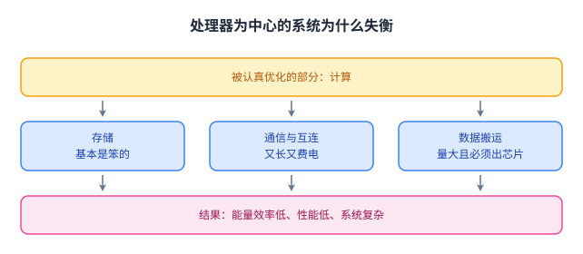
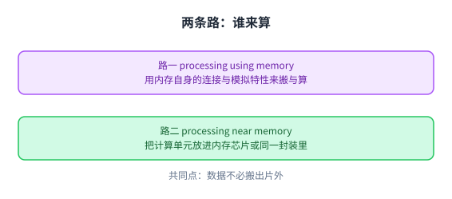
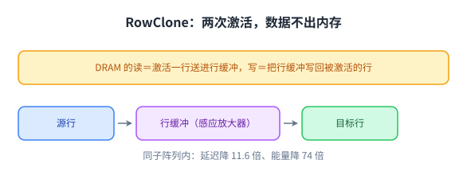
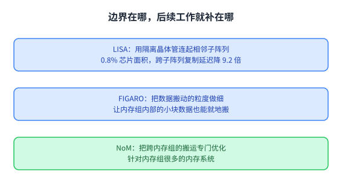
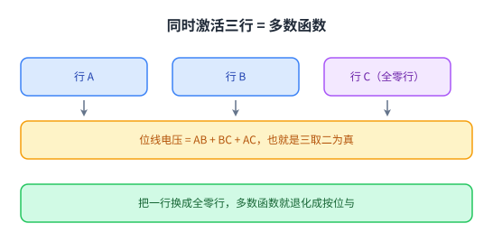
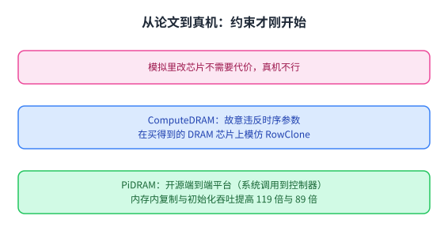
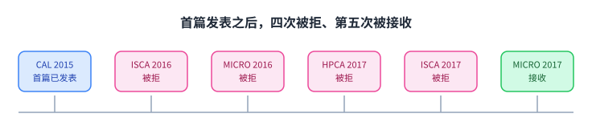

+++
title = "用内存来算：把计算搬到数据所在的地方"
lecture = 4
slug = "lecture3-processing-using-memory"
status = "draft"
source_kind = "notes"
source_url = "https://safari.ethz.ch/architecture/fall2022/lib/exe/fetch.php?media=onur-comparch-fall2022-lecture3-processing-using-memory-afterlecture.pdf"
source_title = "Lecture 3: Processing using Memory (Fall 2022, afterlecture)"
output_mode = "explanation"
+++

> 来源课程：ETH Zürich **Computer Architecture**（Onur Mutlu 主讲，Fall 2022）；
> 对应讲义：Lecture 3 — Processing using Memory（`onur-comparch-fall2022-lecture3-processing-using-memory-afterlecture.pdf`，255 页）；
> 讲义链接：<https://safari.ethz.ch/architecture/fall2022/lib/exe/fetch.php?media=onur-comparch-fall2022-lecture3-processing-using-memory-afterlecture.pdf> ；
> 上游许可：该课程 wiki 每一页的页脚都带站点级许可块，原文为 CC BY-NC-SA 4.0 —— <https://creativecommons.org/licenses/by-nc-sa/4.0/deed.en> ；
> 本页由 CourseLingo 用中文重新讲解，按源讲义的推进顺序组织，**不是逐字翻译**，也不转载原讲义里的任何图片；
> 页内配图全部由我们自绘（原讲义里只有图、没有字的页，我们把它要讲的机制重画出来）。
> 本页为非官方材料，与 ETH Zürich 及课程教学团队无隶属关系；如与原文有出入，以原文为准。

## 这一讲要解决什么问题

上一讲讲清楚了内存为什么是瓶颈：延迟不降、能量又贵。这一讲要做的是把结论变成动作：既然搬数据这么贵，那就走 [[term:processing-in-memory]] 这条路，让计算发生在数据所在的地方。

源讲义先把问题摆出来。它引用 1946 年那份关于电子计算机逻辑设计的报告，说一个计算系统只有三个部件：计算、通信、存储。然后它指出现代系统的毛病：这三个部件里，**只有计算被认真优化过**，存储单元基本是「笨」的，除了处理器芯片里那点缓存。所有数据都要跑到处理器那里被处理，代价是整机的能量与性能。

源讲义把这个局面叫「处理器为中心的设计」带来的失衡：处理只在一个地方发生，其它部分都在存数据和搬数据，于是数据被搬来搬去。它给出的三条后果都是负面词：能量效率低、性能低、系统复杂。更麻烦的是，为了容忍访存延迟，处理器自己反而越长越复杂，缓存层次和各种机制层层叠加，又进一步吃能量。

这张图是竖着三行：最上面一格是唯一被认真优化的部件（计算），中间三格是占掉大部分系统的存与搬；最下面一格是这么做的结果。这一讲要动的就是中间那三格。

## 能量账：为什么「搬」比「算」贵

源讲义的论证分三层，一层比一层具体。

第一层是对比：一次内存访问消耗的能量，约等于一次复杂加法的 100 到 1000 倍。

第二层是占比。它引用两组测量：在移动端网页浏览场景里，[[term:data-movement]]占掉系统能量的 41%；而搬运一次数据的能量约等于 115 次加法操作。对 Google 消费级设备负载的实测更极端：系统总能量的 62.7% 花在数据搬运上。

第三层是物理原因，源讲义在第 4 页写得很直接：高延迟与高能耗来自那些又长又费电的互连、费电的电气接口，以及被搬运的大量数据本身。数据只要出芯片，就要驱动片外引脚和长导线。

三条数字指向同一个结论：省能量的重点不在「少算」，而在「少搬」。所以源讲义给这一讲定的目标是「用最小的数据搬运完成计算」，并且把它叫作需要一次思路转换的事。

## 一个 1969 年就有的想法，为什么今天才做得起来

先把一个容易有的误解说清楚：在内存里做计算**不是新想法**。源讲义专门用两页溯源：Kautz 在 1969 年发表过《单元式逻辑内存阵列》，Stone 在 1970 年发表过《逻辑内存计算机》。也就是说，这个方向比大多数人以为的要老得多。

那为什么过去做不起来、现在又能做？源讲义把原因归成两股力，并把结果画成「设计被挤在中间」：上面是应用与系统的拉力，下面是器件与电路的推力，被夹在中间的设计就是结果。

从下面推的是器件：内存工艺的缩放越来越难，[[term:RowHammer]] 这类问题说明器件本身需要更多「智能」来管理，也就是说[[term:memory-controller]]要变得更聪明，而不是继续靠缩小尺寸。源讲义这一节的标题就是「内存缩放问题是真的」（p41）。

从上面拉的是应用：数据密集型应用越来越多，访存是瓶颈，能量与功耗也是瓶颈，而且这几件事必须同时解决。

中间夹着的是设计者：软件与硬件的接口、编程模型、算法都要跟着改，所以这件事不可能只靠换一种内存芯片解决。

源讲义还给了今天的产业版图，说明这不是纸上谈兵：UPMEM 在 2019 年做出把处理器放进 DRAM 的模块（DDR4 内存条形态，每条 8 GB 内存配 128 个 DPU、共 16 颗 PIM 芯片，用的是标准 2x 纳米 DRAM 工艺；一台机器插 20 条就是 2560 个 DPU）；三星在 2021 年给出把功能放进内存的 DRAM 与 HBM-PIM；同年还有内存条形态的 AxDIMM；SK 海力士 2022 年的 AiM 基于 GDDR6；阿里巴巴 2022 年的 HB-PNM 把逻辑裸片与 DRAM 裸片三维堆叠。源讲义也提到还有大量实验芯片与创业公司在做。这五件产品按本课自己的分类都属于「近内存」那一路（把计算单元放进内存），那一路的机制是下一讲的主题。

图上最上面一格（应用与系统）与最下面一格（器件与电路）是两股原因，中间那一格才是结果：设计者被夹在中间，必须同时回答器件与应用的诉求。

## 两种做法：用内存，还是在内存旁边

源讲义把这类技术分成两条路，并且反复强调这个区分。

第一条是 processing using memory：利用内存本身的运行原理来做批量数据搬运与计算。它对内存的改动很小（源讲义的说法是 with small changes），靠的是内存内部已有的连接（可以把数据在内部搬动）和它的模拟特性（同时激活多行会产生可用的结果）。

第二条是 processing near memory：把计算单元放到内存旁边，可以是内存芯片内部，也可以是与内存同一封装里的逻辑裸片。这条路更接近「在内存旁边加一个小处理器」。

这两条路的共同点是省掉片外搬运；区别在于「谁来算」：前者是内存阵列本身在算，后者是搬进来的计算单元在算。

本讲只讲第一条路。源讲义列出的代表工作是 RowClone、内存内的按位与/或、以及 SIMDRAM 框架。

## 用内存搬数据：RowClone

第一条路的最简单形式不是计算，而是**搬运**：批量数据的复制与初始化。

源讲义先问一个问题：现在的系统怎么复制一大块数据。答案是把它读进处理器，再写回去，也就是数据要出内存、进[[term:cache]]、再回到内存。而在内存内部，数据其实可以从一行直接搬到另一行。

RowClone 的做法就是利用这一点：**连续激活两行**。DRAM 的读操作本来就是「激活一行，把整行数据送进行缓冲（感应放大器）」，而写操作是「把行缓冲里的数据写回被激活的行」。如果连着做这两步，数据就从源行进了目标行，中间不必出门。

这里的关键部件是感应放大器：它本来负责把电容上那点微弱的电荷差别放大成 0 和 1。RowClone 的巧妙之处是让感应放大器充当一次「中转站」，而且不需要额外硬件。源讲义给出的代价是「可忽略的硬件成本」。

同一子阵列内的复制收益最大，源讲义给的数字是[[term:latency]]降低 11.6 倍、能量降低 74 倍。跨内存组的复制要经过共享内部总线，收益降到 1.9 倍与 3.2 倍，但仍然是在内部完成。

RowClone 还有一个更简单的用法：初始化。最常见的是把一大块数据清零。做法是在每个子阵列里预留一行，让它恒为零（源讲义在方案那一页把容量代价写成 0.5%、在总结那一页写成 0.2%，两页不一致，我们照录，不替它调和），清零时把这一行复制到目标行即可。源讲义给的数字是延迟降低 6.0 倍、DRAM 能量降低 41.5 倍。整套机制对芯片面积的影响只有 0.01%。

## RowClone 的边界，以及后来补上的三件工作

源讲义在讲完优点之后专门列了弱点，这一段值得完整看完，因为它决定了一项技术能不能落地。

最大的限制是映射：只有数据正好落在**同一个子阵列**里，收益才是那 11.6 倍与 74 倍。如果数据在同一个内存组的不同子阵列里，收益几乎没有；如果跨了内存通道，则完全帮不上。而数据放在哪里通常不由你决定，这就要软硬件配合。

第二个限制是它牵动的层太多：从应用到电路都要改，缓存一致性、数据复用都会带来真实开销。源讲义也点出一个诚实的问题：这篇工作的评估只有模拟，而且没有考虑多芯片系统。

于是有了三件后续工作，各自补一个缺口。LISA 用隔离晶体管把子阵列连起来，代价是 0.8% 的芯片面积，把跨子阵列复制的延迟从 1.363 毫秒降到 0.148 毫秒（9.2 倍），应用加速 66%、DRAM 能量降 55%；同一套连接还能做「内存内缓存」与快速预充电。FIGARO 把数据搬动的粒度做得更细，NoM 则专门优化跨内存组的搬运。

这张图想说的是：一项机制的价值不只取决于它最快能多快，还取决于它在最常见的映射下还剩多少。

## 用内存算：Ambit 的批量按位

搬运解决的是「数据怎么动」，接下来要解决「数据怎么算」。

源讲义给出的洞察是：[[term:DRAM]] 的行缓冲本来就会把多行数据叠加起来，那么**同时激活三行**，位线上的电压就自然等于这三行的「多数函数」结果。用公式写就是 AB 加 BC 加 AC，也就是三取二为真。

有了多数函数，按位与和按位或都能构造出来。以批量与为例，一条 BULKAND 指令把 A、B 两行做与运算并写进 C 行，步骤是五步：先把 A 复制到一条指定行，把 B 复制到第二条指定行，把「全零行」复制到第三条（这一步是为了让多数函数退化成与），然后同时激活这三行，最后把结果复制到 C 行。可以看到，它完全建立在上一节的复制能力之上。

按位非（NOT）不能用多数函数直接得到，源讲义给的办法是改单元结构：用一个「双接触」单元把取反后的值喂进感应放大器，再写进一条专用行。

源讲义给出的整体收益是：相对 DDR3 基准，性能提升 32 倍、能耗降低 35 倍（另一页的概括是 30 到 60 倍的性能与能效改善）。它列的应用是位图索引与 BitWeaving 这类按位扫描为主的数据库操作，正好是批量按位的天然用户。

## SIMDRAM：把按位运算做成一个框架

Ambit 证明了「用内存算」可行，但它提供的是几条固定指令。SIMDRAM 要解决的是下一步：如果程序员想要一个没人实现的运算，怎么办？

源讲义把 SIMDRAM 定义成一个端到端的框架，包含编程接口、[[term:ISA]] 与硬件支持三部分，目标是让任意运算都能在 DRAM 里实现，而且对 DRAM 结构的改动尽可能小。

它的底座有两个要点。第一是**数据垂直摆放**：一个多位数据的各个比特放在不同行上，这样一次激活天然就是「同时处理很多个数」，移位也变得免费。第二是**以多数函数与取反为基本积木**：因为三行激活给出的是多数函数，而多数加取反可以搭出任何布尔函数。

在这之上，框架把一条复杂指令翻译成一串微操作（源讲义叫它 µProgram）：先决定操作数放在哪些行，再生成并优化这串微操作，最后交给硬件执行。为了让垂直摆放的数据能与常规程序交互，框架里还有一个转置单元，放在末级缓存里。

源讲义给的收益数字很整齐：在 16 种复杂运算上，吞吐分别是 [[term:CPU]] 的 88 倍、高端 GPU 的 5.8 倍；[[term:energy-efficiency]]分别是 CPU 的 257 倍、GPU 的 31 倍；在 7 个真实应用上，性能是 CPU 的 21 倍、GPU 的 2.1 倍。

## 从论文到真机：ComputeDRAM 与 PiDRAM

到这里为止的所有机制都有一个共同的软肋：它们都要求你改内存芯片，而模拟器里改芯片是免费的。于是自然要问：**能不能在买得到的内存条上做到**。

第一件工作是 ComputeDRAM，思路是「违反时序参数」：DRAM 有一堆规定好的时序（激活之后要等多久才能预充电等等），如果故意违反它们，位线上的电压会停在 VDD/2 附近，于是「连续激活两行」这件事在普通芯片上也能近似做出来。源讲义的说法是「用违反时序参数的办法去模仿 RowClone」。

第二件工作是 PiDRAM，目标是把这件事做成一个可复现的端到端平台，而且开源。它的工作流值得一读：用户程序通过系统调用提出请求；操作系统用一个操作库把请求翻译成对内存映射寄存器的写指令；这些写落在「PIM 操作控制器」上；控制器负责执行具体操作；最后有一个调度器在普通访存与这些特殊操作之间仲裁，并按自定义的时序发出 DRAM 命令。源讲义给的微基准结果是：内存内的复制与初始化把吞吐分别提高了 119 倍与 89 倍。

源讲义还提到另一条路：在相变存储器（PCM）上做类似的事，相关工作叫 Pinatubo。

这张图解释了两件事为什么必须做：模拟里改芯片不需要代价，而真机上的约束（时序、系统调用、调度）才是落地的门槛。

## 这段历史：四次被拒与评审责任

这一讲的最后一段偏题，讲的是上面这些工作是怎么被发表的，源讲义花了三十多页。

RowClone 的投稿也不算顺利。源讲义逐字写着它「Rejected from ISCA 2013 conference」（p192），并为此给了好几页评审与改投的材料；它后来发表在 MICRO 2013（讲义里给了论文出处）。Ambit 这条线更曲折：它先在 2016 年的 ISCA、2016 年的 MICRO、2017 年的 HPCA、2017 年的 ISCA 上连续被拒，其中一份评审的意见是「这永远不会被实现」。它最终在 2017 年的 MICRO 上被接收。

源讲义把这段经历用作一个提醒，而不是抱怨。它引用 Raj Jain 的《The Art of Computer Systems Performance Analysis》，给评审者与社区各提了几条建议，核心是两点：评审要公平，而且要知道自己并非什么都懂；一项工作在当时看不清能不能实现，不等于它没有价值。

对读者来说，这一段的价值不在于「坚持就会成功」这种话。它更像一个提醒：**学术判断与工程判断都受限于当时的想象**，所以一项想法被拒过几次，不能作为它价值的证据 —— 反过来也一样。

时间轴上的四次拒绝与一次接收都是同一件工作的评审结果，机制本身没有变。

## 小结：这一讲要带走的东西

第一，这一讲把上一讲的结论变成了动作：既然搬运是瓶颈，就让计算发生在数据所在的地方。源讲义对目标的表述是「用最小的数据搬运完成计算」。

第二，数据搬运的占比与代价都有测量支撑：移动端 41% 到 62.7% 的系统能量花在搬运上，一次访存约等于上百次加法。

第三，这两条路要分清：**processing using memory** 靠内存自身的原理（内部连接与模拟特性）来搬与算，**processing near memory** 是把计算单元搬到内存旁边。本讲讲的是前者。

第四，两个代表机制的思路都很朴素：RowClone 用连续两次激活让数据经行缓冲在内部搬家（同子阵列内延迟降 11.6 倍、能量降 74 倍）；Ambit 用同时激活三行拿到多数函数，再搭出批量按位与、或、非（相对 DDR3 性能提升 32 倍、能耗降低 35 倍）。SIMDRAM 则把这件事做成有编程接口与指令集的框架。

第五，落地才是门槛。ComputeDRAM 与 PiDRAM 说明可以在买得到的芯片上做出真实效果，而 Ambit 四次被拒的历史说明：一项工作的价值判断会受时代想象的限制。
