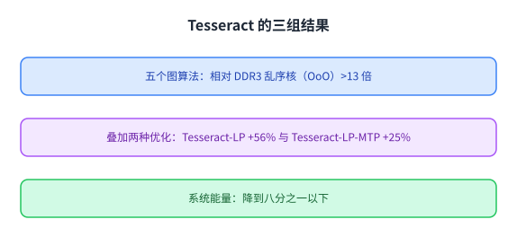
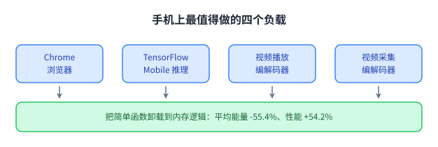
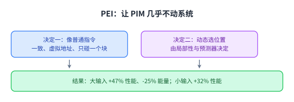
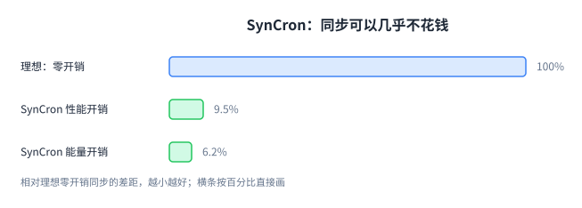
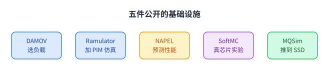
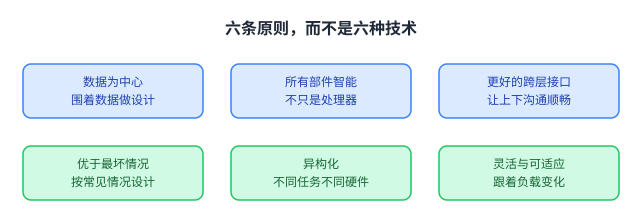

+++
title = "把计算搬到内存旁边：近内存计算"
lecture = 5
slug = "lecture4-processing-near-memory"
status = "draft"
source_kind = "notes"
source_url = "https://safari.ethz.ch/architecture/fall2022/lib/exe/fetch.php?media=onur-comparch-fall2022-lecture4-processing-near-memory-afterlecture.pdf"
source_title = "Lecture 4: Processing near Memory (Fall 2022, afterlecture)"
output_mode = "explanation"
+++

> 来源课程：ETH Zürich **Computer Architecture**（Onur Mutlu 主讲，Fall 2022）；
> 对应讲义：Lecture 4 — Processing near Memory（`onur-comparch-fall2022-lecture4-processing-near-memory-afterlecture.pdf`，236 页）；
> 讲义链接：<https://safari.ethz.ch/architecture/fall2022/lib/exe/fetch.php?media=onur-comparch-fall2022-lecture4-processing-near-memory-afterlecture.pdf> ；
> 上游许可：该课程 wiki 每一页的页脚都带站点级许可块，原文为 CC BY-NC-SA 4.0 —— <https://creativecommons.org/licenses/by-nc-sa/4.0/deed.en> ；
> 本页由 CourseLingo 用中文重新讲解，按源讲义的推进顺序组织，**不是逐字翻译**，也不转载原讲义里的任何图片；
> 页内配图全部由我们自绘（原讲义里只有图、没有字的页，我们把它要讲的机制重画出来）。
> 本页为非官方材料，与 ETH Zürich 及课程教学团队无隶属关系；如与原文有出入，以原文为准。

## 这一讲要解决什么问题

上一讲的做法是「用内存自己来算」：不改结构，只利用 DRAM 内部已有的能力。这一讲走另一条路：在内存旁边放计算单元，也就是 [[term:processing-in-memory]] 里的另一大类。

这条路在 2015 年前后变得可行，原因是一个工艺上的变化：[[term:DRAM]] 可以三维堆叠。源讲义把两张图并列摆出来，一张是「逻辑裸片加内存裸片」的堆叠结构，另一张标注为仍在开发中的其它三维技术。一旦内存上方能放一层逻辑，那里就多出了可以放计算单元的空间，而且离数据只有几十微米。

源讲义在第 20 页把要回答的问题列成两条：把三维堆叠内存当作粗粒度加速器用，性能与能量收益到底有多大（分别考虑「整个系统都改」与「只把简单函数卸载过去」两种情况）；以及最少需要多少 PIM 支持才能拿到这些收益。

这两条问题决定了本讲的结构：先看几个「大改」的例子，再看一个「几乎不改」的方案。

关键不只是「近」，而是有一层可以自由设计的硅：它能放专用单元，也能放通用小核。

## 例子一：内存内图处理

第一个例子是图处理。源讲义先说明为什么挑它：2015 年前后大图到处都是（维基百科页面 3600 万、Facebook 用户 14 亿、Twitter 用户 3 亿、Instagram 照片 300 亿），而大规模图处理很难做快。

难点在图算法的访存模式。源讲义用一行代码说明：遍历每个顶点的每个后继，把权重乘上当前排名再累加到邻居的下一个排名里。这段计算本身极短，但每次要访问的是随机位置的内存。它把瓶颈总结成两条：频繁的随机访存，以及**每次访存对应的计算量极小**。这两条正好是搬运能量的主场。

Tesseract 的做法是把一组三维堆叠的内存加逻辑芯片连起来，每片逻辑里放简单的顺序小核，用交叉开关网络互连，对外暴露成一段不可缓存、物理寻址的内存映射接口。为了避免频繁来回，它用了非阻塞的远程函数调用：把要做的操作发到数据所在的那片逻辑上，然后不等结果直接继续。

源讲义给的对比结果很直观：相对 DDR3 的顺序核系统，五个图算法上加速超过 13 倍；相对同样用三维堆叠内存但只用主机核的方案，加两个优化后还能再快 56% 与 25%；系统能量降低超过 8 倍。

源讲义同时列了它的缺点，这一段和优点一样重要：它改动系统的幅度很大，要求新的编程模型，逻辑层里放的是专为图处理设计的核，成本高，而且规模受限于片外链路或图的分割方式。

## 例子二：手机上的近内存计算

第二个例子把问题反过来问：手机这种面积与能量都很紧的地方，能不能用上近内存计算？

源讲义先给出两条观察。第一条我们前面见过：系统总能量的 62.7% 花在[[term:data-movement]]上。第二条是新的：**这些搬运里有一大部分来自很简单的函数**。既然函数简单，就不必放进通用核，放一个小型固定功能单元就够。

它挑的四个负载是当时 Google 手机上最重要的四类：Chrome 浏览器、TensorFlow Mobile 机器学习框架、视频播放与视频采集。对这四个负载做分析之后，源讲义给的总体结论是：把这些简单函数卸载到内存里的逻辑上，平均**能量降低 55.4%、性能提升 54.2%**。

具体到两个负载更能看清「简单函数」是什么意思。TensorFlow Mobile 的推理过程里，57.3% 的能量花在数据搬运上，而其中 54.4% 来自打包/解包与量化这两件事，也就是把 32 位浮点转成 8 位整数、以及为了矩阵乘而重排元素。Chrome 那边，切换标签页时浏览器要反复压缩与解压页面（讲义提到用的是内存压缩），这些压缩与解压同样可以在内存侧做。

## 例子三：GPU 与链表

第三个例子是 GPU。源讲义问的是：GPU 已经在做大量并行，它还需要近内存计算吗？

答案是某些访存模式仍然很吃亏，典型的是指针追踪：遍历链表、树、哈希表时，每一次取数都要用上一次的结果算出地址，于是访存完全串行，[[term:latency]]一层层叠加。GPU 有大量线程可以隐藏延迟，但当访存依赖链很深时，隐藏不过来。

源讲义列出的方向是把这类操作放到内存侧的[[term:accelerator]]上执行，并给出几件具体工作：加速 GPU 执行的近内存方案、针对链表这类数据结构的加速、以及依赖型缓存缺失的处理。

这类问题的共同点是：数据量不大，但访问的顺序是串行的。所以收益不来自带宽，而来自把串行的等待搬到离数据更近的地方。

## 把 PIM 做成指令：PEI

到这一步出现了一个很实际的矛盾：上面那些方案都要改系统、改编程模型，而改得越多越难被采用。于是有了一个几乎不改的方案，叫 PIM 指令（PEI）。

它的两条设计决定值得记住。第一条是把每个内存侧的操作暴露成一条宿主处理器指令：它像普通指令一样是缓存一致、虚拟地址寻址的，而且只操作一个缓存块。比如把「给某个邻居的排名加上一个值」写成 `__pim_add(&w.next_rank, value)`。这样做的直接好处是：编程模型不变、虚拟内存不变、缓存一致性只需极小的改动，而且**不需要数据映射**，因为每条指令只涉及一个内存模块。

第二条是**动态决定这条指令在哪里执行**：宿主 [[term:CPU]] 还是内存侧单元，由简单的局部性监测与硬件预测器决定。源讲义专门用一页说明「全都放到内存里执行不是好主意」：在有些负载上[[term:cache]]非常有效，硬把它们推到内存侧反而变慢。

源讲义也把边界写清楚了：PEI 之间是原子的，但与普通指令之间不是原子的，需要用一个 `pfence` 来定序。

源讲义给的结果是：在 10 个数据密集型负载上，大输入集平均加速 47%、小输入集 32%，单节点平均能量降低 25%。它自己列出的缺点是：没能吃满 PIM 的潜力，而且「单个缓存块」这条限制很硬。

## 四个系统级挑战

把 PIM 真正用起来，还要解决四个系统层面的问题。源讲义把它们排成一组，并各给出代表工作。

第一个是**代码映射**：哪些操作该放进内存、哪些留给处理器。第二个是**数据映射**：数据该放到哪个内存堆叠上。这两件事在 GPU 场景下有一套代表性方案叫 TOM，目标是让程序员不必手工指定。

第三个是调度：内存侧的算力也要排队，如何安排它们与主机访存的先后。第四个是缓存一致性：当 CPU 与内存侧单元同时可能持有同一份数据时，怎么保证它们看到的是同一份。

这四条合起来说明一件事：近内存计算的难点已经从「能不能算」转移到了「怎么和现有系统相处」。

## 一致性与同步的具体做法

一致性这一条值得展开，因为它是「混合应用」的前提：一个程序里既有主机代码，又有内存侧代码，还共享数据。

源讲义给的代表工作是 CoNDA，目标是为近数据加速器提供高效的缓存一致性支持。它的思路可以这样理解：传统的一致性协议是为「主机之间共享」设计的，放到近数据场景下会带来不必要的开销，因为内存侧单元本来就在数据旁边；所以应该重新设计一套更贴合这种访问模式的协议。

同步是另一半。内存侧单元之间要互相协调，就需要锁、屏障这类机制，而远程调用加上跨芯片的同步开销很大。源讲义给的代表工作是 SynCron，称它是第一个面向近数据处理架构的端到端同步方案。

它给的结果很适合作为这一节的注脚：SynCron 的性能与能量分别落在理想零开销同步的 9.5% 与 6.2% 以内。也就是说，同步这件事有可能做得几乎不花钱，前提是为它专门设计一套机制。

## 数据结构与虚拟内存

还有两个更贴近程序员的问题：数据结构要不要为 PIM 改写，以及虚拟内存怎么支持。

指针追踪这一类操作对应的方案叫 IMPICA，做法是把地址翻译与访存解耦：一致性由硬件处理，地址翻译用一张放在逻辑层里的小页表。源讲义给的数字是：指针追踪操作加速 1.2 到 1.9 倍，数据库吞吐提升 16%，能量降低 6% 到 41%；代价是平均功耗增加 5.6%，面积增加 0.45 平方毫米（作为对比，它的参照物里一级缓存每兆字节 5 平方毫米、[[term:memory-controller]] 10 平方毫米）。

虚拟内存对应的方案叫 VBI，它问的是更根本的问题：今天每个进程一张页表、由操作系统管理的这套结构，在内存侧有算力的时代还是最优的吗。它的做法是引入「虚拟块」与一层放在内存控制器里的地址翻译层，让地址空间的组织更灵活。

这两件工作说明：PIM 不是一个只改硬件的话题，它会一路顶到操作系统与编程模型的边界上。

## 仿真与基准设施

一项技术要能被研究，先得有能研究它的工具。源讲义在这一节列了一整套基础设施，这也是这一讲最实用的一段。

它们的用途各不相同：DAMOV 关注「哪些应用真的能从近数据计算里受益」，提供分析方法与负载；Ramulator 被扩展成支持 PIM 的仿真器，配套的 PrIM 基准把负载按领域分好（向量加、矩阵向量乘、稀疏矩阵乘、数据库选择与去重、二分查找、时序分析、广度优先搜索、多层感知机、Needleman-Wunsch 比对、图像直方图、归约、前缀和、矩阵转置）；NAPEL 用集成学习预测近内存应用的性能；SoftMC 是一块基于 FPGA 的开放平台，用来在真实 DRAM 芯片上做实验；MQSim 则把这类研究推到 SSD 上。

## 适合 PIM 的应用

源讲义最后列了一批「已经在真实问题上拿到收益」的应用，它们共有的特征是两个：数据量大，而每份数据上的计算简单。

基因组读段映射里的 GRIM-Filter 在三维堆叠内存里做过滤，把需要精细比对的位置先筛掉，源讲义给的加速最高 3.7 倍；GenASM 做近似字符串匹配；NERO 面向天气预测的模板计算，直接贴着高带宽内存做；NATSA 做时间序列分析。这些例子的共同点是：它们都不是「把已有的通用程序搬过去」，而是为内存侧算力重新设计的算法或数据结构。

## 采纳的障碍与这一讲的结论

源讲义花了很长篇幅讲采纳问题，因为技术可行不等于会被用。它列出的障碍包括：应用与软件要为 PIM 改写、系统厂商要愿意改硬件、编程模型要重新设计。

它的结论落在两条上。一条是**需要重新审视整个栈**：从器件、逻辑、[[term:microarchitecture]]、软硬件接口、程序语言、算法到系统软件，每一层都要为「数据为中心」重新看一遍，但可以一步一步来。另一条是**要用好的原则**，源讲义列了六条：数据为中心的系统设计、所有部件都具备智能、更好的跨层沟通与接口、优于最坏情况的设计、异构化、以及灵活与可适应。

最后它用一个类比收尾：闪存刚出现时同样被当成「可疑的技术」，而二十年后它改变了存储。这个类比不是用来鼓舞人心的，而是提醒读者：对新技术的判断要留出时间。

## 小结：这一讲要带走的东西

第一，本讲走的是另一条路：上一讲用内存自身的原理，本讲在内存旁边放计算单元。它可行的前提是三维堆叠让内存上方多出一层可以自由设计的硅。

第二，收益有多条证据。Tesseract 在五个图算法上相对 DDR3 顺序核加速超过 13 倍、相对同样堆叠内存的主机方案再快 56% 与 25%、能量降低超过 8 倍；手机侧把简单函数卸载到内存逻辑上，平均能量降低 55.4%、性能提升 54.2%；而 PEI 这种「几乎不改系统」的方案也能拿到大输入集 47% 的平均加速与 25% 的能量降低。

第三，**不是所有东西都该放进内存**。源讲义专门有一页说明「全都放内存不是好主意」，PEI 的核心之一就是动态决定在哪儿执行。

第四，难点已经从「能不能算」转移到「怎么与现有系统相处」：代码映射、数据映射、调度、缓存一致性、同步、地址翻译，每一项都有专门的工作在做。

第五，这一讲反复强调的是工具与原则：没有仿真器、基准与真实芯片实验平台，这类研究无法验证；而真正的进步要靠数据为中心的设计、跨层接口与异构化这些原则，而不是靠某一个具体机制。
