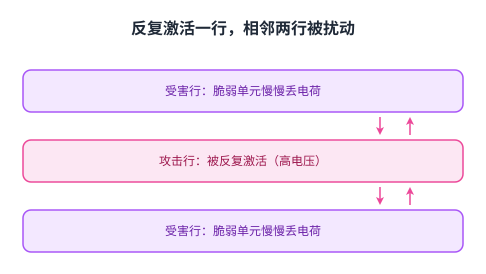
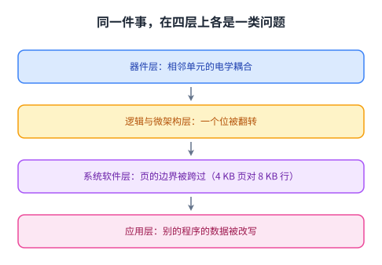
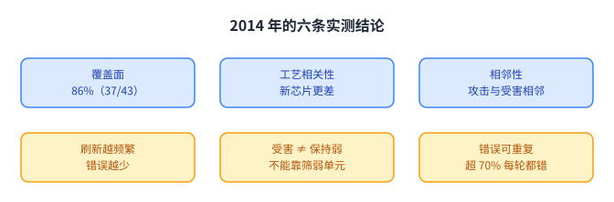
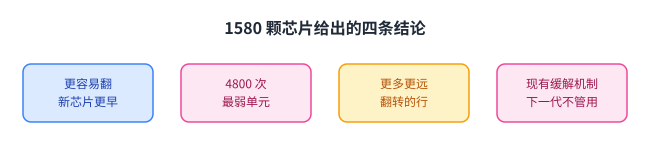
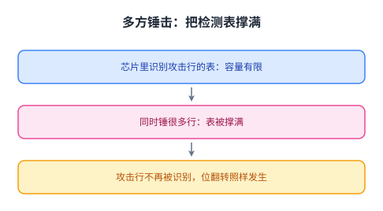
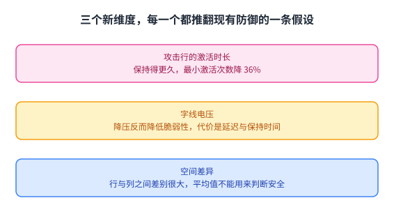
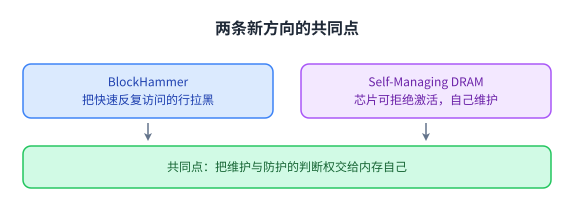
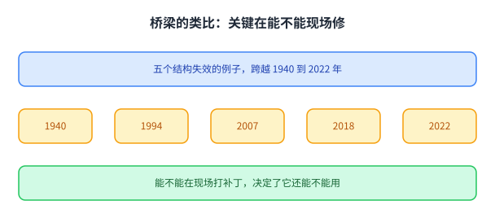

+++
title = "行锤：一个简单失效机制如何变成安全漏洞"
lecture = 6
slug = "lecture6-rowhammer"
status = "draft"
source_kind = "notes"
source_url = "https://safari.ethz.ch/architecture/fall2022/lib/exe/fetch.php?media=onur-comparch-fall2022-lecture6-rowhammer-and-secureandreliablememory-afterlecture.pdf"
source_title = "Lecture 6: The Story of RowHammer (Fall 2022, afterlecture)"
output_mode = "explanation"
+++

> 来源课程：ETH Zürich Computer Architecture（Onur Mutlu 主讲，Fall 2022）；
> 对应讲义：Lecture 6 — The Story of RowHammer（`onur-comparch-fall2022-lecture6-rowhammer-and-secureandreliablememory-afterlecture.pdf`，430 页）；
> 讲义链接：<https://safari.ethz.ch/architecture/fall2022/lib/exe/fetch.php?media=onur-comparch-fall2022-lecture6-rowhammer-and-secureandreliablememory-afterlecture.pdf> ；
> 上游许可：该课程 wiki 每一页的页脚都带站点级许可块，原文为 CC BY-NC-SA 4.0 —— <https://creativecommons.org/licenses/by-nc-sa/4.0/deed.en> ；
> 本页由 CourseLingo 用中文重新讲解，按源讲义的推进顺序组织，不是逐字翻译，也不转载原讲义里的任何图片；
> 页内配图全部由我们自绘（原讲义里只有图、没有字的页，我们把它要讲的机制重画出来）。
> 本页为非官方材料，与 ETH Zürich 及课程教学团队无隶属关系；如与原文有出入，以原文为准。

## 这一讲要解决什么问题

前面几讲讲的是内存慢、内存贵。这一讲讲的是更糟的一件事：内存不可靠，而且这种不可靠可以被别人主动制造出来。

源讲义在第 7 页给出这一讲的定位：可以在商用 DRAM 芯片上**可预测地**制造位翻转；测试过的 DRAM 芯片里超过 80% 都受影响；这是「一个简单的硬件失效机制如何变成大范围系统安全漏洞」的第一个例子。

这三个短句其实概括了整讲的结构。简单指的是触发它不需要什么特殊条件；硬件失效指的是根因在器件层，不是软件 bug；安全漏洞指的是它的后果会一路顶到操作系统和应用程序上。

这一讲要回答三个问题：这个机制到底是什么；它有多严重；以及我们能不能防住它。

先把名字定下来：这种反复访问一行、导致相邻行出错的现象叫 [[term:RowHammer]]，中文常译作行锤。

## 它为什么会发生

根因要从 DRAM 的存储方式说起。DRAM 用[[term:DRAM]]的电容存电荷，而电容式存储在缩放上有两个硬要求：电容要足够大才能被可靠读出，访问晶体管要足够大才能漏电够慢、保持时间够长。源讲义引用 ITRS 2009 的判断：DRAM 在 40 到 35 纳米以下（2013 年前后）继续缩放已经很困难。

缩放困难带来的直接后果是单元之间挨得太近。源讲义把原因写得很直白：DRAM 单元彼此之间没有电学隔离，访问一个单元会影响附近单元的值，这种效应叫单元间耦合。

于是机制就出来了。当你激活一行（给它加高电压）时，旁边那一行也会被轻微激活，而这一行里比较脆弱的单元会丢掉一点电荷。丢一次没关系，因为[[term:refresh]]会定期把电荷补回来。但如果在一段刷新间隔内，同一行被反复激活足够多次，那些脆弱单元丢掉的电荷就攒够了，值就翻转了。

顺带说明刷新这件事本身为什么也很麻烦。源讲义引用 Liu 等人在 ISCA 2013 的实测：DRAM 的保持时间并不整齐，它**依赖位置、依赖存储的值、也依赖时间**。这一条既是行锤的舞台（不同单元的脆弱程度不同），也是刷新策略必须做得更聪明的原因。

这里有两个角色需要记住：被反复激活的那一行叫攻击行（aggressor），被它影响的那一行叫受害行（victim）。源讲义后面所有的实测数据都是围绕这两者展开的。

## 后果为什么会一路顶到应用程序

一个器件层现象为什么能变成系统安全问题？源讲义给了一条很清楚的推理链。

操作系统给每个进程分配内存页，常见页大小是 4 KB；而一行 DRAM 是 8 KB，也就是说一个操作系统页装在一行里，而**相邻的** DRAM 行属于不同的操作系统页。既然攻击者能影响相邻的行，他就能影响别人的页。

源讲义说的破坏很具体：程序通过访问自己的页，去破坏属于另一个程序的页。ISCA 2014 那篇工作给出了概念验证，而且完全只用用户级指令就做到了。这意味着内存保护这道墙在器件层失效了。

这一影响的跨度正是[[term:transformation-hierarchy]]的含义：从器件层的电学耦合，到逻辑层与[[term:microarchitecture]]，再到[[term:ISA]]与系统软件，最后落到应用程序上。

这张图把上一段那句话摊开：同一件事在四层上各是一类问题。而它同时说明了为什么这件事难治 —— 每一层能用的手段不一样，而真正严重的后果（别的程序的数据被改写）落在最上层，最上层的防御却看不到最下层的机理。

## 2014 年第一次系统实测

这一讲的实证基础是 Kim 等人在 ISCA 2014 的工作，标题就是结论：不去访问那些位，也能把它们翻转。源讲义把它总结成七条观测，其中有几条后来被反复引用。

第一条是覆盖面：测试的模块里绝大多数都有风险，源讲义给出的数字是 86%（37/43），并按厂商分成 86%、83%（45/54）、88%（28/32）三组。

第二条是工艺相关性：新芯片比老芯片更容易出错。这一条在 2020 年重做实验时变得更明显。

第三条是相邻性：绝大多数攻击行与受害行是相邻的，偶尔才出现跨多行的情形。

第四条与刷新有关：把刷新做得更频繁（源讲义给的例子约 7 倍频繁）能显著减少错误。这一条既解释了机制，也指出了缓解方向。

还有三条更技术、但决定了防御怎么做：受害单元与「保持时间弱的单元」几乎不重叠，也就是说不能靠筛掉弱单元来防；错误是可重复的，十轮测试里超过 70% 的受害单元每一轮都出错；一个[[term:cache]]行里最多能出现 4 个错误，这意味着简单的纠错码（如能纠一位的 SECDED）挡不住全部错误。另外还有双侧锤击：一个单元被它两侧的两个攻击行同时影响。

这里还要补一句方法上的前提：这些实验之所以做得出来，靠的是能直接对真实 DRAM 芯片下达命令的实验平台。源讲义反复介绍 SoftMC，一件开源、基于 FPGA 的基础设施，它能灵活而方便地对真实芯片做实验。这一点值得记住：行锤这类发现不是从仿真里推出来的，而是靠能对买得到的芯片做实验。

这六条里有三条直接决定了防御该怎么做：错误可重复，说明它不是噪声而是可复现的物理现象；受害单元不等于保持时间弱的单元，说明「筛掉弱单元」这条路走不通；刷新越频繁错误越少，说明这条路至少能缓解。而覆盖面只有 86%，意味着剩下的 14% 得靠别的办法。

## 两类解决思路与 PARA

源讲义把解决思路分成两类，这个分法很实用。

第一类是立即方案：保护已经在现场的那个脆弱芯片。可用的手段有限，因为芯片已经卖出去了。第二类是长期方案：保护未来的芯片，那边空间大得多，因为可以在设计阶段动手。ISCA 2014 那篇工作两类都提了，一共给了七种方案。

其中被源讲义称为最佳方案、并且已经在现场使用的，叫 PARA，中文可以叫「概率性相邻行激活」。它的想法很简单：每次关闭一行之后，以一个小概率（源讲义给的 p 等于 0.005）去激活它的一位邻居，也就是顺手刷新一下。

这样做的效果是：毗邻的攻击行被真正锤到之前，它旁边的那一行已经被顺带刷新过很多次，脆弱单元的电荷来不及攒够损失。

源讲义给了它的代价与保证：当 p 等于 0.005 时，一年内出错的概率是 9.4×10^-14；平均性能损失 0.20%（29 个基准），最差 0.75%；而且它是**无状态**的，所以实现成本与复杂度都低。这一组数字说明了一件事：好的防御不一定要很贵。

## 2020 年重访：它在变糟

过了六年，同一组作者重做了实验，结论比 2014 年更不乐观。源讲义在这一节的标题上就写了「RowHammer 正在变得更糟」。

他们在 1580 颗 DRAM 芯片上测出的关键结论有四条：新一代芯片更容易被翻转，翻转出现得更早；有些新芯片里最弱的单元只要 **4800 次**锤击就翻转；新一代工艺的翻转会出现在更多的行上，并且离受害行更远；而现有的缓解机制在未来的工艺代次上不起作用。

这四条里最要紧的是最后一条：它意味着现有的缓解机制不是「还能撑一阵」，而是「在下一代工艺上撑不住」。

## TRRespass：业界已部署的方案被绕过

2020 年的另一项工作把这件事推到了安全界：TRRespass，拿下了当年的最佳论文奖。

它证明的是：带 TRR 保护的 DRAM 芯片在现场依然可以被翻转。TRR 是产业界用来检测并抑制行锤的机制，各家实现都不公开。TRRespass 的做法是**多方锤击**：不去锤一两行，而是同时锤很多行，把芯片里那张用于识别攻击行的表撑爆，从而绕过检测。

它给的实测结果很具体：42 个受测 DDR4 模块里有 13 个可以被翻转，来自三家主要厂商，需要的锤击面数从 3 面到 19 面不等；13 部受测手机里有 5 部可以被翻转，来自四家厂商，用的是 LPDDR4 系列芯片。源讲义还特意说明这些数字只是「刚碰到表面」，因为工具本身并不穷尽。

这一节的结论只有两句：行锤到那时仍然是一个开放问题；而靠别人不知道细节来保证安全，大概不是个好办法。

## U-TRR：把不公开的防御机制挖出来

既然防御机制不公开，那就把它研究清楚。源讲义给的代表工作是 U-TRR，它的思路很巧妙：用数据保持失败这个已经存在的现象，去反推 TRR 的内部行为，从而搞清楚它到底做了什么。

结论比 TRRespass 更彻底：受测的 45 个模块全部可以被翻转；一个内存组里 99.9% 的行至少出现过一次翻转；最严重的情况下，一个 8 字节的数据字里出现多达 7 个翻转，这让纠错码彻底失效。

源讲义由此给出一句判断：TRR 并没有为行锤提供安全保证，而且我们很难去验证它的安全性质。

## 新的维度

到这里，防御看起来已经很难做了。源讲义最后又补了三个新维度，说明攻击面还在扩大。

第一个是攻击行的激活时长。同样的锤击次数，如果让攻击行保持激活的时间更长，产生翻转所需的最小激活次数可以降低 36%。这意味着那些只数「激活了几次」的防御会被绕过。

第二个是字线电压，这一条容易想反。直觉上「降压省电应该更脆弱」，但同一组作者在 DSN 2022 用 272 颗真实 DRAM 芯片做的实验给出的结论是相反的：降低字线电压会降低行锤脆弱性。攻击造成的位错误率下降 15.2%（最多 66.9%），而要诱发第一次翻转需要多激活 7.4%（最多 85.8%）。

代价有两个：行激活延迟变大（24% 的受测芯片需要把该延迟增加最多 24 纳秒才能稳定工作），以及保持时间变短（20% 的芯片需要补救：用能纠一位的纠错码，或对其中 16.4% 的行把刷新频率加倍）。所以省电与可靠性在这里不是简单的对立，而是一组必须一起算的取舍。

第三个是空间差异。行与行、列与列之间，翻转所需的激活次数差别很大，原因是设计与制造过程带来的差异。这条对防御的含义是：不能用平均值来判断一个芯片安不安全。

三个维度各自都能削弱现有防御，而它们的性质并不一样：前两个是攻击者可以主动去调的旋钮，会直接改变「多少次激活才翻转」这个数；第三个是芯片出厂就带上的空间差异，它让同一个阈值在不同位置上含义不同。

## 防御往哪里走

源讲义最后给了两条新的防御方向，它们的共同点是让内存自己管自己。

第一条是 BlockHammer：不去逐个检测攻击行，而是把「被快速反复访问的行」拉进黑名单，直接限制它们的访问频率。源讲义说它同时满足四条理想性质：防护要全面、要与商用芯片兼容、要能随脆弱性增长而扩展、防护要是确定性的，而它是唯一同时满足四条的方案。

第二条是 Self-Managing DRAM：在 DRAM 芯片加一条可以拒绝激活的引脚。有了它，芯片可以在自己内部完成维护操作，只要在维护期间拒绝控制器的激活命令即可。源讲义对它的定位是：让内存维护不再完全依赖控制器配合。

两条方向的做法不同，但共同点才是关键：过去判断「该不该防、什么时候维护」的权力在内存控制器那一侧，而这两条都把这份判断权往芯片内部挪。挪过去之后，控制器就不必知道芯片内部的物理细节了。

## 结论与一个类比

源讲义对未来的判断是：DRAM 正在变得越来越不可靠，因此会越来越容易被攻击；由于缩放困难，可能还有别的错误「正在悄悄溜进现场」，其中读扰动（也就是行锤）、保持时间错误、读错误、写错误都算，而它们都可能变成安全漏洞。

它用一组桥梁失效的例子收尾，这些例子跨越 1940 年到 2022 年。类比的重点不在「结构会失效」，而在能不能在现场修：能打补丁的结构可以继续用，不能打补丁的只能重建。

源讲义在这一节还补了一层含义：这些桥梁之所以出名，是因为问题都出现在投入使用之后，而结构一旦建成，改动的代价极高。DRAM 也一样：芯片卖出去以后，你能做的只剩控制器侧的补救；真正的修复必须留给下一代设计。这也是它为什么把「长期方案」与「立即方案」分开讲。

把这一点映射回内存，就是源讲义反复强调的那句：主存需要智能的[[term:memory-controller]]，而且是能理解器件行为、能与器件协调的那种智能。行锤这一讲的所有证据都指向同一个结论：**器件不会自己变可靠，可靠性必须由系统设计出来**。

## 小结：这一讲要带走的东西

第一，行锤的根因在器件层：DRAM 单元挨得太近，激活一行会让相邻行被轻微激活，脆弱单元反复丢电荷就会翻转。攻击行与受害行大多相邻。

第二，后果能一路顶到应用程序。一个操作系统页 4 KB 装在一行里，相邻行属于不同进程的页，所以只用用户级指令就能破坏别的程序的内存。

第三，2014 年的实测给出七条观测，其中三条决定防御：受害单元不是保持时间弱的单元、错误可重复、一个缓存行里能有 4 个错误。基于这些，PARA 用 0.005 的相邻行刷新概率换到了平均 0.20% 的性能损失。

第四，2020 年之后形势变糟：新芯片最弱单元 4800 次就翻；TRRespass 说明带 TRR 保护的模块仍可被多方锤击攻破（42 个里 13 个）；U-TRR 说明 45 个模块全部脆弱、99.9% 的行会翻、单个 8 字节字里能有 7 个翻转使 ECC 失效。

第五，防御的方向是让内存自己管自己：要么限制快速反复访问的行（BlockHammer），要么让芯片能拒绝激活、自己在内部做维护（Self-Managing DRAM）。而这一切的前提是主存需要真正智能的控制器。
