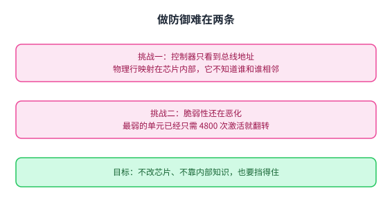
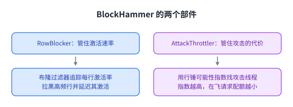
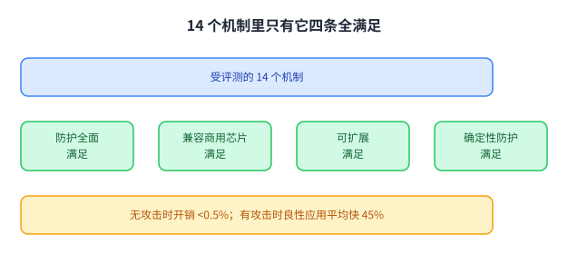
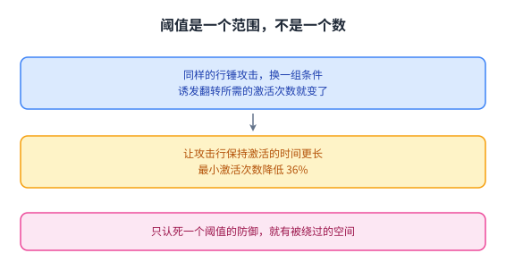
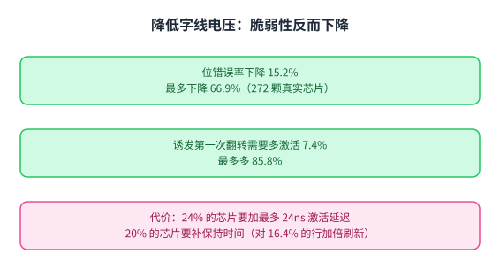
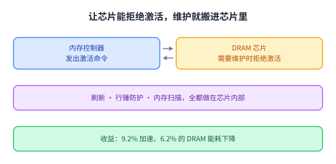
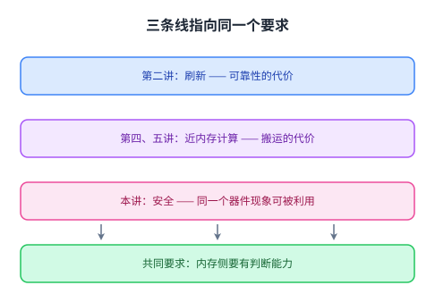

+++
title = "防御怎么设计：从限速到让内存自己维护"
lecture = 7
slug = "lecture7a-rowhammer-ii"
status = "draft"
source_kind = "notes"
source_url = "https://safari.ethz.ch/architecture/fall2022/lib/exe/fetch.php?media=onur-comparch-fall2022-lecture7a-rowhammer-ii-afterlecture.pdf"
source_title = "Lecture 7a: The Story of RowHammer (II) (Fall 2022, afterlecture)"
output_mode = "explanation"
+++

> 来源课程：ETH Zürich Computer Architecture（Onur Mutlu 主讲，Fall 2022）；
> 对应讲义：Lecture 7a — The Story of RowHammer (II)（`onur-comparch-fall2022-lecture7a-rowhammer-ii-afterlecture.pdf`，310 页）；
> 讲义链接：<https://safari.ethz.ch/architecture/fall2022/lib/exe/fetch.php?media=onur-comparch-fall2022-lecture7a-rowhammer-ii-afterlecture.pdf> ；
> 上游许可：该课程 wiki 每一页的页脚都带站点级许可块，原文为 CC BY-NC-SA 4.0 —— <https://creativecommons.org/licenses/by-nc-sa/4.0/deed.en> ；
> 本页由 CourseLingo 用中文重新讲解，按源讲义的推进顺序组织，不是逐字翻译，也不转载原讲义里的任何图片；
> 页内配图全部由我们自绘（原讲义里只有图、没有字的页，我们把它要讲的机制重画出来）。
> 本页为非官方材料，与 ETH Zürich 及课程教学团队无隶属关系；如与原文有出入，以原文为准。

## 这一讲要解决什么问题

上一讲讲清了 [[term:RowHammer]] 是什么：[[term:DRAM]] 单元之间的耦合让反复激活一行可以翻转相邻行的位，而这条路能一路通到应用程序。它还讲了早期防御，其中最实用的是 PARA。

这一讲接着往下问：防御应该怎么设计。源讲义重复了前面的背景，然后把重心放在 2021 年之后的新工作上，其中篇幅最大的是一个叫 BlockHammer 的方案。

它先给出一组判断标准。源讲义在总结一个新方案时，用四条「理想性质」来衡量：防护是不是全面、是不是**与商用 DRAM 芯片兼容**、能不能随行锤脆弱性的恶化而扩展、以及防护是不是确定性的。这四条不是随便列的，后面会看到它们正好把绝大多数方案筛掉。

这四条之所以值得先立出来，是因为它们的组合很苛刻：前两条要求它必须能覆盖各种攻击、又不能在芯片里改结构，后两条要求它必须跟着脆弱性一起变强、而且不能靠概率侥幸。后面会看到，正是这个组合把绝大多数方案筛掉了。

## 做防御难在哪

源讲义把困难总结成两条挑战。

第一条是与商用 DRAM 芯片兼容。这一条常被低估，源讲义专门画了一页说明原因：内存控制器看到的只是 DRAM 总线地址，也就是 [[term:CPU]] 侧发来的通道、rank、bank、行、列这些编号；而物理的行与列的映射发生在芯片内部，控制器看不到。也就是说，控制器并不天然知道哪两行在物理上相邻，而这恰恰是防行锤最需要的信息。

第二条是随脆弱性增长而扩展。上一讲已经看到，新一代芯片最弱的单元只要 4800 次激活就翻转，而且翻转会出现在更多、更远的行上。一个防御方案如果在脆弱性翻倍时开销也翻倍，那它就只能防住今天的芯片。

源讲义把目标写成一句很清楚的话：要高效、可扩展地阻止行锤，而且不依赖对 DRAM 内部的知识，也不修改 DRAM 芯片。

这张图把两条挑战并排放在一起：一条是「看不见」，一条是「追不上」。下面讲的 RowBlocker、AttackThrottler，以及最后的 Self-Managing DRAM，都是为了绕开这两条。

## BlockHammer 的两个部件

BlockHammer 的思路可以概括成一句话：**选择性地限制那些可能引发翻转的访存**。它不去改芯片，而是完全做在[[term:memory-controller]]里，由两个部件配合。

第一个部件是 RowBlocker。它用面积很小的布隆过滤器追踪各行的激活速率，把激活过于频繁的行放进黑名单，然后延迟后续针对黑名单行的激活请求。这里的设计要点是「延迟」而不是「禁止」：正常的程序偶尔也会密集访问某一行，直接拒绝会误伤；延迟则只是把那行的激活速率压到危险线以下。

第二个部件是 AttackThrottler。它的目标是攻击已经发生时减少对系统的伤害：攻击者会不停地激活被拉黑的行，于是这些请求会占掉大量[[term:bandwidth]]。它定义了一个指标叫行锤可能性指数，含义是「针对黑名单行的激活次数」相对「可能的最大激活次数」的比值；这个指数越高，就给该线程的在飞请求数一个越小的配额。源讲义还指出，这个指数本身可以交给系统软件，作为检测攻击的信号。

两个部件一个治「因」、一个治「果」：RowBlocker 让翻转根本不发生，AttackThrottler 让已经发生的攻击不再拖垮同机的其它程序。

## BlockHammer 的结果

源讲义给的结果分成两组，分别对应「没有攻击」与「有攻击」。

没有攻击时，它的开销很低：[[term:cache]]、[[term:latency]]与性能损失小于 0.5%，[[term:energy-efficiency]]开销小于 0.4%。有攻击时，它带来的收益来自另一侧：良性应用的平均性能提高 45%，DRAM 能耗平均下降 29%，因为攻击者不再能霸占带宽。

但源讲义最看重的是另一件事：它评测了 14 个机制在这四条理想性质上的表现，**只有 BlockHammer 四条全满足**。源讲义还列了它的其它性质：相对现有最优方案，无攻击时竞争力相当、有攻击时性能与能耗更好、硬件面积随脆弱性恶化扩展得更好、带安全证明、并且能应对多方锤击这种攻击方式。此外它是开源的，仓库里同时放了六个现有最优机制，方便复现与对比。

「14 个里只有 1 个」这个结果值得读两遍：它说明这四条性质单独看都不难，难的是同时满足。而它在有攻击时让良性应用平均快 45%，也说明防护不必等于性能损失 —— 前提是防护做得足够选择性。

## 攻击面还在扩大

防御要能跟上攻击面。源讲义接下来用两节说明这个面还在变宽。

第一件工作叫「更深入地看行锤的敏感性」，目标是搞清三个基本性质，从而设计出更有效、更高效的攻击与防御。它的做法是在真实芯片上系统性地改变条件，看翻转需要多少次激活。前面已经讲过其中一个结论：让攻击行保持激活的时间更长，可以把诱发翻转所需的最小激活次数降低 36%。

这一类工作的价值不在某个具体数字，而在于它把「行锤需要多少次激活」从一个数变成了一个随条件变化的范围。只要它是范围，任何只认死一个阈值的防御就有被绕过的空间：攻击者只要找到最省力的那组条件即可。

这张图把「范围」这件事说实了：横轴不是时间而是条件。于是防御的难度不在于把阈值定得更低（那只会更贵），而在于让防御不依赖某一个具体的阈值。这也解释了为什么后面那些方案都在讲机制而不是讲数字。

## 字线电压：一条反直觉的结果

第二个更深入的研究关于字线电压，它的结论值得单独讲，因为它与直觉相反。

直觉上，降低字线电压（一种省电手段）会让单元更难被正确读写，所以应该更脆弱。但同一组作者在 DSN 2022 用 272 颗真实 DRAM 芯片做的实验给出的答案是：**降低字线电压会让行锤脆弱性下降**。攻击造成的位错误率下降 15.2%，最多下降 66.9%；要诱发第一次翻转，一行需要被多激活 7.4%，最多多 85.8%。

代价有两个，它们也很具体。第一是行激活的[[term:latency]]变大：76% 以上的芯片用原有[[term:refresh]]与定时参数就能稳定工作，剩下的 24% 需要把该延迟增加最多 24 纳秒。第二是保持时间变短：80% 的芯片用原有刷新率就能稳定工作，剩下的 20% 需要补救，办法是用能纠一位的纠错码，或者对其中 16.4% 的行把刷新频率加倍。

这一节的结论不是「找到了一个好开关」，而是说明省电与可靠性之间不是简单的对立关系：同一个旋钮可能同时改善一件事、恶化另一件事，而每一项都要用真实芯片量出来。

## 让内存自己维护

前面几条路都要求内存控制器知道得更多。源讲义最后给了一个方向相反、但可能更根本的解法：**让 DRAM 芯片自己完成维护**。

这个方案叫 Self-Managing DRAM。它的关键是一条可以拒绝激活的引脚：芯片需要做维护时，把接下来针对相关区域的激活命令拒绝掉，控制器收到拒绝后换个时间再来。有了这条反馈通路，维护操作就可以完全实现在芯片内部，而不必先改控制器与接口。

源讲义列了三类维护操作在这一框架下的实现：刷新（可以按固定速率，也可以对保持时间长的行跳过）、行锤防护（可以按概率做邻居行刷新，也可以在计数超过阈值时确定性地做）、以及内存扫描（周期性扫描全片并纠正错误）。

它给的整体结果是：把这三类操作都用上之后，相对传统 DRAM 有 9.2% 的加速与 6.2% 的 DRAM 能耗下降。这个数字不算惊人，但它的意义在于**换了一种分工方式**：维护的知识放在最了解器件的那一层。

源讲义解释它为什么值得做：想加一种新的维护机制，通常要在 DRAM 接口与内存控制器两侧同时做很难落地的改动，而 SMD 让新机制可以不再牵动这两处。换句话说，它把「谁来维护」从系统问题变成了芯片内部问题。

值得留意的是这一页把三件事放在同一张图上：刷新、行锤防护与内存扫描。它们过去分属不同的问题，而在这条引脚出现之后，它们都变成了「芯片自己决定什么时候做」的同一类事情。

## 未来的三段议程

源讲义最后把这件事整理成三段议程，这个分法很值得记下来。

第一段是理解：为脆弱性建模与发现方法，基于真实的器件数据做预测，把「脆弱性」变成可靠的度量。

第二段是架构：设计把安全当作首要关注之一的架构，在整条栈上分清职责；同时不能牺牲性能与效率，而且要能在现场打补丁。

第三段是设计与测试：为安全而设计，追求高覆盖，并且让安全方法与系统可靠性方法互相配合。源讲义在这里的提醒是，安全与可靠性不是两套独立的问题：很多器件层现象同时属于两者，分开处理就会漏掉它们的交集。

它的落点是一句很短的话：智能的内存控制器可以避免许多失效，并且能带来更好的缩放。

## 把这一门课串起来

这一讲其实可以把前面几讲串成一条线。

第二讲讲刷新：器件的电荷会漏，所以必须定期补，这是可靠性的代价。第四与第五讲讲把计算搬到内存里（从三维堆叠的 HBM 结构，到 UPMEM 这类已经卖出来的产品）：因为[[term:data-movement]]太贵，所以要减少搬运。这一讲讲安全：同一个器件层现象既能被自然发生，也能被人主动利用。

三条线指向同一个工程判断：内存已经复杂到**不能把它当成一块笨的存储**。刷新策略要按行的保持时间定制，防护要知道物理相邻关系，维护要在芯片内部完成，而计算本身也可以放进去。这些都需要内存侧有判断能力，也就是源讲义反复强调的智能控制器。

三条线放在一起看，得到的不是三个结论而是一个共同要求：内存侧要有判断能力。这也解释了这一讲的标题里为什么是「需要智能控制器」，而不是「需要更快的控制器」—— 缺的不是速度，是判断。

## 小结：这一讲要带走的东西

第一，评价一个行锤防御要问四件事：防护是否全面、是否兼容商用芯片、能否随脆弱性恶化而扩展、是否是确定性的。源讲义评测的 14 个机制里只有 BlockHammer 四条全满足。

第二，控制器做防御的天然障碍是**它看不到芯片内部的物理行映射**，这正是「哪两行相邻」这个关键信息所在。

第三，BlockHammer 的两个部件分工明确：RowBlocker 用布隆过滤器追踪激活率、把高频行拉黑并延迟其后续激活；AttackThrottler 用行锤可能性指数识别攻击线程并压缩它的在飞请求配额。无攻击时开销小于 0.5% 与 0.4%，有攻击时良性应用平均快 45%、DRAM 能耗低 29%。

第四，攻击面还在扩大，而且有些结论反直觉：让攻击行保持激活更久可把最小激活次数降低 36%；而降低字线电压反而让脆弱性下降（位错误率 −15.2%，最多 −66.9%），代价是行激活延迟与保持时间。

第五，更长远的解法是换分工：让 DRAM 芯片能拒绝激活、自己完成刷新、行锤防护与扫描，源讲义给的收益是 9.2% 加速与 6.2% 的 DRAM 能耗下降。
