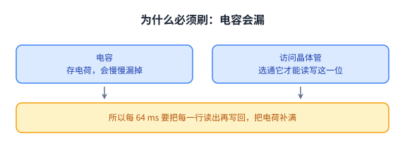
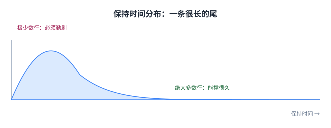
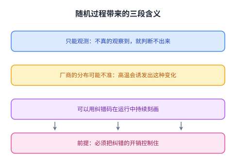

+++
title = "刷新：一个必须做、但不该所有人都做的动作"
lecture = 8
slug = "lecture7b-retention-refresh"
status = "draft"
source_kind = "notes"
source_url = "https://safari.ethz.ch/architecture/fall2022/lib/exe/fetch.php?media=onur-comparch-fall2022-lecture7b-memory-dataretention-and-refresh-afterlecture.pdf"
source_title = "Lecture 7b: Data Retention and Refresh (Fall 2022, afterlecture)"
output_mode = "explanation"
+++

> 来源课程：ETH Zürich Computer Architecture（Onur Mutlu 主讲，Fall 2022）；
> 对应讲义：Lecture 7b — Data Retention and Refresh（`onur-comparch-fall2022-lecture7b-memory-dataretention-and-refresh-afterlecture.pdf`，158 页）；
> 讲义链接：<https://safari.ethz.ch/architecture/fall2022/lib/exe/fetch.php?media=onur-comparch-fall2022-lecture7b-memory-dataretention-and-refresh-afterlecture.pdf> ；
> 上游许可：该课程 wiki 每一页的页脚都带站点级许可块，原文为 CC BY-NC-SA 4.0 —— <https://creativecommons.org/licenses/by-nc-sa/4.0/deed.en> ；
> 本页由 CourseLingo 用中文重新讲解，按源讲义的推进顺序组织，不是逐字翻译，也不转载原讲义里的任何图片；
> 页内配图全部由我们自绘（原讲义里只有图、没有字的页，我们把它要讲的机制重画出来）。
> 本页为非官方材料，与 ETH Zürich 及课程教学团队无隶属关系；如与原文有出入，以原文为准。

## 这一讲要解决什么问题

第 2 讲讲内存趋势时出现过两个数字：刷新开销占 DRAM 能量的 15%，而在容量继续增长后会逼近 47%。这一讲把那个数字拆开，问一个更基础的问题：刷新这个动作，是不是所有人都必须做。

源讲义一开始就把这一讲放进课程的母题里：跨过抽象层看问题，也就是在 [[term:transformation-hierarchy]] 上做一次来回。器件层有一个现象（电荷会漏），上层有一个代价（必须定期补），而这一讲要做的是把两层接起来，让上层知道哪一部分真的需要补。

它先算了两笔账。第一笔是性能：刷新占掉的时间从现在的 8% 会长到 46%。第二笔是能量：从 15% 会长到 47%。这两个数字是同一个原因的两个侧面，而它们都来自一个统一的规定动作。

两笔账同时变重不是巧合，因为它们是同一个原因的两个侧面：所有行都被同样对待。也正因为原因相同，后面那些按行定制的方案可以同时改善这两个指标，而不是在两者之间取舍。

## 刷新为什么必须做

要理解为什么可以少刷，先要理解为什么必须刷。

源讲义从最基本的单元讲起：一个 [[term:DRAM]] 存储单元就是一个电容加一个访问晶体管。它存数据靠的是电容上的电荷，而电容会漏电。漏到一定程度，里面的值就读不出来了。

所以刷新（[[term:refresh]]）的规定动作是：每隔一段时间把每一行读出来、再写回去，把电荷补满。源讲义给的间隔是每 64 ms 一次，DDR4 这类器件的规范也是这么定的，而且对所有行一视同仁。

它还给了一道练习题：假设系统有 8 艾字节的 DRAM（2 的 63 次方字节），行大小 8 KB，那么一共有多少行、64 ms 内要做多少次刷新、总功率多少、一天的能耗多少。这道题的价值在于让人亲手感受规模：一次刷新的代价很小，但行数是天文数字。

顺着这道题还能看出刷新为什么是一种「刚性」开销。它不来自程序的需求，而来自器件的物理性质，所以无论程序在做什么，它都按固定节奏发生；而在容量继续增长时，行数增加、刷新次数跟着增加，这笔开销在总能耗与总时间里的占比就会越来越高。

这一页是整讲的物理起点。把「电容会漏」与「读出会把电荷补满」放在一起看，就能理解后面所有方案的思路：既然刷新是为了补电荷，那么「什么时候必须补」就成了一个可以按行去问的问题，而不必是一个对所有行统一的规定动作。

## 关键在于「所有行都被同样对待」

真正的问题不在刷新本身，而在刷新策略的粗粒度。

源讲义指出一个被统一规定掩盖的事实：DRAM 的保持时间并不是一个整齐的数。制造过程不是完美的，于是不同行的保持时间差别很大，分布是一条很长的尾巴。

接着它给了这堂课最关键的一句话：在 32 GB 的 DRAM 里，只有大约 1000 行需要每 256 ms 刷新一次，但我们却**把所有行每 64 ms 都刷了一遍**。也就是说，绝大多数的刷新是在给不需要那么勤的行走同一个流程。

RAIDR 的核心想法就来自这里：**弱行刷得更勤，其它行刷得更少**。

图里那条长尾就是全部机会所在：尾巴那一小段决定了整个系统必须多频繁地刷新，而中间那一大片本来可以刷得少得多。

## RAIDR 的三步

把想法变成机制需要三步，源讲义把这三步讲得很清楚。

第一步是刻画（profiling）：找出每一行的保持时间。这一步可以在设计阶段做，也可以在运行中做。

第二步是分箱（binning）：把行按保持时间放进不同的箱子，每个箱子对应一种刷新频率。这一步的难点是存储：如果给每一行都记一条信息，开销会随容量线性增长。源讲义用的办法是硬件布隆过滤器，代价是允许「假阳性」——某一行可能被误判为需要勤刷。

第三步是刷新：[[term:memory-controller]]按行所属的箱子决定刷新频率。整套机制在一个 32 GB 的系统里只占 1.25 KB（两个布隆过滤器）。

这里还有一个实现位置上的选择值得注意。源讲义指出，在今天 DDR4、DDR5 的自动刷新里，刷新的控制权在 DRAM 芯片那一侧；而 RAIDR 既可以实现在内存控制器里，也可以实现在 DRAM 芯片里。两种位置各有取舍：放在控制器里改动面小，放在芯片里离器件更近，而且不需要控制器知道箱子的细节。

三步的分工值得留意：第一步是测量（只能靠实验做出来），第二步是把测量结果压成可查询的形式，第三步才是真正省下刷新。前面两步是成本，第三步是收益，而这个方案的价值就在于让前两步足够便宜，使第三步的收益跑得赢它们。

## 为什么布隆过滤器正好合适

这里有一个很值得学的判断：布隆过滤器的缺点恰好不是问题，这也是它常被用在[[term:cache]]与过滤器里的原因。

源讲义列了布隆过滤器的性质：**没有假阴性**（说不在就一定不在），但可能有假阳性（说在却可能从没插入过）；插入与查询都很快；永远不会溢出；而且可以用容量与哈希函数数量在时间、空间与假阳性率之间做取舍。

放进刷新这个场景，假阳性的后果是「某些行被刷得比需要的更勤」：这只损失一点性能，不会丢数据；而「没有假阴性」保证了任何需要勤刷的行都不会被漏掉。源讲义把这个判断写成一句总结：适合用在场合适假阳性的地方，而刷新正好是这种地方。

这条推理值得单独记下来：同一份数据结构的「缺陷」，在换成另一个问题之后可能正好落在可接受的误差里。判断能不能用，靠的不是结构本身好不好，而是出错的方向会不会伤到正确性。

## RAIDR 的结果

源讲义给的结果很整齐，在 32 GB、8 个 [[term:CPU]] 核的配置上跑多种负载：刷新次数减少 74.6%，动态 [[term:energy-efficiency]]开销降低 16%，空闲时的 DRAM 功耗降低 20%，性能提升 9%，而硬件成本就是那 1.25 KB。

它还给了一句前瞻：**容量越大，收益越大**。原因不难理解：需要勤刷的弱行数量基本不随容量涨，而总行数随容量线性增长，所以「不需要勤刷的行」占比会越来越高。

四组数字之外，「容量越大收益越大」这句前瞻更值得记。它说明这个方案的收益不是固定的，而是跟着容量一起长的，这和很多「收益大致恒定」的优化不一样：这里的收益会随问题规模一起变好。

## 让它真正可行的两个挑战

源讲义接下来用一整段讲「怎么让 RAIDR 真的能用」，因为刻画保持时间这件事远没有听起来那么容易。有两个挑战。

第一个是数据模式依赖：一个单元的保持时间取决于它自己的值，也取决于它周围单元的值。原因是当一行被激活时，所有位线会被同时扰动，于是同一行在不同数据下表现不同。这意味着「这一行的保持时间」不是一个固定的数。

它的工程后果是：任何刻画方法都必须覆盖足够多的数据模式，否则测出来的是一个偏乐观的数；而如果把最坏模式全部测一遍，成本又会高到不可接受。

第二个是保持时间随时间变化：同一个单元会在多个保持时间状态之间随机切换。原因是访问晶体管的栅氧化层里存在电荷陷阱：陷阱被占据时，漏电流会变大，保持时间就变短。源讲义把这种现象叫陷阱辅助的栅致漏极漏电，并指出它是一个随机过程。

两个挑战的性质不同，应对方式也不同。数据模式依赖是确定性的，所以可以通过测量去逼近；而随时间随机变化是随机的，测量只能给出一个当下的快照，所以任何一次刻画都有时效性，需要持续去做。

## 随机过程带来的三段含义

第二个挑战的后果值得单独说，因为它决定了「刻画」这件事能做到什么程度。

第一，源讲义指出：除非真的观察到某个单元出现保持时间变化，否则没有可靠的办法判断它是否有这种变化。也就是说，**只能靠观测，不能靠推断**。

第二，厂商给出的保持时间分布可能并不准确，因为极高的温度可以诱发出原本不存在的这种变化，而焊接过程正好会经历高温。

第三，源讲义给了一个未来方向：用纠错码在运行中持续刻画、同时激进地降低刷新率，但要控制住纠错的开销。

三段含义合起来指向一个结论：保持时间是一个必须持续观测的量。这解释了这一讲后半部分的走向 —— 当芯片内置纠错把错误提前修掉之后，观测会变得更难，因为原本能看见的现象被掩盖了。

## 怎么可靠地找到保持时间失败

既然只能观测，那就要设计观测的方法。源讲义列了一条演进线。

较早的方案叫 AVATAR：思路是**不预测，而是出错就升级**——某一行被纠错码报出错误时，就提高这一行的刷新率，于是它以后不会再犯。源讲义给了一条支撑这个思路的观察：保持时间变化的发生率比软错误率高 50 到 2500 倍，所以「靠纠错码发现」是可行的。

后来的一件工作叫 REAPER，它处理数据模式依赖与随机变化这两个挑战同时存在的情况，做法是在更激进的条件下做刻画：更高的刷新间隔与更高的温度，从而更快地暴露问题。源讲义说它是第一篇针对移动端 LPDDR4 芯片的实验分析。

再往后，源讲义指出芯片内置纠错码会把事情搞得更复杂：片上纠错会在你观察之前就把错误修掉，于是刻画看到的现象被掩盖了。对应的工作包括一项针对现代 DRAM 片上纠错机制的实验研究（获最佳论文奖），以及在有纠错的情况下继续做刻画的方法。

同一时期还有一类偏系统层的工作，例如把刷新与保持时间处理做成系统级技术，思路是在不精确知道每一行保持时间的前提下，用统计与运行时反馈把刷新成本压下来。它和前面那条线的差别在于：前者努力把每一行的真实情况测准，后者承认测不准，于是把安全性建立在「出错也能被纠错码抓住」这个前提上。而这里还有一个系统级的版本：与其逐行预测，不如让系统按现象反应，把纠正与升级交给硬件自动完成。它的好处是不需要准确的前瞻模型，缺点是必须先出现一次错误才能触发升级，所以纠错的覆盖能力就成了安全边界。

这条演进线本身就是一份方法论：每一代方案都在绕开上一代暴露出来的一个盲点。AVATAR 靠纠错报错来触发，REAPER 换到更激进的条件下刻画，而片上纠错的出现又把可观测性拿掉了一部分。

## 同一个问题在闪存上

源讲义在附录里把这个话题延伸到闪存，因为保持时间同样是闪存的核心问题。

闪存靠的是把电荷放进浮栅，同样会漏，于是错误类型里有专门的保持时间错误一类（行锤是另一类，见第 6 讲 [[term:RowHammer]]）；解决思路也类似：定期刷新。源讲义提到一项叫 Flash Correct-and-Refresh 的工作，思路是读了就检查、必要时重写，把保持时间错误在变成不可纠正错误之前修掉。再往后还有针对三维闪存的保持时间分析。

把两件事放在一起看，能看出一个更一般的结论：只要是靠电荷存数据，保持时间就是必须付的成本，差别只在于怎么把这份成本精准地付在需要的地方。

把闪存放在这里对照，是为了说明保持时间不是 DRAM 特有的问题，而是「把数据存在电荷里」这一类技术的共同问题。补救方式也一致：定期刷新、读了就检查。区别在于闪存的写代价更高，所以它的刷新策略要更省着做。

## 小结：这一讲要带走的东西

第一，刷新的必要性来自器件：电容会漏电，所以每 64 ms 要把每一行读出再写回，而这条规定的代价会随容量增长从性能 8%/能量 15% 涨到 46%/47%。

第二，真正的问题不是刷新本身，而是所有行被一视同仁。32 GB 里只有约 1000 行需要每 256 ms 刷一次，绝大多数的刷新是多余的。

第三，RAIDR 用三步把这件多余的事去掉：刻画每一行的保持时间、用布隆过滤器把行分箱、按箱决定刷新频率。它只花 1.25 KB，换来 74.6% 的刷新减少、16% 的动态能量降低、20% 的空闲功耗降低与 9% 的性能提升，而且容量越大收益越大。

第四，让这件事真正可行要解决两个挑战：保持时间依赖数据模式，而且会随时间随机变化。后者意味着「只能观测，不能推断」，也意味着厂商给出的分布可能不准。

第五，解决方法是一条演进线：AVATAR 用纠错码出错就升级，REAPER 在更激进的条件下刻画，之后还要处理芯片内置纠错把错误提前修掉的问题。而同一套问题在闪存上以另一种形式存在，说明**只要靠电荷存数据，保持时间就是必须付的成本**。

第六，这一讲的方法论比机制更重要：把器件层的真实差异暴露给上层，让系统按差异分配成本，而不是对所有数据执行同一个最坏情况的动作。
