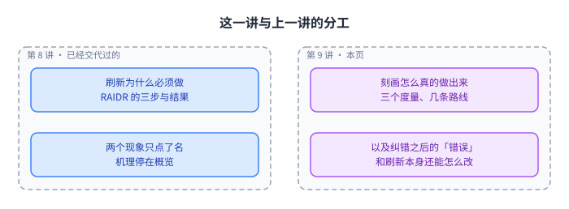
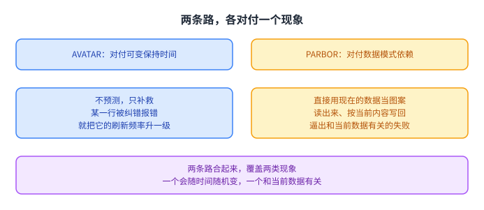
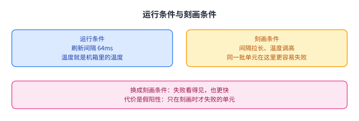
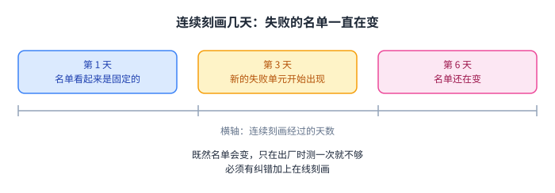
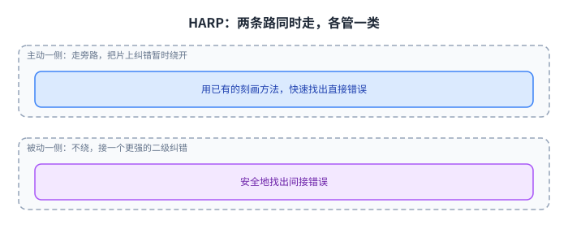
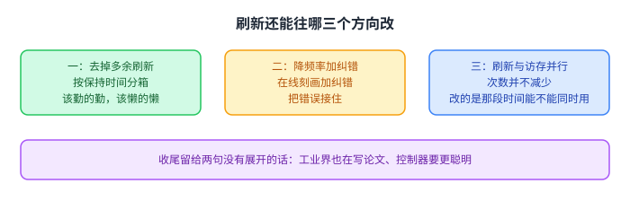
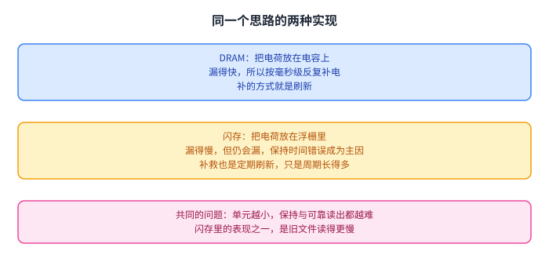

+++
title = "做出来才算数：把保持时间测准有多难"
lecture = 9
slug = "lecture8a-retention-refresh-ii"
status = "draft"
source_kind = "notes"
source_url = "https://safari.ethz.ch/architecture/fall2022/lib/exe/fetch.php?media=onur-comparch-fall2022-lecture8a-memory-dataretention-and-refresh-ii-afterlecture.pdf"
source_title = "Lecture 8a: Data Retention and Memory Refresh II (Fall 2022, afterlecture)"
output_mode = "explanation"
+++

> 来源课程：ETH Zürich Computer Architecture（Onur Mutlu 主讲，Fall 2022）；
> 对应讲义：Lecture 8a — Data Retention and Memory Refresh II（`onur-comparch-fall2022-lecture8a-memory-dataretention-and-refresh-ii-afterlecture.pdf`，141 页）；
> 讲义链接：<https://safari.ethz.ch/architecture/fall2022/lib/exe/fetch.php?media=onur-comparch-fall2022-lecture8a-memory-dataretention-and-refresh-ii-afterlecture.pdf> ；
> 上游许可：该课程 wiki 每一页的页脚都带站点级许可块，原文为 CC BY-NC-SA 4.0：<https://creativecommons.org/licenses/by-nc-sa/4.0/deed.en> ；
> 本页由 CourseLingo 用中文重新讲解，按源讲义的推进顺序组织，不是逐字翻译，也不转载原讲义里的任何图片；
> 页内配图全部由我们自绘；原讲义里只有图、没有字的页，我们只如实记下它的标题。
> 本页为非官方材料，与 ETH Zürich 及课程教学团队无隶属关系；如与原文有出入，以原文为准。

本页的事实来自 `_sources/eth-ddca-ca/evidence/eth-ca2022-lecture8a-retention-refresh-ii.pdf.embedded.txt`（pypdf 抽取，141 页），并与 `_sources/eth-ddca-ca/text-clean/` 下的同名文本交叉核对。该 PDF 入库前按三道核验过完整性：体积 4,644,011 字节、尾部有 `%%EOF`、大小不是 2 的整数次幂。本页没有一条结论取自忠实抽取（`pdftext3.py`）的输出：对这一个文件实测，141 页里有 72 页的正文是逐字符错位的字形码（含 NUL 字节），第 6 页那句题眼与第 131 页的 Ramulator 在忠实输出里检索命中都是 0。它不是全篇乱码，而是按页静默丢失，本页引用的页里就有 8 页落在受损范围内。

## 这一讲要解决什么问题

上一讲把「刷新」这件事讲完了前半段：[[term:DRAM]] 的电容会漏电，所以每隔 64 ms 要把每一行读出来再写回去；而所有行都被同样对待，是这笔固定开销里最大的一块浪费。它还讲了 RAIDR 的想法，也就是先测出每一行的[[term:retention-time]]，再用[[term:bloom-filter]]把行分箱，最后按箱决定[[term:refresh]]频率。

这一讲接着回答一个更硬的问题：那个想法怎么才能真的做出来。源讲义在第 6 页引了两句英文当作题眼，原文是「Good ideas are a dime a dozen」与「Making them work is oftentimes the real contribution」，意思是好主意一抓一大把，把它们做出来往往才是真正的贡献。整讲的重量都压在后半句上。

两讲的分工大致是这样。

左边是第 8 讲已经交代过的部分：为什么必须刷、RAIDR 的三步是什么、结果如何，以及两个现象的名字。右边是本讲要接手的两件事：刻画到底怎么做、测出来的东西算不算数；以及在芯片自己带上纠错之后，「错误」这个词还意味着什么。

源讲义在第 5 页只给了一篇 RAIDR 论文的出处，并注明它是作业的候选阅读材料。**这一页只有出处、没有正文**，所以这里也只记下这件事，不替它补充结论。

## 衡量一个刻画方法，先看三个数

源讲义在第 129 页把[[term:retention-time-profiling]]的评价标准收成三个量，后面所有方案的比较都绕着这三个量转。

第一个是运行时间，也就是刻画一共要跑多久。刻画期间机器要停下来做测试，时间长就直接等于可用时间变少。第二个是覆盖度，也就是真正会失败的单元里有多少被找了出来，漏掉的那部分正是以后会丢数据的那部分。第三个是[[term:false-positive]]，也就是只在刻画时失败、真实运行中从不失败的单元。

这三个数互相拉扯，这是整讲的骨架。

想跑得快，就只能挑一小部分单元测，覆盖度掉下去；想把失败测全，就得把条件放宽到一堆本来不会失败的单元也跟着失败，假阳性涨上来。源讲义把这里称为一个复杂的取舍空间，后面每一个方案都是在三个数之间选一个位置站。

## 先把保护拉高，再边跑边降级

源讲义在第 87 到 88 页给出一条把刻画搬进运行时的路线，它来自一项实测研究（SIGMETRICS 2014）。这条路线值得单独看，因为它把「测试」和「容忍错误」这两件事绑在了一起。

它分成三个阶段。

一开始把纠错能力开到最强，宁可多花开销，也要保证这段时间里出错不会丢数据。然后定期只挑内存的一小块做测试，轮着测，测得慢也没关系。测出哪些单元有问题，就把它们修掉或者标记掉，于是那块区域需要的保护强度就可以降下来。

这条路线给出的三条观察是：只测一次不可能把失败测全；纠错和其它手段合起来用，效果远好于只用一种；测试本身可以把需要的纠错强度降下来，哪怕一开始用的是更强的纠错。

它的意义在于把「测得准」从一次性任务变成了持续任务。后面会看到，这不是保守，它是必须：源讲义在第 109 页用实测数据说明，会失败的单元集合本身随时间在变。

## 出错就升级，还是拿现成数据当图案

两个现象各自需要一条路。源讲义在第 14 到 21 页把这两条路摆在一起。

左边是 AVATAR（DSN 2015）。它不打算预测哪一行会失败，而是承认预测不准：平时按一张宽松的表来刷，一旦某一行被纠错报出错误，就把这一行的[[term:refresh-rate]]升一级，此后它不会再犯。这个做法成立的前提是一条实测观察，可变保持时间的发生率比软错误高 50 到 2500 倍，所以「靠纠错发现」足够频繁，也足够早。它的示意图里还有一个 15 分钟一次的巡检（[[term:scrubbing]]）动作，和纠错一起把升级过的行保护起来。

右边是 PARBOR（DSN 2016）。它处理的是[[term:data-pattern-dependence]]：既然一个单元会不会失败取决于它存的值，那就不要让测试去猜值，而是直接用内存里现在的内容当图案，把它读出来、按当前数据重新写回去。这样测到的是真实数据下的行为。

两条路的差别不在强度，而在立场。AVATAR 接受「先出错再补救」，代价是必须等一次错误发生，所以纠错能覆盖多少，就成了它的安全边界。PARBOR 主动去构造失败，代价是测试本身要读写数据，会和正常访存抢时间。

源讲义给的结果里，AVATAR 把刷新减少了 60% 到 70%；如果一年做一次保持时间测试，还能从 60% 提到 70%。它的性能接近「完全不刷新」的三分之二，另外一条[[term:energy-delay-product]]曲线显示容量越大收益越明显。

## 把条件调高，让失败自己浮出来

这两条路都还是在正常条件下测。源讲义在 2017 年的一项工作（ISCA）里换了个思路，不在正常条件下测，而是把条件调得更苛刻一点去测。

理由是实测出来的，源讲义的原话是「Any cell is more likely to fail at a longer refresh interval OR a higher temperature」：任何一个单元，在刷新间隔更长或者温度更高的时候，都更容易失败。同一个单元在不同条件下，处在不同的「容易失败程度」上。

这带来一个位置上的选择。

左边是真实运行的位置，刷新间隔按规格来、温度是机箱里的温度，失败的少，也难发现。右边是[[term:reach-profiling]]的位置，把间隔拉长、温度调高，同一个单元在这里就很容易失败。

好处是快，而且可靠：容易失败的单元会自己跳出来，不用把整片内存翻个底朝天。代价也很清楚，就是假阳性，有些单元只在刻画条件下失败，真实运行中永远不会。源讲义把这件事说成把单元放到它最可能失败的位置上去找，而不是去预测它会不会失败。

## 连测几天会看到什么

源讲义在第 107 到 110 页给了一组实测数据，来自 368 颗 LPDDR4 芯片，芯片来自三家厂商，放在恒温箱里测，环境温度在 40 到 55 摄氏度之间，芯片自身温度比环境再高 15 度。

它做的是长时间连续刻画，结论可以压成一句话：会失败的单元不是一份固定名单。

天数一增加，就不断有新的失败单元出现，被归为失败的那个集合也跟着变。源讲义把新增的失败归因于[[term:variable-retention-time]]。既然名单会变，只在出厂时测一次就不够用，必须有[[term:ecc]]加在线刻画，才能管住以后新冒出来的失败单元。

同一组实验还给出一个设计刻画时要用的细节：一个单元的失败不是一个「到点就失败」的开关，而是一条随刷新间隔上升的曲线。在正常运行的那个间隔处，它几乎显示不出来；把间隔拉长一点，它就变得明显。源讲义给的一张图里，某个单元在 16 次试验里失败了 9 次，这就是「随机」的具体样子。

这一项工作的评测配置源讲义也写清了：4 核 4 GHz 的 [[term:CPU]]、8 MB 末级[[term:cache]]、LPDDR4-3200、每通道一个 rank，性能用 Ramulator 模拟、能耗用 DRAMPower 模拟，负载是 20 组随机搭配的 4 核基准混跑。在这个配置上，把刻画条件调高之后，刻画速度是当时最好基线的 2.5 倍（覆盖度 99%、假阳性 50%），系统性能提升 16.3%，DRAM 功耗降低 36.4%。

## 片上纠错把「错误」变成了两类

到这里，整条线都假设「读出来是错的，就能被看见」。源讲义在第 28 页之后换了一个前提：现在的内存芯片自己带纠错（[[term:on-die-ecc]]），错误在外部看到之前就已经被芯片改回去了。

它先指出三个新麻烦。处在风险中的位数按指数增长，因为一个纠错字牵涉多颗单元，一次失败会牵连一片。更难以定位到具体是哪一位出了问题。芯片内部的纠错还会和常用的测试图案打架，那些图案本来是设计来逼出错误的，现在先在芯片里被修掉了。

真正关键的是它给出的区分。

一种叫直接错误，来自存储单元本身，是真正该担心的东西。另一种叫间接错误，是片上纠错算法在解码时自己产生的假象，它的数量被纠错算法的能力上界卡住。对刻画来说，这两类错误混在一起，看到的现象就没法解释。

## HARP：两条路同时走，各管一类

源讲义在第 35 到 37 页讲了 HARP 的做法，思路很直接：既然两类错误的性质不同，就不要用一套方法去测。

主动一侧走一条旁路，把片上纠错暂时绕开，用已有的刻画方法快速把直接错误找出来。被动一侧不去绕，而是用一个至少和片上纠错一样强的二级纠错来接住错误，用这种方式安全地找出间接错误。这两条路同时走，不是先后两步。

这样一来，问题被还原了。源讲义把这一句写成「HARP reduces the problem of profiling with on-die ECC to profiling without on-die ECC」，也就是带片上纠错时的刻画被化简成不带片上纠错时的刻画。它给的数字是，相对两个当时最好的基线算法，达到 99 分位覆盖度要快 20.6% 到 62.1%；在一个数据保持错误的案例里，单位错误概率 0.75 时快 3.7 倍。

这条线还能看出一个更一般的模式：当测量工具本身开始改变被测对象，正确的做法不是把工具调得更用力，而是先把工具的作用和被测量的东西分开。

## 后面两步：放在哪里，代价多少

源讲义在第 39 页回到 RAIDR 的三步，把后面两步的实现细节补完。

分箱用的还是硬件[[term:bloom-filter]]，这一步第 8 讲已经讲过。这里补上的是刷新那一步的实现位置：今天的自动刷新系统，刷新的控制权在芯片那一侧；而 RAIDR 既可以做在[[term:memory-controller]]里，也可以做在芯片里。

两种位置的开销是明摆着的。

做在控制器里，需要的是一对布隆过滤器、3 个计数器，以及为逐行刷新多发出去的命令，这些在源讲义里都被算进了评测。做在芯片里，每颗 4 Gbit 芯片只要 20 字节的布隆过滤器和 1 个计数器，整台 32 GB 机器合起来是 1.25 KB 的布隆过滤器加 64 个计数器。

两种位置真正的差别不在字节数。做在控制器里，控制器必须自己知道箱子的细节；做在芯片里，控制器不需要知道这些细节，代价是控制逻辑要进到内存颗粒里。源讲义只写了「RAIDR 可以实现在控制器或 DRAM 中」，没有替读者选。

## 刷新本身还能怎么改

源讲义在第 57 到 64 页把这一讲的结论收在几条方向上。

第一条是去掉不必要的刷新，对应 RAIDR。第二条是用在线刻画降低刷新频率，同时靠纠错把错误接住，对应 AVATAR 与 REAPER 这一线。第三条是让刷新和访存并行起来，而不是互相挡住。

第三条值得多说一句，因为它换的是角度。前两条都在减少刷新的次数，这一条不减少次数，改的是刷新占用的那段时间能不能同时做别的事。源讲义在这一页给了一项 2014 年的工作，并注明同一方向在 2022 年又出现了新的论文。

还有两页值得如实记一句：第 62 页的标题是「工业界也在为这件事写论文」，第 63 页的标题是「对智能内存控制器的呼吁」。**这两页只有标题、没有正文**，所以这里不替它们补充结论，只记下源讲义把这两句放在了收尾的位置。

## 延伸阅读：闪存里的同一件事

源讲义从第 66 页起是备份幻灯片，其中一段专讲闪存。闪存的错误类型、Flash Correct-and-Refresh，以及三维闪存的保持时间分析，第 8 讲已经讲过，这里不重复。

这一份讲义补的是另一层说法：把 [[term:DRAM]] 和闪存放回同一个框架里看，它们都是「把电荷存在一个小地方」这个思路的不同实现。

源讲义的原话是：困难来自电荷的放置与控制，而电荷存储单元尺寸一缩小，数据的保持和可靠的读出都会变得更难。这句判断把前面所有机制放到了同一根线上，不是哪一种器件有毛病，而是「用少量电荷表示信息」这件事本身在缩小之后越来越难。

还有一个现象值得记下来：闪存里存在旧文件读得更慢的情况，源讲义给的实测是旧文件只有 30 MB/s，而新写入的文件有 500 MB/s。它把原因归结为保持时间的损失，并把读延迟变长列为这个损失的一个副作用。**这一页只给到这一层**，没有展开到判决电平那一级。顺带对照一句：这门课第 6 讲讲的 [[term:RowHammer]] 是 DRAM 侧由访问模式引起的另一类错误，和保持时间没有关系。

## 小结：这一讲要带走的东西

第一，这一讲接的是第 8 讲的后半段。第 8 讲给出了 RAIDR 的想法和结果，也点了两个现象的名字；这一讲回答的是那个想法怎么真的做出来，源讲义自己的判词是「把它们做出来往往才是真正的贡献」。

第二，刻画方法的评价标准是三个数：运行时间、覆盖度、假阳性。它们互相拉扯，想快就覆盖不全，想全就会带出假阳性，后面每个方案都是在三个数之间选一个位置站。

第三，两条经典的路各对付一个现象。AVATAR 不预测，某一行被纠错报错就升级它的刷新频率，靠的是一条实测观察，可变保持时间的发生率比软错误高 50 到 2500 倍；PARBOR 则直接用内存里现在的内容当测试图案，专门逼出数据模式依赖的失败。把条件调高去刻画（REAPER）换成另一个角度：不预测单元会不会失败，而是把单元放到它最容易失败的位置上去找，代价是假阳性。

第四，实测给出的最硬一条是：会失败的单元不是一份固定名单。368 颗 LPDDR4 芯片连续测下来，新的失败单元持续出现，失败的那个集合随时间在变。所以刻画不可能是出厂时的一次性动作，必须有纠错加在线刻画。

第五，芯片自己带纠错之后，「错误」变成了两类：来自存储单元的直接错误，和来自纠错算法本身的间接错误。HARP 把两类分开处理，主动一侧绕过片上纠错去测直接错误，被动一侧用更强的二级纠错接住间接错误，于是带片上纠错时的刻画被化简成不带片上纠错时的刻画。

第六，这一讲的方法论比任何一个机制都更重要：当测量工具本身开始改变被测对象，正确的做法不是把工具调得更用力，而是先把工具的作用和被测量的东西分开。
