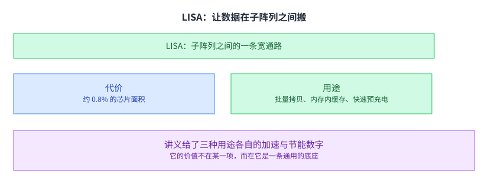

+++
title = "内存延迟：它不是物理常数"
lecture = 10
slug = "lecture8b-memory-latency"
status = "draft"
source_kind = "notes"
source_url = "https://safari.ethz.ch/architecture/fall2022/lib/exe/fetch.php?media=onur-comparch-fall2022-lecture8b-memorylatency-afterlecture.pdf"
source_title = "Lecture 8b: Memory Latency (Fall 2022, afterlecture)"
output_mode = "explanation"
+++

> 来源课程：ETH Zürich Computer Architecture（Onur Mutlu 主讲，Fall 2022）；
> 对应讲义：Lecture 8b — Memory Latency（`onur-comparch-fall2022-lecture8b-memorylatency-afterlecture.pdf`，345 页）；
> 讲义链接：<https://safari.ethz.ch/architecture/fall2022/lib/exe/fetch.php?media=onur-comparch-fall2022-lecture8b-memorylatency-afterlecture.pdf> ；
> 上游许可：该课程 wiki 每一页的页脚都带站点级许可块，原文为 CC BY-NC-SA 4.0：<https://creativecommons.org/licenses/by-nc-sa/4.0/deed.en> ；
> 本页由 CourseLingo 用中文重新讲解，按源讲义的推进顺序组织，不是逐字翻译，也不转载原讲义里的任何图片；
> 页内配图全部由我们自绘；原讲义里只有图、没有字的页，我们只如实记下它的标题。
> 本页为非官方材料，与 ETH Zürich 及课程教学团队无隶属关系；如与原文有出入，以原文为准。

本页的事实来自 `_sources/eth-ddca-ca/evidence/eth-ca2022-lecture8b-memorylatency.pdf.faithful.txt`（`pdftext3.py` 抽取，345 个分页段）。该 PDF 入库前按三道核验过完整性：体积 11,184,937 字节、尾部有 `%%EOF`、大小不是 2 的整数次幂。**这一份的抽取是干净的**：讲义正文各页的文字可按整词检索到（例如第 44 页的 `Two Major Sources of Latency Inefficiency`、第 47 页的 `Reason 1: Design of DRAM Micro`）。需要说明的是，同一份 PDF 用 `pypdf` 抽出的 `.embedded.txt` 反而**是坏的**：那份输出抽到的是内嵌字体的二进制，只有 19 个文本块。所以本页依据的是前一份，两份都留在证据目录里，便于核对这条差异。

讲义从第 241 页起是附录（备份幻灯片），本页取材落在正文的 p1 到 p240。

## 这一讲要解决什么问题

讲义开头把计算机体系结构当前的四个关键方向并列出来：根本安全可靠的架构、根本节能的架构、以内存为中心的架构，以及**根本低延迟、可预测的架构**。

这一讲站在最后一条上，而且它对这条的表述很直接：不是「设法不去等内存」，而是把内存延迟本身降下来。

把它与另外三条并列，本身就说明了讲义的判断：低延迟不是一个可以交给缓存去糊过去的问题，而是一个独立的研究方向。

## 而新一代内存往往更慢

先看一个有点反常识的观察。

讲义给的说法是：新的 DRAM 类型常常为了提高并行度与吞吐而把访问延迟做大。GDDR6 与 HBM 这些给 GPU 用的类型就是例子，它们换来的是更多的 bank、更高的带宽，代价是单次访问更慢。

而讲义接着指出，很多应用补不回这份延迟。它举的例子从操作系统的常见流程（文件 I/O、进程创建）一直到桌面、科学计算与服务端的一批应用。

这份清单值得留意的地方在于它**不是**高精尖的科研负载，而是一批日常应用。也就是说，延迟上升的代价并不只落在少数极端程序上，它落在大多数人每天都会碰到的东西上。

这句话是这一讲的动机：如果延迟只会越来越高，那么「能不能把它降下来」就是一个值得投入的问题。

[[term:latency]] 与[[term:bandwidth]] 在这里又一次分开了。前几讲讲的一直是「怎么把带宽用满」，而这一讲问的是另一个量：单次访问要等多久。

## 传统手段是「容忍」，不是「降低」

讲义回顾了四类经典手段。

| 手段 | 它靠什么生效 | 它的问题 |
| --- | --- | --- |
| 缓存 | 访存有局部性 | 不是所有程序、所有阶段都有局部性 |
| 预取 | 访存模式有规律 | 不规则的访存很难预取准，而且很费硬件 |
| 多线程 | 有别的线程可以跑 | 要让单线程也快起来，仍在研究中 |
| 乱序执行 | 窗口足够大 | 覆盖长延迟需要大量硬件资源 |

四类手段的共同点很清楚：它们都是让处理器不去等，而延迟本身一点没变。

讲义把它们叫「容忍延迟」（latency tolerance）。这个命名是准确的：容忍的代价是硬件复杂度，而收益的上限取决于程序里有多少可以并行的事。

[[term:memory-controller]] 与[[term:microarchitecture]] 的关系在这里又出现了一次：只要延迟还在，处理器就得为「怎么熬过它」付出代价，而这些代价最后会变成面积、功耗与设计复杂度。

讲义在回顾完这四类之后没有马上给出新方案，而是先做了一件事：把「容忍」与「降低」这两个词分开。这个区分看起来只是措辞，其实决定了后面所有方案的评价标准——一个方案如果只是让处理器更能等，那它并没有回答这一讲的问题。

## 延迟为什么长：两个来源

讲到这里，讲义把问题收成了两条。

- 来源一：[[term:DRAM]] 的[[term:microarchitecture]] 设计目标不是低延迟。讲义的原话是「目标是容量与面积最大化，不是延迟最小化」。
- 来源二：延迟参数的「一刀切」。同一套延迟参数用在所有温度、所有芯片、芯片的所有部位、所有电压档位、以及所有应用数据上。

讲义在这一页直接下了结论：很多内存延迟是不必要的。

这句话是这一讲全部内容的出发点。后面每一节讲一种方案，而每一种方案都可以被看成对这两条之一的进攻。

## 延迟由两段组成

要进攻来源一，得先知道延迟花在哪里。

讲义把一次访问的延迟拆成子阵列延迟与 I/O 延迟两段，并指出前者是主要部分。

这个拆法看起来朴素，但它是后面所有微架构方案的前提：不知道延迟落在哪一段，就不知道该改哪里。

## 子阵列为什么慢：长位线

沿着这条线往下问：子阵列那一段为什么慢。

讲义给的因果链是：位线之所以长，是为了摊薄感放器的面积成本：一个感放器服务很多个单元，平均到每个单元上的面积就小。但位线越长，线上的电容越大，充放电越慢，于是延迟与功耗一起上去。

这条链值得记住，因为它同时解释了延迟与功耗两个指标。它也直接指出了两条出路：把线做短，或者改变访问的粒度。后面的方案基本都落在这两条上。

## 出路一：把子阵列拆成近段与远段

分层延迟 [[term:DRAM]] 的做法是把一个子阵列的位线切成两段：近段位线短、访问快，但容量小；远段位线长、访问慢，但容量大。大部分容量放在远段，而访问得比较多的那部分数据放在近段。

讲义把它的目标总结成一句话：**用长位线拿到小面积，用短位线拿到低延迟。**

这是一个「两头都要」的设计，它成立的前提是：真实程序对内存的访问本来就不均匀，所以把快的那一段留给常用的数据是有意义的。

换个角度说，这个方案赌的是「访问的分布是偏的」。如果所有数据被访问得一样频繁，那么切分只会让问题更复杂；而真实的程序里，热数据通常只占一小部分，这一点让切分变得划算。

## 近段可以当成硬件管理的缓存

既然近段只放常用的数据，那它就成了一块由[[term:memory-controller]] 自己管的缓存：热数据留在近段，冷数据放到远段。

但这样立刻带来两个必须解决的问题：怎么在两段之间高效地搬一行数据，以及怎么高效地管理这块缓存。

这两个问题在性质上还不一样：前者是硬件问题（要不要在芯片上开一条通路），后者是把内存控制器变成一个带策略的部件。它们合起来说明了一件事：一次[[term:microarchitecture]] 改动会连带出一整套系统问题。 把位线切短本身不难，难的是随之而来的搬运与管理。

## LISA：让数据在子阵列之间搬

第一个问题（怎么高效搬）的答案之一。

LISA 的思路是用很低的芯片面积代价（讲义说约 **0.8%**）在相邻子阵列之间开一条宽通路，于是数据可以在内存内部直接搬家，而不必绕到处理器再回来。

讲义给了三种用途：批量拷贝、把子阵列当内存内缓存用、以及快速预充电，并给了各自的加速与节能数字。

值得注意的是它的定位：它的价值不在某一项用途，而在于它是一条通用的底座。 有了这条通路之后，上面那些用途都变成了「怎么用它」的问题。这类「先造一个原语、再在上面长出应用」的做法，在前面的讲次里也出现过。

## CROW：把「拷贝一行」做成一条命令

拷行基质的思路与 LISA 属于同一类：与其把一行读出来再写回去（那要多次行激活），不如在内存内部直接把它复制走。

讲义给的收益是约 **20% 的加速**与 **22% 的 DRAM 能耗下降**，硬件代价是约 0.5% 的芯片面积、1.6% 的容量，加上内存控制器里的一点存储。

它还有一个顺带的用途：同一个机制可以用来做抗 [[term:RowHammer]] 的防护。这一点与前几讲接上了：RowHammer 的根因是反复激活相邻行，而如果能直接在内部拷贝而不是反复激活，攻击面就小了一块。

这一类「一个机制顺带解决另一件事」的情况在前面几讲里也出现过。它通常意味着这个机制触到了某个更底层的共同原因，而找到共同原因是这类研究中最有价值的部分。

## 另一个来源：保守的时序余量

前面几节都在进攻来源一（设计目标）。现在转向来源二（一刀切）。

讲义指出，延迟参数是按最坏情况定的：最坏的温度、最坏的器件（电荷最少的那个单元）。理由是量产良率必须覆盖工艺变异，于是常见情况下留下了很大的时序余量。

而常见情况下，一个单元能存的电荷比最坏情况多得多。讲义把这一步的推论说得很清楚：电荷更多，就意味着可以更快地感知、恢复与预充电。

这就是「不必要的延迟」的具体来源：不是硬件做不到更快，而是参数为了覆盖少数最坏情况，把所有人都按最慢的档位来伺候。

[[term:latency]] 在这里第一次成了一个可以被重新取值的东西，而不是一个硬件常数。这一点是这一讲最重要的转折。在它之前，延迟看起来像一个由硬件决定的常数；在它之后，延迟成了一个可以按情况重新商量的量。

## 按当下情况取值：自适应延迟 DRAM

自适应延迟 DRAM 的做法很直接：既然最坏情况很少发生，那就按当前的温度与当前这块模块的特性去定时序参数。

讲义给的实测是：在 55 摄氏度下测 115 块内存条，读取延迟降约 32.7%，写入延迟降约 55.1%。它还把延迟拆到各个时序参数上分别报了数字（感知、恢复、预充电各降多少）。

这一条还有一个附带收益：讲义指出降低延迟同时也降低了能耗。原因是那些时序参数本身就是充放电的过程，做快一点，耗的电也少一点。

这个「两个指标同向」的结果在前面的讲次里不常见——通常延迟与能耗是互相拉扯的。它成立的前提是：那份延迟本来就来自「等一个不必要的慢过程」，把过程做快，等的与耗的一起省下来。

## 把「一刀切」拆得更细：按部位分档

自适应延迟 DRAM 是在时间与模块两个维度上取值。还有一类方案在空间维度上取值。

Solar-DRAM 的观察是：同一条位线上的快慢是局部的，快的位线可以可靠地用更短的时序。于是它按位线的局部差异做静态分档。

DIVA 则把这个思路做成在线剖析：不去剖析整个芯片，只挑出慢的区域去剖析，从而动态地、低代价地调整。

两者都在回答同一个问题：分档要分到多细。 分得越细，能省下的延迟越多，但剖析与管理的开销也越大；这个取舍的形状，和前面几讲反复出现的那种「两头都有代价」是一样的。

讲义还提到一个方向相反的观察：激活错误在空间上是高度聚集的。聚集意味着「大部分地方没问题」这个假设成立，而这正是分档能有效的前提。

把这两条放在一起看，能看出一类方案的共同前提：**要先证明「差异是真实存在的、而且是稳定的」**，分档才有意义。如果差异只是噪声、或者随温度抖动，那么按部位分档就会变成一场赌博。

## 同一条思路的三种延伸

讲义在最后把这条思路推广到了别处。

- 电压。 降低电压可以省能耗，但会让可靠性变差、错误变多。讲义的方案是先用一个回归模型预测性能损失，再选出「不超出性能目标」的最低电压。这样就把「降电压」从一个冒险动作变成了一个有界操作。
- 安全。 延迟的变异性本身是一种资源：它可以用来做物理不可克隆函数（每块芯片的延迟特征都不一样，正好当指纹），也可以用来产生真随机数。讲义给了具体的吞吐与时延数字。
- 刷新。 最近被访问过的行电荷更足，可以少刷新几次；刷新也可以与访问并行做。

讲义的两句总结是：我们能降低内存延迟（这需要换一种思路），以及主存需要智能的控制器来降延迟。

它给的原则里有几条值得单独抄下来：以数据为中心的设计、让各个部件都变智能、更好的[[term:cross-layer]] 沟通与接口、按比最坏情况更好的情况来设计、利用异质性、以及灵活与可适应。这六条里，后三条属于同一个方向：承认系统里存在差异，并且把差异当成信息来用，而不是当成需要被覆盖掉的麻烦。

最后那一条「按比最坏情况更好的情况来设计」，其实是这一讲全部内容的共同形状：不是在硬件上发明什么新东西，而是拒绝用一个数去覆盖所有情况。别处的系统设计里也能看到同一件事：服务侧那些手法，本质上也是在利用「实际情况比最坏情况好」这一点。这是一个跨领域的形状，而不是内存专有的技巧。

## 读完应该能回答

1. 讲义把长内存延迟归到哪两条来源上。
2. 四类传统容忍手段各自靠什么生效，为什么都不降低延迟本身。
3. 一次访问的延迟由哪两段组成。
4. 子阵列为什么慢，这条链同时解释哪两个指标。
5. 分层延迟 DRAM 把子阵列切成哪两段。
6. 自适应延迟 DRAM 的依据是什么。
7. 讲义最后给的原则里，哪一条最能概括这一讲。

## 溯源

- 对应：ETH Zürich Computer Architecture（Onur Mutlu 主讲，Fall 2022），Lecture 8b — Memory Latency。
- 讲义链接：<https://safari.ethz.ch/architecture/fall2022/lib/exe/fetch.php?media=onur-comparch-fall2022-lecture8b-memorylatency-afterlecture.pdf>
- 上游许可：站点级页脚为 CC BY-NC-SA 4.0。SA 是传染性的，所以本页译文也以同协议发布、且为非商业用途。本页未转载原讲义里的任何图片，配图全部自绘；只有图没有字的页，本页只如实记下标题。
- 证据来源：`_sources/eth-ddca-ca/evidence/eth-ca2022-lecture8b-memorylatency.pdf.faithful.txt`（`pdftext3.py`，345 个分页段，135,824 字符）。三道完整性核验：11,184,937 字节、尾部有 `%%EOF`、不是 2 的整数次幂。
- 一处关于抽取器的事实要说明：同一份 PDF 用 `pypdf` 抽出的 `.embedded.txt` **是坏的**（抽到内嵌字体的二进制，只有 19 个文本块），而 `pdftext3.py` 的输出是干净的。所以本页依据后者。这一条正好回应了本课程此前立下的一个教训：`text-clean/` 与 `evidence/*.embedded.txt` 常常是同一个抽取器的产物，拿它们互相核对等于自比；**要交叉核对就得换一个抽取器**，而这里两个抽取器的结果差异本身就是一个可核的观察。
- 本讲取材范围是讲义的正文（p1 到 p240），附录不计入。包括：四个关键方向里低延迟这一条的位置；新 DRAM 类型用延迟换并行度；四类传统容忍手段及局限；长延迟的两条来源；延迟拆成子阵列与 I/O 两段；长位线导致大电容这条因果链；分层延迟 DRAM 的切法与它引出的两个问题；LISA 的宽通路与三种用途；CROW 与它抗 RowHammer 的用途；自适应延迟 DRAM 的依据与实测；Solar-DRAM 与 DIVA 的分档；以及电压、安全、刷新三种延伸与最后的总结。
- 数字与定义以讲义页面为准。讲义未展开的推论属于 CourseLingo 的讲解。这类推论分三组：把散在各页的方案收拢成对两条来源的进攻，以及把「按比最坏情况更好的情况来设计」说成本讲的共同形状；跨讲的联系（与前几讲的 RowHammer、以及服务侧那些利用「实际情况比最坏情况好」的手法）；以及把「容忍 vs 降低」的区分说成本讲的动机。本讲与前后讲次的对应关系属于我们的编排。
- 一处说明：讲义有多页是幻灯片式的短句与图示并列，文字层只留下标题与零散标签；本页只依据可见文字描述，未依据图示复原结构，也未补公式或数字。
