+++
title = "一个数要管所有情况：把内存延迟拆开"
lecture = 11
slug = "lecture9-memory-latency-ii"
status = "draft"
source_kind = "notes"
source_url = "https://safari.ethz.ch/architecture/fall2022/lib/exe/fetch.php?media=onur-comparch-fall2022-lecture9-memorylatency-ii-afterlecture.pdf"
source_title = "Lecture 9: Memory Latency II (Fall 2022, afterlecture)"
output_mode = "explanation"
+++

> 来源课程：ETH Zürich Computer Architecture（Onur Mutlu 主讲，Fall 2022）；
> 对应讲义：Lecture 9 — Memory Latency II（`onur-comparch-fall2022-lecture9-memorylatency-ii-afterlecture.pdf`，283 页）；
> 讲义链接：<https://safari.ethz.ch/architecture/fall2022/lib/exe/fetch.php?media=onur-comparch-fall2022-lecture9-memorylatency-ii-afterlecture.pdf> ；
> 上游许可：该课程 wiki 每一页的页脚都带站点级许可块，原文为 CC BY-NC-SA 4.0：<https://creativecommons.org/licenses/by-nc-sa/4.0/deed.en> ；
> 本页由 CourseLingo 用中文重新讲解，按源讲义的推进顺序组织，不是逐字翻译，也不转载原讲义里的任何图片；
> 页内配图全部由我们自绘；原讲义里只有图、没有字的页，我们只如实记下它的标题。
> 本页为非官方材料，与 ETH Zürich 及课程教学团队无隶属关系；如与原文有出入，以原文为准。

本页的事实来自 `_sources/eth-ddca-ca/evidence/eth-ca2022-lecture9-memorylatency-ii.pdf.pypdfium2.txt`（pypdfium2 抽取，283 页），并与同目录的 `.pypdf.txt`（pypdf 6.19.0，独立再抽一遍）逐条核对。仓内自研抽取器对这份 PDF 不可用：`pdftext.py` 产出的 `evidence/*.embedded.txt` 是 0 字节、`.text.txt` 是逐字符错位的字形码，`pdftext3.py` 的 `.faithful.txt` 同样是错位的字形码，而且只切出 282 个分页段（与 283 页差一段）。该 PDF 入库前按三道核验过完整性：体积 21,368,248 字节、尾部有 `%%EOF`、大小不是 2 的整数次幂。本页引用的每一条数字都在 pypdfium2 那一份里检索命中，命中到的页码写在正文里；少数短语在 pypdf 那一份里要先把制表符与断行归一化才命中，详见图末溯源。

## 这一讲要解决什么问题

源讲义在第 3 页把内存延迟的问题收成两条：现代 [[term:DRAM]] 不是为低延迟设计的，它的主要目标是每比特成本；而延迟又是按最坏条件与最坏器件定的，于是有一大部分延迟根本用不上。原文是 "Modern DRAM is not designed for low latency"，前半句说的就是这件事。第 4 页把这两条展开成两条理由，一条是 DRAM 微结构的设计目标是容量与面积最大，另一条是延迟参数的「一刀切」，源自己的标题叫 "One size fits all"，一个尺码适合所有人。

那份清单值得单独抄下来。源讲义第 4 页逐条列的是：同一套延迟参数用在所有温度、所有 DRAM 芯片、芯片的所有部位、所有供电电压、所有应用数据上。数出来是 5 条，后面跟一个省略号。这张清单在第 4、44、75、93、105、164 页各出现一次，六次的内容完全一样。

重复六次不是排版失误，它是这一讲的路线图：每拆掉一个「所有」，就有一批工作。本页按拆除的维度组织，不按论文的年份。

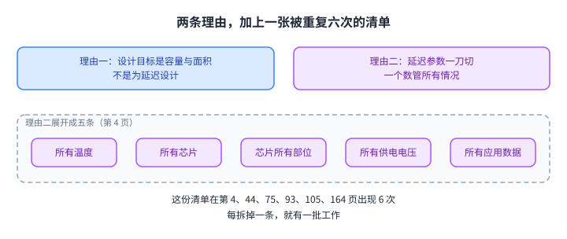

图的左列是两条理由，右列是清单里的五条「所有」，下面两行说明这份清单被重复了六次，而后面每一节都在拆其中一条。

## 延迟长在哪：一个数要覆盖所有情况

先看那些数字是怎么定出来的。一次 DRAM 访问的电荷移动分三步：感知、恢复、预充电（第 50 页）。三步各有一个时间参数，而参数按最坏情况定：所有 DRAM 产品里电荷最少的那个单元，加上最高的工作温度（第 57 页）。源给的最坏温度是 85 摄氏度（第 48 页）。

这一步的后果就是裕量。常见情况下单元存的电荷比最坏情况多得多，而时间参数按最坏情况留了余量，所以第 3 页的判词是「Much of memory latency is unnecessary」，意思是很多内存延迟是不必要的。

真实运行条件离最坏情况有多远，源给了一组对比：服务器集群通常工作在 34 摄氏度以下，桌面在 50 摄氏度以下，而 DRAM 标准是按 85 摄氏度优化的（第 66 页）。

这里要如实记一处源自身的矛盾。第 52 页与第 55 页是同一张「时序裕量的两个原因」，页面上各有 4 个文本框，标号却重复：第 52 页出现三次「1. Process Variation」，第 55 页出现三次「2. Temperature Dependence」。两处的正文还互换过，一处说裕量是留给「能存很少电荷的单元」，另一处说留给「能存很多电荷的单元」。按第 48 页与第 57 页的正文（参数由电荷最少的单元与最高温度决定），需要裕量的是电荷最少、温度最高的那一侧。本页照这条读，不替源改字。

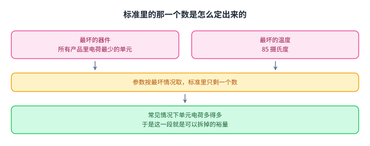

图上左边是两个最坏情况，中间把它们取成最大值，右边落成标准里的那一个数；下面一行是差距所在：常见情况下单元电荷更多，于是这一段就是可以拆掉的裕量。

## 把微结构改掉：LISA 的那条宽路

清单的头一条对应微结构本身。这条线的出发点不是时序，而是数据在 DRAM 里搬不动。源引了一项实测：memmove 与 memcpy 在 Google 的数据中心里占 5% 的周期（Kanev+ ISCA 2015），而 DRAM 内部连接度低是这个动作的根本瓶颈（第 7、8 页）。

LISA（HPCA 2016）的做法是在相邻[[term:subarray]]之间加隔离晶体管，开出一条宽通路，芯片面积代价 0.8%（第 9、11 页）。它顺带加了一条新命令，叫行缓冲移动（RBM）：把一个已经激活的[[term:row-buffer]]里的整行，直接搬到另一个已预充电的子阵列去（第 10 页）。

源的量化结果在这里：4 KB 数据用 8 ns 搬完（已含 60% 的裕量），折合 500 GB/s，是 DDR4-2400 单通道[[term:bandwidth]]的 26 倍（第 11 页）。

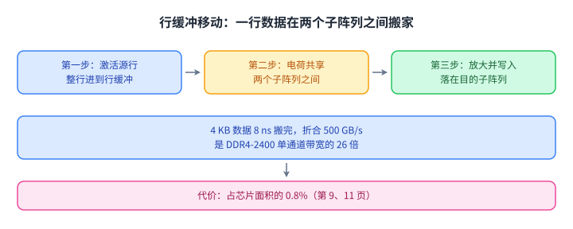

图上三步分别是激活源行、两个子阵列之间做电荷共享、目的子阵列把结果放大；右侧那 0.8% 是这条通路要付的面积代价，换来的是一条 500 GB/s 的内部通路。

## 这条宽路换来了什么

源在第 9 页把用途收成三个，每个都带数字。批量拷贝：拷贝延迟从 1.363 ms 降到 0.148 ms，降 9.2 倍，换来 66% 的整体加速与 DRAM 能量下降 55%。内存内缓存：热点数据访问延迟从 48.7 ns 降到 21.5 ns，降 2.2 倍，换来 5% 的整体加速。快速预充电：预充电延迟从 13.1 ns 降到 5.0 ns，降 2.6 倍，换来 8% 的整体加速。

第 12 页给的是另一个口径：用 RBM 拼出来的拷贝命令序列（RISC）把行拷贝延迟降 9.2 倍、把行拷贝这个动作的 DRAM 能量降 48.1 倍。这一页的 48.1 倍与第 9 页的 55% 不是同一个数，前者是拷贝动作本身的能量，后者是三个用途之一在整机上的 DRAM 能量。两个都照录。

同一批工作里还有两件要记：VILLA 在每个 bank 里加快的子阵列当缓存（32 行快、512 行慢），热点数据访问延迟降 2.2 倍，面积代价 1.6%，代价是要频繁搬行（第 13、14 页）；LIP 让多个预充电单元并联给一个子阵列预充电，预充电延迟降 2.6 倍，留了 43% 的裕量（第 15 页）。

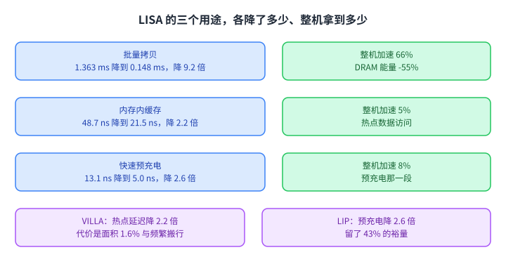

图上左边三条是同一个通路的三种用途，每条都带着自己的降幅与整机收益；下面两个框是同一批工作里的 VILLA 与 LIP，它们的收益同样要用面积或搬运成本换。

## 同一批微结构工作的另外三件

CROW（ISCA 2019）把「拷贝一行」做成一条命令，用专用的拷贝解码器与拷贝行，避免反复激活同一行（第 20 页）。它的收益是 20% 加速与 22% 的 DRAM 能量下降；代价是 0.5% 的芯片面积、1.6% 的容量，加上内存控制器里 11.3 KiB 的存储（第 22 页）。它还有两个顺带的用途：当缓存用，以及用来防 [[term:RowHammer]]（第 21 页）。

CLR-DRAM（ISCA 2020）换的是另一个自由度：让同一行在「最大容量」与「高性能」两种模式之间切换，做法是改单元与[[term:sense-amplifier]]之间的连接方式（第 28、29 页）。源给的结果是四个时序参数加三个系统级指标：激活延迟 tRCD 降 60.1%，恢复延迟 tRAS 降 64.2%，预充电延迟 tRP 降 46.4%，写恢复延迟 tWR 降 35.2%；系统性能提升 18.6%，DRAM 能量降 29.7%，刷新能量降 66.1%（第 30 页）。

SALP（ISCA 2012）不新增 bank，而是减少子阵列之间共享的全局结构：把全局锁存器换成每个子阵列一个本地锁存器，再用一个指定的位锁存器与连线，选择性地把本地行缓冲接到全局行缓冲（第 34 到 38 页）。结果是动态 DRAM 能量降 19%、行命中率提升 13%、系统性能提升 17%，距「所有 bank 都独立」的理想只差 3%；面积代价 0.15%，而把 bank 做成完全独立的代价是 36%（第 39 页）。

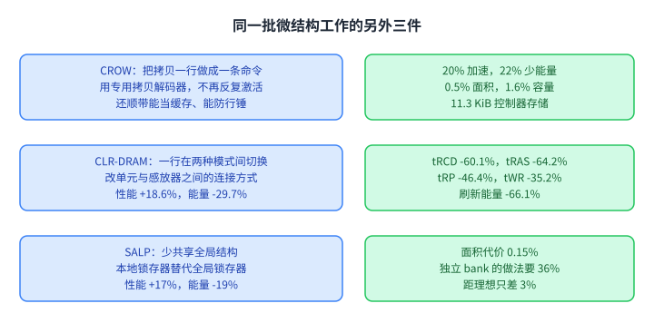

图上三行是同一批工作里的三件，每行左边写它改的是什么，右边写它换来的结果与代价；把三行连起来看，它们都在用面积或容量换时间，只是下手的位置不同。

## 按温度与模块取值：AL-DRAM

清单的第二条是温度。自适应延迟 DRAM（HPCA 2015）由两个部件组成：厂商为每块 DIMM 给出多套在不同温度下可靠的[[term:timing-parameter]]，系统监视 DRAM 温度、挑对应的一套用（第 65 页）。它成立的理由与上一节同源：常见情况下单元电荷更多，感知、恢复、预充电三步都可以更快，于是读、写、[[term:refresh]]都跟着快（第 58、59 页）。

实测的余量有多大：源在第 67 页给出的总量是读延迟降 32.7%、写延迟降 55.1%（55 摄氏度、115 块 DIMM）；拆到时序参数上是感知降 17.3%、恢复降 37.3%（读）与 54.8%（写）、预充电降 35.2%。这一页逐条数是 2 个总量加 3 个分项，其中恢复有两组读数。

更早两页给了两条单点观察：低温下感知的 tRCD 可以降 17% 且无错误（第 63 页）；恢复的 tRAS 降 37%、写恢复的 tWR 降 54%，同样无错误（第 64 页）。这两页的 17% 与第 67 页的 17.3% 是两次呈现，本页都照录。

代价写在源的第 72 页：要为不同温度与不同 DIMM 测出可靠的工作延迟，测试成本更高；源自己补了一句，低温那一档可能没那么难。

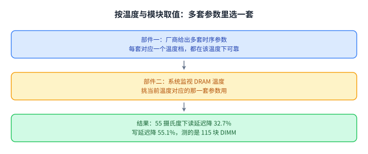

图上左边是厂商给出的多套参数，中间是系统监视到的温度，右边落成实际使用的一套；右侧那两个数字就是这套办法在 115 块 DIMM 上的读写降幅。

## 真机上值多少

源给了一台具体的机器：AMD 4386，8 核 3.1 GHz、8 MB 末级[[term:cache]]、4 GB DDR3-1600、128 GB 固态盘，负载是 35 个来自 SPEC、STREAM、Parsec、Memcached、Apache、GUPS 的应用（第 68 页）。

结果按核数分开：单核平均提升 5.0%，多核平均提升 10.4%（第 69、70 页）。降低延迟还带来了附带收益：DRAM 功耗下降 5.8%，源把主要原因归到行激活时间变短（第 71 页）。

这台的配置与那一页上的另一个数字放在一起看更清楚：源测的 35 个应用里，单核那一档的收益只有多核的一半左右。延迟是每核都在等的东西，核越多，等得越明显。

图上的刻度轴把三个数排在一起：单核 5.0%、多核 10.4%、功耗下降 5.8%；下面一行是读法，多核收益更高，原因是每核都在等同一份延迟。

## 片内也有快慢：FLY-DRAM 与 DIVA

清单的第三条是「芯片的所有部位」。先看证据：源在一组 240 颗芯片、7500 轮的实验里发现激活延迟的分布很宽，标准那一档在 13.1 ns，而这一档上已经有大量错误（第 76 页）。更要紧的是错误在空间上聚集在某些列上（第 77 页）。

FLY-DRAM（SIGMETRICS 2016）据此把内存分成不同延迟的区域，控制器对没有慢单元的区域用更低的延迟（第 78 页）。源给了三档配置：D1、D2、D3 对应 13 ns、10 ns、7.5 ns；tRCD 的覆盖率分别是 12%、93%、99%，tRP 的覆盖率是 13%、74%、99%（第 79 页）。40 个负载上的性能数字是 17.6%、19.5%、19.7% 与 13.3% 四个数，而这一页的图例有 5 组（基线、D1、D2、D3、上界），文字层没有把这四个数一一对到柱子上，本页不替它配对。

DIVA（SIGMETRICS 2017）换了个来源：片内的快慢除了随机的工艺变异，还有一部分是设计引起的系统性差异，原因是单元到感放器的距离、到字线驱动器的距离不同（第 87 页）。它的做法是只对固有的慢区做在线刻画，再把在线刻画与[[term:ecc]]合起来用：随机慢单元交给纠错码接住，于是延迟可以降得比前面几种方法更激进（第 88 到 90 页）。源在这一页的判词是 "DIVA-DRAM reduces latency more aggressively and uses ECC to correct random slow cells"。代价是内存控制器更复杂、运行时要花刻画的工夫，而且必须知道哪些区天生慢（第 91 页）。

Solar-DRAM 在这一讲的正文里只有标题与出处（第 83 到 85 页），细节在附录：它用弱位线的静态画像决定哪些访问可以少等，并说写操作可以用大幅降低的 tRCD，例如降 77%（第 177 页）。

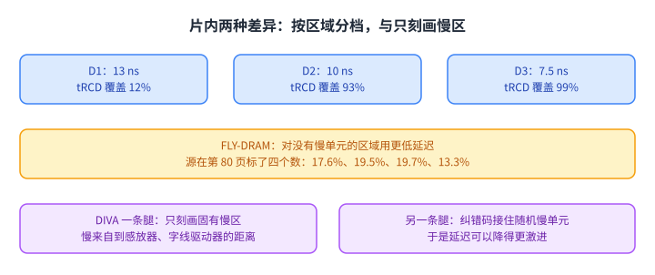

图上上半是 FLY-DRAM 的三档延迟与它们各自的覆盖率，下半是 DIVA 的两条腿：固有的慢区靠在线刻画找出来，随机的慢单元交给纠错码接住。

## 用电压换能量：Voltron

清单的第四条是供电电压。动机是功耗：源引了两项实测，POWER7 里内存功耗超过 40%，GPU 里也超过 40%（第 108 页）；而功率与电压的平方成正比，DDR3L 把电压从 1.5 V 降到 1.35 V（降 10%），LPDDR4 用 1.2 V 的低功耗接口（第 189 页）。

降电压的代价要先测清楚。源用了 124 颗 DDR3L 芯片、31 条 SO-DIMM，每颗 4 Gb，来自三家厂商，生产年份落在 2014 到 2016 年之间，把供电电压从 1.35 V 一路降到 1.0 V（降 26%），逐位读一遍（第 112 页）。三条观察是：电压降得越低错误越多；错误有空间局部性；把操作的延迟加大可以缓解这些错误（第 199 页）。在 1.175 V（降 12%）时，错误已经集中成片（第 116 页）。

Voltron（SIGMETRICS 2017）把这件事做成一个有界操作：用户给一个性能损失目标，它用一个线性回归模型（输入是应用的访存强度与访存停顿时间）预测各电压下的性能损失，选出不违反目标的最低电压（第 202、203 页）。它靠两个限制条件换可行性：只降 DRAM 阵列的电压、不改外围电路，于是通道频率不掉（第 204 页）；只对在低电压下出错的 bank 加大延迟（第 205 页）。评测用 Ramulator 加 McPAT 与 DRAMPower，配置是 4 核 DDR3L，负载是 SPEC2006 与 YCSB（第 206 页）。源给的省能量数字是 7.3% 与 3.2%（Voltron 与对比方案 MemDVFS），性能损失是 -1.6% 与 -1.8%，图上写着「满足性能目标」；这两组数在文字层同样没有一一配对。代价与前一类一样：要为每颗芯片找出可靠的工作电压，测试成本更高，控制器也更复杂（第 120 页）。

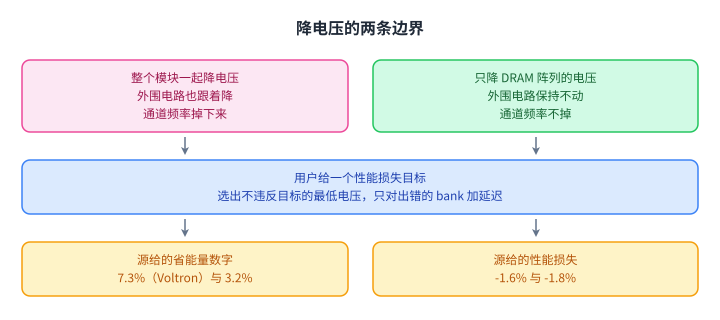

图上一左一右是两种降电压的范围，中间一行是 Voltron 附加的两条边界：只对出错的 bank 加延迟，并且以用户给的性能目标为界；最下面一行是源给的两组数字。

## 应用数据也有容错度：EDEN 与异构可靠性内存

清单的第五条是「所有应用数据」。这一条与前面几条的立场不同：前面都在让硬件更快，这一条问的是这些数据是不是都值得用最高代价去保护。

EDEN（MICRO 2019）站在深度学习推理上：DNN 评测很吃 DRAM，而有些数据与层对错误很宽容，于是把更宽容的层放到电压与延迟更低的分区上（第 94 页）。源给的 ResNet-50 映射例子里有 4 个错误率不同的分区，误码率分别在 2%、5%、6%、8% 以下（第 95 页）。结果是 [[term:CPU]] 上 DRAM 能量平均降 21%，精度保持在原来的 1% 以内（第 97 页）；系统平均加速 8%，部分负载到 17%（第 98 页）；换成 GPU、Eyeriss 与 [[term:TPU]] 三种平台，能量分别平均降 37%、31%、32%（第 99 页）。

异构可靠性内存（DSN 2014）把同一件事做成系统级：先刻画应用数据对内存错误的脆弱度，再把脆弱数据放到可靠内存（带纠错、测试充分），把能容忍的数据放到低成本内存（无纠错或只有奇偶校验、测试较少）（第 102、103 页）。在微软的网页搜索负载上，服务器硬件成本降 4.7%，单机可用性做到 99.90%（第 102 页）。

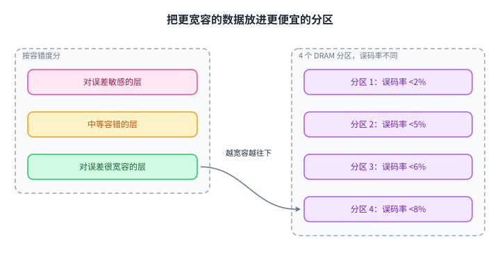

图上左边是容错度不同的数据与层（越往下越宽容），右边是四个错误率不同的分区，中间那条曲线是映射的方向：越宽容的数据，越往便宜的分区放。

## 低于可靠值运行本身就是资源

前面所有工作都想把延迟或电压推到「刚好可靠」为止。这一节反过来：源在正文里专门留了一段给安全，因为「低于可靠值运行」本身可以当资源用（第 122 页）。它列了三类：用 DRAM 生成真随机数、用 DRAM 做物理不可克隆函数、以及快速销毁内存里的数据（第 123 页）。

D-RaNGe（HPCA 2019）把访问延迟降到可靠值以下，用单元失败的概率当熵源。它在 282 颗真实 LPDDR4 器件上做了刻画，吞吐 717.4 Mb/s（比先前的工作高 211 倍），延迟 100 ns（低 180 倍）；一次读 64 位用不到 1 微秒，每比特 4.4 nJ，随机性通过 NIST 统计测试套件（第 128、134 页）。

DRAM 延迟 PUF（HPCA 2018）用的是同一批物理事实的另一面：延迟失败的概率由随机的工艺变异决定，而失败的图案对同一颗器件是可重复的，于是可以当指纹。它在 223 颗真实 LPDDR4 器件上做了刻画，生成一次响应用 88.2 ms，在 70 摄氏度与 55 摄氏度下比先前的 DRAM PUF 快 102 倍与 860 倍（第 238、244、248 页）。附录里还按内存段大小给了三组更大的倍数，8 KiB 段是 33,806.6 倍与 318.3 倍、64 KiB 段是 869.8 倍与 108.9 倍、64 MiB 段是 17.3 倍与 11.5 倍；它们与 88.2 ms 那一组的对比基线不同，本页不把它们混算。

QUAC-TRNG（ISCA 2021）换了熵源：用精心编排的命令序列一次激活四行，激活前把这几行初始化为互相冲突的数据，冲突的结果就是随机值。它在 136 颗真实 DDR4 芯片上评测：每通道最大 5.4 Gb/s、平均 3.44 Gb/s，比当时最好的方案快 15.08 倍，增强版再快 1.41 倍；生成 256 位随机数用 274 ns；面积是当时一颗 CPU 的 0.04%，内存开销是一块 8 GiB 模块的 0.002%；通过全部 15 项 NIST 随机性测试（第 145、146 页）。源第 147 页把结果收成 4 条，而第 146 页的图表页列了 8 条，两页的条数不一样，这里照录这个差别。

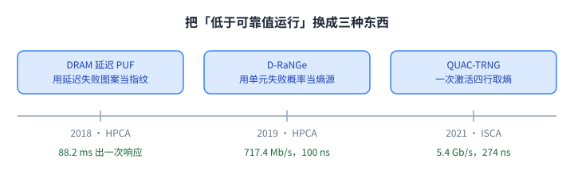

图上一条时间轴串起三件安全方向的工作，节点下标着它们各自把「低于可靠值运行」换成了什么：一个器件指纹、一串随机数、以及一条更快的随机数通道。

## 访问模式里藏着的延迟：ChargeCache

前面那些余量都住在硬件里，还有一类余量住在访问模式里。ChargeCache（HPCA 2016）建立在三条观察上：电荷充足的行可以用更低的[[term:latency]]访问；一行被访问时它的电荷会被恢复；刚被访问过的行很可能再被访问，源叫它行级时间局部性（第 154 页）。这一页逐条数就是 3 条观察。

第三条观察有数字：以 8 ms 为窗口，单核负载里 86% 的访问落在上一次访问的 8 ms 之内，八核负载里是 97%（第 260 页）。第一条观察的数字是 tRCD 可降 44%、tRAS 可降 37%（第 257 页）。机制本身很轻：内存控制器里跟一张最近访问过的行表，命中就用更低的时序参数（第 261、262 页）。开销是 128 条目的表约 5 KB，占一块 4 MB 末级缓存面积的 0.24%；功耗平均 0.15 mW，是末级缓存功耗的 0.23%（第 263 页）。八核上平均性能提升 8.6% 到 10.6%，DRAM 能量降 7.9%（第 254 页）。

刷新那一侧的正文只给了两处出处：可变刷新延迟（DAC 2018，第 151 页）与把刷新和访问并行起来（HPCA 2014，第 157 页），后者注明同一方向在 2022 年又出现在 MICRO。这两页都只有标题与出处，本页不替它们补结论，也不补数字。

正文里还留了一页给 DRAM 功耗模型（VAMPIRE，SIGMETRICS 2018，第 160 页），细节在附录：真实模块往往比厂商数据手册里的电流值省电；功耗依赖被读写的数值；跨 bank 与跨行的结构性差异会影响功耗；新一代产品的实际省电幅度小于数据手册所写。VAMPIRE 报告的平均绝对百分比误差是 6.8%，对比的两个旧模型是 160.6% 与 32.4%（第 281 页）。

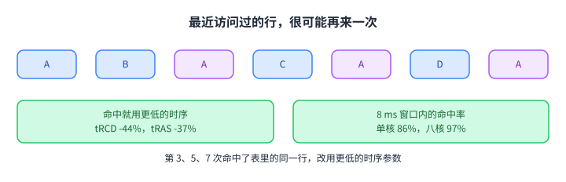

图上那条序列里相同的行反复出现，后面每一次都命中同一张表并改用更低的时序。

## 读完应该能回答

1. 源把长内存延迟归到哪两条理由上，「一刀切」清单有哪五条、在讲义里出现了几次。
2. 时序裕量是从哪两个最坏情况来的，真实运行条件离它们有多远。
3. LISA 用多大的面积代价换到一条多宽的内部通路，三个用途各降了多少。
4. CROW、CLR-DRAM、SALP 各改的是什么，代价分别落在面积、容量还是控制器存储上。
5. AL-DRAM 的两个部件是什么，115 块 DIMM 上读与写的降幅各是多少。
6. FLY-DRAM 的分档与 DIVA 的在线刻画，分别用了哪一种片内差异，代价是什么。
7. 随机数与 PUF 为什么可以从「低于可靠值运行」里长出来，ChargeCache 的三条观察又是什么。

## 脉络回顾

这一讲是综述性质：它不给一个新机制，而是把「延迟为什么长」拆成一条清单，再看每一项被哪些工作拆掉。第 164 页把两条理由原样列了一遍，随后两页是两条带走的话，原文是 "We Can Reduce Memory Latency with Change of Mindset" 与 "Main Memory Needs Intelligent Controllers to Reduce Latency"，也就是换一种思路、以及主存需要智能的控制器；第 167 页把方法收成 6 条原则：以数据为中心、部件都变智能、更好的跨层沟通、按比最坏情况更好的情况设计、利用异质性、灵活与可适应，末尾写着「Open minds」。

按拆除的维度排一遍就看得见形状：改微结构的（LISA、CROW、CLR-DRAM、SALP）花面积换时间；按时序取值的（AL-DRAM、FLY-DRAM、DIVA、Solar-DRAM）花测试与控制器复杂度换时间与能量；动电压的（Voltron）花可靠性风险换能量；看数据的（EDEN、异构可靠性内存）花精度余量换能量；安全的（D-RaNGe、延迟 PUF、QUAC-TRNG）把风险变成功能。ChargeCache 把余量挪回访问模式：不改硬件，只记住哪些行最近刚被访问过。

与本课其它页的关系：第 8b 讲（Memory Latency）那一页走过微结构与时序的一部分幻灯片，本页侧重清单的五个维度，并补上本讲独有的 CLR-DRAM、SALP、Voltron、EDEN、三个安全原语与 ChargeCache；刷新与保持时间落在 ChargeCache 之后那两处出处上，行锤则出现在 CROW 的附带用途里。这份对应属于我们的编排。

## 溯源

- 对应：ETH Zürich Computer Architecture（Onur Mutlu 主讲，Fall 2022），Lecture 9 — Memory Latency II（afterlecture）。
- 讲义链接：<https://safari.ethz.ch/architecture/fall2022/lib/exe/fetch.php?media=onur-comparch-fall2022-lecture9-memorylatency-ii-afterlecture.pdf>
- 上游许可：站点级页脚为 CC BY-NC-SA 4.0。**SA 是传染性的**，所以本页的译文也以同协议发布、且为非商业用途。本页未转载原讲义里的任何图片，配图全部自绘；原讲义里只有图、没有字的页，本页只如实记下它的标题。
- 证据来源：`_sources/eth-ddca-ca/evidence/eth-ca2022-lecture9-memorylatency-ii.pdf.pypdfium2.txt`（283 页）与同目录 `.pypdf.txt`（283 页）；抽取脚本 `_sources/_audit/pdftext_alt.py`，逐条检索脚本 `_sources/_audit/verify_l9.py`（103 条数字与短语）。

- 一处抽取器的事实：本课程立过一条教训，`text-clean/` 与 `evidence/*.embedded.txt` 常出自同一个自研抽取器，互相核对等于自比。这份 PDF 更极端，仓内两个自研抽取器都不可用：`pdftext.py` 的 `embedded.txt` 是 0 字节、`.text.txt` 是逐字符错位的字形码，`pdftext3.py` 的 `.faithful.txt` 同样是错位的字形码且只切出 282 个分页段。所以本页换两个第三方抽取器（pypdfium2 与 pypdf）各抽一遍：103 条数字与短语在 pypdfium2 那一份里全部命中；pypdf 那一份有 5 处要先归一化制表符与断行才命中（第 64 页的 54%、第 97 至 98 页的 21%/8%/17%、第 112 页的 124 颗 DDR3L），另有若干短语因制表符分隔或词粘连需要同样处理（第 134 页的 `4.4 nJ/bit`、第 146 页的 `5.4 Gb/s` 与 `274 ns`、第 263 页的 `0.15 mW`，以及第 165 页 `Change of Mindset` 这类标题大小写）。
- 取材范围：正文第 1 到 169 页；附录（第 171 到 283 页）只在两处被引用，并就地标明来源是备份页：Solar-DRAM 的 77%（第 177 页）与 VAMPIRE 的四条观察及 6.8%（第 275 到 281 页）。只给标题与出处、没有正文的页，本页只记标题：第 5 页的分层延迟 DRAM 出处、第 151 页的可变刷新延迟（DAC 2018）、第 157 至 158 页的刷新与访问并行（HPCA 2014，并注明 2022 年在 MICRO 又出现）。
- **属于 CourseLingo 的讲解**（源里没有这些推论）：把清单在六页上的重复读成「本讲的路线图」并按拆除的维度重排全页；把每件工作对到清单的哪一条；「花面积换时间／花测试与控制器复杂度换时间／花可靠性风险换能量／花精度余量换能量／把风险变成功能」这五条概括；与本课第 6、7b、8a、8b 讲的对应关系；第 52、55 页矛盾的读法（按第 48、57 页判方向）；第 9 页 55% 与第 12 页 48.1 倍是两个口径的说明；第 80 页四个数、第 119 页两组数未配对的说明；第 146 页 8 条与第 147 页 4 条的计数差异。
- 核不到的：本页引用的数字没有一条在两份抽取里都落空。第 52、55 页的标号重复无法从文字层判断哪一版是最终稿（页面上叠着动画的各层），只能说按第 48、57 页的正文判方向。第 90 页 DIVA 的两张柱状图标了 12 个数（25.5% 到 41.3% 之间），但图上 6 组配置与这些数对应得很含糊，本页因此没有引用 DIVA 的具体降幅。
