+++
title = "真机上量一遍：一条 PIM 内存条能做什么"
lecture = 12
slug = "lecture10-upmem"
status = "draft"
source_kind = "notes"
source_url = "https://safari.ethz.ch/architecture/fall2022/lib/exe/fetch.php?media=onur-comparch-fall2022-lecture10-upmem-afterlecture.pdf"
source_title = "Lecture 10: Processing using Memory (UPMEM) (Fall 2022, afterlecture)"
output_mode = "explanation"
+++

> 来源课程：ETH Zürich Computer Architecture（Onur Mutlu 主讲，Fall 2022）；
> 对应讲义：Lecture 10 — Processing using Memory (UPMEM)（`onur-comparch-fall2022-lecture10-upmem-afterlecture.pdf`，160 页，页数按同名的 `.pptx` 计，理由见下一段）；
> 讲义链接：<https://safari.ethz.ch/architecture/fall2022/lib/exe/fetch.php?media=onur-comparch-fall2022-lecture10-upmem-afterlecture.pdf> ；
> 上游许可：该课程 wiki 每一页的页脚都带站点级许可块，原文为 CC BY-NC-SA 4.0：<https://creativecommons.org/licenses/by-nc-sa/4.0/deed.en> ；
> 本页由 CourseLingo 用中文重新讲解，按源讲义的推进顺序组织，不是逐字翻译，也不转载原讲义里的任何图片；
> 页内配图全部由我们自绘；原讲义里只有图、没有字的页，我们只如实记下它的标题。
> 本页为非官方材料，与 ETH Zürich 及课程教学团队无隶属关系；如与原文有出入，以原文为准。

本页的事实来自 `_sources/eth-ddca-ca/evidence/eth-ca2022-lecture10-upmem.pdf.embedded.txt`（`_sources/_audit/pdftext.py` 抽取，3 个块）与同目录的 `eth-ca2022-lecture10-upmem.pdf.text.txt`，但这两份输出撑不起本页。该 PDF 入库时按三道核验过完整性，第二道没过：体积 14,221,312 字节、不是 2 的整数次幂（第一条过），而整份文件里 `%%EOF` 出现 0 次，`xref`、`trailer`、`startxref` 也各 0 次。三条不同的下载路径拿到的字节完全相同，对超出末尾的范围发 Range 请求又被服务器回以 DokuWiki 自己的 `Bad Range Request!`，所以截断在服务器那一侧。它缺文档目录、缺页树、缺全部字体对象，130 个页面对象一个都渲染不出字，正文抽出来是逐字符错位的字形码。

所以本页改用同一讲、同一个 wiki 页面上的 `.pptx`。它跟 PDF 只差扩展名，体积 35,416,048 字节，ZIP 中央目录完整，160 张幻灯片，首页写着 Lecture 10: Programming a Real-world PIM Architecture，讲者是 Juan Gómez Luna 博士与 Onur Mutlu 教授，日期是 2022 年 10 月 28 日，跟 PDF 是同一份讲义。本页引用的每一条数字都取自这份 `.pptx` 的幻灯片文字，抽取结果留在 `_sources/eth-ddca-ca/evidence/_upmem.pptx.slidetext.txt`，本页写的页码就是幻灯片上印着的那一号。更细的核验记录放在文末的溯源一节。

## 这一讲要解决什么问题

前面几讲把「在内存里算」的两条路走完了：一条靠内存自身的运行原理，一条在内存旁边放计算单元。第 5 讲收尾时列了五件已经上市的产品，其中第一条是 UPMEM 在 2019 年做出来的 PIM 内存条，当时只用一句话带过。

这一讲把那句话拆开。它是一堂客座课，讲者就是那篇实测论文的作者，所以结构不是再讲一遍原理，而是把一条真实的内存条当成被测对象：先看它长什么样、怎么编程，再用一组微基准把算力与访存能力一格一格量出来，最后拿 16 个基准和当时的 [[term:CPU]]、GPU 比。

图上三行就是这一讲的位置：方向已经讲完，剩下的问题是这件硬件到底能做到什么。

## 一条 PIM 内存条里装了什么

源讲义第 7 页给这条内存条三条规格。形态上替换的是标准 DDR4 R-DIMM；容量与算力是 8 GB 加 128 个 DPU，这 128 个 DPU 分布在 16 颗 PIM 芯片里；制造用的是标准的 2x 纳米 [[term:DRAM]] 工艺。

第 30 页把内部账算得更细。一条内存条装 8 颗或 16 颗芯片，也就是 1 个或 2 个 rank，每个 rank 8 颗。每颗 PIM 芯片里有 8 个 64 MB 的 bank，源叫它主内存 [[term:MRAM]]；同一颗芯片里还有 8 个 [[term:DPU]]。于是一个 rank 是 64 个 DPU。

它也不是凭空出现的。源第 6 页把时间点列了一遍：UPMEM 成立于 2015 年 1 月，2016 年宣布第一个真实世界的 PIM 架构，PIM 内存条从 2019 年开始商用；2021 年初三星在 ISSCC 上宣布 FIMDRAM，几个月后又给出 LP-DDR5 与基于内存条的 PIM；2022 年初 SK 海力士在同一会上宣布 AiM。第 12 到 16 页各给了一组数字：三星的 AxDIMM 做 DLRM 推荐系统；SK 海力士的 AiM 在一颗 4 Gb 芯片里放 16 个处理单元，基于 GDDR6，源记的算力是 1 TFLOPS 的乘加；阿里巴巴的 HB-PNM 把逻辑裸片与 DRAM 裸片用混合键合三维堆叠。

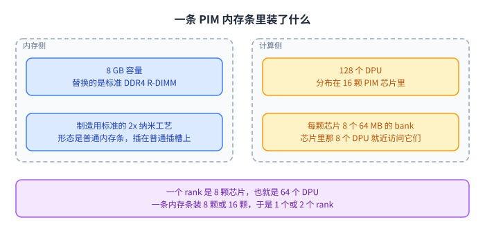

这张图没画别家的产品，只画了 UPMEM 这一条：它同时是内存条，也是算力的载体。

## 它按加速器的方式被用

源第 25 页把集成方式叫加速器模型。UPMEM 内存条与普通 DDR4 内存条共存；它是一个松耦合的[[term:accelerator]]；数据要在主处理器与它之间显式搬运；kernel 要显式发射。源在这一页直接写它 resembles GPU computing。

第 26 页把 GPU 那一套拆成三步：CPU 到 GPU 搬数据、执行 GPU kernel、把结果搬回 CPU。UPMEM 的接口确实是照这三步长的。

差别在数据要不要离开那颗芯片。GPU 的计算单元在另一块硅上，数据必须过去；UPMEM 的 DPU 就住在存数据的颗粒里，一次运算要用的数据本来就在旁边那几个 bank 里。

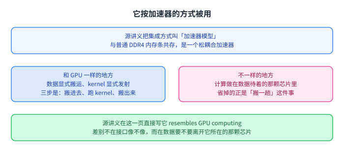

所以「像 GPU」说的是接口，不是位置。接口像的好处是熟悉，位置不同才是收益的来处。

## 系统怎么摆：2560 个 DPU

源第 31 页给出一台具体机器：20 条 P21 内存条，每条 16 颗芯片，合起来 40 个 rank，插在双路 x86 上。UPMEM 内存条与普通 DDR4 内存条共存，两个控制器里有一个在一个通道上插了 2 条普通内存条。合起来是 2560 个 DPU，其中 4 个是坏的，所以实验里最多能用 2556 个，容量 160 GB。

第 20 页还给了一处容易看漏的差别：两代内存条的 DPU 频率不同。E19 每条约 8 颗芯片、1 个 rank，DPU 跑 267 MHz；P21 是 16 颗、2 个 rank，DPU 跑 350 MHz。这一讲讲吞吐时用的都是 350 MHz。

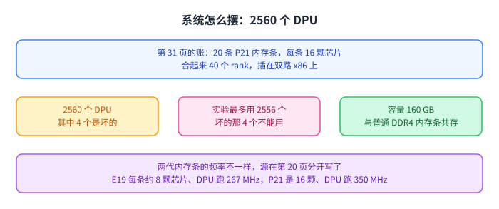

这台机器是全讲数字的分母。后面凡是写「2556 个 DPU」，指的都是同一台。

## 编程模型：把活分成两级

第 34 页用向量加法当第一个例子：把输入数组先分给 DPU，再分给 [[term:tasklet]]，也就是跑在一个 DPU 上的软件线程。两级划分就是这一讲编程模型的全部。

第 36 页把建议收成 4 条，逐条抄下来是：尽量让并行段长；按独立数据块切分；把能用的 DPU 都用上；每个 DPU 至少发射 11 个 tasklet。

接口只有几个。`dpu_alloc` 分配到一组 DPU，也就是一个 dpu_set；`dpu_load` 把一个程序装进这组 DPU；`dpu_launch` 发射 kernel，可以选同步或异步。同一个程序可以给不同 DPU 装不同 kernel，于是任务级并行是现成的。

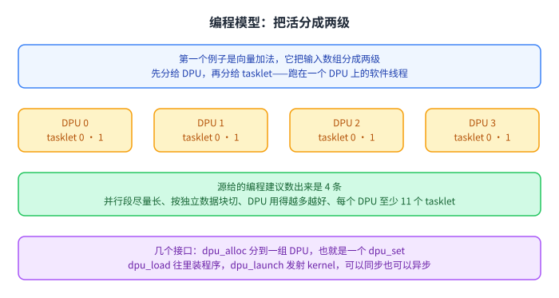

「至少 11 个 tasklet」不是拍出来的数，第 8 节会看到它是从流水线里推出来的。

## 数据怎么进出这条内存条

第 40 页把 CPU 与 DPU 之间的传输分三类。串行一次只对一个 DPU，也就是 1 个 MRAM bank；并行一次覆盖多个 DPU，每个 DPU 的缓冲区必须一样大；广播让多个 DPU 收到同一份缓冲区。对应的接口分别是 `dpu_copy_to` 与 `dpu_copy_from`、`dpu_prepare_xfer` 加 `dpu_push_xfer`、以及 `dpu_broadcast_to`。

第 45 页给了一条硬限制：DPU 之间没有直连通道。跨 DPU 通信只能经主机 CPU 绕一圈，用 DPU 到 CPU 加上 CPU 到 DPU 两类传输拼出来。合并部分结果要走两趟，重新分配中间结果要走四趟。

这条限制的代价被第 46 到 49 页量成了三条观察：传输越大，持续带宽越高；同一 rank 内并行的持续带宽随 DPU 数量上升；并行的 CPU 到 DPU 带宽高于反向的 DPU 到 CPU，而广播又高于并行。源把后两条的原因分别归到运行库的实现与[[term:cache]]层次里的时间局部性。

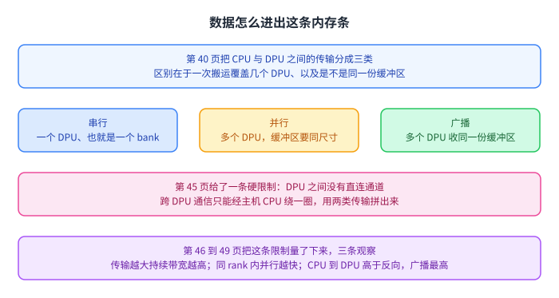

绕行这件事解释了后面两个结论：跨 DPU 通信越多越不划算，传输要尽量凑大。

## DPU 里面是什么

第 69 页（第 74 页是同一页）给出[[term:pipeline]]参数：顺序流水线，最高 425 MHz，[[term:fine-grained-multithreading]]，24 个硬件线程，14 级。六级有名字：DISPATCH 选线程、FETCH 取指、READOP 读寄存器堆、FORMAT 整理操作数、ALU 做运算并访问 [[term:WRAM]]、MERGE 整理结果。

第 71 页讲的机制是每个周期换一个线程取指。硬件里存着多个线程上下文，也就是程序计数器和寄存器；取指引擎轮流从它们取。等这条分支或指令解析完，同一个线程已经不会再被取指，于是相关的延迟被别的线程的工作盖住。

代价同样列了出来：单线程性能变差，要额外逻辑保存线程上下文，线程不够多时盖不住整条流水线。第 75 页说 [[term:ISA]] 是它自己的一套 32 位指令集，目标是标量、顺序、多线程，能编译 64 位 C 代码，编译器是 LLVM/Clang。

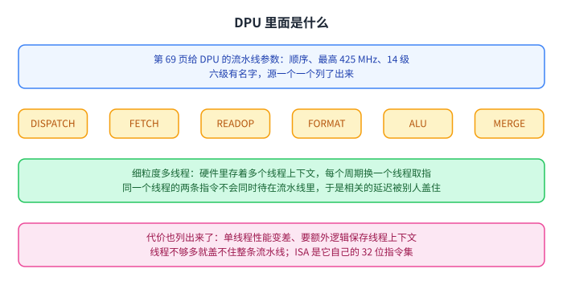

这里有两个频率出现过：流水线上限写的是 425 MHz，而后面所有吞吐计算用的都是 350 MHz。第 20 页那处给了后者一个出处，P21 的 DPU 就跑在 350 MHz。

## 能算什么：算术吞吐的一处硬边界

第 76 页的微基准很直接：在 WRAM 里流式做读改写，tasklet 从 1 到 24，运算有加、减、乘、除，数据类型有 int32、int64、float、double，周期数由 SDK 提供的计数器读出。

观察 1 是算术吞吐在 11 个或更多 tasklet 上饱和，而且对上面所有数据类型与运算都成立。

峰值也能算出来。第 79 页说流水线填满时每个周期退休一条指令，于是吞吐等于频率除以指令条数。32 位加法的循环是 6 条指令，64 位是 7 条，在 350 MHz 上分别得到 58.33 与 50.00 MOPS，64 位因此慢 17%。

另一条边界更要紧。第 82 页说 DPU 没有 32 位乘法器，乘除靠一条在一个周期里做移位与加法的指令拼出来，最多要用 32 条指令。观察 2 把话说完：整数加减有原生硬件支持；32 位与 64 位的乘除、以及浮点，都没有原生支持，由运行库模拟，吞吐因此低得多。

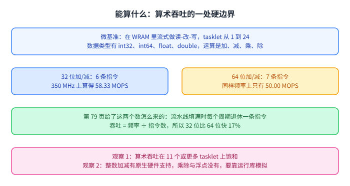

这条边界直接影响选型：一个负载里有多少乘法与浮点，比它有多少次访存更能决定它在 UPMEM 上跑得顺不顺。

## 片上两种内存：WRAM 与 MRAM

DPU 身边有两种内存，性子完全不同。

WRAM 是 DPU 自己的便签内存。第 86 页的微基准是 STREAM 的四个版本，tasklet 从 1 到 16，不访问 MRAM。第 89 与 90 页用「字节数 × 频率 ÷ 指令数」给出两个数：COPY 两条指令，11 个 tasklet 在 22 个周期里搬 11 乘 16 字节，350 MHz 上是 2,800 MB/s；ADD 五条指令，55 个周期搬 11 乘 24 字节，是 1,680 MB/s。观察 3 讲的是另一件事：WRAM 的持续带宽与访问模式无关，流式、带步长、随机都一样；只要流水线满了，每次 8 字节的读写都只要一个周期。

MRAM 是每颗芯片里那 8 个 64 MB 的 bank。第 95 页给了延迟模型：延迟等于 α 加上 β 乘传输大小，实测 β 是 0.5 周期每字节，于是理论上限是每周期 2 字节，350 MHz 上折合 700 MB/s。观察 4 说延迟随传输大小线性增长，并不封顶。

第 102 页给了一个好看的数：COPY-DMA 的持续带宽接近这个上限，2556 个 DPU 合起来约 1.6 TB/s，而它只要两个 tasklet 就饱和，因为 DMA 引擎一次只做一个传输。第 103 页把饱和点按负载分开：COPY 与 ADD 分别在 4 个、6 个 tasklet 饱和，SCALE 与 TRIAD 要 11 个。

带步长与随机访问那一段收成一条分界。粗粒度 DMA 用 1024 字节的传输，细粒度用 8 字节；步长到 16 或更大时，细粒度的带宽反而更高。步长 16 时粗粒度实际只用上最大持续带宽的十六分之一，也就是 622.36 MB/s，低于细粒度的 72.58 MB/s。

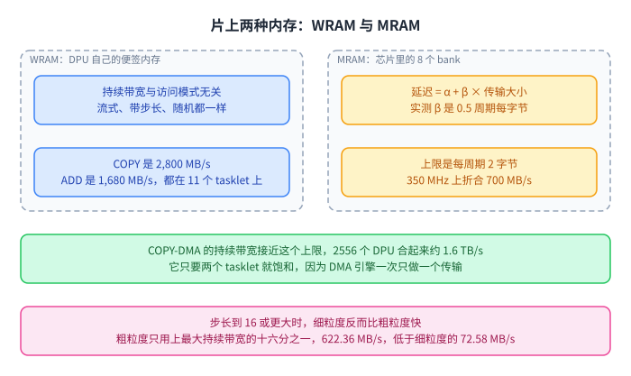

左右两块是两种内存的分工：WRAM 负责算得快，MRAM 负责放得下，而两者之间的搬运是这一讲反复出现的成本。

## 算术强度：它其实是算力受限的

第 114 页定义一个量：[[term:operational-intensity]]，也就是每从 MRAM 取一个字节做多少次运算，单位 OP/B。实验照着 Roofline 模型设计：往 WRAM 里读一块，做若干次运算，再写回。

第 117 页把图分成两段。访存受限区里吞吐随算术强度上升；算力受限区里吞吐平在最大值；两段之间那个算术强度叫饱和点。DPU 的饱和点低到 ¼ OP/B，也就是每取一个 32 位元素做一次整数加法就够了。

观察 6 把结论说死：DPU 根本上是算力受限的处理器。源还预期多数真实负载在它上面也会是算力受限的。

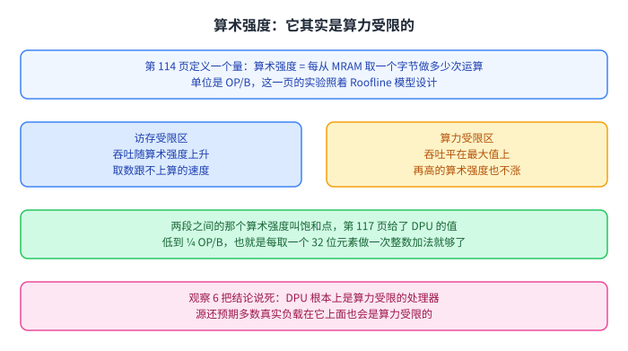

这个结论有点反直觉：一个把计算放进内存的架构，瓶颈居然不在访存。原因在上一节，DPU 的算力比它访存能力的富余大得多。

## 量出来的结果：和 CPU 与 GPU 比

先看被测的东西。第 121 页给 PrIM 那套基准的定位：一组能用来评测 UPMEM 架构、比较软件改进与编译器、比较未来 PIM 架构的公共负载，两条挑选标准是来自不同应用领域、以及在处理器为中心的架构上是访存受限的。数量是 14 个负载、16 个基准，覆盖 10 个领域，从向量加法、矩阵向量乘、稀疏矩阵向量乘，到数据库的选择与去重、二分查找、时间序列、广度优先搜索、多层感知机、序列比对、图像直方图、归约、前缀和与矩阵转置。第 123 页用 Intel Advisor 在一颗 Xeon E3-1225 v6 上跑出的 Roofline 图显示，这些负载全都落在访存受限区域。

评测在两台机器上做，分别是 2556 个 DPU 与 640 个 DPU，对比对象是 Intel Xeon E3-1240 与 NVIDIA Titan V。

数字分四组。2556-DPU 与 640-DPU 在 13 个基准上分别比 CPU 快 93.0 倍与 27.9 倍，不占上风的是 SpMV、BFS、NW。2556-DPU 在 10 个基准上平均比 GPU 快 2.54 倍，640-DPU 在同一批上落在 GPU 的 65% 以内。能量上 640-DPU 在全部 16 个基准上平均比 CPU 少用 1.64 倍，其中 12 个基准省到 5.23 倍。收尾那条 Key Takeaway 4 给的是另一个口径：2556 个 DPU 在 16 个基准上比 CPU 快 23.2 倍。

93.0 倍是 13 个基准上的平均，23.2 倍是 16 个基准上的平均，两个数的分母不同。本页都照录，也不把它们混成一句「快多少倍」。

扩展性那一段还有一句值得记：BFS 与 NW 的扩展是次线性的，源把原因都归到负载不均。BFS 是图的结构不规则，NW 每一轮只算一条对角线，对角线短的时候多加 DPU 也用不上。

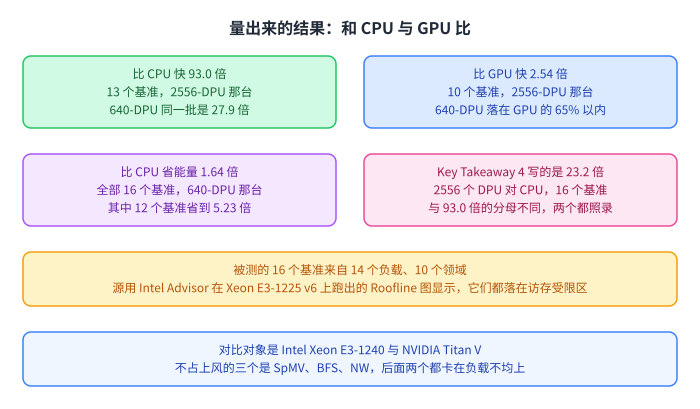

图上的四个数来自不同分母，看的时候要连着分母一起看，这也是这一页正文特地把分母写出来的原因。

## 适合它的是什么工作负载

观察 19 给的三条特征，是这一讲最可以直接拿走的东西：流式访存；跨 DPU 通信很少或没有；很少或不用整数乘法、整数除法与浮点。

观察 20 说性能与能量这两种收益同源，都是把内存与处理器核之间的[[term:data-movement]]减下来，而不是靠算得更快。它还补了一句，同一个系统只在能跑赢 CPU 或 GPU 的负载上才省能量。

Key Takeaway 2 与 3 是同一件事的两种说法：最合适的是不做算术或只做简单运算的负载，比如位运算与整数加减；以及几乎不需要跨 DPU 通信的负载。

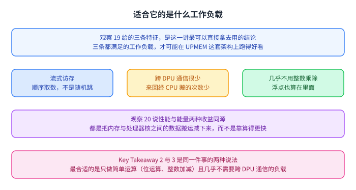

三条特征合起来说的是同一件事：这套架构擅长把一大块数据顺序过一遍，而且每份数据上做的事很少。

## 读完应该能回答

1. 一条 UPMEM 内存条里有几颗芯片、几个 rank、几个 DPU，每颗芯片有几个 bank。
2. 加速器模型有哪几个要素，它与 GPU 的三步在哪里像、在哪里不一样。
3. 2560 个 DPU 那台机器是怎么拼出来的，实验里为什么只能用 2556 个。
4. 编程的两级划分是什么，为什么建议每个 DPU 至少 11 个 tasklet。
5. 三类传输各覆盖几个 DPU，跨 DPU 通信为什么要经主机 CPU 绕行。
6. DPU 的流水线有几级、几个硬件线程，细粒度多线程的好处与代价各是什么。
7. 32 位与 64 位加法各要几条指令，为什么乘除与浮点慢得多；WRAM 与 MRAM 的带宽上限又是怎么算出来的。
8. 算术强度的饱和点是多少，为什么说 DPU 根本上是算力受限的。

## 脉络回顾

这一讲在整门课里的位置是落地。前面的讲次先把方向摊开：内存是瓶颈，所以要把计算放到数据所在的地方；第 5 讲列了五件已经上市的产品，把方向印成事实。这一讲只挑一件，把它的编程接口、算力、访存能力和真实负载表现量了一遍，于是方向变成了有边界的工具。

量出来的结果可以压成三句话。它确实能跑赢当时的 CPU，在 13 个基准上快 93.0 倍；它只在少数负载上跑赢当时的 GPU，10 个基准上平均 2.54 倍；它的瓶颈不在访存而在算力，饱和点低到 ¼ OP/B。

与第 5 讲那一页的关系：那一页把 UPMEM 与三星、SK 海力士、阿里巴巴的几件产品并列，说明这条路有产业在走；这一讲把其中一条内存条拆开，量出它能做什么、不适合做什么。这层对应是我们排的，不是源讲义的自我说明。

## 溯源

- 对应：ETH Zürich Computer Architecture（Onur Mutlu 主讲，Fall 2022），Lecture 10 — Processing using Memory (UPMEM)（afterlecture）。讲义首页自己的标题是 Lecture 10: Programming a Real-world PIM Architecture，讲者是 Juan Gómez Luna 博士。
- 讲义链接：<https://safari.ethz.ch/architecture/fall2022/lib/exe/fetch.php?media=onur-comparch-fall2022-lecture10-upmem-afterlecture.pdf>
- 上游许可：站点级页脚为 CC BY-NC-SA 4.0。**SA 是传染性的**，所以本页的译文也以同协议发布、且为非商业用途。本页未转载原讲义里的任何图片，配图全部自绘。
- 证据来源与核验：`...lecture10-upmem.pdf.embedded.txt` 与 `.text.txt`（`_sources/_audit/pdftext.py`）都取不出可用的正文，理由写在上面的第二段。真正被本页引用的是同一讲的 `.pptx`，幻灯片文字留在 `_sources/eth-ddca-ca/evidence/_upmem.pptx.slidetext.txt`。该 PDF 由三条路径各下载一次，MD5 同为 `0e2dbc9564314617491b0aa2c7a8817b`，体积 14,221,312 字节，整份文件 `%%EOF` 出现 0 次，超出末尾的 Range 请求被服务器回以 `Bad Range Request!`。用内容对齐可以确定它残存的 130 个页面对象是前 130 张幻灯片：第 6、7、8、42、127 页的文字与同名 `.pptx` 的第 6、7、8、42、127 张幻灯片逐条对得上。
- **属于 CourseLingo 的讲解**（源里没有这些推论）：把全讲读成「先看它是什么、再量它能做什么」两段；「像 GPU」指的是接口而不是位置这个读法；把 425 MHz 与 350 MHz 分派到流水线上限与 P21 工作频率上；把观察 2 读成「选型时看乘法与浮点比看访存次数更要紧」；把 93.0 倍与 23.2 倍按分母区分开；以及第 5 讲与本讲的对应关系。
- 核不到的：这份 PDF 取不出文本，所以本页每条数字只在 `.pptx` 的文字层核对过一遍，没有第二个抽取器可以对照；想用 LibreOffice 把 `.pptx` 渲染成图再目视核对也没成功，转换进程崩过一次、渲染超时一次，因此本页的核对只到文字层。检索词与命中见 `_sources/eth-ddca-ca/evidence/_upmem.pptx.slidetext.txt`：`93.0x`、`27.9x`、`2.54x`、`1.64x`、`5.23x`、`23.2`、`58.33`、`50.00`、`2,800`、`1,680`、`622.36`、`72.58`、`0.5 cycles/byte`、`425 MHz`、`350 MHz`、`2,560`、`2,556`、`11` 个 tasklet 全部命中。
