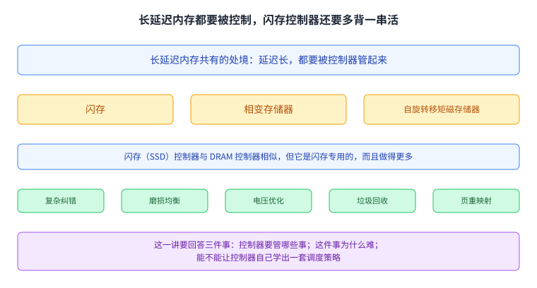
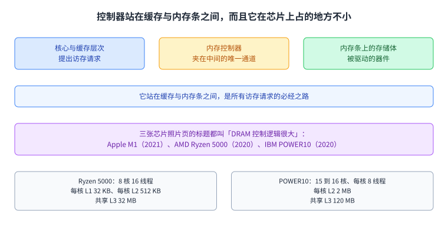
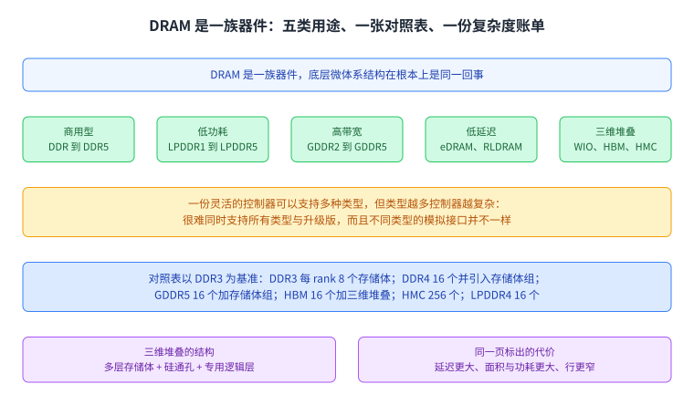
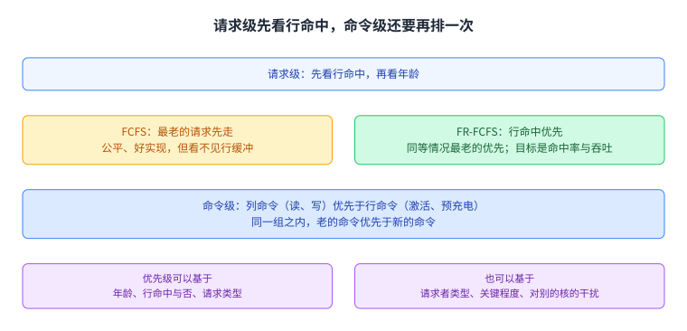
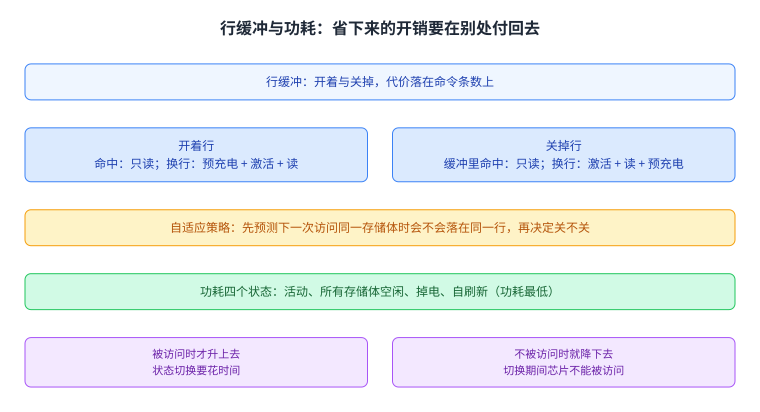
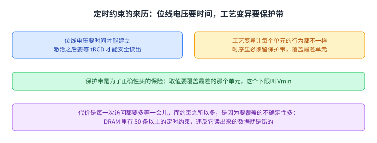
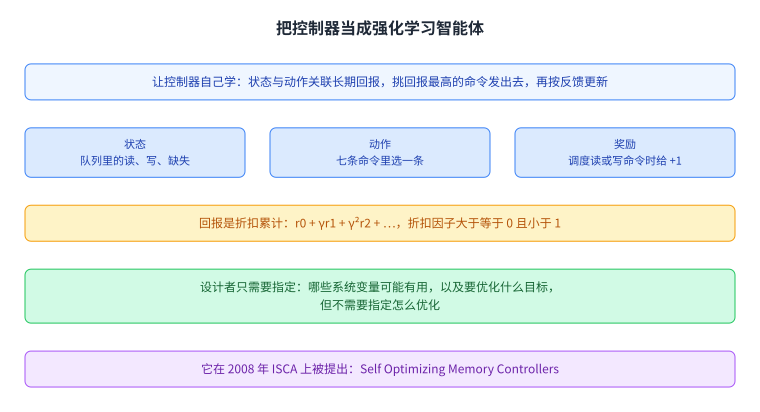
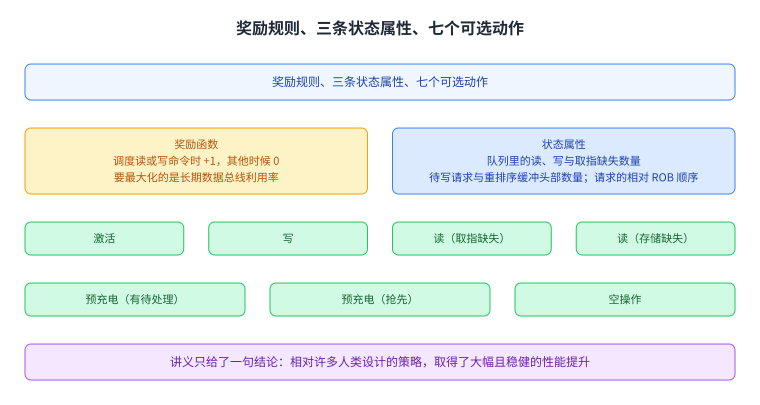
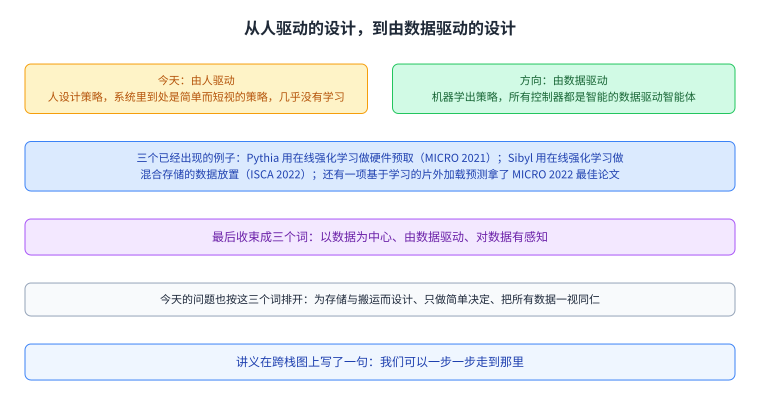

+++
title = "内存控制器：一堆约束里选谁先上"
lecture = 13
slug = "lecture11a-memory-controllers"
status = "draft"
source_kind = "notes"
source_url = "https://safari.ethz.ch/architecture/fall2022/lib/exe/fetch.php?media=onur-comparch-fall2022-lecture11a-memorycontrollers-afterlecture.pdf"
source_title = "Lecture 11a: Memory Controllers (Fall 2022, afterlecture)"
output_mode = "explanation"
+++

> 来源课程：ETH Zürich Computer Architecture（Onur Mutlu 主讲，Fall 2022）；
> 对应讲义：Lecture 11a — Memory Controllers（`onur-comparch-fall2022-lecture11a-memorycontrollers-afterlecture.pdf`，126 页）；
> 讲义链接：<https://safari.ethz.ch/architecture/fall2022/lib/exe/fetch.php?media=onur-comparch-fall2022-lecture11a-memorycontrollers-afterlecture.pdf> ；
> 上游许可：该课程 wiki 每一页的页脚都带站点级许可块，原文为 CC BY-NC-SA 4.0：<https://creativecommons.org/licenses/by-nc-sa/4.0/deed.en> ；
> 本页由 CourseLingo 用中文重新讲解，按源讲义的推进顺序组织，不是逐字翻译，也不转载原讲义里的任何图片；
> 页内配图全部由我们自绘；原讲义里只有图、没有字的页，我们只如实记下它的标题。
> 本页为非官方材料，与 ETH Zürich 及课程教学团队无隶属关系；如与原文有出入，以原文为准。

本页的事实来自 `_sources/eth-ddca-ca/evidence/eth-ca2022-lecture11a-memorycontrollers.pdf.pypdf.txt`（pypdf 抽取，126 页，45,505 字符），并与同一份 PDF 用第二个抽取器得到的 `.pdf.pypdfium2.txt`（126 页，46,167 字符）逐页比对：抽查正文 30 页，两边的文本相似度在 0.989 到 1.000 之间，绝大多数页逐字相同。该 PDF 入库前按三道核验过完整性：体积 8,656,107 字节、尾部有 `%%EOF`、大小不是 2 的整数次幂。本页还有一条抽取器的事实要说明：同一份 PDF 用**仓内自研抽取器 `pdftext.py`** 抽不出可用文本——它写出的 `.embedded.txt` 是内嵌字体的二进制（`OS/2`、`cmap`、`glyf` 与 Monotype Garamond 字体表），`.text.txt` 是字形级转储。**这两个文件名每次重跑都会被覆盖，所以本页只把它当作「该工具在这份文件上失败」的记录，不当作引用**；本页依据的是 pypdf 与 pypdfium2 两个独立抽取器的输出，且两者互为交叉核对。

## 这一讲要解决什么问题

主存这一侧的东西，延迟都很长。讲义开篇说得很平：长延迟内存有一些相似的特性，都需要被控制（p2）。这一讲拿 DRAM 当例子，但它同时提醒，很多调度与控制上的问题和别的内存控制器是相通的，闪存与新兴存储技术也一样，只是这些技术还会向控制器提出别的要求。

讲义在 p3 用一页把闪存控制器和 DRAM 控制器摆在一起：两者相似，区别是闪存控制器是闪存专用的，而且做得更多，包括复杂的纠错、磨损均衡、电压优化、垃圾回收和页重映射。

讲义从 p4 到 p14 是连续的材料清单：SSD 控制器相关的论文、视频课与课程链接。**这十一页只有出处与链接、没有正文**，所以这里也只记下这件事，不替它补充结论。

那么这个部件到底凭什么值得单独讲一讲。原因是它握着唯一的一根旋钮。内存条能提供的峰值[[term:bandwidth]]是硬件给死的，而实际能拿到多少，取决于控制器按什么顺序把请求变成命令发出去。顺序换一下，同一套硬件给出的吞吐就不一样。

这一讲要回答三件事：控制器一共要管哪些事；为什么这件事难；以及能不能让控制器自己去学一套调度策略。

最上面一条是各种长延迟内存共有的处境，中间那排是三类存储器件，下面两排是闪存控制器在相同职责之外多背的一串活，以及这一讲要回答的三个问题。几块合起来说明了为什么这个部件值得用一整讲来讲。

## 控制器站在哪里，以及它有多大

讲义在 p20 用一张多核芯片的照片把位置标了出来：核心、各自的二级[[term:cache]]、共享的三级缓存在一侧，DRAM 存储体在另一侧，中间那块就是[[term:memory-controller]]。它是缓存和内存条之间唯一的通道，所有访存请求都要从它手里过。

接下来的四页都在重复同一个标题，DRAM 控制逻辑很大（p20 到 p23）。讲义摆了三张近年芯片的照片当证据。Apple M1（2021 年）、AMD Ryzen 5000（2020 年）、IBM POWER10（2020 年）。照片之外，讲义还给后两颗芯片标了规格：Ryzen 5000 是 8 核 16 线程，每核一级缓存 32 KB、每核二级缓存 512 KB、共享三级缓存 32 MB；POWER10 是 15 到 16 核、每核 8 线程，每核二级缓存 2 MB、共享三级缓存 120 MB。

这几组数字和控制器没有直接的算术关系，它们说明的是同一件事：控制器不是几根线，它在芯片上占的地方已经能在一张照片里被指出来。

图里那条唯一的通道就是这一讲的主角。它的左边是提出请求的核心，右边是要被驱动的存储器件，它自己在中间既要把请求排好，又要把它们翻译成器件能懂的命令。

讲义在 p25 与 p26 又给了一张现代控制器的框图，并注明它出自 2007 年 MICRO 上那篇讲公平调度的论文（Stall-Time Fair Memory Scheduling）。**这两页只有图、没有说明文字**，所以这里只记下出处，不替它描述内部结构。

## 内存类型很多，控制器要认得它们

[[term:DRAM]] 不是一种器件，而是一族器件，讲义在 p15 按用途把它们分了几类：商用型的 DDR 一代到 DDR5；为移动设备做低功耗的 LPDDR1 到 LPDDR5；为显卡做高带宽的 GDDR2 到 GDDR5；低延迟的 eDRAM 与 RLDRAM；以及三维堆叠的 WIO、HBM、HMC 与 HBM2.0。讲义的判断是，这些类型的底层微体系结构在根本上是同一回事。

这个判断对控制器是压力。一份灵活的控制器可以支持多种 DRAM 类型，但支持得越多，控制器越复杂：很难同时支持所有类型和它们的升级版，而且不同类型的模拟接口并不一样。

讲义在 p17 用一张对照表把差异落到数字上，原表以 DDR3 为基准。DDR3 每个 rank 有 8 个存储体；DDR4 是 16 个，并且引入了存储体组；GDDR5 也是 16 个加存储体组；HBM 是 16 个加三维堆叠；HMC 的存储体数是 256，同样三维堆叠；Wide I/O 是 4 个，Wide I/O 2 是 8 个，两者都三维堆叠且低功耗；LPDDR3 是 8 个、LPDDR4 是 16 个，都是低功耗类型。同一页还给三维堆叠画了结构：多层存储体，靠硅通孔连起来，另有一层专门做逻辑。代价也标在同一页上，延迟变大、面积与功耗变大、行更窄而延迟更高。

讲义在 p18 与 p19 各挂了一篇材料：一篇是 2015 年的 Ramulator，一个灵活可扩展的 DRAM 模拟器，源码按 MIT 许可发布；另一篇是 2019 年 SIGMETRICS 上关于工作负载与 DRAM 类型如何相互影响的研究。**这两页只有出处**，这里只登记方向。

上面一排是五类用途各自对应的型号，下面两条是控制器要付出的复杂度与那张对照表里的数字。堆叠和存储体组带来了更大的规模，也带来了更难的时序。

## 控制器要同时管四件事

讲义在 p24 把职责收成四条。**这一页只有四条 bullet**，逐条是：保证 DRAM 正确工作，也就是刷新与定时；在遵守存储器件定时约束的前提下服务请求，约束来自资源冲突（存储体、总线、通道）与最小的写后读间隔，并且要把请求翻译成 DRAM 命令序列；缓冲并调度请求，为的是高性能与[[term:QoS]]，手段是重排序以及对行缓冲、存储体、rank、总线的管理；管理 DRAM 的功耗与温度，包括开关芯片和切换功耗状态。

四条里只有第三条是「性能」问题，另外三条是「能不能用」和「贵不贵」的问题。这也解释了为什么控制器的设计难点不是想出一个聪明的排序，而是同时守住四类互相牵制的要求。

图里四条从上到下排开，每条左边是职责、右边是它具体管什么。第三条是这一讲后面大半篇幅的主题，但前三条的存在决定了它没有无限的自由。

## 谁先上：FCFS 与 FR-FCFS

最朴素的调度是[[term:memory-scheduling]]里的先来先服务（FCFS），讲义的定义是「最老的请求先走」（p27）。这个规则公平、好实现，但它对 DRAM 最要紧的那件事视而不见。

DRAM 的一个存储体里有一个[[term:row-buffer]]。请求落在已经打开的那一行上叫[[term:row-hit]]，只需要一条读或写命令；落在别的行上叫行冲突，得先预充电、再激活新行，代价高一个量级。于是第二个策略叫 FR-FCFS，先看行命中再看年龄：行命中优先，同等情况最老的优先。讲义把它的目标写得很直白，最大化行缓冲命中率，也就是最大化 DRAM 吞吐。

这里还有一个容易被忽略的层次：讲义说调度其实是在**命令**这一级做的。列命令（读、写）优先于行命令（激活、预充电），同一组之内老的命令优先于新的命令。请求级的排序最终要落到命令级的顺序上，两层规则不总是一致。

讲义在 p29 又把这个问题铺开：一个调度策略就是一套请求优先级顺序。优先级可以基于很多东西，请求的年龄、行命中与否、请求类型（预取、读、写）、请求者类型（取指缺失还是存储缺失）。也可以基于请求的关键程度，比如它是不是核里最老的缺失、有多少指令在等它、它会不会把处理器卡住；以及它会对别的核心造成多少干扰。

上面一层是请求级的排序依据，下面一层是命令级的优先级。FR-FCFS 之所以快，是因为它把行命中提到了年龄前面。

## 行缓冲与功耗：两个必须一起定的开关

行缓冲用完要不要关，这件事没有单方面正确的答案，讲义把它写成一组对照（p30）。

开着行（open row）的好处是下一次访问如果还在这一行，直接命中；坏处是如果下一次访问换了一行，就要先预充电，白花一次能量。关掉行（closed row）正好相反，下一次换行时省掉了冲突，代价是下一次如果还要原来那一行，就得多付一次激活延迟。第三种是自适应策略，先预测下一次访问同一存储体时会不会落在同一行，再决定关不关。

讲义在 p31 用一张表把这几种情形需要的命令数列了出来，共五行。开着行且命中，只需要一条读命令。开着行但冲突，要预充电、激活新行、再读。关着行且请求还在请求缓冲里（算命中），一条读命令。关着行且请求不在缓冲里，要激活、读、再预充电。关着行且换行，要激活新行、读、再预充电。**这张表的意义在于把「开还是关」翻译成了命令条数**，而不是停留在一句经验判断上。

功耗这一侧讲义给了四个状态（p32）：活动状态功耗最高，所有存储体空闲，掉电状态，以及功耗最低的自刷新。它的想法很直接，某个芯片不被访问时就把它降下去。代价同样直接，状态切换要花时间，切换期间芯片不能被访问。

上半张是行缓冲两种策略换来换去的代价，下半张是功耗状态的阶梯。两者的共同点在于，省下来的每一份开销都要在别处用延迟或命令数付回去。

## 难在五十多条定时约束

讲义在 p34 把控制器的难处列了出来。

第一类是定时约束，而且数量惊人：DRAM 里有 50 条以上。讲义举了两条做例子。tWTR 是一条写命令发出之后、要等多少个周期才能发读命令。tRC 是同一个存储体上两次连续激活之间至少要隔多少个周期。这些数字不是建议，是正确性要求，违反它读出来的数据就是错的。

第二类是资源，控制器要同时追踪通道、存储体、rank、数据总线、地址总线与行缓冲，防止它们撞车。此外还要处理刷新，还要管功耗，还要在上面这些约束之下优化性能与服务质量。讲义特意说了一句，重排序并不简单，公平性与 QoS 的要求又把调度问题变得更复杂。

约束为什么会有这么多，讲义在 p37 用一张位线电压的图回答。位线上电压的建立需要时间，激活之后要等一段 tRCD 才能安全地使能读出放大器。而制造过程中的工艺变异让每个单元的行为都不一样，于是时序里必须留一段保护带，取值要覆盖最差的那个单元，这个下限就是 Vmin。保护带是为了正确性买的保险，代价是每一次访问都要多等一会儿。

讲义在这一段还挂了三篇延伸阅读（p35、p38、p39），分别是 2010 年一篇讲末级缓存回写干扰的技术报告，2012 年 ISCA 上关于子阵列级并行的论文，以及 2013 年 HPCA 上的分层延迟 DRAM。**这几页主要是图与出处**，这里只登记它们的主题。

上面两栏把约束的来历拆成两半：一半是位线电压的建立需要时间，激活之后要等 tRCD；另一半是工艺变异让单元行为各异，于是必须留保护带。约束多，是因为要覆盖的不确定性多。

## 目标不止一个，而且一直在变

讲义在 p40 把设计难度推到了系统层面：现在的主存要同时服务 [[term:cpu]]、GPU 和硬件加速器这几类完全不同的主体，它们之间会互相干扰；同时内存类型很多，各有各的定时约束；而目标又是一串，性能、公平性、服务质量、能效都在里面。

接着是这一讲最直白的一页（p41）。讲义先写现实：要设计一个能同时把性能、服务质量、能效都做好的策略非常难，因为要考虑的东西太多，而工作负载与系统行为又在持续变化。然后写愿望：要是 DRAM 控制器能自己找到一套好的调度策略就好了。

左边是人的处境，右边是讲义提出的那个愿望。这一讲的下一半就是在回答这个愿望能不能落地。

讲义在 p42 把问题写成一个函数的样子：控制器在多个核心之间解决内存争用，它的输出是调度顺序，而要最大化的量是系统性能。这一页只有图和一句设问，所以我在这里也不替它给出目标函数的解析形式。

## 让它自己学：把控制器当成强化学习智能体

答案来自 2008 年 ISCA 上的一篇工作，Self Optimizing Memory Controllers: A Reinforcement Learning Approach（p43 到 p46，作者是 Engin Ipek、Onur Mutlu、José F. Martínez 与 Rich Caruana）。讲义用四页交代它。

第一页给的是问题、想法、观察和设计。问题：DRAM 控制器难设计，人很难写出一个能在不同工作负载与系统条件下都适配得很好的策略。想法：让控制器用机器学习，把调度策略适配到工作负载行为与系统条件上。观察：[[term:reinforcement-learning]]与控制器的处境正好对得上。设计：把控制器当成一个强化学习智能体，让它持续地学、持续地用当前最好的调度策略，目标是长期性能。

第二页给了要最大化的东西，讲义写的是一个折扣累计的回报：r0 + γr1 + γ²r2 + …，其中折扣因子大于等于 0 且小于 1。也就是说近期的奖励更值钱，但远处的奖励不会被忽略。

第三页给的是机制，三条。把系统状态与动作（也就是命令）和长期回报值关联起来，每个状态下每个动作都有一个学出来的回报值；在每个状态下，挑估计长期回报最高的那条命令发出去；系统给出反馈之后，每一对状态与动作的回报值都会被持续更新。

图里三栏是智能体手里的三样东西，下面两条是它的目标函数与设计者需要指定什么。控制器不需要先验地知道哪条策略好，它靠的是持续的比较与修正。

## 状态、动作、奖励具体是什么

讲义在 p47 把三样东西列全了。

奖励函数很克制：调度读命令或写命令时给 +1，其他时候给 0。它要最大化的量因此是长期的数据总线利用率。换句话说，这套设计不直接优化延迟，它优化的是总线别闲着。

状态属性有三条：事务队列里的读、写与取指缺失的数量；正在等待对应行的待写请求与重排序缓冲头部的数量；以及请求在重排序缓冲里的相对顺序。

动作有七个：激活、写、读（取指缺失）、读（存储缺失）、预充电（有待处理请求时）、预充电（抢先）、以及空操作。

讲义在 p48 只给了一句结论，说相对许多人类设计的策略取得了大幅且稳健的性能提升。**这一页没有数字**，所以这里也不替它补数字。

奖励那一栏解释了它到底在优化什么，动作那一栏说明控制器手里的选择其实不多，只有七条命令可以挑。

## 换来了什么，留下什么问题

讲义在 p49 把这项工作的得失一起列了出来。

收益有两条：能在环境变化时持续学习；以及减轻设计者的负担——设计者只需要指定两件事，一是哪些系统变量可能有用，二是要优化什么目标，而**不需要指定怎么优化**。

待解的问题有三条，讲义都写成问号：公平性与服务质量这类不同的目标该怎么指定；硬件复杂度如何；以及设计思路与流程要怎么变。

这三条问得不算客气。它承认了这套做法当前最擅长的是「把吞吐做上去」，而一个真实的控制器还得同时回答公平与服务质量。

上半是收益，下半是遗留的问题。三个问题一个指向目标怎么表达，一个指向代价，一个指向人怎么工作。

## 从一个控制器推到整个系统

这一讲的最后一段把这套想法往外推。

讲义在 p52 描述今天的系统设计：由人驱动，人设计策略；系统里到处是又简单又短视的策略；没有自动的、数据驱动的策略学习；几乎没有学习，也就无法从过去的动作里吸取教训。它在这一页问，我们能不能设计出根本意义上智能的体系结构。

p53 给出对立面：由数据驱动，由机器学出最好的策略；策略可以复杂、跟着工作负载走、会变化、看得更远；策略学习是自动的；所有控制器都是智能的数据驱动智能体。它在这一页提醒，需要重新思考所有控制器的设计。

讲义接着给了三个已经发生的例子（p54 到 p56）。Pythia 用在线强化学习做可定制的硬件预取（MICRO 2021）；Sibyl 用在线强化学习做混合存储系统的数据放置（ISCA 2022）；还有一项基于学习的片外加载预测工作拿了 MICRO 2022 的最佳论文奖。**这三页的正文基本是论文出处**，这里只登记它们各自的方向。

最后几页是收束。讲义把未来的体系结构概括成三个词：以数据为中心、由数据驱动、对数据有感知（p57、p59）。它在 p58 把今天的问题也按这三个词排开：体系结构不擅长处理数据，它是为存储和搬运数据而设计的，而不是为计算，立场是「以处理器为中心」而不是「以数据为中心」；体系结构不擅长利用手里大量的数据与元数据，它只做简单决定，用的是人驱动的决定而不是数据驱动的决定；体系结构也不擅长认识和利用应用数据的不同性质，它把所有数据一视同仁，做的是「部件感知」而不是「数据感知」的决定。

讲义还给了一张必须跨整栈的图（p61）：从问题、算法、程序与语言、软硬件接口、微体系结构、逻辑、器件，一直到电子，还要算上系统软件，并在图上写了一句「我们可以一步一步走到那里」。后面三页是这篇思想的论文与教程出处（p62 到 p64）。

左边是今天由人写策略的样子，右边是讲义希望的方向，下面三个是已经落地的例子。这一讲从一个内存控制器的调度策略出发，最后落到的是所有控制器该怎么被设计。

## 读完应该能回答

1. 内存控制器在系统里处在什么位置，它手里的那根旋钮是什么。
2. 控制器的四条职责分别是什么，其中哪一条是性能问题。
3. FCFS 与 FR-FCFS 的差别在哪一条判断上，为什么命令级的优先级还要再排一次。
4. 行缓冲开着与关掉各换来什么，讲义那张表用哪种量把差别写清楚了。
5. 为什么 DRAM 会有 50 条以上的定时约束，保护带是在为什么买保险。
6. 2008 年那项工作把控制器的调度问题改写成什么，奖励函数只在什么时候给分。
7. 那项工作留下的三个问题分别指向目标表达、代价与人的工作方式里的哪一个。

## 脉络回顾

控制器站在缓存与内存条之间，是所有访存请求的必经之路，它在芯片上占的地方已经大到能在照片里被指出来。它的职责有四条：保证正确、在定时约束下服务请求、缓冲并调度以取得性能与服务质量、管理功耗与温度；只有第三条是关于性能的。

调度上，先来先服务只看年龄，真正被广泛使用的是 FR-FCFS，行命中优先、同等情况最老的优先，目标是行缓冲命中率与吞吐。行缓冲开着还是关掉、功耗状态怎么切，都要拿命令条数或延迟去换，没有免费的选项。

难的原因很具体：DRAM 里有 50 条以上的定时约束，控制器还要同时追踪通道、存储体、rank、两条总线与行缓冲。约束之所以多，是因为工艺变异让单元行为各异，时序里必须留保护带。

要同时优化的目标又多又在变，于是讲义提出了那个愿望，让控制器自己学。2008 年的工作把它做成强化学习智能体，奖励只在调度读或写命令时给 +1，要最大化的是长期数据总线利用率，状态三条、动作七条。它换来了持续学习与更轻的设计负担，也留下三个问题：公平性与服务质量怎么指定、硬件复杂度如何、设计流程怎么变。

最后这套想法被推给所有控制器，收束成三个词：以数据为中心、由数据驱动、对数据有感知。

## 溯源

- 对应：ETH Zürich Computer Architecture（Onur Mutlu 主讲，Fall 2022），Lecture 11a — Memory Controllers（2022 年 11 月 3 日）。
- 讲义链接：<https://safari.ethz.ch/architecture/fall2022/lib/exe/fetch.php?media=onur-comparch-fall2022-lecture11a-memorycontrollers-afterlecture.pdf>
- 上游许可：站点级页脚为 CC BY-NC-SA 4.0。**SA 是传染性的**，所以本页的译文也以同协议发布、且为非商业用途。本页未转载原讲义里的任何图片，配图全部自绘。
- 证据来源：`_sources/eth-ddca-ca/evidence/eth-ca2022-lecture11a-memorycontrollers.pdf.pypdf.txt`（pypdf 抽取，126 页），交叉核对用同名的 `.pdf.pypdfium2.txt`。三道完整性核验：8,656,107 字节、尾部有 `%%EOF`、不是 2 的整数次幂。仓内自研抽取器 `pdftext.py` 在同一份 PDF 上没有产出可用文本（它写出的 `.embedded.txt` 是内嵌字体二进制、`.text.txt` 是字形级转储）；那两个文件名会被后续重跑覆盖，因此本页不作为引用。
- 取材范围是讲义的正文 p1 到 p65（p65 是重复的封面页）。p66 起是讲义自己标注的 Backup Slides，不计入；其中 p104 起那组讲内存干扰与服务质量感知的调度，与本课程第 2 讲同名一节相通。只有图或只有出处的页（p4 到 p14、p16、p19、p25、p26、p35、p36、p38、p39、p42、p46、p48、p50、p54 到 p56、p60、p62 到 p64）本页只登记主题或出处。
- 数字与定义以讲义页面为准：50 条以上定时约束、tWTR 与 tRC 的定义、DDR3 的 8 个存储体与 DDR4 的 16 个、HMC 的 256 个、Ryzen 5000 与 POWER10 的规格、行缓冲那张表的五行命令、功耗四个状态、奖励与动作的条目数，都逐条对回原页。一处说明：p44 的折扣累计式在文本层里丢掉了折扣因子的字形（抽出来是 `r0 + r1 + 2r2 + … ( 0 < 1)`），本页按这个形状写成 `r0 + γr1 + γ²r2 + …`。p34 的 tRC 讲义没有给具体周期值；奖励与动作的条目数（+1 与 0、三条状态、七个动作）是本页逐条数出来的。
- 讲义未展开的推论属于 CourseLingo 的讲解。这类推论有三组：把「控制器握着唯一的旋钮」说成这一讲的动机；把行缓冲与功耗两节收成「省下的开销要在别处用延迟或命令数付回去」；以及开头的抽取器说明与第 2 讲、第 4 讲的对照。
