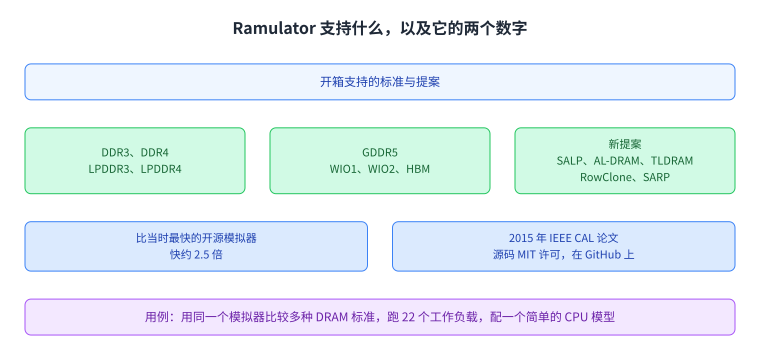
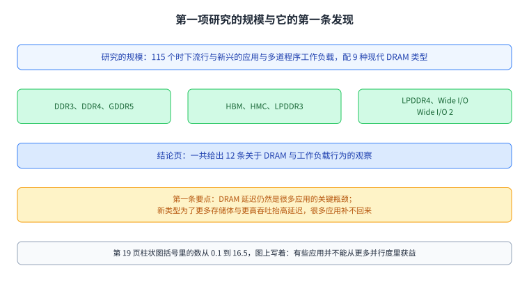
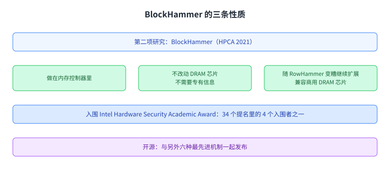
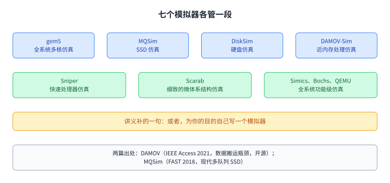

+++
title = "仿真：建筑师怎么评估还不存在的东西"
lecture = 15
slug = "lecture12a-simulation-ii"
status = "draft"
source_kind = "notes"
source_url = "https://safari.ethz.ch/architecture/fall2022/lib/exe/fetch.php?media=onur-comparch-fall2022-lecture12a-simulation-ii-afterlecture.pdf"
source_title = "Lecture 12a: Simulation II (with a Focus on Memory) (Fall 2022, afterlecture)"
output_mode = "explanation"
+++

> 来源课程：ETH Zürich Computer Architecture（Onur Mutlu 主讲，Fall 2022）；
> 对应讲义：Lecture 12a — Simulation II（`onur-comparch-fall2022-lecture12a-simulation-ii-afterlecture.pdf`，55 页）；
> 讲义链接：<https://safari.ethz.ch/architecture/fall2022/lib/exe/fetch.php?media=onur-comparch-fall2022-lecture12a-simulation-ii-afterlecture.pdf> ；
> 上游许可：该课程 wiki 每一页的页脚都带站点级许可块，原文为 CC BY-NC-SA 4.0：<https://creativecommons.org/licenses/by-nc-sa/4.0/deed.en> ；
> 本页由 CourseLingo 用中文重新讲解，按源讲义的推进顺序组织，不是逐字翻译，也不转载原讲义里的任何图片；
> 页内配图全部由我们自绘；原讲义里只有图、没有字的页，我们只如实记下它的标题。
> 本页为非官方材料，与 ETH Zürich 及课程教学团队无隶属关系；如与原文有出入，以原文为准。

本页的事实来自 `_sources/eth-ddca-ca/evidence/eth-ca2022-lecture12a-simulation-ii.pdf.pypdfium2.txt`（pypdfium2 抽取，55 页，18,021 字符），并与同一份 PDF 用 pypdf 抽出的 `.pdf.pypdf.txt`（55 页，17,573 字符）互相比对。该 PDF 入库前按三道核验过完整性：体积 5,603,177 字节、尾部有 `%%EOF`、大小不是 2 的整数次幂。抽取用的是 `_sources/_audit/pdftext_alt.py`（第三方库路线，pypdfium2 主、pypdf 复核）；仓内自研的 `pdftext*.py` 这一族在前几讲已被实测为不可靠，那两个脚本的输出文件名还会被后续重跑覆盖，所以本页不把它们当引用。

## 这一讲要解决什么问题

讲义第 2 页只有一句标语，「Simulation: The Field of Dreams」。它到第 45 页才把这句话说清楚：建筑师一半是梦想家、一半是创造者，而[[term:simulation]]是他的关键工具，因为它让人能够评估和理解**还不存在**的系统。

这一讲是仿真这条线的下半段，标题里写的副标题是「以内存为焦点」。它先用一个具体的模拟器把「仿真在内存这件事上到底长什么样」讲清楚，再看两项靠这个工具做出来的研究，然后看这门课还会用到哪些模拟器，接着把同一套方法搬到另一个领域，最后回到仿真本身的基本功。

最后那几页有个记号要说明：讲义把它们标成 `Recall:`，也就是复习。它们在讲仿真的目标、三个度量、高层模拟与渐进细化，属于仿真这件事的通用部分。按本课程的讲次清单，这部分对应第 14 讲 Simulation I，而本仓库已经有那一页（`content/14-lecture11b-simulation/`），所以本页照讲义如实标出它们是复习页，不把它们讲成这一讲的新内容。

图里四段就是这一讲的推进顺序。前半段全部落在内存上，后半段把方法抽出来，最后落回仿真的基本功。

## 为什么需要一个 DRAM 模拟器

讲义在第 6 页给的理由只有三条，讲的都是 [[term:DRAM]] 与内存控制器这一层的处境，而三条指向的是同一个方向：**留下的东西在变，能用来评估它们的东西没变**。

第一条是 DRAM 与[[term:memory-controller]]的格局在变。第二条是很多新的、即将到来的标准。第三条是很多新的控制器设计。三条加起来的结论是：一个又快又容易扩展的模拟器非常必要。

这里没有明说、但下一节会看到的那件事是：真实硬件跟不上变化的速度。新的 DRAM 类型需要新的 CPU 才能测，所以一批问题只能在模拟器里问。

图里左边三条是讲义列的变化，右边是它给出的那个结论。这一讲后面所有的研究都建立在这个工具上。

## Ramulator：一个又快又容易扩展的 DRAM 模拟器

讲义用一页把 Ramulator 的能力列了出来（第 7 页）。它开箱支持很多 DRAM 标准：DDR3、DDR4、LPDDR3、LPDDR4、GDDR5、WIO1、WIO2 与 HBM，此外还支持若干新提案，包括 SALP、AL-DRAM、TLDRAM、RowClone 与 SARP。

两个数字值得单独记住。一是速度，它比当时最快的开源模拟器还快约 **2.5 倍**。二是开放性，论文发表在 2015 年的 IEEE Computer Architecture Letters，源码按宽松的 MIT 许可发布在 GitHub 上。

讲义在第 8 页顺手给了一个用例：用同一个模拟器比较多种 DRAM 标准，跑 22 个工作负载，配一个简单的 CPU 模型。这一点是模拟器价值的直接体现，换标准不需要换机器。

后面几页是围绕这个工具的配套设施。第 10 到 12 页的标题分别是自由开源、与其它模拟器集成、以及可复现性，每页只有标题和一个仓库链接。第 13 页是一门项目课：面向本科生的选修，从内存系统仿真入门到用 Ramulator 的教程，用 C++，并且可以往研究探索走。第 14 页把「读 Ramulator 论文」列进了下次作业的加分项。

左边一栏是它能建模的标准与提案，右边一栏是速度与许可这两件事。

## 它支撑的第一项研究：115 个应用乘 9 种 DRAM

第 15 页往后是一段完整的实验研究，发表在 2019 年的 SIGMETRICS 上，标题是「Demystifying Workload–DRAM Interactions」。

讲义在第 17 页先讲为什么要做这件事。厂商在做很多新类型的 DRAM，而 DRAM 限制着性能与[[term:energy-efficiency]]的改进，新类型有可能绕开其中一部分限制。与此同时，内存系统要服务的应用已经非常多样，**不能再一刀切**。于是问题变成：哪一种 DRAM 类型配哪一种应用最好。

这个问题有两个难处。一是交互太复杂，靠直觉判断不出来。二是真实系统上没法系统地测，因为换一种新的 DRAM 类型就要换一颗新的 [[term:cpu]]。所以只能用模拟器做一次大范围的实验研究，规模是 **115 个时下流行与新兴的应用与多道程序工作负载**，配 **9 种现代 DRAM 类型**：DDR3、DDR4、GDDR5、HBM、HMC、LPDDR3、LPDDR4、Wide I/O 与 Wide I/O 2。

第 18 页那张对照表，第 13 讲已经逐行抄过，这里只留一句：这些类型在存储体数、存储体组、三维堆叠与低功耗上各有取舍，而同一页标出的代价是延迟更大、面积与功耗更大、行更窄而延迟更高。

第 19 页讲的是这组实验里最硬的一条发现，标题就是「需要更低的访问延迟」。新的 DRAM 类型常常为了提供更多存储体、更高[[term:bandwidth]]而抬高访问延迟，而很多应用补不回这部分[[term:latency]]。讲义点名说，常见操作系统例程尤其如此，比如文件 I/O 与进程创建；受影响的还有一批桌面与科学计算、服务器与云、以及 GPGPU 应用。同一页的柱状图按应用列出加速比，括号里是各自的数，跨度从 0.1 一直到 16.5，图上的结论一句话：有些应用并不能从更多并行度里获益。

第 20 页把整段研究的要点收成四条。第一，DRAM 延迟仍然是很多应用的关键瓶颈。第二，存储体并行度没有被广泛应用充分利用。第三，只要内存子系统真的去利用空间局部性，它仍然能带来明显的性能收益。第四，对某几类应用，低功耗内存可以在不显著牺牲性能的前提下省下能量。

第 21 页是结论页，把规模再点一遍：115 个应用、9 种 DRAM 类型，一共给出 **12 条**关于 DRAM 与工作负载行为的观察；工具与论文都开源。

上面是规模，下面是结论页给出的条数与四个要点里的第一条。规模是这项研究最直接的贡献，因为它把「哪种内存配哪种应用」从一个直觉问题变成了一个可以逐条查表的问题。

## 第二项研究：用同一套工具做 RowHammer 防御

第 23 页到第 25 页是另一项工作，BlockHammer，发表在 2021 年的 HPCA 上。讲义特别标了一句它的外部评价：入围 Intel Hardware Security Academic Award，是 34 个提名里的 4 个入围者之一。

第 24 页给出了三条总结。第一，它是第一个让「基于限速的 RowHammer 缓解」真正可用的工作。第二，它做在[[term:memory-controller]]里，既不需要 DRAM 芯片的任何专有信息，也不需要改动芯片。第三，它既能在 RowHammer 越变越糟时继续扩展，又兼容商用 DRAM 芯片。同一页还写了它的开源状态：与另外六种最先进机制一起发布。

[[term:RowHammer]] 这个机制本身，这门课在第 6 讲与第 7 讲已经讲过，这里不重复。这一讲要看的只是：这样一项防御工作，它的评估同样是搭在模拟器上的。

左边三条是它的做法与性质，右边一条是它的开放性。把它放在这里，是为了说明同一套工具能支撑的工作有多远。

## 模拟器也要能模拟 PIM

第 27 页往后换了一个方向：把计算搬进内存或搬到内存旁边，这件事也需要能评估它的基础设施。

第 28 页讲的是为 PIM 扩展过的 Ramulator。它保留了原模拟器的两条性质，灵活、可扩展，能建模很多内存标准与提案，同时还给出了 PIM 版本的源码仓库。

第 29 页是一项具体工作，NAPEL，发表在 2019 年的 DAC 上，全称是「用集成学习为近内存计算应用做性能预测」。它要回答的问题很实际：在真正做出来之前，能不能先预测一个近内存方案能带来多少收益。

这个过程本身也能用到[[term:processing-in-memory]]这一侧。这门课第 4 讲与第 5 讲讲的是 PIM 本身，也就是把计算搬到数据所在的地方，以及搬到内存旁边；这一讲补的是评估它的那一层。

上面一条是扩展出来的基础设施，下面一条是建立在它上面的一项预测工作。

## 还有哪些模拟器

讲义在第 32 页列了一张清单，七个模拟器各管一段。gem5 做全系统多核仿真。MQSim 做 SSD 仿真。DiskSim 做硬盘仿真。DAMOV-Sim 做近内存处理的仿真。Sniper 做快速处理器仿真。Scarab 做细致的[[term:microarchitecture]]仿真。Simics、Bochs 与 QEMU 做全系统功能级仿真。

清单后面还有一句值得抄下来：或者，为你的目的自己写一个模拟器。这一讲的立场不是推荐某一个工具，而是说清每一类问题各自需要什么样的工具。

后面几页给了两篇材料的出处。DAMOV 是 2021 年 IEEE Access 上关于[[term:data-movement]]瓶颈的方法学与基准套件，讲义还标了它的开源位置。MQSim 是 2018 年 FAST 上关于现代多队列 SSD 的工作。第 37 页与第 39 页是两门项目课，分别对应内存内计算与固态盘。第 40 页指向一个仓库，里面还有更多模拟器。

图里每一格是一个工具与它负责的层次。下面一条是讲义自己写的那句提醒：也可以为自己的目的写一个。

## 同一套方法用在别的领域

第 41 页的标题就是一句判断：这里讨论的东西也适用于其它领域的仿真。第 42 页给出案例：COVID-19 的传播建模与预测。

第 44 页先把「怎么评估一个想法」铺成五种方法。要判断一个想法会怎样影响某个目标指标，可选的手段有：理论证明、解析建模或估算、仿真（抽象度与精度可以不同）、用真实系统做原型（例如 FPGA），以及真实实现。

第 45 页把仿真对建筑师的意义讲得最完整。建筑师一半是梦想家、一半是创造者，仿真是他的关键工具，因为它让人能够评估与理解还不存在的系统。它让人探索很多梦想、给梦想做一次现实检查、并判断哪个梦想更好。紧接着是这一页最该记住的一句：仿真也让人**有办法用一个假的梦想把自己骗过去**。

第 48 页是预测与现实的对照，讲义给了一个公开的疫情预测页面当例子。放在这一讲里，它的作用是把上一句警告落到实处：仿真给出的东西需要有人拿现实去对。

上面一排是五种评估手段，下面两格是仿真的用途与它的风险。讲义把风险写在用途的同一页上，这两件事本来就不该分开讲。

## 仿真的目标与三个度量

接下来的几页都带 `Recall:` 记号，是仿真这件事的基本功。

第 49 页把目标分成两头。一头是快速探索设计空间，看什么值得在下一代平台上实现、值得作为下一个大想法提出来，这时候主要看设计决策的**相对效果**。另一头是匹配一个已有系统的行为，为的是高精度地调试与验证它，或者提出小的改动，这时候要求**很高的精度**。两头之间还有中间地带：不做完整的细致建模就细化已经探索过的设计空间；以及为更高层探索得到的决策建立信心。

第 50 页给出评价模拟器的三个度量。速度，也就是模拟器跑得多快，用的量是每秒多少条指令、每秒多少个周期或者减速比。灵活性，也就是多快能把模拟器改成去评估不同的算法与设计选择。精度，也就是它给出的性能或能耗数字相比真实设计有多准，这个差就是仿真误差。三者的相对重要性，取决于你处在设计流程的哪个位置。

第 51 页讲这三者怎么互相换。速度与灵活性影响的是你能多快做出设计取舍。精度影响的是你的取舍最终能有多好，也影响你多快能建出模拟器本身。灵活性还影响改模拟器要花多少人力。

图里上面一排是三个度量，下面两格是它们各自牵动的东西。它们没有同时最优的点，只能按当前目标选一个位置。

## 抬高抽象层，以及渐进细化

第 52 页给出高层模拟的关键想法：把建模的[[term:abstraction]]层次抬上去，用一部分精度去换速度、灵活性，以及更快的模拟器开发。

好处有三条。仍然能很快做出正确的取舍。只需要建模关键的高层因素，边角情况可以省掉。只需要把「相对趋势」搞准，不需要精确的性能数字。代价有两条：有可能因此做出错误的决策；以及更麻烦的那一条，你怎么保证相对趋势真的是准的。

第 53 页把仿真的做法画成一条细化的阶梯：高层模型（抽象，用 C 写）、中层模型（不那么抽象）、低层模型（RTL，什么都要建模），最后是真实设计。往下走的时候有四件事同时发生。抽象度降低。精度但愿上升，但如果不够小心，它并不必然上升。灵活性下降。速度通常也下降，只有真实设计这一步例外。还有一条出口：你可以回头去修高层的模型。

第 54 页把这一讲收在人的判断上。好的建筑师在细化的每一层都自在，包括两个极端；他知道什么时候该用哪一种仿真，更一般地说，知道该用哪一种[[term:design-space-exploration]]方法。这一页又把那五种评估手段列了一遍，作为整讲的收尾。

上面一条是阶梯，下面四条是每往下一层走时同时发生的变化。最后那一条出口是往上回头修模型，这也是它和一条单向流水线的区别。

## 脉络回顾

这一讲把仿真是建筑师用来评估还不存在的系统的工具这件事讲透了，而它的落点是一个具体的模拟器。

Ramulator 就是那个落点：它开箱支持一批 DRAM 标准与提案，比当时最快的开源模拟器快约 2.5 倍，按 MIT 许可开源。靠它做出来的第一项研究用 115 个应用与 9 种现代 DRAM 类型回答「哪种内存配哪种应用」，收成四条要点与 12 条观察，其中第一条是延迟仍然是很多应用的关键瓶颈。第二项工作是 BlockHammer，做在内存控制器里的 RowHammer 缓解。

工具这一侧还有一条延伸线：为 PIM 扩展的 Ramulator 与 NAPEL，以及 gem5、MQSim、DiskSim、DAMOV-Sim、Sniper、Scarab、Simics、Bochs、QEMU 这一串各管一段的模拟器，外加一句「也可以为自己的目的写一个」。

最后这部分带 `Recall:` 记号的几页讲的是基本功。目标有两头，快速探索设计空间看相对效果，或者高精度匹配已有系统。度量有三个，速度、灵活性、精度，它们之间只能互相换。抬高抽象层能换来速度、灵活性与更快的开发，代价是有可能把决策做错，而且「相对趋势准不准」本身需要证明。做法上是一条从高层模型到 RTL 再到真实设计的阶梯，往下走时抽象度、精度、灵活性与速度各自有各自的走向，而且随时可以回头修高层的模型。

## 读完应该能回答

1. 讲义用哪三条理由说明需要一个又快又容易扩展的 DRAM 模拟器。
2. Ramulator 的速度与开放性各有一个具体数字或名称，分别是什么。
3. 那项工作负载与 DRAM 交互的研究，规模是多少个应用、多少种 DRAM 类型。
4. 新 DRAM 类型为什么常常会抬高访问延迟，这条发现在图上的跨度是多少。
5. BlockHammer 的三条性质分别是什么，它为什么不需要改动 DRAM 芯片。
6. 评价模拟器的三个度量是什么，它们各自牵动什么。
7. 高层模拟用精度换来了什么，它的两条代价是什么。
8. 渐进细化这条阶梯往下走时，抽象度、精度、灵活性与速度分别怎么变。

## 溯源

- 对应：ETH Zürich Computer Architecture（Onur Mutlu 主讲，Fall 2022），Lecture 12a — Simulation II（2022 年 11 月 4 日）。
- 讲义链接：<https://safari.ethz.ch/architecture/fall2022/lib/exe/fetch.php?media=onur-comparch-fall2022-lecture12a-simulation-ii-afterlecture.pdf>
- 上游许可：站点级页脚为 CC BY-NC-SA 4.0。**SA 是传染性的**，所以本页的译文也以同协议发布、且为非商业用途。本页未转载原讲义里的任何图片，配图全部自绘。
- 证据来源：`_sources/eth-ddca-ca/evidence/eth-ca2022-lecture12a-simulation-ii.pdf.pypdfium2.txt`（pypdfium2 抽取，55 页，18,021 字符），交叉核对用同名的 `.pdf.pypdf.txt`（pypdf 抽取，55 页，17,573 字符）。三道完整性核验：5,603,177 字节、尾部有 `%%EOF`、不是 2 的整数次幂。抽取器是 `_sources/_audit/pdftext_alt.py`。仓内自研的 `pdftext*.py` 这一族在前几讲已被实测为不可靠，本页没有采用它们的任何输出；它们写出的文件名还会被后续重跑覆盖，因此也不作为引用。
- 本讲取材范围是讲义的全文 p1 到 p55，其中 p55 是重复的封面页。讲义里有若干页只有标题、图或出处链接：分节页 p2、p3、p4、p5、p15、p27、p31、p41、p42；图片页 p8、p18、p43、p46、p47；链接或出处页 p10、p11、p12、p14、p22、p25、p26、p33、p34、p35、p36、p37、p38、p39、p40、p48。这些页本页只登记标题、主题或出处，没有替它们复原内容。
- 一处要说明的记号：讲义最后六页（p49 到 p54）的标题都带 `Recall:`，属于复习性质。按本课程讲次清单，它们对应第 14 讲 Simulation I；本仓库已经有那一页（`content/14-lecture11b-simulation/`），所以本页如实把它们标成复习页，不复述其中的内容。
- 数字与定义以讲义页面为准：Ramulator 的约 2.5 倍、MIT 许可与 2015 年 IEEE CAL；用例里的 22 个工作负载与简单 CPU 模型；研究的 115 个应用、9 种 DRAM 类型与 12 条观察；第 19 页柱状图括号里的数从 0.1 到 16.5（这是从图上标签读出来的，讲义正文没有复述）；BlockHammer 的 34 个提名里 4 个入围者；三个度量与五个评估手段的条目。第 18 页那张 DRAM 对照表（DDR3 的 8 个存储体到 HMC 的 256 个）第 13 讲已逐行抄过，本页只留一句代价，没有重复展开。
- 讲义未展开的推论属于 CourseLingo 的讲解。这类推论有三组：把「真实硬件跟不上变化的速度」说成第 6 页三条理由背后的那件事（讲义把这句放在第 17 页的动机里）；把第一项研究的规模说成它最直接的贡献；以及把这一讲与第 4、5 讲（PIM 本身）、第 6、7 讲（RowHammer 本身）的分工写清楚。
