+++
title = "电荷到头之后：换器件，以及换完之后的事"
lecture = 16
slug = "lecture12b-emerging-memory"
status = "draft"
source_kind = "notes"
source_url = "https://safari.ethz.ch/architecture/fall2022/lib/exe/fetch.php?media=onur-comparch-fall2022-lecture12b-emergingmemorytechnologies-afterlecture.pdf"
source_title = "Lecture 12b: Emerging Memory (Fall 2022, afterlecture)"
output_mode = "explanation"
+++

> 来源课程：ETH Zürich Computer Architecture（Onur Mutlu 主讲，Fall 2022）；
> 对应讲义：Lecture 12b — Emerging Memory（`onur-comparch-fall2022-lecture12b-emergingmemorytechnologies-afterlecture.pdf`，159 页）；
> 讲义链接：<https://safari.ethz.ch/architecture/fall2022/lib/exe/fetch.php?media=onur-comparch-fall2022-lecture12b-emergingmemorytechnologies-afterlecture.pdf> ；
> 上游许可：该课程 wiki 每一页的页脚都带站点级许可块，原文为 CC BY-NC-SA 4.0：<https://creativecommons.org/licenses/by-nc-sa/4.0/deed.en> ；
> 本页由 CourseLingo 用中文重新讲解，按源讲义的推进顺序组织，不是逐字翻译，也不转载原讲义里的任何图片；
> 页内配图全部由我们自绘；原讲义里只有图、没有字的页，我们只如实记下它的标题。
> 本页为非官方材料，与 ETH Zürich 及课程教学团队无隶属关系；如与原文有出入，以原文为准。

本页的事实来自两份独立抽取：主用 `_sources/eth-ddca-ca/evidence/eth-ca2022-lecture12b-emergingmemorytechnologies.pdf.pypdfium2.txt`（`pypdfium2`，159 页、58,467 字符），并与同目录的 `.pypdf.txt`（`pypdf`，159 页、57,023 字符）逐条核对。该 PDF 入库前按四道核验过完整性：体积 5,355,963 字节、尾部有 `%%EOF`、大小不是 2 的整数次幂、也不是 64 KiB 的整数倍（余数 47,547）。两份抽取的页数一致、正文里引用的数字都能按整词检索到。

## 这一讲要解决什么问题

前面几讲讲的都是「在现有器件上，怎么把浪费管起来」。这一讲换了前提：如果电荷这条路快走到头了呢。

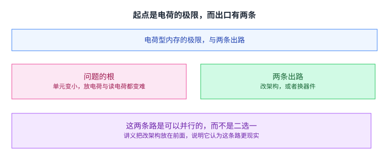

讲义把问题归到电荷本身：把电荷放进一个越来越小的单元、再可靠地读出它，变得越来越难。它举的两个例子是闪存的浮栅电荷与 [[term:DRAM]] 的电容电荷（后者还要面对晶体管的漏电）。

出路有两条：改架构，或者换器件。

值得先说明的是，这两条路不是二选一。讲义把改架构放在前面讲，本身就说明它认为那条路更现实；而换器件那条路要真正落地，也得靠改架构去补它的短板；这一点在后面会看得很清楚。

## 出路一：不换器件，改架构

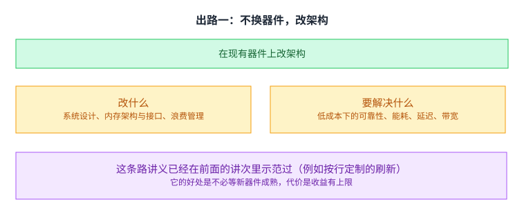

第一条路是在现有器件上改：以内存为中心设计系统、改内存的架构与接口、把浪费管起来。

讲义列的要紧事项里，第一条是「在低成本下拿到可靠性」，也就是容量。后面依次是降[[term:energy-efficiency]]、降[[term:latency]]、提[[term:bandwidth]]、减少各类浪费，以及让计算靠近数据（[[term:processing-in-memory]]）。最后那一条是后面「内存内计算」那一节的伏笔。

这条路的好处是不必等新器件成熟，代价是收益有上限。而前面几讲已经示范过它：[[term:refresh]] 按行定制、[[term:RowHammer]] 的限流防护，都是这条路。

## 出路二：换成电阻型器件

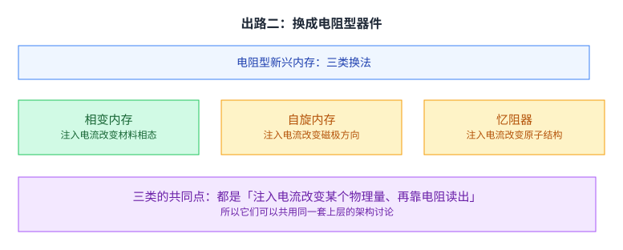

第二条路是换器件。讲义说，有一类新兴的电阻型内存看起来比 DRAM 更容易继续缩小，而且是非易失的，于是它有可能替换、补强或者在某些方面超过 DRAM。

它列了三类：相变内存（注入电流改变材料的相态）、自旋内存（注入电流改变磁极方向）、以及忆阻器（注入电流改变原子结构）。这一讲以相变内存为主线。

三类的共同点是：都是「注入电流改变某个物理量、再靠电阻读出」。 这个共同点意味着它们可以共用同一套上层的架构讨论，也意味着它们的短板有相似的结构。

## 两类内存读写的东西根本不同

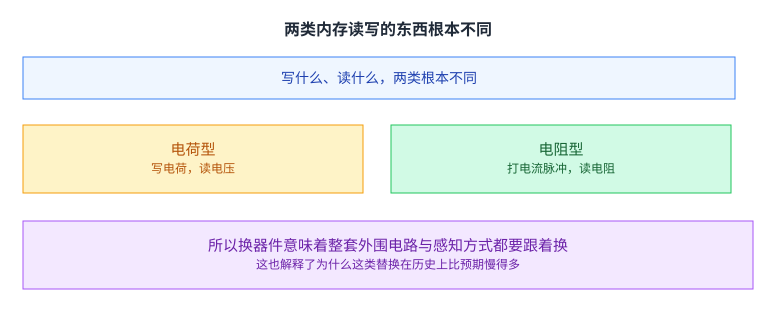

先把差别说清楚。电荷型内存写的是电荷、读的是电压；电阻型内存写的是电流脉冲、读的是电阻。

这个差别决定了后面所有的性质差异。它同时说明一件事：换器件不是换个零件那么轻。 写的方式变了、读的方式变了，那么整套外围电路、感知方式、时序参数都要跟着换。

再往下追一层：电荷型内存之所以能沿用一套成熟的架构，是因为「有多少电荷」可以被连续地感知，于是可以有行缓冲、可以有感放器阵列、可以用同一套时序去读所有单元。电阻型内存把感知的对象换成了电阻，而电阻的可分辨区间与电荷不同，这就使得那些为电荷设计的复用结构不再自动适用。换句话说，被换掉的不只是存储单元，还有建立在存储单元之上的那一整套复用方式。

这也解释了为什么这类替换在历史上比预期慢得多：不是因为器件不好，而是因为替换的代价落在整个系统上。

## 相变内存是什么

相变材料有两个态。 非晶态电阻高，晶态电阻低。两个态之间可以可靠且快速地来回切换，于是可以用高阻表示一个值、低阻表示另一个值。

这句「把值编码在电阻上，而不是编码在电荷量上」是整讲里所有性质差异的来源。后面那些优势与代价，都可以从这一句往回推。[[term:MRAM]] 那一类自旋器件也是同一个思路，只是被改变的物理量不同。

## 它怎么被写进去

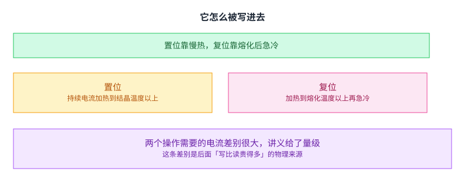

置位用持续电流把单元加热到结晶温度以上，于是材料转为晶态、电阻变低；复位把单元加热到熔化温度以上再急冷，于是转为非晶态、电阻变高。读则是去感知电阻。

讲义给了两个操作需要电流的量级，它们的差别很大。这条差别就是后面「写比读贵得多」的物理来源，而它属于[[term:microarchitecture]] 层面的性质。

写要真的改变材料的相态，而读只是去感知它：一个动作改变了物理状态，另一个只是观察它。 这解释了为什么写延迟、写能耗与寿命这三条代价都集中在写这一侧。

## 它的好处：可继续缩小、能存多值、不用刷新

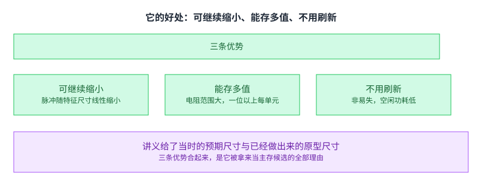

讲义列了三条。

一是比 DRAM 与闪存更容易继续缩小。理由是它靠电流脉冲工作，而脉冲的尺寸随特征尺寸线性缩小，所以缩小不会像电荷那样遇到读不出来的问题。

二是能存多值。因为电阻的可分辨范围大，一个单元能存比一位更多，讲义给了当时的原型进展。

三是非易失。数据能保住很多年，因此不需要[[term:refresh]]、空闲功耗低。

三条合起来，就是它被拿来当主存候选的全部理由。值得注意的是第三条：它不只是「更快的内存」，而是同时具备内存的粒度与存储的持久性——这一点正是下一篇（本仓库第 17 讲）那条「合层」线的起点。

这里先把后面那条线的一句话版本放在这里：过去之所以要把数据分成「易失的内存」与「持久的存储」，是因为没有器件能同时满足两边的要求。而一旦有这样的器件出现，那条界线就失去了物理依据，剩下的问题就变成了「那套为两边各写一套的结构还要不要」。

## 但代价也很硬

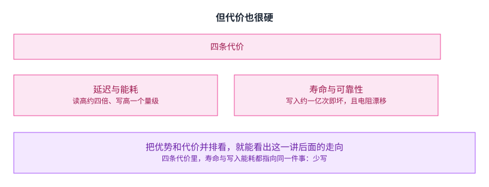

讲义把这四条列在一起：延迟比 DRAM 高（读高约四倍、写高一个数量级）、动态能耗高、寿命低（一个单元写入约一亿次就会坏）、以及可靠性问题（电阻会随时间漂移）。

把优势和代价并排看，就能看出这一讲后面的走向。而四条代价里有一条特别值得留意：寿命与写入能耗都指向同一件事，那就是少写。

这不是巧合。前面说过写要真的改变材料的相态，而每次相变都会磨损接触点，同时消耗能量。所以「怎么少写」既是性能问题也是寿命问题，它们的最优方向是同一个。

## 先试最朴素的做法：直接替换

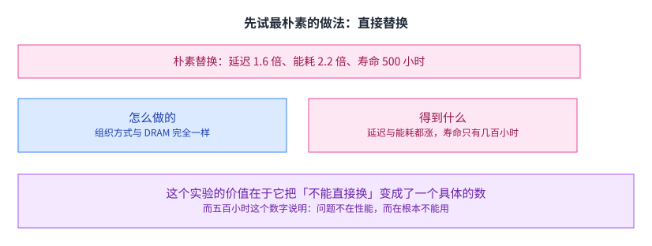

讲义先给了一个「直接把 DRAM 换成相变内存、其余照旧」的实验：四核、四兆二级缓存，相变内存的组织方式与 DRAM 完全一样。

结果是延迟一点六倍、能耗二点二倍，而平均寿命只有五百小时。

这个实验的价值在于它把「不能直接换」变成了一个具体的数。而五百小时这个数字说明一件更要紧的事：问题不在性能，而在根本不能用。 一台机器跑二十天就坏掉，性能再好也没有意义。

## 改架构之后：能用了，但留了三条保留

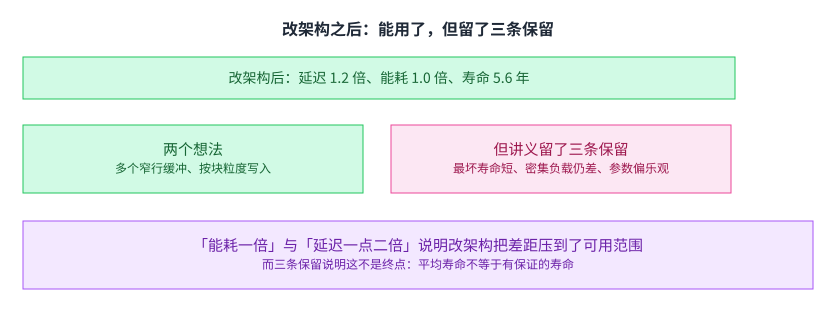

讲义接着给了改架构之后的版本，两个想法：在每个芯片里用多个窄行缓冲（减少阵列的读写次数），以及按缓存块或字的粒度写入（减少无谓的磨损）。

结果是延迟一点二倍、能耗一倍、平均寿命五点六年。

从「五百小时」到「五点六年」，差距被压到了可用范围。而能耗那一项从二点二倍变成一倍，说明前面那条「少写」的方向是对的。

而这两个想法都指向同一个动作：减少进入阵列的访问次数。多个窄行缓冲让一次阵列读出的数据能被更多次访问用上；按块粒度写入让一次写入不牵动整个阵列。它们都不是在改良器件，而是在改良器件被使用的方式 —— 这正是「改架构」这条路的名字。

但讲义留了三条保留：最坏情况的寿命比平均值短得多，因而没有保证；密集使用内存的应用仍然会看到明显的性能与能耗损失；以及它用的器件参数可能偏乐观。

第一条保留最值得记住：平均寿命不等于有保证的寿命。 这正好回应了前面那条——它靠少写来延寿，而「平均少写」并不能保证每一个单元都被少写。那些恰好被反复写的单元，寿命仍然可能是几百小时。这也解释了为什么这一讲后面的混合方案都把写过滤当成核心，而不是把「平均寿命变长」当成结论。

## 一个反直觉的细节：读一个位比读另一个位贵

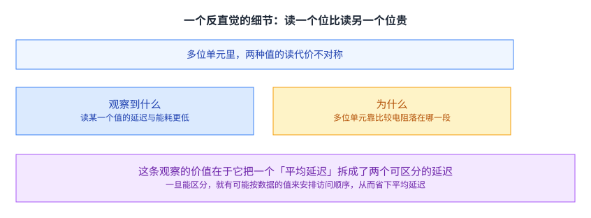

讲义观察到：在多位单元里，读某一种值的延迟与能耗明显低于另一种。原因是多位单元靠比较电阻落在那一段来判断值，而不同的段读起来的代价不同。

这条观察的价值在于它把一个「平均延迟」拆成了两个可以区分的延迟。而一旦能区分，就有可能按数据的值来安排访问顺序，从而把平均延迟压下来。

这是一个很好的例子，说明「先把现象看准」能带来什么：如果只记一个平均延迟，那么这条优化根本不存在；把它拆成两个，优化就自己出现了。

## 另一类器件多了一个自由度

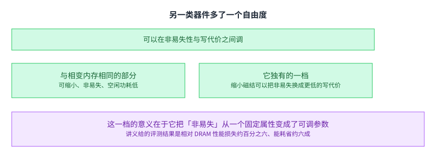

讲义也讲了自旋内存。它与相变内存的优势类似：可继续缩小、非易失、空闲功耗低。代价是写延迟与写能耗高、密度目前较差。

而它多出来的一个自由度是：可以通过缩小磁结来拿写延迟与写能耗去换非易失性。

这一档的意义在于它把「非易失」从一个固定属性变成了一个可调参数。器件本身还是那个器件，但你可以选择它更像内存一点、还是更像存储一点。讲义给的评测结果是：相对 DRAM 性能损失约百分之六，而能耗省约六成。

## 更现实的做法不是替换，而是混合

讲义把结论引向[[term:heterogeneous-memory]] 的思路：快而贵的那层做小、慢而便宜的那层做大，用硬件与软件协作来管理。一个具体做法是让 DRAM 当相变内存的缓存，并在它上面做写过滤。已经上市的 Optane 走的就是这条路：它以 DDR4 DIMM 的形式插在内存槽上，DRAM 那份就当它的缓存。

讲义列了三条写过滤技术：懒写（从存储进来的页只装进 DRAM、不装进相变内存）、部分写（只把 DRAM 里脏的那几行写回去）、以及页面绕过（淘汰时把复用性差的页直接丢掉）。

三条每一条都在减少写进慢层的次数。这与前面那四条代价里「寿命与写入能耗都指向少写」完全是同一个方向。

顺带说一句这个方案的位置：它把「替换」这个问题换成了「分工」这个问题。 相变内存不必在所有方面都赢过 DRAM，它只需要在容量与持久性上赢，而延迟交给 DRAM 那层去挡。这个思路在后面几讲里会反复出现。

## 往上一层：该把哪份数据放在哪一层

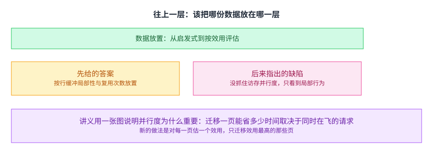

混合内存带来一个放置问题。讲义先给了基于行缓冲局部性的答案：把「预计会行未命中、而且会被反复用」的数据放在快层。理由是行未命中的代价在慢层上大得多，所以把这类数据挪到快层，收益最大。

后来它指出这类启发式的共同缺陷：它们只看到访存行为的一部分，没有抓住访存并行度。

讲义用一张图说明并行度为什么重要。如果同一个应用同时在飞好几个访存请求，那么迁移一页能省下的停顿时间，可能被其他还在飞的请求盖住；要让停顿真的减少，就得同时迁移好几页。于是「迁移哪一页最值」这个问题的答案取决于应用当前有多少并发。

它给的新做法是：对每一页估一个效用（用一个性能模型算迁移它能带来多少停顿减少），只迁移效用最高的那些页。这样就不必为每一种混合组合各写一套启发式。

## 同一个器件还能做别的事

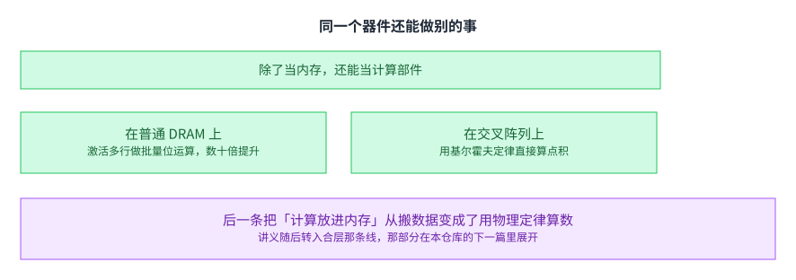

讲义在最后把视线从「当内存用」移开：这类器件还能做内存内计算。

一是在普通 DRAM 上做批量位运算：靠 DRAM 的模拟特性，激活多行本身就完成了一次计算（讲义举的是拷贝、置零、与、或、非、多数这些操作），性能与能耗提升数十倍。这一支的代表工作是 Ambit，之后还有把这类做法做成通用框架的 SIMDRAM。

二是在新兴器件的交叉阵列上直接做点积：因为交叉阵列的位线电流天然就是「电压乘电导」的求和，所以它能用基尔霍夫定律直接算点积。这一支的代表工作是面向卷积网络的 ISAAC。

这两支的区别值得分清。前一支是在已有的 DRAM 上想办法，靠的是把 DRAM 读操作的模拟特性用起来，所以它不需要新器件就能做；后一支依赖新兴器件的阵列结构，没有这类器件就没有这个能力。而两支的共同收益都来自同一件事：不再把数据搬出来算。

后一条把「计算放进内存」从「把数据搬过去算」变成了「用物理定律算数」——计算不再是一个动作，而是器件本身的性质。

讲义随后转入合层那条线（把内存与存储合成一层、持久内存管理器、崩溃一致性、编程易用性、安全与隐私）。那部分在本仓库的第 17 讲（`content/17-lecture13a-emerging-memory-technologies/`）里已经讲过，本页不重复；两讲的对照写在下面溯源里。

## 读完应该能回答

1. 讲义把电荷型内存的极限归到什么上，它给了哪两条出路。
2. 电荷型与电阻型内存写的是什么、读的是什么，这个差别意味着什么。
3. 相变内存的置位与复位各做什么，为什么写比读贵得多。
4. 相变内存的三条优势与四条代价分别是什么。
5. 朴素替换的结果是多少，改架构之后是多少，讲义留了哪三条保留。
6. 多位单元的读不对称是什么，这条观察能带来什么优化。
7. 混合内存里 DRAM 与相变内存各自负责什么，写过滤在解决什么。

## 溯源

- 对应：ETH Zürich Computer Architecture（Onur Mutlu 主讲，Fall 2022），Lecture 12b — Emerging Memory。
- 讲义链接：<https://safari.ethz.ch/architecture/fall2022/lib/exe/fetch.php?media=onur-comparch-fall2022-lecture12b-emergingmemorytechnologies-afterlecture.pdf>
- 上游许可：站点级页脚为 CC BY-NC-SA 4.0。SA 是传染性的，所以本页译文也以同协议发布、且为非商业用途。本页未转载原讲义里的任何图片，配图全部自绘；只有图没有字的页，本页只如实记下标题。
- 证据来源（两份独立抽取，互为核对）：`eth-ca2022-lecture12b-emergingmemorytechnologies.pdf.pypdfium2.txt`（`pypdfium2`，159 页、58,467 字符）与同目录 `.pypdf.txt`（`pypdf`，159 页、57,023 字符）。四道核验：5,355,963 字节、尾部有 `%%EOF`、不是 2 的整数次幂、也不是 64 KiB 的整数倍（余数 47,547）。两份抽取页数一致。
- 与下一篇（本仓库第 17 讲）的分工，这里要写明，因为它是有实测依据的：第 17 讲用的那份讲义（Lecture 13a）与这一讲的尾部是同一批页。我逐页比对过：这一讲的 p116 到 p159 与第 17 讲的 p1 到 p47 对应（按每页正文前 60 字符比对，7 页逐字相同，其余是同内容而抽取文本略有差异的页，例如只有标题与图的页）。所以本页按讲义自己的分节点取材：正文落在 p1 到 p122（p122 是讲义写的「我们讲到这里，下次继续」），p123 之后的那批页已在第 17 讲里讲过，本页只在末尾指向它，不重复展开。第 17 讲那一页的溯源里此前写着「上篇（Lecture 12b）本仓库尚未收录」，该句现已随本页交付而更新为指向本页。
- 本讲取材范围：电荷型内存的极限；改架构这条路与它列的六条要紧事项；三类电阻型器件；电荷型与电阻型在读写对象上的差别；相变内存的两个态、置位与复位的做法、三条优势与四条代价；朴素替换与改架构两个实验的结果及三条保留；多位单元的读不对称；自旋内存的代价与它多出的那个自由度；混合内存的做法、三条写过滤技术与评测结果；按行缓冲局部性放置数据、以及后来按效用评估的做法与它指出的并行度问题；最后是普通 DRAM 上的批量位运算与交叉阵列上的点积两类内存内计算。
- 数字与定义以讲义页面为准。讲义未展开的推论属于 CourseLingo 的讲解。这类推论分三组：把四条代价中的寿命与能耗归到「都指向少写」这同一个方向上，并由此解释为什么后面的方案都把写过滤当核心；把「平均寿命不等于有保证的寿命」讲成那三条保留里最要紧的一条及其对后文的影响；以及把混合内存讲成「把替换问题换成分工问题」。本讲与前后讲次的对应关系属于我们的编排。
- 一处说明：讲义有多页只有标题与图或只有图（例如第 20、35、50、52、57、59、60、71、81、82、87、88、95、106、109、110、111、112、113 页），文字层留下的是标题与零散标签。本页对这些页只依据可见的标题与文字描述，未依据图示复原结构，也未替讲义补数字或公式。
