+++
title = "把内存和存储合成一层，然后呢"
lecture = 17
slug = "lecture13a-emerging-memory-technologies"
status = "draft"
source_kind = "notes"
source_url = "https://safari.ethz.ch/architecture/fall2022/lib/exe/fetch.php?media=onur-comparch-fall2022-lecture13a-emergingmemorytechnologies-ii-afterlecture.pdf"
source_title = "Lecture 13a: Emerging Memory Technologies II (Fall 2022, afterlecture)"
output_mode = "explanation"
+++

> 来源课程：ETH Zürich Computer Architecture（Onur Mutlu 主讲，Fall 2022）；
> 对应讲义：Lecture 13a — Emerging Memory Technologies II（`onur-comparch-fall2022-lecture13a-emergingmemorytechnologies-ii-afterlecture.pdf`，48 页）；
> 讲义链接：<https://safari.ethz.ch/architecture/fall2022/lib/exe/fetch.php?media=onur-comparch-fall2022-lecture13a-emergingmemorytechnologies-ii-afterlecture.pdf> ；
> 上游许可：该课程 wiki 每一页的页脚都带站点级许可块，原文为 CC BY-NC-SA 4.0：<https://creativecommons.org/licenses/by-nc-sa/4.0/deed.en> ；
> 本页由 CourseLingo 用中文重新讲解，按源讲义的推进顺序组织，不是逐字翻译，也不转载原讲义里的任何图片；
> 页内配图全部由我们自绘；原讲义里只有图、没有字的页，我们只如实记下它的标题。
> 本页为非官方材料，与 ETH Zürich 及课程教学团队无隶属关系；如与原文有出入，以原文为准。

本页的事实来自 `_sources/eth-ddca-ca/evidence/eth-ca2022-lecture13a-emergingmemorytechnologies-ii.pdf.pypdfium2.txt`（`pypdfium2` 抽取，48 页，47 页有实质文字）。该 PDF 入库前按三道核验过完整性：体积 4,393,227 字节、尾部有 `%%EOF`、大小不是 2 的整数次幂。

这一讲是「新兴内存技术」的下半部分：上篇讲器件本身，下篇讲这些器件被用起来之后会发生什么。本仓库里上篇（Lecture 12b）尚未收录，所以本页是自足地讲的，需要承接上文的地方会明说。

## 这一讲要解决什么问题

先把痛点说清楚。前面几讲讲的是「内存很慢，怎么在不换器件的前提下让它快起来」。而这一讲面对的是另一件事：器件已经换了。

非易失内存这类东西同时具备两个过去互斥的性质：它有内存那样的读写粒度与[[term:latency]]，又像存储那样断电不丢。两个性质长在同一个器件上，于是过去那条把数据分成「易失的内存」与「持久的存储」的界线，就失去了物理依据。

痛点正在这里。那条界线不是凭空画的，它对应着一整套系统结构：内存那边有读写指令，存储那边有文件系统；两侧各有自己的定位、翻译与缓冲逻辑。器件一合，这套结构就从「必要的分工」变成了「白干的工作」。

于是这一讲要解决的问题可以写成一句话：把内存与存储合成一层，值多少；而合成之后，会新长出哪些必须解决的问题。 讲义的回答是前半句收益很大（它有实测数字），后半句有三个挑战，而这节课的篇幅主要花在后半句上。

讲义开头先把新兴内存能打开的机会列成四类：把内存与存储合成一层、做超快的检查点与恢复、让系统更不容易丢数据、以及把计算与内存紧耦合起来。

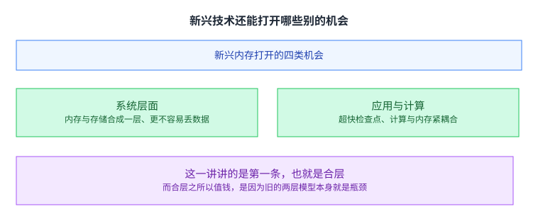

这一讲讲的是第一条。而它之所以值钱，得先看旧的做法哪里不对。

## 旧的两层模型为什么成了瓶颈

传统做法把数据分成两种：易失的放在内存里，用读写指令访问；持久的放在存储里，用文件系统访问。

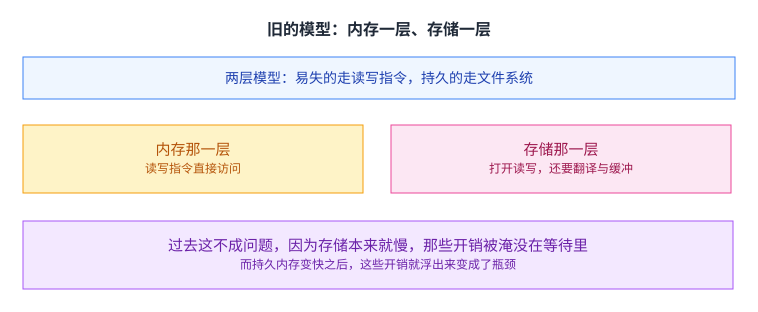

讲义指出的问题是：当持久存储变得很快时，操作系统与文件系统里那些用来定位、翻译、缓冲数据的代码，本身就成了性能与能耗的瓶颈。

这句话里有个容易滑过去的点：「过去不成问题」不是因为这些代码写得高效，而是因为存储实在太慢，那些开销被淹没在等待里。一旦底下变快，原本被遮住的成本就露出来了。 这是一个在系统设计里反复出现的形状：瓶颈转移之后，原来可以忽略的东西会变成新的瓶颈。

## 目标：把两层合成一层

讲义给的目标是把内存与存储的管理合成一个单元，从而消掉「定位、搬运、翻译」这三类白干的工作。

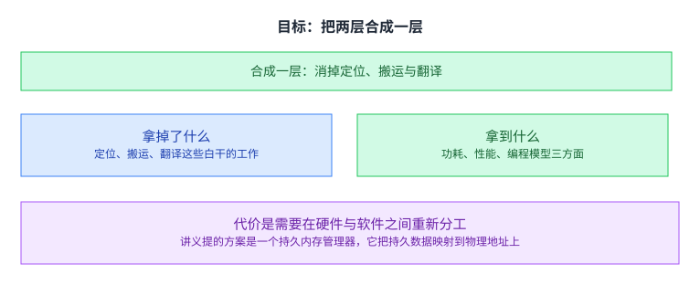

它带来的好处讲义分了三个面：[[term:energy-efficiency]]、性能，以及编程模型。第三个面容易被忽略：如果程序不必再区分「这份数据在内存还是存储」，那么写程序的模型就少了一个维度。

代价是需要在硬件与软件之间重新分工。讲义提的方案是一个持久内存管理器（它把持久数据映射到物理地址上，并给程序一个可以用普通读写指令访问的接口）。

这个分工具体是什么，讲义没有在一页里说完，但它给了一个方向：**把「哪份数据在哪」这件事从操作系统与文件系统手里，挪到一个专门的硬件部件手里。**这样做的理由是延迟：软件那一层的检查与翻译本身就要花时间，而持久内存足够快，快到这个时间成了可见的开销。

## 一个统一的接口要管什么

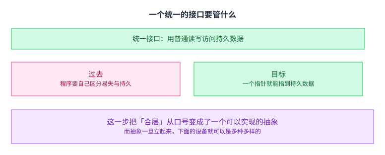

这一步的意义在于，它把「合层」从一句口号落到了一个具体的东西上：给程序一个统一的接口，让它用普通的读写指令就能访问持久数据。 讲义的说法是，程序拿到的可以只是一个指向数据的指针。

抽象一旦立起来，底下就可以是多种设备。这一点既是它的好处，也是它下一个麻烦的来源。

## 但底下是一堆不一样的设备

持久内存对外给出一整片持久的地址空间，可这片空间可能由很多种设备拼成。

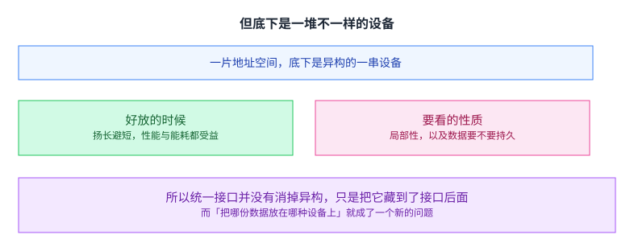

从又快又小的易失 [[term:DRAM]]，到又慢又大的硬盘与闪存，中间还夹着各种非易失内存。统一接口并没有消掉异构，它只是把异构藏到了接口后面。

于是出现一个新问题：把哪份数据放在哪种设备上。 讲义说这要看两个应用性质：局部性，以及这份数据要不要持久。有局部性的数据放在快的那一层，需要持久的放在不掉电的那一层，两个性质合起来就决定了放置。

这正是[[term:heterogeneous-memory]] 那一类设计的共同问题，而在这里它被一个统一接口重新提了出来。

## 合层能换来多少

讲义用归一化的执行时间与能耗两组数据说明这套做法的价值。

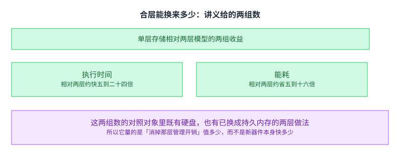

单层存储相对两层模型，执行时间约快五到二十四倍，能耗约省五到十六倍。

这两组数的对照对象里既有硬盘，也有已经换成持久内存的两层做法。也就是说，它量的是「消掉那层管理开销」值多少，而不是新器件本身比旧器件快多少。 这个区分很重要：前者是系统设计换来的，后者是器件换来的，而这一讲讲的是前者。

## 已经落地的两件东西

这一讲没有停在论文上，它举了两件当时能买到的产品。

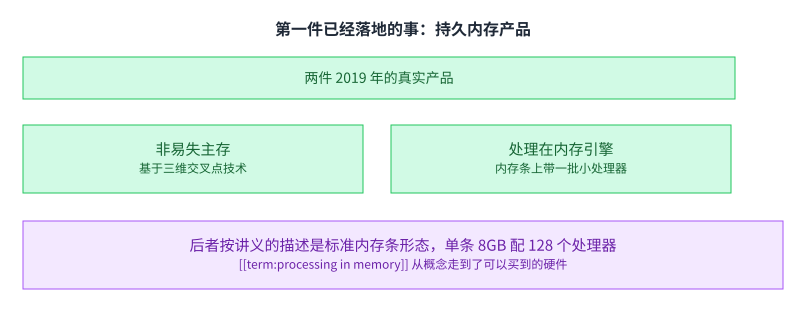

一件是 Intel 的 Optane 持久内存，基于三维交叉点技术。另一件是 UPMEM 的处理在内存引擎：标准内存条形态，单条 8GB 配 128 个处理器，用的是常规的 DRAM 工艺。

后者值得单独提一句，因为它说明 [[term:processing-in-memory]] 从概念走到了可以买到的硬件。它把「内存[[term:bandwidth]] 不够」这个问题的解法换了个方向：既然 [[term:data-movement]] 贵，那就不搬，把计算放过去。

这两件产品放一起看，能看出这一讲标题里那个「II」的意思：上篇讲的是器件层面的可能性，下篇讲的是这些可能性已经变成了货架上的东西，所以语言要从「将来会怎样」换成「现在要解决什么」。

## 挑战一：崩溃一致性

合层带来三个必须解决的问题。第一个最硬。

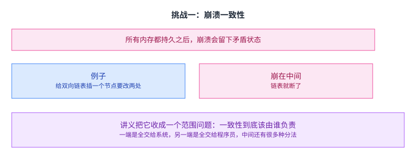

如果所有内存都是持久的，那么一次崩溃就可能把内存留在一个自相矛盾的状态里。讲义用的例子是给双向链表插入一个节点：改前驱与改后继是两步，崩在两步中间，链表就断了。

讲义把它收成一个范围问题：一致性到底该由谁负责。 一端是全交给系统（程序员不用管），另一端是全交给程序员（系统不插手），中间还有很宽的地带。

## 现有的解法与它们的代价

讲义把当时的解法归为一类：显式接口。

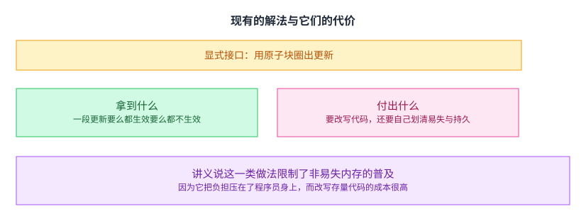

程序员用原子块把一段更新圈起来，系统保证这段要么都生效、要么都不生效。讲义列的代表工作是 NV-Heaps、BPFS 与 Mnemosyne；后面那一节里讲义的方案叫 ThyNVM，工具库方向举的是 NVMove。

它拿到的东西很实在，代价也很实在：必须改写代码，并且程序员要自己划清哪些数据是易失的、哪些是持久的。讲义由此给出一句判断：这一类做法限制了非易失内存的普及。

这句话背后的账不难算：一项技术哪怕快十倍，只要用它的前提是把存量代码重写一遍，那么真正会去用的人就很少。

而且这一类的改写比普通的移植更麻烦，因为程序员要自己在代码里划出一条界线：哪些数据断电就该没、哪些必须留下。这条界线在旧的两层模型里是**由数据的存放位置自动决定的**，而在持久内存里，它变成了一个必须显式表达的设计决定。

## 另一条路：让系统透明地做检查点

讲义的方案叫 **ThyNVM**，它换了一个方向：不去要求程序员改写代码，而是周期性地把状态做成检查点，崩了就从上一个检查点恢复。

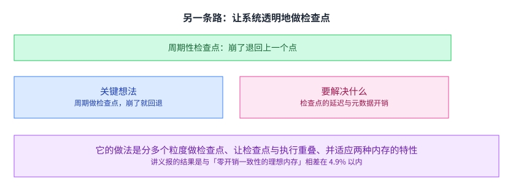

它要解决的是检查点自己的开销。讲义列了三招：在多个粒度上做检查点（同时压低检查点的延迟与元数据开销）、让检查点与执行重叠、以及适应两种内存各自的特性。

它报的结果是：与「零开销一致性的理想内存」相比，性能差距在 4.9% 以内。

这个数字的参照物选得很讲究。它比的不是「比不加一致性快多少」，而是「比一个不需要付一致性代价的理想内存慢多少」——后者才是真正要证的命题：**透明的一致性并不是靠牺牲性能换来的。** 如果把参照物换成不做一致性的版本，那么再快的方案也只能说明「代价可接受」，而说明不了「代价接近零」。

这一条与上一条的区别，正好是系统设计里的一对经典取舍：把负担放在程序员身上（灵活但要改写），还是放在系统身上（透明但系统要承担开销）。 ThyNVM 选了后者，而它要证明的就是「后者也不慢」。

[[term:abstraction]] 在这里的作用也清楚了：显式接口是把一致性做成一个程序员要调用的抽象，而检查点是把一致性做成一个程序员看不见的抽象。

## 挑战二与挑战三：好不好写、安不安全

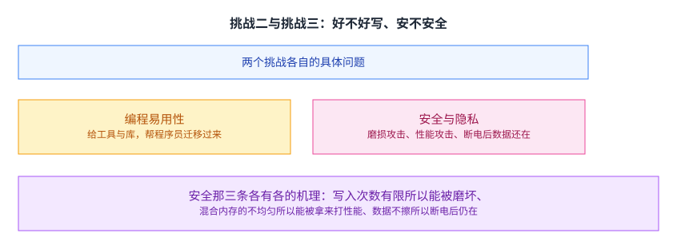

第二个挑战是编程易用性：怎么让程序员真的用上持久性。讲义给的方向是工具与库，代表工作是 NVMove（帮程序员把代码迁到按字节的持久性上）。

第三个挑战是安全与隐私，讲义列了三条，每条机理不同：

- 写入次数有限，所以能被磨坏。 非易失内存的擦写寿命有限，一个攻击者可以通过反复写同一块把它磨废。
- 混合内存各层不一样，所以能被拿来打性能。 如果快慢两层是分开的，那么把热点数据挤到慢的那一层就能拖垮别人。
- 断电后数据还在，所以有隐私问题。 传统上断电就等于清空，而持久内存不会自己擦掉。

第三条是最容易被忽略的：它不是一个「谁攻谁防」的问题，而是「一个过去被默认成立的性质不再成立」的问题。系统里很多设计都隐含地假设了「断电即清空」，而这个假设在这里失效了。

## 讲义的结论与它给的原则

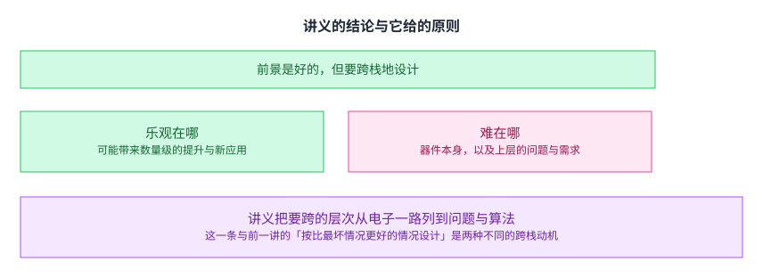

讲义对前景是乐观的，同时它强调困难不只在器件本身，也在上层的问题与需求上。它给的做法是要跨栈地思考，并设计能把技术用起来的系统。

它把要跨的层次列成了一长串：从电子、器件、逻辑、问题与算法，一直到微体系结构与软硬件接口。[[term:cross-layer]] 这个词在这里被用足了：器件变了，跟着要变的是一整条栈，而不只是器件那一层。

这一条与前一讲的跨栈动机不同。 前一讲（Lecture 8b）跨栈是为了「按比最坏情况更好的情况来设计」，动机来自硬件内部的差异；这一讲跨栈是因为一个新器件把上下两层的分工整个打乱了，动机来自接口。

## 还留着哪些值得做的问题

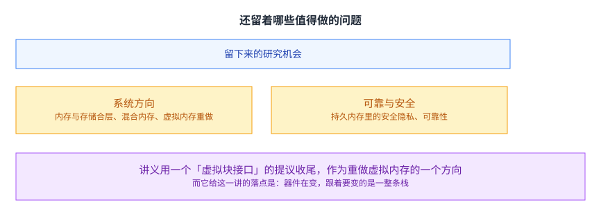

讲义最后列了一串研究机会：内存与存储合层的系统、在非易失内存里做计算、混合内存系统、持久内存里的安全与隐私、可靠性与寿命问题，以及为非易失内存重做虚拟内存。

它用一个提议收尾：既然底层设备已经换了，那么沿用了很多年的虚拟内存框架也值得重新设计。讲义举的方向是一个「虚拟块接口」，作为对传统虚拟内存框架的一个替代方案。

这个收尾的方式值得留意：它没有停在「这些技术很有前途」，而是指出一个被沿用太久、以至于没人再问它为什么长这样的框架。合层讲到最后，问出来的问题落在了虚拟内存上。

讲义对这个方向的判断是，传统的虚拟内存框架里有些设计是为了当年那些约束才长成那样的（比如页大小、比如地址翻译的粒度），而那些约束在今天已经变了。讲义举的替代方向叫**虚拟块接口**：换一种粒度与抽象来组织地址空间与数据放置。它在这一页只是提议，不是结论，但它是这一讲思路的延续：**器件换了，就值得回头问一遍旧抽象为什么长这样。**

## 读完应该能回答

1. 新兴内存打开了哪四类机会，这一讲讲的是哪一类。
2. 两层存储模型为什么在持久存储变快之后成了瓶颈。
3. 「合层」在接口这一层具体意味着什么，它带来哪三方面的好处。
4. 统一接口为什么没有消掉异构，放置数据要看哪两个应用性质。
5. 崩溃一致性问题的形状是什么，讲义把它收成了哪个范围问题。
6. 显式接口这一类解法拿到了什么、付出了什么，为什么它限制了普及。
7. 讲义的方案换的是哪个方向，它的三招分别解决什么。

## 溯源

- 对应：ETH Zürich Computer Architecture（Onur Mutlu 主讲，Fall 2022），Lecture 13a — Emerging Memory Technologies II。
- 讲义链接：<https://safari.ethz.ch/architecture/fall2022/lib/exe/fetch.php?media=onur-comparch-fall2022-lecture13a-emergingmemorytechnologies-ii-afterlecture.pdf>
- 上游许可：站点级页脚为 CC BY-NC-SA 4.0。SA 是传染性的，所以本页译文也以同协议发布、且为非商业用途。本页未转载原讲义里的任何图片，配图全部自绘；只有图没有字的页，本页只如实记下标题。
- 证据来源：`_sources/eth-ddca-ca/evidence/eth-ca2022-lecture13a-emergingmemorytechnologies-ii.pdf.pypdfium2.txt`（`pypdfium2`，48 页）。三道核验：4,393,227 字节、尾部有 `%%EOF`、不是 2 的整数次幂。
- 一处关于讲义形态的说明：这一讲的**上篇是三周前的 Lecture 12b**，本仓库尚未收录，所以本页是自足地讲的；需要承接上文的地方（例如「上篇讲器件本身」）已按讲义自己的说法写出，没有替上篇补内容。
- 本讲取材范围是讲义的全部正文（p1 到 p48，讲义没有附录分节）。包括：新兴技术打开的四类机会；两层存储模型在持久存储变快后成为瓶颈；把内存与存储管理合成一层这个目标、以及持久内存管理器；统一接口与持久数据映射；异构设备之间的数据放置与要看的两条应用性质；单层存储的性能与能耗收益；两件 2019 年的真实产品（非易失主存与处理在内存引擎）；崩溃一致性问题的形状与它被收成的范围问题；显式接口这一类解法及其代价；ThyNVM 的做法、三招与 4.9% 这个结果；编程易用性这一挑战与工具库方向；安全与隐私的三条问题及其机理；讲义的结论与要跨的层次；以及最后列出的研究机会与虚拟内存重做这个提议。
- 数字与定义以讲义页面为准。讲义未展开的推论属于 CourseLingo 的讲解。这类推论分三组：把三类挑战之间的关系讲成「负担放在程序员身上还是系统身上」这组取舍；把「过去不成问题、底下变快之后才成问题」抽成瓶颈转移这个形状，并指出它与前一讲跨栈动机的不同；以及把安全那第三条讲成「一个过去被默认成立的性质不再成立」。本讲与前后讲次的对应关系属于我们的编排。
- 一处说明：讲义有多页是图示与短句并列（例如第 3、20、21 页只有标题与图），文字层只留下标题与零散标签；本页只依据可见文字描述，未依据图示复原结构，也未替讲义补公式或数字。
