+++
title = "内存干扰与服务质量：谁来给共享的内存排个队"
lecture = 18
slug = "lecture13b-memory-controllers-ii"
status = "draft"
source_kind = "notes"
source_url = "https://safari.ethz.ch/architecture/fall2022/lib/exe/fetch.php?media=onur-comparch-fall2022-lecture13b-memorycontrollers-ii-performance-interference-qos-afterlecture.pdf"
source_title = "Lecture 13b: Memory Controllers II: Performance, Interference, QoS (Fall 2022, afterlecture)"
output_mode = "explanation"
+++

> 来源课程：ETH Zürich Computer Architecture（Onur Mutlu 主讲，Fall 2022）；
> 对应讲义：Lecture 13b — Memory Controllers II（`onur-comparch-fall2022-lecture13b-memorycontrollers-ii-performance-interference-qos-afterlecture.pdf`，315 页，正文 p1 到 p180）；
> 讲义链接：<https://safari.ethz.ch/architecture/fall2022/lib/exe/fetch.php?media=onur-comparch-fall2022-lecture13b-memorycontrollers-ii-performance-interference-qos-afterlecture.pdf> ；
> 上游许可：该课程 wiki 每一页的页脚都带站点级许可块，原文为 CC BY-NC-SA 4.0：<https://creativecommons.org/licenses/by-nc-sa/4.0/deed.en> ；
> 本页由 CourseLingo 用中文重新讲解，按源讲义的推进顺序组织，不是逐字翻译，也不转载原讲义里的任何图片；
> 页内配图全部由我们自绘；原讲义里只有图、没有字的页，我们只如实记下它的标题。
> 本页为非官方材料，与 ETH Zürich 及课程教学团队无隶属关系；如与原文有出入，以原文为准。

本页的事实来自 `_sources/eth-ddca-ca/evidence/eth-ca2022-lecture13b-memory-controllers-ii.pdf.pypdfium2.txt`（pypdfium2 抽取，315 页，113,009 字符），交叉核对用同名的 `.pdf.pypdf.txt`（pypdf 抽取，315 页，108,523 字符）。抽取器是 `_sources/_audit/pdftext_alt.py`。该 PDF 入库前按四道核验过完整性：体积 13,005,857 字节、尾部有 `%%EOF`、不是 2 的整数次幂、也不是 64 KiB 的整数倍（余数 29,729）。仓内自研的 `pdftext*.py` 这一族在前几讲已被实测为不可靠，本页没有采用它们的任何输出。

## 这一讲要解决什么问题

第 13 讲把[[term:memory-controller]]这个部件讲了一遍：它要同时管正确性、请求、调度与功耗，调度上最常用的是 FR-FCFS，最后落到「能不能让它自己学」。那一讲的备份页里有一组讲内存干扰与服务质量，当时只指了路，没有展开。

这一讲展开的就是那一块：共享带来的[[term:interference]]与服务质量。讲义自己也是这么安排的：开头 p3 到 p14 全部标着 `Recall:`，复习的正是第 13 讲的定时约束、异构主体、性能函数、自优化控制器与「由数据驱动」的那一串判断。也就是说，两讲共用同一个部件，第 13 讲问「这个部件怎么工作」，这一讲讲「多个线程一起用它的时候会发生什么」。

问题一句话就能说清：[[term:DRAM]] 系统被很多线程共享，但它不区分这些线程的请求。讲义在第 27 页把这层意思拆成四条：现有内存系统对请求是「先到先得、按需分配」；控制算法不知道线程、也不对线程公平；激进的线程可以让别人得不到服务；系统根本不打算减少或控制线程之间的干扰。

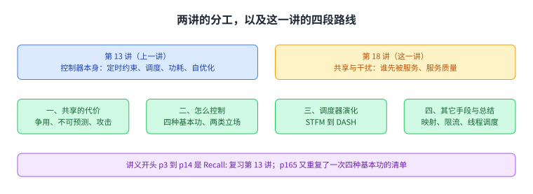

图里上面是两讲的分工，中间四格是这一讲的四段路线，最下面一条说明讲义开头那几页为什么标着 `Recall:`。

## 共享是必要的，代价是不受控的干扰

讲义先讲共享为什么必要（p18）。把一份硬件资源独占给一个上下文，改成让多个上下文共用，收益有三条：利用率和效率提高，也就是吞吐上去；通信延迟降低，比如共享数据留在同一个缓存里；以及它与共享内存模型天然兼容。

代价接着列在 p19。共享会产生资源争用：资源不空闲时别的线程就用不上，空间被别人占了就得重新占。后果是一串：线程的性能可能比自己独占时更差；性能隔离消失，同一次运行的结果取决于同跑的线程；不受控的共享会降低服务质量，带来不公平与饥饿。

讲义用共享缓存举了一个小例子（p20 到 p22，出自 2004 年 PACT 上的一篇工作）。两个核共享二级缓存，一个线程把[[term:cache]]占满，另一个线程的吞吐就显著下降。这个例子的意义在于它和内存控制器无关：只要资源是共享的，同一类问题就会出现。

p23 回答「为什么不可预测的性能是坏事」。它让程序员难做，一个调优过的程序可能只拿到很低且波动很大的性能，因为这取决于同跑者；它让用户难受，一个重要程序可能被饿死；它也让系统管理难做，硬件资源共享不受控时，服务水平协议根本无法执行。

p24 把选择摆出来：共享提高吞吐，划分提供性能隔离，而划分靠的是专用空间。讲义的问法是能不能两者兼得，它自己给的方向是把共享资源设计得既高效可利用，又可控、可划分。

p25 与 p26 把这件事的分量点出来：系统里大部分东西都在存储和搬运数据，所以内存系统是主要的共享[[term:bandwidth]]资源，而且未来会更主要。

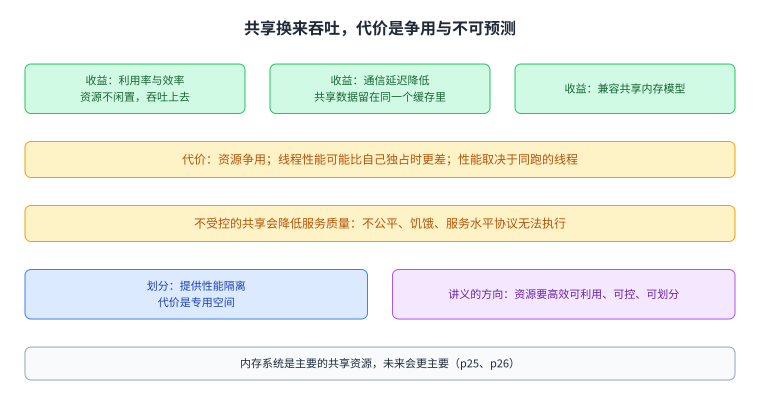

图里左边是共享的三条收益，右边是它带来的争用与后果，下面一条是讲义给的方向：把资源设计得既可高效利用，又能控制和划分。

## 一个具体的干扰：内存性能攻击

讲义在 p28 到 p33 用一组对照把干扰讲成了可以量化的东西。这组工作出自 2007 年的 USENIX Security，标题就叫「内存性能攻击」。

先看两个线程的性格（p30）。STREAM 顺序访问内存，行缓冲命中率高达 **96%**，内存密集。RANDOM 随机访问，行缓冲命中率只有 **3%**，同样内存密集。两者跑在同一个共享内存系统上。

p31 解释会发生什么。行大小是 8 KB，缓存块是 64 B，所以一行对应 **128** 个请求。拿到行缓冲的线程可以连续把这些请求服务完，另一个线程只能等。也就是说，FR-FCFS 这个为了最大化吞吐而设计的策略（p32：行命中优先，然后最老的优先），在多线程场景下会把行缓冲的收益全部给一个线程。

p33 给出实测。在 Intel Pentium D 上跑 Windows XP：STREAM 只被拖慢 **1.18 倍**，RANDOM 被拖慢 **2.82 倍**。同样的现象在 Intel Core Duo、AMD Turion 与 Fedora Linux 上也能看到。一个顺序访问的线程让一个随机访问的线程慢了将近三倍，而两者对内存的需求是同一量级。

p34 与 p35 把这个后果推到系统层面：容易遭到拒绝服务；无法执行优先级与服务水平协议；系统性能低下。结论是系统变得不可控、不可预测。

p36 给了另一个方向的数字。在网络化的多核系统里，8 个核作为攻击者，可以让另外 56 个核上跑的期权定价应用延迟增加约 **5000 倍**。p39 用马斯洛的需求层次图说明，缺乏服务质量不只是性能问题，它可以是安全与保障问题。

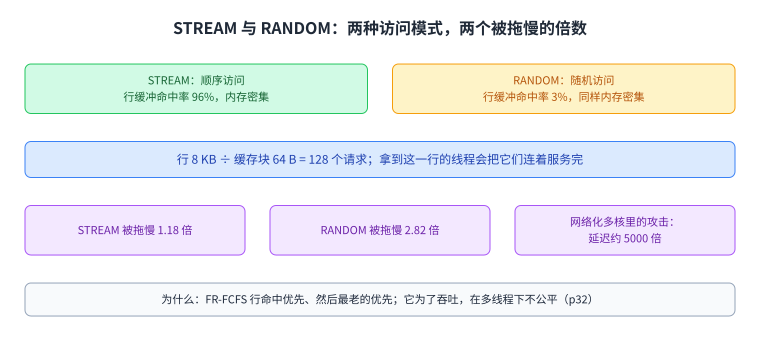

图里上半是两种访问模式的差别，中间是那 128 个请求为什么会被一个线程连着拿走，下半是实测的两个倍数。这组数字就是整讲后面所有方案要对付的东西。

## 怎么控制：两类资源与四种基本功

讲义在 p40 把问题定位清楚：干扰在所有内存资源里都不受控，包括内存控制器、互连与缓存。所以要设计一个干扰感知、也就是服务质量感知的内存系统。

p41 列出三个挑战。怎么减少干扰：提高系统性能与核心利用率，减少请求串行化与核心饥饿。怎么控制干扰：给系统软件提供执行服务质量策略的机制，同时保持高系统性能。怎么让它可配置：提供灵活的机制去达成多种目标，需要公平时给公平，需要吞吐时给吞吐，需要性能保证时给保证。

p42 给出两类做法。一类是**聪明的资源**：把每个共享资源设计成自带可配置的干扰控制机制，包括服务质量感知的内存控制器、互连与缓存。另一类是**笨的资源**：资源本身保持先到先得，改用注入控制或数据映射来减少干扰，包括源限流、服务质量感知的数据映射、以及服务质量感知的线程到核调度。

p43 把手段收成四种基本功，这也是整讲的骨架：一是优先级或请求调度；二是数据映射到存储体、通道、rank；三是核或源限流；四是应用或线程调度。讲义在最后的总结页（p176）又把同样四条列了一遍，并加了一句判词：最好的是把四种组合起来用。

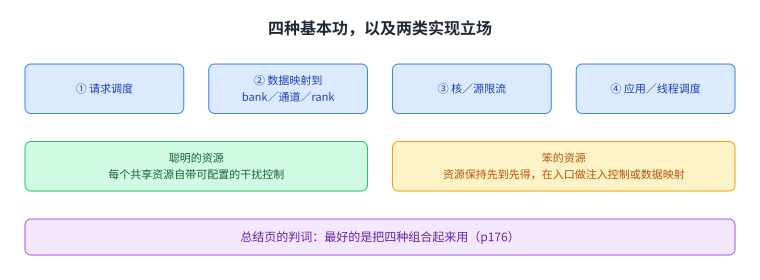

图里上半是四种基本功，下半是讲义给的两类实现立场。后面几节讲的调度器属于第一类基本功里的第一项。

## 调度器这十几年的演化

讲义从 p50 到 p56 用七页把这一条线上的工作排成一张年表，每一项都给了「想法」与「结论」两句话。这张年表本身就是这一讲的目录。

最前面两项是同一组作者的两篇：2007 年 MICRO 上的 STFM，用估计并拉平线程减速比的办法换[[term:fairness]]；2008 年 ISCA 上的 PAR-BS，用线程排名加请求分批，既保并行度又防饥饿。接着是 2010 年 HPCA 上的 ATLAS，优先服务从内存子系统拿到服务最少的线程；2010 年 MICRO 上的 TCM，把线程分成两类、对不同类用不同策略；2011 年 MICRO 上的整合通道划分与调度；2011 年 MICRO 上的 PAMS，处理并行应用里的 limiter 线程；2012 年 ISCA 上的 SMS，把调度器的功能拆成多级；2013 年 HPCA 上的 MISE 与 2015 年 MICRO 上的 ASM，做减速模型；2014 年 ICCD 上的 BLISS，用黑名单代替完整排名；2016 年 TACO 上的 DASH，处理有截止时间的硬件加速器。

年表里还挂着几条支线：预取感知的共享资源管理、DRAM 感知的末级缓存与写调度、面向 NVM 的写读优先级、面向 GPU 的 criticality 感知调度、以及面向实时系统的按最坏执行时间调度。

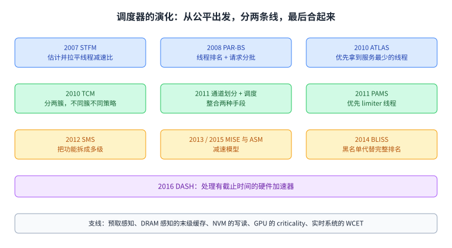

图里按年份把主干排成一条阶梯，每级一句「它想解决什么」。后面四节分别展开其中最有代表性的几项。

## STFM：把「减速比」拉平

STFM 出自 2007 年 MICRO，标题就是「给片上多处理器的停机时间公平访存调度」（p57）。

它先把公平定义清楚（p60）。一个 DRAM 系统是公平的，如果它让同等优先级的线程相对于各自单独运行时的减速比相等。减速比用的是与 DRAM 相关的停机时间：一个线程花在等 DRAM 上的时间，在共享时记作 STshared，单独运行时记作 STalone，两者的比值就是内存减速比，也就是停机时间相对增加了多少。

算法本身是一个带阈值的开关（p61）。控制器为每个线程跟踪 STshared、估计 STalone，每个周期算出各线程的减速比，再取最大值与最小值的比作为不公平度。如果这个比值小于阈值 α，就用面向吞吐的策略；如果大于等于 α，就切到面向公平的策略：先服务减速比最大的线程，然后行命中优先，最后最老的优先。

讲义给它列了两面（p63）。正面：它是第一个专门为多核做公平访存调度的算法；它提供了一个估计线程内存减速的机制；它在公平上做得很好；而且公平本身也能提升性能。反面：它不处理所有类型的干扰；实现复杂；减速比的估计可能不准。

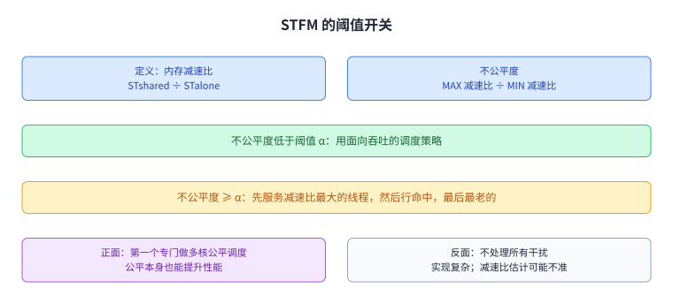

图里是一个阈值开关，两种策略各有各的目标。把它放在演化表的最前面，是因为后面几项都在回答它留下的那两个反面的问题。

## PAR-BS：把线程的存储体并行度保住

PAR-BS 出自 2008 年 ISCA，标题写明了它的目标：同时提升共享 DRAM 系统的性能与公平（p65）。

它从一个和公平有关、但方向不同的问题出发（p66）。处理器为了容忍 DRAM [[term:latency]]，会让多个请求同时在途，这叫内存级并行。这件事只有在控制器真的把这些请求并行地送到不同存储体上时才有效。而控制器并不知道线程的并行度，于是可能把一个线程的多个请求串行地服务掉。

p67 到 p69 用两张时序图把代价量出来。单个线程发出两个去往不同存储体的请求时，两个请求的延迟可以重叠，线程只等大约**一个**存储体的访问延迟。两个线程各发两个请求时，基线调度器会把两个线程的访问串起来，每个线程要等大约**两个**访问延迟。换成并行度感知的调度器之后，平均停机时间回到大约 **1.5 个**访问延迟。

它的做法是两条原则（p70）。第一条是并行度感知：把一个线程发往不同存储体的请求背靠背地服务，保住它自己的并行度，但这样做可能造成饥饿。第二条是请求分批：把每个线程最老的一批请求组成一个批次，服务完这一批再换下一批，这样饥饿被消除，而批次内部仍可以做并行度感知。

具体组件有两个（p71 到 p77）。请求分批靠每个请求上的一个标记位：每个存储体对每个线程标记最多 Marking-Cap 个最老请求，被标记的请求构成当前批次，批次里没有标记请求时就形成新批次，批次之间不重排。批次内部可以用任何既有策略，但要保住线程内的并行度，所以在形成批次时给线程排一次名：最短停机时间优先，先比较各线程在任一存储体上的最大标记请求数，再比较标记请求总数，前者小、后者小的排前面。讲义注明这个排名取自 1956 年 Smith 的最短作业优先结论，能给出最优吞吐。

最终策略是四条规则的叠加（p78）：标记的请求优先；行命中优先；排名高的线程优先；最后是最老的优先。它的代价很小：8 核、128 项请求缓冲的配置下，存储开销不到 **1.5 KB**，没有除法之类的复杂运算，而且不在关键路径上，因为调度器每个 DRAM 周期才决策一次（p79）。

结果给在 p80 与 p81：4 核、8 核、16 核上的不公平度改善分别是图上的 **1.11X**、**1.08X**、**1.11X**，Hmean 加速比提升是 **8.3%**、**6.1%**、**5.1%**。讲义给它的两面是（p82）：正面，它是第一个处理多线程之间存储体并行度被破坏这一问题的调度器，机制比 STFM 简单，分批带来公平，排名带来并行度感知；反面，它并不总是优先延迟敏感的应用。

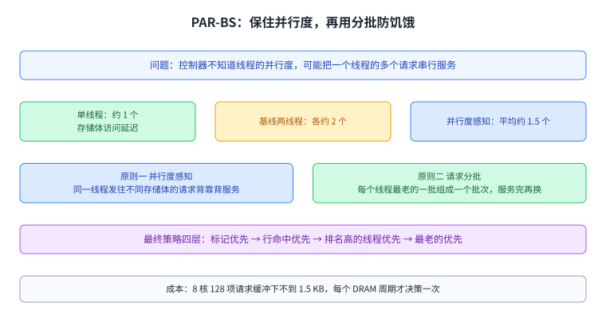

图里上半是两条原则，下半是最终策略的四层判断顺序。这一讲后面几个调度器，做的都是把「先服务谁」这件事分得更细。

## ATLAS 与 TCM：先服务谁，以及把线程分成两类

ATLAS 出自 2010 年 HPCA，目标单一，就是把系统性能做上去（p88）。它的想法是优先服务从内存控制器拿到服务最少的线程，名字里那句话就是这个意思。它之所以有效，是因为这样会优先照顾「轻」的、内存不密集的线程，而这些线程更可能让自己的核心保持忙碌。它的两面是（p91）：正面，吞吐提升明显，复杂度低，控制器之间的协调不频繁；反面，排名最低与中等的线程会被显著延迟，不公平度高。讲义在第 89 与第 90 页给了两页吞吐曲线，纵轴是系统吞吐，图上标的提升幅度从 3.5% 一直到 17.0%。

TCM 出自 2010 年 MICRO，要解决的问题正好是 ATLAS 留下的那一个（p94）。讲义的判断是：此前没有任何内存调度算法能同时给出最好的公平与最好的系统吞吐。它给了一页散点图来说明，24 核、4 个内存控制器、96 个工作负载，每个点是一个工作负载，横轴是吞吐、纵轴是最大减速比，既有算法各自偏一边。

p95 解释了为什么会偏。如果只用一套策略：偏向吞吐的做法会优先照顾内存不密集的线程，结果是把密集型线程饿死，不公平；偏向公平的做法会让密集线程之间轮转，但它们没有被优先照顾，吞吐又上不去。结论是一句话：对所有线程用同一条策略是不够的。p96 提出思路：对吞吐，优先非密集线程；对公平，在密集线程之间打乱优先级，而且打乱要偏向那些「更不容易被干扰」的线程。

它的做法分三步（p97 到 p111）。第一步分簇：先按 MPKI 排序，再用内存带宽使用量把线程分成两簇，阈值 α 小于 **10%**，讲义把这条线叫 ClusterThreshold，落在它上面的是密集簇，下面的是非密集簇。第二步簇间：优先非密集簇，理由是这些线程更有推进的潜力，而且它们很少干扰密集线程，所以这么做不伤公平。第三步簇内分两套：非密集簇里按 MPKI 排名，最不密集的优先，这是为了吞吐；密集簇里周期性打乱优先级，这是为了公平。

密集簇里那句「周期性打乱」有一个细节值得单独记。p105 问，对所有线程一视同仁就够了吗，答案是不够，因为**相等的轮转不等于相等的减速**。p106 用两个线程做例子：同样密集的随机访问线程与流式访问线程互相争用时，谁被优先谁就快，而随机访问的那个更容易被拖慢。于是 p109 引入一个量来衡量线程之间的差别，把「容易被干扰」与「造成干扰」两件事合成它，容易受干扰的（存储体级并行度高、行缓冲局部性好）算「好说话」，反之算「不好说话」。运行上，TCM 按量子推进，一个量子约 **100 万周期**，量子开始时做分簇并计算好说话程度，量子内部每隔约 **1000 周期**打乱一次。调度算法最后也是三条（p111）：排名高的线程优先，然后行命中优先，最后最老的优先。

它的实现成本是 24 核下总计不到 **4 kbit**，其中 MPKI 约 0.2 kb、存储体级并行度约 0.6 kb、行缓冲局部性约 2.9 kb（p112）。系统软件这一侧留了两个口子（p116）：ClusterThreshold 可以调，操作系统用它换公平与吞吐；线程权重也能被强制执行，操作系统给权重，TCM 在每一簇内部落实。它自己的两面是（p118）：正面，公平与性能都高，照顾了延迟敏感与带宽敏感两类线程，而且相对简单；反面，能不能扩展到很大的请求缓冲、分簇与打乱够不够稳、排名是否还是太复杂，都是问号。

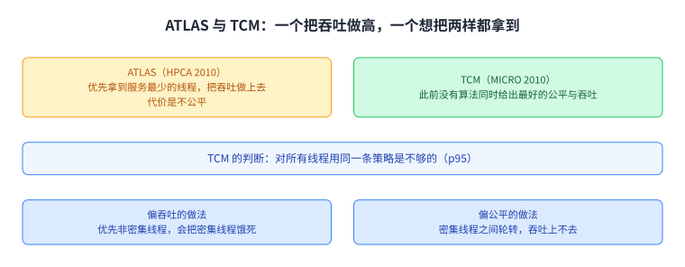

图里上半是两台策略各自的偏向与代价，下半是 TCM 用来换公平的那个量。它和 ATLAS 的关系是接续：一个把吞吐做高，另一个想把吞吐与公平同时拿到。

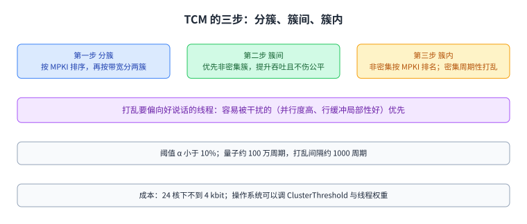

图里三步按顺序排开，第三步下面挂了那两个时间尺度。OS 能调的旋钮也在其中一条上。

## BLISS：不给全排名，只黑名单

BLISS 出自 2014 年 ICCD，它的出发点不是公平也不是吞吐，而是**复杂度**（p121 到 p123）。

p122 先说清代价从哪里来。应用感知的调度器要给请求按应用排名，而完整排名会显著增加关键路径延迟与面积。p123 把三个目标摆在一张图上：性能、公平、简单。既有的调度器要么简单但性能与公平都差，要么复杂。它的问题是，为了性能或公平，是不是必须放弃简单。

它的答案来自两个观察。观察一（p124）：把应用分成两组就够，一组是容易被干扰的，一组是造成干扰的，不需要完整排名。这样做有两个好处，复杂度比排名低，而且减速比完整排名还低。观察二（p126）：连续服务一个应用的大量请求会造成干扰。于是基本做法是：把连续请求多的应用归为造成干扰的一类，放进黑名单，降级它们，并且周期性地清空黑名单，周期是数千个周期。

它的结论页（p127 到 p129）给三句话：黑名单最接近理想；它同时拿到最高性能并平衡了性能与公平；它显著降低了复杂度，图上标的面积与关键路径改善是 **43%** 与 **70%**。

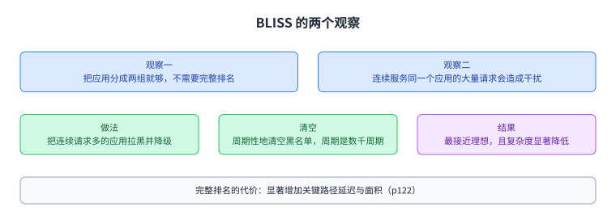

图里上半是两个观察，下半是它们各自换来的东西。这一节的位置在演化表的偏后段，回答的是「能不能不理解得更细，却做得更好」。

## 并行应用与异构系统

前面几节处理的是互相独立的应用。讲义在 p132 往后换了一个前提：同一个多线程应用内部的线程是互相依赖的。

p135 到 p138 把依赖的形态列清楚。线程之间会同步，手段有锁、屏障、流水线阶段与条件变量。有些线程会落在执行的关键路径上，有些不会。连同一个线程内部的代码段也有这个区别。三种典型的关键路径是：被争用的临界区，一次只能有一个线程进入，抢锁的线程就得等；屏障的最后一个到达者，其他线程都要等它；流水线里执行最慢那一段的线程。

PAMS 出自 2011 年 MICRO，它要回答的就是怎么给这些互相依赖的线程排请求（p139）。做法是先估计出可能在关键路径上的 limiter 线程，优先它们的请求，同时打乱非 limiter 线程之间的优先级以减少它们之间的干扰。limiter 的估计是软硬件协作的，三种线索分别对应上面三种关键路径：执行最争用临界区的线程，执行最慢流水线阶段的线程，以及在屏障上落后最多的线程。它的两面是（p141）：正面，提升了多线程应用的性能，提供了估计 limiter 线程的机制，也为多线程应用的减速估计开了一条路；反面，如果同时跑多个多线程应用怎么办，以及 limiter 估计本身可能很复杂。

异构系统这一侧的问题是同一件事的放大版（p147 到 p154）。现代 SoC 里有 [[term:CPU]]、GPU、[[term:accelerator]]与 DMA 引擎，它们共享内存，于是互相干扰。讲义在这一段挂了三项工作：SMS 把应用感知调度器的功能拆成多级，让每一级都显著简单于单体调度器，从而能扩展到很大的请求缓冲；DASH 处理有截止时间的硬件加速器，一边控制加速器的进度不要侵占别人，一边区分延迟敏感与带宽敏感的 CPU 负载；另有一项工作用一种双数据端口的 DRAM 把 CPU 与 IO 的流量隔开。

p155 到 p163 这一段讲的是可预测性能与强服务保证，标题就是这两件事。它同样先摆出异构主体的图，然后给出四篇延伸阅读，涉及用源限流提供公平、用服务速率模型给出性能可预测性、把减速模型扩展到缓存与内存两侧、以及 DASH。

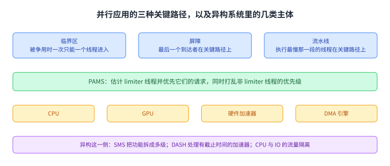

图里左边是并行应用的三种关键路径与对应的 limiter 线索，右边是异构系统里几类互相干扰的主体。这两块合起来说明：调度器要判断的不只是线程的性格，还有它此刻在不在关键路径上。

## 其它服务质量手段

四种基本功里，前面几节用的都是第一项，也就是请求调度。讲义在 p164 到 p174 把另外几项讲了一遍。

第二项是数据映射。内存通道划分把不同应用的数据放到不同通道上，从空间上减少它们之间的争用（p169，2011 年 MICRO）。

第三项是源限流。它不在内存这一侧排队，而是在请求的源头控制注入速率（p170 到 p172）。讲义挂了三项工作：一项用源限流在多核内存系统上提供可配置的公平；一项把自适应限流用到片上网络；还有一项从网络的角度研究片上网络的拥塞与可扩展性。

第四项是应用或线程调度。应用到这里，指的是把应用放到哪个核上跑（p173，2013 年 HPCA），以及虚拟机场景里按架构感知的方式做分布式资源管理（p174，2015 年 VEE）。

讲义在这一节末尾没有给结论，它在总结页上才把话说全。

图里把第二到第四项基本功各排一格。它们与请求调度的关系不是替代，而是可以叠加。

## 总结：没有单一最好的手段

讲义从 p175 开始收尾，一共四页。

p176 又把四种基本功列了一遍，并补一句：最好的是把四种组合起来用，紧接着问了一句「你会怎么做」。p177 把做法分成聪明资源与笨资源两类：聪明资源这一侧的代表是[[term:QoS]] 感知的[[term:memory-scheduling]]，笨资源这一侧的代表是源限流与通道划分。它给的三条判断是：两类做法都能有效减少干扰；不存在对所有工作负载都最好的单一做法；组合起来的手段与技术最有力，并且举了 2011 年那项把通道划分与调度整合起来的工作当例子。

p178 把整讲的因果收成三句：服务质量不感知的内存会带来不可控、不可预测的系统；加上服务质量感知之后，性能、可预测性、公平与利用率都会改善；为此需要很多新技术，也需要把软硬件之间的交互补上。

p179 列了没讲的：预取感知的共享资源管理、与 DRAM 控制器的协同设计、缓存侧的干扰管理、互连侧的干扰管理、写读调度、为减少干扰而做的 DRAM 设计、以及[[term:processing-in-memory]]里的干扰与服务质量。p180 给了未来：面向异构 SoC 的内存服务质量技术、把多种技术组合起来、用机器学习来管理资源，以及做真实的原型。

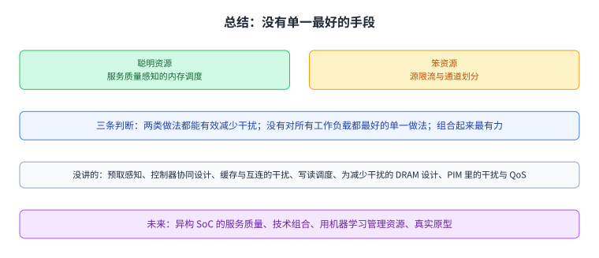

图里上面是讲义给的三条判断，下面两格是它自己列出的缺口与未来方向。

## 读完应该能回答

1. 讲义为什么说共享是必要的，它列出的收益与代价各有哪几条。
2. 共享缓存那个例子想说明什么，为什么它和内存控制器无关。
3. STREAM 与 RANDOM 在行缓冲命中率上差多少，一行对应多少个请求，最后两个线程被拖慢的倍数各是多少。
4. FR-FCFS 为什么在多线程下不公平，四种基本功又分别是什么。
5. STFM 用什么量定义公平，它的阈值开关在两种情况下分别走哪条路。
6. PAR-BS 的两条原则各解决什么问题，最终策略的四层判断顺序是什么。
7. TCM 为什么说对所有线程用一条策略是不够的，它的三步分别为了什么。
8. BLISS 的两个观察各是什么，并行应用的三种关键路径又是什么。

## 脉络回顾

这一讲接着第 13 讲讲同一个部件的另一面：多个线程一起用它的时候会发生什么。第 13 讲问它怎么工作，这一讲讲共享带来的干扰与服务质量。

共享本身是必要的，它换来吞吐与更低的通信延迟，代价是争用、性能隔离的消失与不可预测。讲义用一个具体的对照把代价量化：顺序访问的 STREAM 行缓冲命中率 96%，随机访问的 RANDOM 只有 3%，一行 8 KB 对应 128 个请求，最后 STREAM 只被拖慢 1.18 倍而 RANDOM 被拖慢 2.82 倍；在网络化多核里，这种攻击可以把另一个应用的延迟放大到约 5000 倍。

控制手段有四种基本功：请求调度、数据映射、源限流、应用或线程调度；实现立场有两类：让每个资源自己变聪明，或者让资源保持笨、在入口处管。讲义自己的判断是没有单一最好的手段，组合最有力。

主干是调度器的演化。STFM 用估计并拉平线程减速比来换公平，代价是实现复杂、估计可能不准。PAR-BS 保住线程自己的存储体并行度，并用请求分批消除饥饿，四条规则的叠加只有不到 1.5 KB 的存储开销。ATLAS 优先服务拿到服务最少的线程，把吞吐做上去，代价是不公平。TCM 把线程分成两簇，簇间偏向非密集簇换吞吐，簇内周期性打乱换公平，并且用「好说话程度」让打乱偏向更脆弱的那种线程。BLISS 换了个角度，不做完整排名，只用「连续请求多」这一个特征把应用分成两组并周期性拉黑，用复杂度换到了性能与公平。再往后是并行应用的 limiter 线程、异构系统里的加速器与可移动的截止时间、以及可预测性能这一条线。

## 溯源

- 对应：ETH Zürich Computer Architecture（Onur Mutlu 主讲，Fall 2022），Lecture 13b — Memory Controllers II: Performance, Interference, QoS。
- 讲义链接：<https://safari.ethz.ch/architecture/fall2022/lib/exe/fetch.php?media=onur-comparch-fall2022-lecture13b-memorycontrollers-ii-performance-interference-qos-afterlecture.pdf>
- 上游许可：站点级页脚为 CC BY-NC-SA 4.0。**SA 是传染性的**，所以本页的译文也以同协议发布、且为非商业用途。本页未转载原讲义里的任何图片，配图全部自绘。
- 证据来源：`_sources/eth-ddca-ca/evidence/eth-ca2022-lecture13b-memory-controllers-ii.pdf.pypdfium2.txt`（pypdfium2 抽取，315 页，113,009 字符），交叉核对用同名的 `.pdf.pypdf.txt`（pypdf 抽取，315 页，108,523 字符）。抽取器是 `_sources/_audit/pdftext_alt.py`。四道完整性核验：13,005,857 字节、尾部有 `%%EOF`、不是 2 的整数次幂、不是 64 KiB 的整数倍。仓内自研的 `pdftext*.py` 这一族在前几讲已被实测为不可靠，本页没有采用它们的任何输出。
- **与第 13 讲的分工**（正文第一段已显式回指）：第 13 讲讲控制器这个部件本身，包括定时约束、调度策略、行缓冲与功耗、以及强化学习式的自优化；其中干扰与服务质量只在溯源里指了路。这一讲展开的正是那一块：共享的收益与代价、干扰怎么被量化、四种基本功、以及调度器从 2007 年到 2016 年的演化。讲义自己的开头 p3 到 p14 也标着 `Recall:` 复习第 13 讲，p165 又重复了一次四种基本功的清单，两讲的衔接是讲义安排的。
- 本讲取材范围是讲义的正文 p1 到 p180。p181 起是讲义自己标注的 Backup Slides（p185 与 p195 是 SMS 与 DASH 的执行摘要，p308 到 p311 是总结页的重复），不计入本页。讲义里只有标题、图或出处的页：分节页 p2、p8、p16、p48、p86、p147、p155、p164、p175；图片页 p17、p20 到 p22、p25、p26、p28、p29、p31、p33、p36、p39、p43、p60、p62、p67 到 p69、p74、p77、p80、p81、p89、p90、p94 到 p97、p106、p107、p110、p114、p115、p122 到 p129、p135 到 p140、p148、p149、p156、p176 到 p178、p180；纯链接与出处页 p15、p37、p38、p44 到 p47、p50 到 p56、p57、p64、p65、p83 到 p85、p87、p92、p93、p119 到 p121、p130 到 p134、p141 到 p146、p150 到 p154、p157 到 p163、p166 到 p174、p179。这些页本页只登记标题、主题或出处，没有替它们复原内容。
- 数字与定义以讲义页面为准：STREAM 的 96% 与 RANDOM 的 3%、行 8 KB 与缓存块 64 B 推出的 128 个请求、1.18 倍与 2.82 倍、约 5000 倍、PAR-BS 的不到 1.5 KB 与约 1.5 个访问延迟、TCM 的 α 小于 10% 与不到 4 kbit（0.2／0.6／2.9 kb）与约 100 万周期与约 1000 周期、BLISS 的数以千计周期。**有三组数字是从图上标签读出来的，讲义正文没有复述**，本页按图标注：PAR-BS 的 1.11X／1.08X／1.11X 与 8.3%／6.1%／5.1%（p80、p81）；ATLAS 的 3.5% 到 17.0%（p89、p90）；BLISS 的 43% 与 70%（p129）。
- 讲义未展开的推论属于 CourseLingo 的讲解。这类推论有三组：把第 13 讲与第 18 讲的分工写成「同一个部件的两面」，并把 p3 到 p14 的 `Recall:` 读成讲义自己的衔接安排；把 p95 的「对所有线程用同一条策略是不够的」与 p96 的思路合起来讲成分簇动机；以及把四种基本功与后面几节的一一对应关系写清楚（调度对应 p57 到 p146，数据映射对应 p169，源限流对应 p170 到 p172，应用与线程调度对应 p173 与 p174）。
