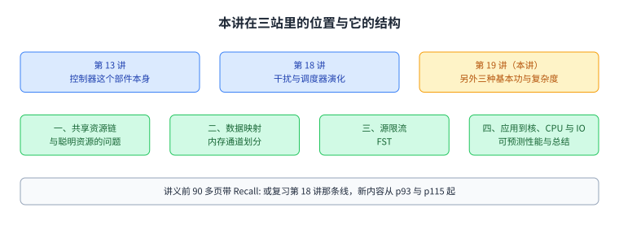
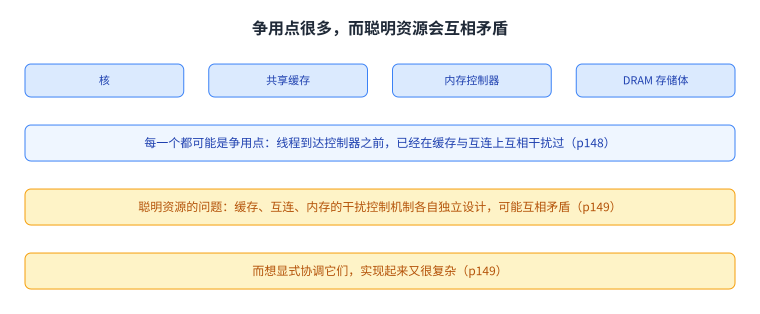
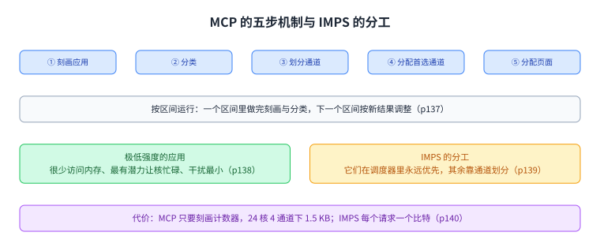
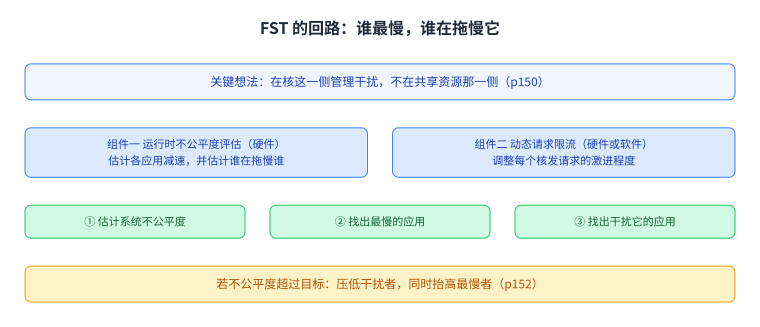
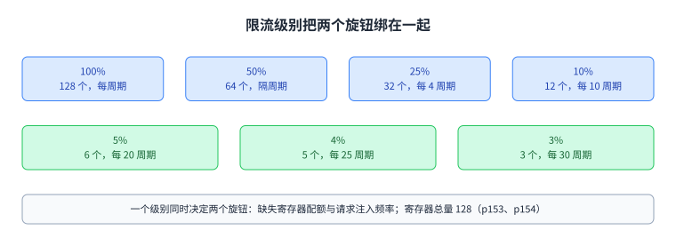
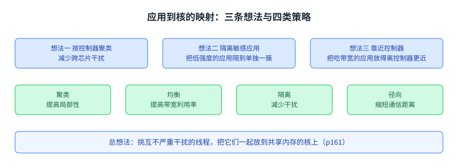
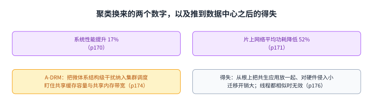
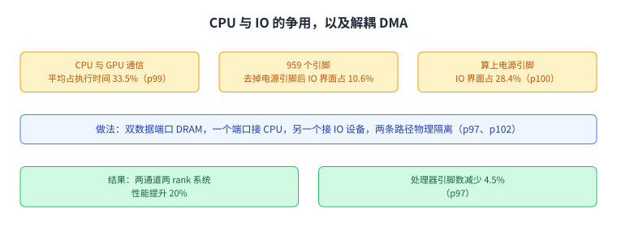
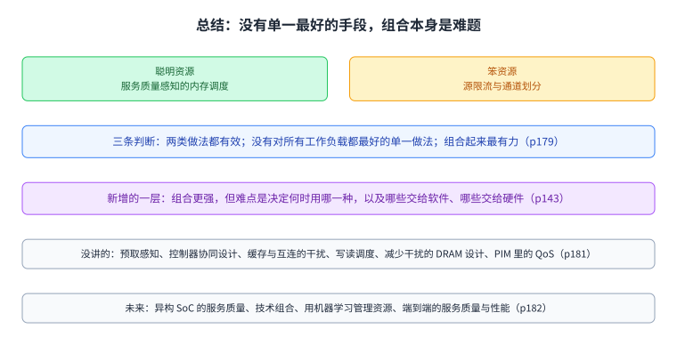

+++
title = "内存争用：把四把工具都用上，还要让它们不打架"
lecture = 19
slug = "lecture15-memory-contention"
status = "draft"
source_kind = "notes"
source_url = "https://safari.ethz.ch/architecture/fall2022/lib/exe/fetch.php?media=onur-comparch-fall2022-lecture15-memorycontention-performance-qos-complexity-afterlecture.pdf"
source_title = "Lecture 15: Memory Contention: Performance, QoS, **Complexity** (Fall 2022, afterlecture)"
output_mode = "explanation"
+++

> 来源课程：ETH Zürich Computer Architecture（Onur Mutlu 主讲，Fall 2022）；
> 对应讲义：Lecture 15 — Memory Contention: Performance, QoS, Complexity（`onur-comparch-fall2022-lecture15-memorycontention-performance-qos-complexity-afterlecture.pdf`，271 页，正文 p1 到 p183）；
> 讲义链接：<https://safari.ethz.ch/architecture/fall2022/lib/exe/fetch.php?media=onur-comparch-fall2022-lecture15-memorycontention-performance-qos-complexity-afterlecture.pdf> ；
> 上游许可：该课程 wiki 每一页的页脚都带站点级许可块，原文为 CC BY-NC-SA 4.0：<https://creativecommons.org/licenses/by-nc-sa/4.0/deed.en> ；
> 本页由 CourseLingo 用中文重新讲解，按源讲义的推进顺序组织，不是逐字翻译，也不转载原讲义里的任何图片；
> 页内配图全部由我们自绘；原讲义里只有图、没有字的页，我们只如实记下它的标题。
> 本页为非官方材料，与 ETH Zürich 及课程教学团队无隶属关系；如与原文有出入，以原文为准。

本页的事实来自 `_sources/eth-ddca-ca/evidence/eth-ca2022-lecture15-memory-contention.pdf.pypdfium2.txt`（pypdfium2 抽取，271 页，97,357 字符），交叉核对用同名的 `.pdf.pypdf.txt`（pypdf 抽取，271 页，96,513 字符）。抽取器是 `_sources/_audit/pdftext_alt.py`。该 PDF 入库前按四道核验过完整性：体积 7,060,980 字节、尾部有 `%%EOF`、不是 2 的整数次幂、也不是 64 KiB 的整数倍（余数 48,628）。仓内自研的 `pdftext*.py` 这一族在前几讲已被实测为不可靠，本页没有采用它们的任何输出。

## 这一讲要解决什么问题

到这一讲为止，内存这条线已经走了三站。第 13 讲讲[[term:memory-controller]]这个部件本身：它要同时管正确性、请求、调度与功耗，以及能不能让它自己学一套调度策略。第 18 讲讲[[term:interference]]与[[term:QoS]]：共享的内存为什么会让线程互相拖慢，怎么把这件事量化，以及调度器从 2007 年到 2016 年的演化。这一讲把剩下那三把工具单独展开，并且正面处理一个到那时才浮出来的问题：这些手段放在一起会互相打架。

讲义的标题把这个重点写在明处：Memory Contention 后面跟着三个词，Performance、QoS，以及 Complexity。它的第一条判词在第 178 页：四种基本功最好组合起来用，紧接着问了一句「你会怎么做」。第二条判词在第 143 页：组合多种干扰控制技术能比单一手段减少多得多的干扰，而**关键挑战是决定什么时候用哪一种，以及把哪些工作交给软件、哪些交给硬件**。

需要说明的是这一讲的取材结构。讲义前 90 多页大部分带 `Recall:` 或是在复习第 18 讲那条调度器演化线（ATLAS、TCM、BLISS、PAMS、SMS、DASH 都在），所以本页对那部分只做一句回指，不重复展开。真正的新内容从 p93 起：CPU 与 IO 的争用，以及第 18 讲只指了路的三种基本功各自展开成一节。

图里上面三格是三站的分工，下面四格是这一讲的结构。看这一页时可以把它当成第 18 讲的续集：那一讲把「先服务谁」讲透，这一讲讲「除了改顺序，还能做什么」。

## 争用发生在很多个共享资源上

讲义在第 148 页把共享资源排成一条链：核、共享[[term:cache]]、内存控制器、[[term:DRAM]] 的各个存储体。它们从片上一直排到片外，每一个都可能成为争用点。这也解释了为什么「把内存控制器做聪明」不能解决全部问题：线程在到达控制器之前，已经在缓存和互连上互相干扰过了。

第 149 页就是这一讲最要紧的一页之一，标题叫「聪明资源的问题」。它的意思是：缓存、互连、内存这三处的干扰控制机制是各自独立设计的，**它们之间可能互相矛盾**；而如果想显式地协调它们，实现起来又很复杂。于是讲义提出一个问题：怎么才能用一种协调的方式，控制整个内存系统的干扰，让它可以被公平共享。

这一页和上一节那条链合起来，是整讲的动机。四种基本功各自都能减少干扰，但它们各自的「聪明」加在一起不一定更好，因为它们可能同时对准同一个线程动手，或者互相抵消。

图里左边那条链是争用点，右边是聪明资源之间的冲突。本节与后面三节的关系是：三种基本功各解决一段，但它们之间怎么配合是另一个问题。

## 数据映射：把应用放到不同通道上

第一把要展开的工具是数据映射，讲义用内存通道划分这一项工作讲它（2011 年 MICRO，p128 到 p145）。

起点是一个观察（p130）：现代系统有多个内存通道，而数据怎么映射到这些通道上，是一个此前没被用起来的自由度。p131 说明现状：现在的映射方式让两个应用的页面交错落在同一个通道里，于是它们的请求在这个通道上互相干扰。p132 给出做法：把两个应用的页面分到不同通道，它们之间的请求干扰就消失了。

MCP 的目标是消除应用之间有害的干扰，基本想法是把互相干扰严重的应用的数据映射到不同通道上（p133）。它有两条关键原则，对应两类冲突（p134、p135）：一是把内存强度高和低的应用分开，因为高强度应用会在共享通道上拖慢低强度应用；二是把行缓冲局部性高和低的应用分开，因为局部性高的应用会占住行缓冲，让局部性低的应用频繁冲突。

机制分五步，跨越硬件与系统软件（p136）：先刻画应用，再分类，然后按组划分通道，接着给每个应用分配一个首选通道，最后把应用的页面分配到首选通道上。p137 说明它是按区间运行的：在一个区间里做完刻画与分类，下一个区间按新结果调整。

这里有一个值得单独记的判断（p138）。内存强度极低的应用很少访问内存，给它们专用通道等于浪费宝贵的[[term:bandwidth]]；但它们最有潜力让自己的核保持忙碌；而且它们对别人的干扰最小。所以讲义把策略合成 IMPS（p139）：极低强度的应用直接在内存调度器里永远优先，其余应用之间的干扰用通道划分来化解。

代价与收益都给得很具体（p140、p141）。MCP 只需要硬件里的刻画计数器，不改内存调度逻辑，24 核 4 通道系统的存储开销是 **1.5 KB**；IMPS 更省，只需要每个请求一个比特，调度器按这一个比特决定优先级。性能上，讲义说它用更低的硬件成本拿到了比此前最好的调度器更好的系统性能，240 个工作负载平均，图上标的提升幅度是 1%、5%、7%、11%。

讲义还给了它一个反例页（p142），以及一组得失（p144）。好处有四条：让内存调度的硬件保持简单；能组合多种减少干扰的技术；能给映射到不同通道的应用之间提供性能隔离；而且划分这个想法可以往下推到更小的粒度，比如存储体与子阵列。坏处有两条：工作负载在刻画之后改变行为时，它很难反应；以及页面在通道之间搬来搬去本身有开销，这个开销会限制收益。

图里两条原则各针对一类冲突。它们都是把「互相拖慢」换成了「互不相见」。

图里上面是五步机制与区间化运行，下面是 IMPS 把两类应用分开处理的做法。

## 源限流：不在资源处管，在源头管

第二把工具是源限流，讲义用「用源限流换公平」这一项工作讲它（属于[[term:memory-scheduling]]之外的另一类手段）（2010 年 ASPLOS，p146 到 p160）。

它的出发点正是上一节那条「聪明资源的问题」（p149）：既然每个资源各自做干扰控制会互相矛盾，而显式协调又太复杂，那就换一个位置动手。关键想法写在 p150：**在核这一侧管理线程之间的干扰，而不是在共享资源那一侧**。做法是动态估计内存系统里的不公平度，把这个信息反馈给一个控制器，控制器据此限制各个核的访存速率。谁被限、限多少，取决于性能目标，可以是吞吐、公平，也可以是每个线程各自的服务质量。讲义举的规则很直白：如果不公平度超过系统软件设定的目标，就把造成不公平的那个核压下去，把被不公平对待的那个核抬起来。

FST 由两个按区间运行的组件构成（p151）。第一个是运行时的不公平度评估，做在硬件里：动态估计各个应用在内存系统里的减速，并且估计出是哪个应用在拖慢哪个应用。第二个是动态请求限流，可以放在硬件也可以放在软件里：调整每个核向共享资源发请求的激进程度，把造成不公平的那些核的请求速率压下去，手段是限制缺失缓冲的数量与注入速率。

p152 给出了完整的回路。每个区间里先估计系统不公平度，再找出减速最多的应用，然后找出对它干扰最大的那个应用；如果不公平度超过目标，就压低干扰者，同时抬高最慢者。

限流的具体机制有两个（p153）：一是缺失状态保持寄存器的配额，它控制一个应用同时有多少个请求在访问共享资源；二是请求注入频率，它控制这些请求多久往末级缓存发一次。p154 给了一张级别表，把两级旋钮绑在一起：100% 对应 128 个寄存器、每个周期都发；50% 对应 64 个、隔一个周期；25% 对应 32 个、每 4 个周期；10% 对应 12 个、每 10 个周期；5% 对应 6 个、每 20 个周期；4% 对应 5 个、每 25 个周期；3% 对应 3 个、每 30 个周期。全部寄存器一共 128 个。

系统软件这一侧留了三个口子（p155）：可以设定系统级最大减速的目标，可以给某个应用单独设定减速目标，也支持线程优先级，实现方式是把估计出来的减速乘上权重。

结果这一页（p156）给出了这一讲最重要的对照之一：**单靠源限流，性能比「聪明的内存调度加公平缓存」这个组合还要好**，原因是调度器和缓存各自做决定时有时会互相矛盾。接着它补了两句平衡的话：两者单独都不是最好的；把它们组合起来才更强大。

得失写在 p157。好处有三条：核或请求限流容易实现，不需要改内存调度算法；它可以成为一种通用的应对共享资源争用的办法；它可以降低内存系统整体的负载与争用。坏处有两条：它需要减速估计，而减速很难估准；阈值很难调优，限得太狠会损失吞吐，很难找到一个整体都好的配置。

图里那个回路每一轮都在回答两个问题：谁最慢，谁在拖慢它。答案是限流的输入。

图里每一行是一个级别与它对应的两个数。级别越低，同时在途的请求越少、发得也越慢。

## 应用到核的映射：让互不干扰的应用住在一起

第三把工具是把应用映射到核上，讲义用 2013 年 HPCA 上的一项工作讲它（p161 到 p172）。

总的想法一句话（p161）：挑那些彼此不会严重干扰的线程，把它们一起放到共享内存的核上。具体的三条关键想法在 p162：把线程按内存控制器聚类，以减少跨芯片的干扰；把对干扰敏感的低强度应用隔到单独一簇里，避免被高强度应用打扰；以及把能从带宽里获益的应用放得离控制器更近。

讲义先把背景从多核推到众核（p163、p164），然后提出问题（p165）：应用与核之间是空间关系，怎么把应用映射到核上。p166 列出三个挑战：怎么减少应用之间破坏性的干扰；怎么缩短通信距离；怎么为吞吐排出优先级。p167 把可选策略分成四类，各自主打一件事：聚类提高局部性、均衡提高带宽利用率、隔离减少干扰、径向缩短通信距离。

第一步是聚类（p168、p169），效果是局部性变好、干扰变少，讲义画了四个簇。结果给在两页图上（p170、p171）：系统性能提升 **17%**，片上网络的平均功耗降低 **52%**。

这一节在后半段延伸到了数据中心（p173 到 p176）。p173 把问题换成虚拟机：一个数据中心里跑着很多虚拟机，怎么共同调度它们才能让整个数据中心的吞吐最大，而单个节点内部的干扰是不能忽略的。A-DRM 的做法（p174）是把微体系结构级的共享资源干扰纳入集群调度，盯住两样东西，共享缓存的容量与共享内存的带宽；它监测并识别这些干扰，再在集群范围内均衡资源使用，既减少干扰又提高系统性能。它的得失写在 p176：好处是可以通过把「共生」的应用调度到一起，从根上减少干扰，而不是只管理干扰；而且对硬件的侵入小。坏处是在核与机器之间迁移线程和数据的开销很大；另外如果所有线程都相似、彼此都在干扰，这一招就不灵了。

图里上半是那三条关键想法，下半是四类策略各自主打什么。它的立场与调度器不同：不改请求顺序，改谁和谁住在一起。

图里上半是性能提升 17% 与网络功耗降低 52%，下半是 A-DRM 在虚拟机场景里的好处与坏处。

## CPU 与 IO 的争用：解耦 DMA

上面三种工具处理的都是核与核之间的争用。这一节换了对手：CPU 与 IO 设备也在抢同一个内存通道（p93 到 p105）。

p94 先给逻辑组织：主存作为中间层连接处理器与 IO 设备，两边的访问都要经过它。p95 说明物理实现的问题：把 IO 界面集成在处理器芯片上（今天 x86 处理器都是这么做的），代价是引脚成本高，而且 IO 的访问与 CPU 的访问在内存通道上争用。

两个问题各有数字。p99 给的是争用的分量：在它测的那批工作负载上，CPU 与 GPU 通信平均占掉执行时间的 **33.5%**。p100 给的是引脚成本：一颗处理器一共 **959** 个引脚，去掉电源引脚之后，IO 界面占 **10.6%**，如果把电源引脚算进来则是 **28.4%**。

做法叫解耦直接内存访问（p97、p102、p103）：设计一种带两个独立数据端口的 DRAM，一个端口接 CPU，另一个端口接 IO 设备，于是 CPU 的访问与 IO 的访问在物理上被解耦、互相隔离。讲义列了三类能用上它的场景：计算单元之间的通信，例如 CPU 与 GPU；内存内部的通信，例如成批的内存拷贝与初始化；以及内存与存储之间的通信，例如缺页与 IO 预取。

结果给在摘要页（p97）：在两通道两 rank（rank 是 DIMM 上被一起选中访问的那组芯片）的系统里性能提升 **20%**，同时处理器引脚数减少 **4.5%**。p104 与 p105 还挂了一个 2022 年 HotNets 上的后续工作，说明互连拥塞在真实系统里的重要性。

图里上半是争用的分量与引脚成本，中间是双数据端口 DRAM 的做法，下面是性能与引脚两个结果。

## 可预测性能

第 106 页起是另一条线，标题是「可预测性能：强内存服务保证」。

p107 把问题重新摆了一遍：系统里有 [[term:cpu]]、GPU、[[term:accelerator]]、DMA 引擎这些异构主体，它们共享内存资源，于是互相干扰。要回答的是怎么给这些主体分配资源，既减少干扰，又能给出可预测的性能。

这一节本身没有给新的机制，它列了五篇延伸阅读（p110 到 p114），分别是源限流、MISE 与 ASM 两个减速模型、DASH 的截止时间感知调度，以及解耦 DMA。把它们排在一起的意思是：可预测性能不是某一个机制能给出的，它需要一串从估计到控制的手段。

图里上面一条是目标，下面五格是五篇阅读的方向。它们分别负责估计、控制与隔离。

## 总结：没有单一最好的手段，而组合本身是一个难题

讲义从第 177 页开始收尾，列的是第 18 讲那三页的总账，加上了这一讲的复杂度这一层。

p178 重申四种基本功：请求调度、数据映射、核或源限流、应用或线程调度，并给出判词「最好的是把四种组合起来用」，后面跟着那个提问。p179 把做法分成聪明资源与笨资源两类，各点了代表：聪明资源是服务质量感知的内存调度，笨资源是源限流与通道划分；它给的三条判断是两类做法都有效、没有对所有工作负载都最好的单一做法、组合起来最有力，并举了把通道划分与调度整合起来的 IMPS 当例子。p180 把因果收成三句：服务质量不感知的内存带来不可控、不可预测的系统；加上服务质量感知之后，性能、可预测性、公平与利用率都会改善；而集成技术与补上软件交互还需要很多新想法。

p181 列了没讲的：预取感知的共享资源管理、与 DRAM 控制器的协同设计、缓存侧的干扰管理、互连侧的干扰管理、写读调度、为减少干扰而做的 DRAM 设计、以及内存内计算里的干扰与服务质量。p182 给了未来：面向异构 SoC 的内存服务质量技术、把多种技术组合起来、用机器学习来管理资源，以及复杂系统里端到端的服务质量、可预测性与性能。

这一讲真正新增的那一层，就在 p143 那句话里：组合更强，但难点变成了「什么时候用哪一种」和「哪些交给软件、哪些交给硬件」。三种基本功各自都有明确的适用面：数据映射改变数据住在哪里，源限流改变请求发的快慢，线程调度改变谁和谁一起跑。它们分别动的是空间、速率与邻居，而调度器动的是顺序。四者组合起来之所以最强，也正是因为它们动的是四个不同的东西；而它们会打架，也正是因为同一个线程可能同时被四种手段盯上。

图里上面是四种基本功与两类立场，中间是这一讲新增的复杂度这一层，下面两格是讲义自己列出的缺口与未来方向。

图里把四种基本功各自改变的东西并列出来。它们动的是四个不同的量，这是组合之所以强的理由，也是它们会互相打架的理由。

## 读完应该能回答

1. 这一讲**与第 13 讲、第 18 讲的分工**分别是什么，为什么讲义把复杂度写进标题。
2. 共享资源这条链上有哪些争用点，聪明资源的问题是什么。
3. MCP 的两条关键原则分别针对哪一类冲突。
4. 为什么极低内存强度的应用不适合给专用通道，IMPS 怎么处理它们。
5. FST 为什么选择在核这一侧动手，它的两个组件各做什么。
6. 限流级别把哪两个旋钮绑在一起，级别越低意味着什么。
7. 应用到核的映射有哪三条关键想法与四类策略，聚类带来了哪两个数字。
8. 解耦 DMA 对付的是哪两个问题，它的做法与两个结果数字分别是什么。

## 脉络回顾

这一讲是内存这条线的第三站。第 13 讲讲控制器这个部件本身，第 18 讲讲共享带来的干扰与调度器的演化，这一讲把剩下三种基本功单独展开，并正面处理它们之间的配合问题。讲义自己的判词是四种基本功最好组合起来用，而这门课把「复杂度」直接写进了标题。

动机那两页值得记住：共享资源从核、缓存、控制器一直排到存储体，每个都是争用点；而缓存、互连、内存各自的干扰控制机制是独立设计的，它们之间可能互相矛盾，显式协调又太复杂。

三种基本功各有各的着力点。内存通道划分动的是数据住哪里：它用两条原则把应用分开，一条按内存强度，一条按行缓冲局部性；机制是刻画、分类、划分通道、分配首选通道、再分配页面，按区间运行；极低强度的应用交给 IMPS 在调度器里直接优先，其余靠划分；代价只有 1.5 KB 与每个请求一个比特，性能比此前最好的调度器更好，而它最怕的是工作负载在刻画之后改行为，以及页面迁移本身的开销。

源限流动的是请求发的快慢，而且刻意不在资源处动手，在核这一侧动手：按区间估计不公平度、找出最慢的应用和干扰它的应用，再用缺失寄存器配额与注入频率两个旋钮把干扰者压下去。它的结果里最有意思的一条是，单靠源限流比「聪明调度加公平缓存」的组合还要好，因为后两者的决定有时互相矛盾；而它自己的短板是减速估计与阈值调优。

应用到核的映射动的是邻居：挑互不严重干扰的线程住在一起，三条关键想法分别是按控制器聚类、把敏感的低强度应用隔离、把吃带宽的应用放近控制器；四类策略各主打局部性、带宽利用率、隔离与通信距离；实测系统性能提升 17%，网络平均功耗降低 52%。同一思路推到数据中心就是 A-DRM，好处是从根上把共生的应用放在一起，代价是迁移开销，而且所有线程都相似时无效。

最后是 CPU 与 IO 的争用。它们抢的是同一条内存通道，而 IO 界面集成进处理器还带来引脚成本：一颗处理器 959 个引脚里 IO 界面占 10.6%，算上电源引脚是 28.4%；CPU 与 GPU 通信平均占执行时间 33.5%。解耦 DMA 用一个双数据端口 DRAM 把两条访问路径在物理上分开，换来 20% 的性能提升与 4.5% 的引脚减少。可预测性能那一条线则说明，这件事需要一串从减速估计到控制的手段，而不是某一个机制。

## 溯源

- 对应：ETH Zürich Computer Architecture（Onur Mutlu 主讲，Fall 2022），Lecture 15 — Memory Contention: Performance, QoS, Complexity（2022 年 11 月 17 日）。
- 讲义链接：<https://safari.ethz.ch/architecture/fall2022/lib/exe/fetch.php?media=onur-comparch-fall2022-lecture15-memorycontention-performance-qos-complexity-afterlecture.pdf>
- 上游许可：站点级页脚为 CC BY-NC-SA 4.0。**SA 是传染性的**，所以本页的译文也以同协议发布、且为非商业用途。本页未转载原讲义里的任何图片，配图全部自绘。
- 证据来源：`_sources/eth-ddca-ca/evidence/eth-ca2022-lecture15-memory-contention.pdf.pypdfium2.txt`（pypdfium2 抽取，271 页，97,357 字符），交叉核对用同名的 `.pdf.pypdf.txt`（pypdf 抽取，271 页，96,513 字符）。抽取器是 `_sources/_audit/pdftext_alt.py`。四道完整性核验：7,060,980 字节、尾部有 `%%EOF`、不是 2 的整数次幂、不是 64 KiB 的整数倍。仓内自研的 `pdftext*.py` 这一族在前几讲已被实测为不可靠，本页没有采用它们的任何输出。
- 与第 13 讲、第 18 讲的分工（正文第一段已显式回指）：第 13 讲讲控制器这个部件本身；第 18 讲讲共享带来的干扰、干扰怎么被量化、以及调度器从 2007 年到 2016 年的演化；这一讲展开另外三种基本功（数据映射、源限流、应用与线程调度）并正面处理组合它们的复杂度。讲义自己也是这么安排的：前 90 多页大部分带 `Recall:` 或直接复习第 18 讲那条调度器线（ATLAS、TCM、BLISS、PAMS、SMS、DASH 都在，p12 到 p92），真正的新内容从 p93（CPU 与 IO 的争用）与 p115 起（三种基本功各自展开）。
- 本讲取材范围是讲义的正文 p1 到 p183，其中 p183 是重复的封面页。p184 起是讲义自己标注的 Backup Slides（p188 是 SMS 与 p198 是 DASH 的执行摘要，p249 起是总结页的重复），不计入本页。讲义里只有标题、图或出处的页：分节页 p12、p70、p85、p106、p115、p177；图片页 p27、p28、p44、p86、p87、p94 到 p96、p98 到 p103、p107、p130 到 p132、p134 到 p137、p141、p148、p152、p164 到 p171；纯链接与出处页 p3、p4、p8 到 p11、p21 到 p26、p29 到 p31、p57 到 p59、p68 到 p72、p80 到 p84、p88 到 p93、p104、p105、p108 到 p114、p117 到 p125、p128、p129、p142、p145、p147、p158 到 p160、p162、p172 到 p175。这些页本页只登记标题、主题或出处，没有替它们复原内容。
- 数字与定义以讲义页面为准：CPU 与 GPU 通信占执行时间 33.5%、959 个引脚与 IO 界面的 10.6%／28.4%、DDMA 的 20% 与 4.5%、MCP 的 1.5 KB 与 IMPS 的每请求一比特、FST 的限流级别表（100%／50%／25%／10%／5%／4%／3% 对应 128／64／32／12／6／5／3 个寄存器与每 1／2／4／10／20／25／30 个周期）与 128 个寄存器总量、应用到核映射的 17% 与 52%、IMPS 的区间化运行、ClusterThreshold 与 MISE／ASM／DASH 的归属。MCP 的性能提升 1%／5%／7%／11% 是从 p141 图上标签读出来的，讲义正文只写了「用更低的硬件成本拿到比此前最好的调度器更好的系统性能，240 个工作负载平均」。
- 讲义未展开的推论属于 CourseLingo 的讲解。这类推论有三组：把第 13、18、19 三讲的分工写成「同一个部件的三站」；把 p143 的「组合更强但难点在决定何时用哪一种」读成这一讲标题里 Complexity 的所指；以及把三种基本功的着力点归纳成「空间、速率、邻居」，与调度器的「顺序」并列。
