+++
title = "预取：让处理器提前拿到，而不是学会等待"
lecture = 20
slug = "lecture16-prefetching"
status = "draft"
source_kind = "notes"
source_url = "https://safari.ethz.ch/architecture/fall2022/lib/exe/fetch.php?media=onur-comparch-fall2022-lecture16-prefetching-beforelecture.pdf"
source_title = "Lecture 16: Prefetching (Fall 2022, beforelecture)"
output_mode = "explanation"
+++

> 来源课程：ETH Zürich Computer Architecture（Onur Mutlu 主讲，Fall 2022）；
> 对应讲义：Lecture 16 — Prefetching（`onur-comparch-fall2022-lecture16-prefetching-beforelecture.pdf`，276 页）；
> 讲义链接：<https://safari.ethz.ch/architecture/fall2022/lib/exe/fetch.php?media=onur-comparch-fall2022-lecture16-prefetching-beforelecture.pdf> ；
> 上游许可：该课程 wiki 每一页的页脚都带站点级许可块，原文为 CC BY-NC-SA 4.0：<https://creativecommons.org/licenses/by-nc-sa/4.0/deed.en> ；
> 本页由 CourseLingo 用中文重新讲解，按源讲义的推进顺序组织，不是逐字翻译，也不转载原讲义里的任何图片；
> 页内配图全部由我们自绘；原讲义里只有图、没有字的页，我们只如实记下它的标题。
> 本页为非官方材料，与 ETH Zürich 及课程教学团队无隶属关系；如与原文有出入，以原文为准。

本页的事实来自两份独立抽取：主用 `_sources/eth-ddca-ca/evidence/eth-ca2022-lecture16-prefetching.pdf.pypdfium2.txt`（`pypdfium2`，276 页、97,583 字符），并与同目录的 `.pypdf.txt`（`pypdf`，276 页、94,375 字符）逐条核对。该 PDF 入库前按四道核验过完整性：体积 20,567,106 字节、尾部有 `%%EOF`、大小不是 2 的整数次幂、也不是 64 KiB 的整数倍（余数 54,338）。两份抽取页数一致。

讲义从第 171 页起是附录（备份幻灯片），本页取材落在正文的 p1 到 p170。

## 这一讲要解决什么问题

先把这一讲在整门课里的位置说清楚。

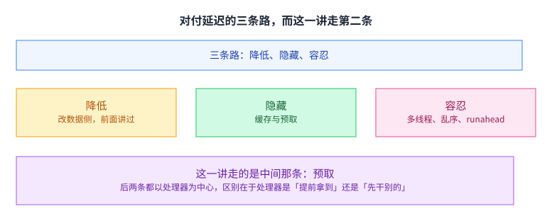

讲义把「对付[[term:latency]] 的做法分成三条：

- 降低延迟：以数据为中心，也就是前面讲过的内存延迟那两讲（本仓库第 10 讲与第 11 讲）。
- 隐藏延迟：以处理器为中心，让处理器提前拿到数据。缓存与预取属于这一条。
- 容忍或摊薄延迟：也是以处理器为中心，让处理器先干别的。多线程、乱序执行与 runahead 属于这一条。

这里要对前面那一讲做一次更正性的补充。 我在本仓库第 10 讲里写过：那四类传统手段（缓存、预取、多线程、乱序）的共同点是让处理器不去等，而讲义把它们统称为 latency tolerance（延迟容忍），并说那个命名就是那一讲的支点。

这一讲的讲义把这个分法细分成了三档，而不是两档：缓存与预取被单独拿出去，叫作延迟隐藏；只有多线程、乱序与 runahead 才叫延迟容忍。

这个细分不是措辞游戏。隐藏与容忍的区别在于处理器做什么：隐藏是「提前把数据搬到手边」，容忍是「在等的时候去干别的活」。 前者要预测未来会用到什么，后者只需要有别的活可干。两条路的难点因此完全不同：隐藏难在预测准不准，容忍难在有没有足够的并行工作。

第 10 讲那个粗分法没有错，它只是把这一层区别压掉了。这一讲展开的正是被压掉的那一半。

还可以从「谁在承担代价」这个角度再看一次这个细分。隐藏延迟的代价主要由存储层次承担：你要多花带宽、多占缓存位置，还可能因为取错而污染缓存。容忍延迟的代价主要由处理器的执行资源承担：你要多留一个线程上下文、多留一个乱序窗口，或者在等的时候多跑一些注定要被丢掉的指令。第 10 讲把两者放在一起说，是因为它们对程序员是同一件事（都不用改代码）；而这一讲把它们分开，是因为它们对硬件设计者是两件完全不同的事。

## 预取为什么能成立，以及它为什么安全

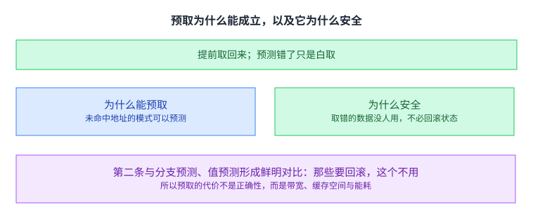

预取的想法很简单：在数据被用到之前先把它取回来。 它成立的前提是程序的未命中地址存在可预测的模式；这句话说的是[[term:cache]] 未命中的地址侧，而不是数据本身。

它还有一个很好的性质，讲义专门用一页讲：预测错了不影响正确性。 取错的数据只是没人用而已，不需要回滚任何状态。

这一点值得强调，因为它的对比对象很鲜明：分支预测错了要回滚，值预测错了也要回滚，所以那两种技术必须带着一整套恢复机制。而预取不需要，所以它的代价不在正确性上，而在[[term:bandwidth]]、缓存空间与[[term:energy-efficiency]] 上。这也解释了为什么整讲的篇幅大半花在「怎么少浪费」上，而不是「怎么保证不出错」。

换个说法：预取把「猜错了怎么办」这个问题整个消掉了，但代价是它必须回答另一个问题 ——「猜错的那些取回来之后，放在哪里、占谁的资源」。所以这一讲后半部分反复出现的三个指标（准确率、覆盖率、及时性）其实都是在给这个新问题记账。

## 预取的四个问题

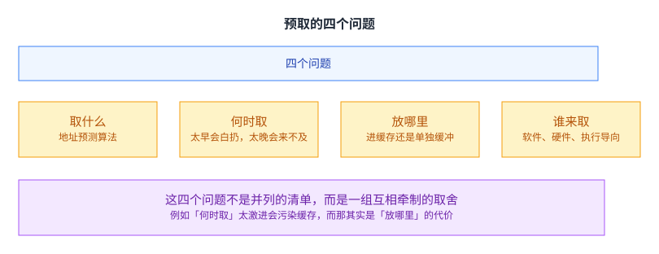

讲义用四个问题把全部方案组织起来：取什么地址、什么时候发起、把数据放在哪里、以及由谁来取。

后面每一种预取器都可以被看成对这四个问题的一组回答，而它们大多要在[[term:microarchitecture]] 里加状态。而它们不是并列的清单，而是一组互相牵制的取舍：例如「什么时候取」如果取得太早，数据可能在被用到之前就被挤出存储，这其实是「放在哪里」的代价；而取得太晚又盖不住完整的延迟。

把这四个问题记在心里，后面那些花样繁多的方案就会显得有秩序：它们多半是在某一个问题上换了一个答案。

## 谁来取之一：让程序员或编译器来

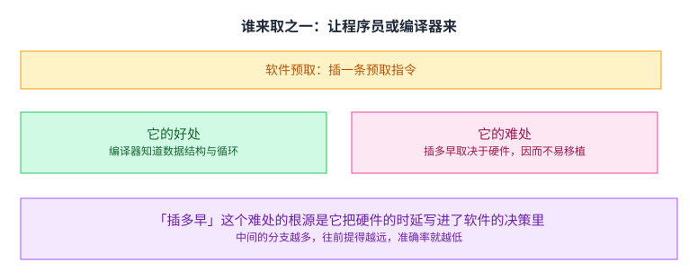

软件预取靠指令集里的一条预取指令，由程序员或编译器把它插进代码，GCC 与 LLVM 里都有做这件事的开关。讲义举的例子是 x86 的 PREFETCH 指令，并说明它有两点值得注意：具体语义依[[term:ISA]] 的实现而定，而且不同缓存层级各有不同的指令。它对非常规则的数组访问有效。

它的好处是编译器与程序员知道数据结构与循环结构，这些信息硬件拿不到。难处在讲义里写得很具体：插多早很难定，因为合适的提前量取决于内存延迟、缓存大小与循环迭代的时间，也就是取决于硬件。同一份代码换一台机器，最优的插入位置可能就变了。

这个难处的根源是它把硬件的时延写进了软件的决策里。而中间的分支越多，往前提得越远，准确率就越低：因为提前量一大，中间走错路的概率就上去了。

## 谁来取之二：最简单与最通用的两种硬件预取

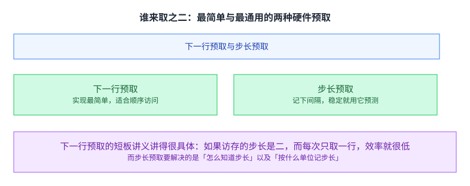

硬件预取用专门的硬件观察访存模式，再据此发出预取。它本质上是在[[term:speculation]] 里做预测，只是预测错了不必回滚。讲义先讲了两种最基本的。

下一行预取是最简单的一种：每次访问之后，把后面若干行也取回来。

步长预取通用一些：记下相邻访问之间的间隔，如果这个间隔稳定，就用它去预测后面的若干次访问。

下一行预取的短板讲义讲得很具体：如果访存的步长是二，而每次只取一行，那么有一半取回来的行是白取的。这个例子说明一件更一般的事：「最简单」之所以有效，是因为它赌了顺序访问这个常见情形；而一旦真实模式偏离这个赌注，它的浪费就按比例上升。

## 步长按什么单位记：两种记法各有所长

步长预取要回答一个前置问题：步长按什么单位记。

一种按指令记：每条访存指令各记一个步长。另一种按内存区域记：在一个地址范围上记步长。

讲义把两者的差别列得很清楚。按区域记的能发现由多条指令共同造成的步长（那些在按指令记的视角下看起来不规则的访问）；它也更容易跑到处理器前面去，因为它不需要靠程序计数器回头去找是哪条指令。

代价是硬件开销：要监视的地址通常比指令多得多。 这一条也解释了它为什么出现得更晚——它的收益要靠更大的开销换来，而芯片能容纳的硬件变多之后，这笔买卖才划算。

讲义在这一节还给了几个真实处理器里的落地形态：Intel 的处理器与 IBM POWER4 里都做过流预取器。这些例子的价值在于说明一件事：教材里那些看起来简单的机制，在真实芯片里往往是最先被做进去的一批，因为它们的效果稳定、验证的代价低。相比之下，后面那些要靠学习或要靠预执行的方案，虽然理论上更强，落地的门槛也高得多。

## 把「流」做成一个缓冲区

流缓冲是另一个角度的做法：每个缓冲区装一条顺序预取过来的行。 一次未命中时去查所有缓冲区的头部：命中就弹出一项并把数据装进缓存；不命中就按最近最少用策略新开一条流。

这个设计值得留意的地方在于它把预取与命中分开了：数据先在缓冲区里等着，等真正要用它的那次访问来取走。这样即使预取来得早，也不会去挤占缓存的位置。这正是前面「把数据放在哪」那个问题的一个答案。

## 不是所有模式都规整：按局部性预取

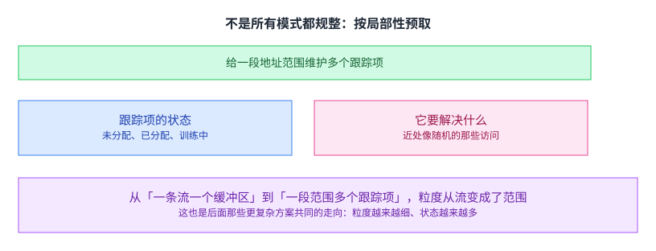

很多程序的访问模式不是完美的步长，在近处看像是随机的。局部性预取的做法是给一段地址范围维护多个跟踪项：先判断方向是升还是降，再训练出一条流。

从「一条流一个缓冲区」到「一段范围多个跟踪项」，粒度变了。而这也是后面那些更复杂方案共同的走向：粒度越来越细、要维护的状态越来越多。 每细一档，能覆盖的模式就多一类，而开销也大一档。

## 怎么判断一个预取器好不好

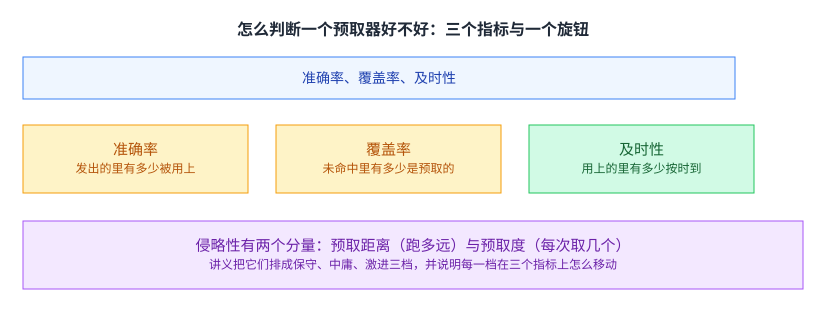

讲义给了三个指标：准确率（发出的预取里有多少被用上）、覆盖率（所有未命中里有多少是预取来的）、及时性（用上的预取里有多少按时到达）。

而这三个指标都被同一个旋钮牵动：侵略性。这条取舍的形状与[[term:energy-delay-product]] 那一类指标同源。它有两个分量，预取距离（跑多远）与预取度（每次取几个）。讲义把它们排成保守、中庸、激进三档，并逐档说明三个指标怎么移动。

这三个指标之间的关系是这一讲后半部分的主线。 它们不能同时最优：激进提高覆盖率与及时性，代价是准确率下降、带宽与缓存污染上升。

## 而三个指标不能靠固定档位解决

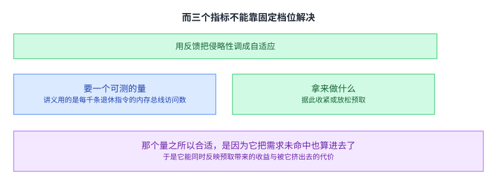

既然权衡随负载变，那么固定档位就必然在某些负载上过激、在另一些上过保守。于是有了反馈式限流：用一个可测的量当反馈，据此收紧或放松预取。

讲义用的量是每千条退休指令的内存总线访问数。这个量之所以合适，是因为它把需求未命中也算了进去，于是它既能反映预取带来的收益，也能反映被预取挤出去的代价。

这一步是这一讲方法论上的转折点。 前面那些方案都在改进「怎么预测地址」，而这一节承认了一件事：预测得准还不够，还得知道在当前这个系统状态下，多取一点是否划算。这个判断没法写死在硬件里，只能靠反馈。

## 模式不规则时，改记「谁跟在谁后面」

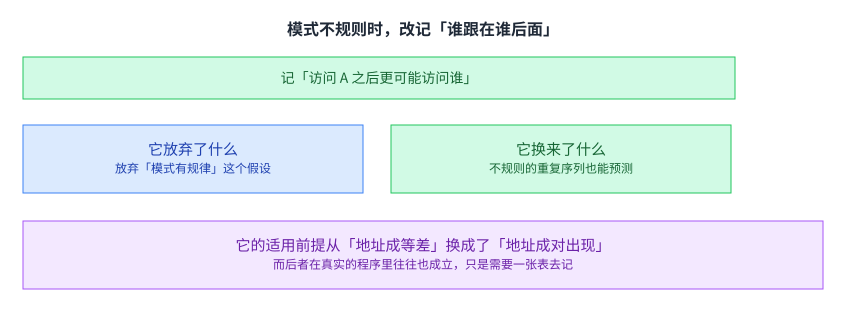

地址相关预取换了一个思路：不再去找步长，而是记下「访问了 A 之后，接下来更可能是 B、C、D」。讲义用一段地址序列说明它可以被写成一个马尔可夫模型，也可以用多个地址做键（例如用 A 与 B 一起预测 C）来提高准确率。

它的适用前提从「地址成等差」换成了「地址成对出现」。后者在真实程序里往往也成立，只是需要一张表去记。

这个转向值得留意：它放弃了「模式有规律」这个较强的假设，换成了一个较弱的假设。假设越弱，能覆盖的程序就越多；而代价是那张表要更大、维护起来更贵。 这条取舍在后面的方案里一直在起作用。

## 另一条路：直接去看数据里有什么

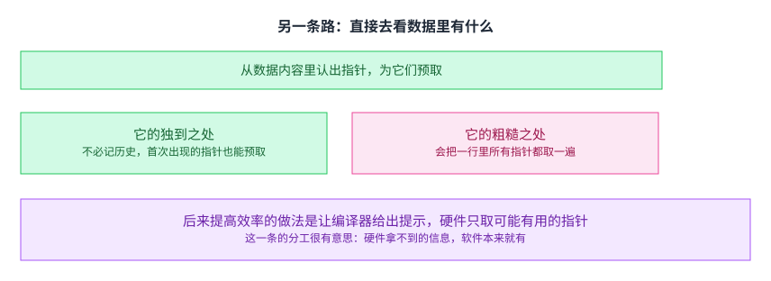

内容导向预取针对的是指针：在一行数据里认出哪些值像指针，就为它们发出预取。

它的独到之处是不必记历史，因此连从未见过的指针也能提前取回来。它的粗糙之处是会把一行里所有指针都取一遍，其中很多根本用不上。

后来提高效率的做法是让编译器给出提示：哪一些指针可能是值得预取的。这一条的分工很有意思：硬件拿不到的信息，软件本来就有。 而这一点在前面讲软件预取时已经出现过一次——那时是软件拿不到硬件的时延，这里是硬件拿不到数据的语义。

## 一个预取器不够，就上多个

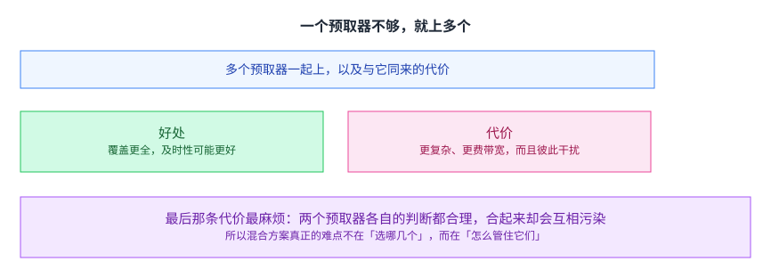

混合预取器的想法是用多个预取器去覆盖多种访问模式：覆盖更全，及时性可能更好。代价是复杂度、带宽，以及预取器之间会互相干扰。

最后那条代价最麻烦：两个预取器各自的判断都合理，合起来却会互相污染缓存、互相抢占带宽。所以混合方案真正的难点不在「选哪几个」，而在「怎么管住它们」。 这与上一节那条反馈式限流是同一件事的两个尺度：上一节管的是一个预取器的侵略性，这一节管的是多个预取器之间的相互影响。

讲义还把这些思路带到了别的场景。一是多核里的协调：多个核各自的预取器会互相抢带宽，所以需要把它们放在一起管，而不是各管各的。二是 GPU：讲义专门有一节讲 GPU 上的预取与调度协调，因为 GPU 上同时在飞的线程远多于 [[term:CPU]]，预取与调度必须一起考虑。

## 把「取什么」交给学习

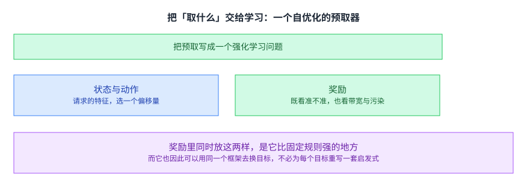

讲义给了一个会自己调整的预取器例子：它把预取写成一个强化学习问题。

状态是一个请求的特征向量（程序计数器、缓存行地址、物理页号、相邻地址之间的差值等）。动作是选一个预取偏移量，讲义给的候选范围是负六十三到正六十三，并说明上下限的作用是保证预取不跨物理页边界、而偏移量为零表示不预取。奖励同时包含两样：预取是否有用（准确、迟到、超出页边界等等），以及系统层面的反馈（例如带宽用量、缓存污染、能耗）。讲义给的评测是在一个轨迹驱动的访存模拟器上做的，对照的是当时几个公开的预取器实现（例如 SPP、Bingo、MLOP 等）。

把这两样放进同一个奖励里，是它比固定规则强的地方。 固定规则只能表达「这样预测对不对」，而这个奖励还能表达「在这个系统状态下，这样取划不划算」。于是同一套框架可以用同一个机制去换目标，不必为每个目标重写一套启发式。

## 最彻底的一类：把预取做成「先跑一段」

执行导向预取不靠记录地址，而是真的把程序（或它的一部分）提前跑一遍，用跑出来的地址去做预取。

它有两种形态。一种是预执行：另外开一个线程或线程上下文，让它跑一段被裁剪过的程序，只为产生地址。另一种是 runahead：讲义说它是其中最省的一种，因为它不另开线程，而是趁长延迟未命中期间用主线程上下文往前跑，等原来的未命中返回时再回滚到检查点。

runahead 的机制讲义讲得很清楚：最老的那条指令是一次长延迟未命中的时候，检查点架构状态并进入 runahead 模式；在模式里投机地预执行指令，其目的就是产生预取；与那次未命中相关的指令被标记并丢弃；未命中返回后恢复检查点、冲掉流水线。

它的优点是几乎能覆盖任何访问模式，而且顺着程序的真实路径走，所以预取的地址很准。它还有一个工程上的优点：大部分硬件本来就在那里，不必为预取专门造一个上下文。

它的代价是依赖分支预测。顺着路径走是它的长处，也正是它的软肋：一旦路径走错，跑出来的地址就偏离了。而它还会多执行一些指令，那些指令本身要花能耗。

讲义还给了一个后续改进：连续的 runahead。它先给了一个观察——基准的 runahead 只覆盖了所有可达未命中的百分之十三，原因是每次 runahead 的窗口很短（平均六十个周期）。改进的做法是找出那条导致关键未命中的指令链，让它在专门的硬件里循环执行，从而持续产生未来的未命中。结果是覆盖率从百分之十三升到百分之七十。

这个改进的形状值得记一笔：它没有去改 runahead 的机制，而是去掉了机制外面那个「窗口太短」的限制。有时候把一件事做得更好，靠的不是把它做得更强，而是找出它为什么没做完。

## 读完应该能回答

1. 讲义把对付延迟的做法分成哪三条，隐藏与容忍的区别在哪。
2. 预取为什么不影响正确性，它的代价落在哪三样资源上。
3. 预取的四个问题是什么，为什么它们不是并列的清单。
4. 下一行预取在什么情况下会浪费一半带宽。
5. 步长按指令记与按内存区域记，各自的长处与代价是什么。
6. 判断一个预取器好坏的三个指标是什么，牵动它们的旋钮有哪两个分量。
7. 为什么固定档位不够，反馈式限流用什么量、为什么这个量合适。

## 脉络回顾

这一讲是「怎么对付内存延迟」这条线的第二段。第一段是第 10 讲与第 11 讲，那两讲讲的是把延迟本身降下来；这一讲开始讲另一条路，也就是让处理器不去等。而这条线上还留着三段：讲多处理器的第 21 讲会把视角从单个核搬到多个核；讲内存序的第 22 讲会接着回答「不去等之后，什么东西不再成立」；而讲缓存一致性的第 23 讲会处理多个核之间的那层局部约定。

本讲留下的三件工具会一直用：一是那四个问题（取什么、何时取、放哪里、谁来取），它不只适用于预取，任何「提前做一件事」的机制都可以按它拆；二是那三个指标与侵略性这个旋钮的关系（更激进就覆盖更全、但准确率与带宽变差），这个形状在后面的讲次里会反复出现；三是讲义给的那个细分，也就是把对付延迟的手段分成降低、隐藏与容忍三档。

要分清的是，留下来复用的是这三件工具，不是某一台预取器：讲义列的那些具体方案（下一行、步长、流缓冲、局部性、地址相关、内容导向）各自只在一类访存模式上成立。下一讲会换一个完全不同的角度，也就是多个核同时跑的时候，谁先看到谁的写。

## 溯源

- 对应：ETH Zürich Computer Architecture（Onur Mutlu 主讲，Fall 2022），Lecture 16 — Prefetching。

- 讲义链接：<https://safari.ethz.ch/architecture/fall2022/lib/exe/fetch.php?media=onur-comparch-fall2022-lecture16-prefetching-beforelecture.pdf> 。讲义文件名是 `beforelecture`（不是 `afterlecture`），与 `docs/lecture-manifest.md` 第 20 行一致。

- 上游许可：站点级页脚为 CC BY-NC-SA 4.0。SA 是传染性的，所以本页译文也以同协议发布、且为非商业用途。本页未转载原讲义里的任何图片，配图全部自绘；只有图没有字的页，本页只如实记下标题。

- 证据来源（两份独立抽取，互为核对）：`eth-ca2022-lecture16-prefetching.pdf.pypdfium2.txt`（`pypdfium2`，276 页、97,583 字符）与同目录 `.pypdf.txt`（`pypdf`，276 页、94,375 字符）。四道核验：20,567,106 字节、尾部有 `%%EOF`、不是 2 的整数次幂、也不是 64 KiB 的整数倍（余数 54,338）。

- 与第 10 讲的关系（这一讲开头已经写明，这里再记一次以便核对）：第 10 讲里我把缓存、预取、多线程、乱序四类手段统称为延迟容忍，那是照源讲义（Lecture 8b）的用法。这一讲的讲义把同一批手段细分成三档：降低（数据侧）、隐藏（缓存与预取）、容忍（多线程、乱序、runahead）。本页按这一讲的细分法组织，并在开头说明第 10 讲那个粗分法把哪一层区别压掉了。两处说法并不冲突：粗分法是对的，细分法更精确。

- 本讲取材范围是讲义的正文（p1 到 p170），附录（p171 之后的备份幻灯片，含 runahead 的补充材料与读物清单）不计入。包括：降低、隐藏、容忍三条路的划分；预取的想法、它成立的前提与它不影响正确性；预取的四个问题；软件预取的做法、好处与难处；下一行预取与步长预取；步长按指令记与按内存区域记的对比；流缓冲的设计；局部性预取与跟踪项的状态；评估预取器的三个指标、侵略性的两个分量与三档对比；反馈式限流与其反馈量；地址相关预取的马尔可夫视角与用多地址做键；内容导向预取的做法与后来用编译器提示提高效率的改进；混合预取器的好处与代价；把预取写成强化学习问题的那个自优化预取器（状态、动作空间、奖励的两部分与七档奖励）；执行导向预取的预执行形态与 runahead 的机制、优缺点；以及连续 runahead 的观察、做法与结果。

- 数字与定义以讲义页面为准。讲义未展开的推论属于 CourseLingo 的讲解。这类推论分三组：把隐藏与容忍的区别讲成「提前拿到」与「先干别的」这组对照，并指出两条路难点的不同；把「最简单之所以有效是因为它赌了顺序访问」与「假设越弱能覆盖的程序越多但代价越大」抽成两条可复用的形状；以及把反馈式限流讲成本讲方法论上的转折点（从「改预测」到「判断当前该取多少」）。本讲与前后讲次的对应关系属于我们的编排。

- 一处说明：讲义有多页只有标题与图或只有图（例如第 2、3、7、10、11、22、23、24、28、37、38、39、41、42、43、44、49、50、54、60、61、64、66、68、69、70、71、74、79、80、81、83、85、87、94、96、97、98、99、100、101、102、103、104、108、109、110、111、112、113、114、115、116、118、121、122、123、124、125、126、128、129、130、131、132、133、134、135、136、137、138、139、140、141、142、143、144、145、148、149、151、153、154、155、156、157、158、159 页），文字层留下的是标题与零散标签。本页对这些页只依据可见的标题与文字描述，未依据图示复原结构，也未替讲义补数字或公式。
