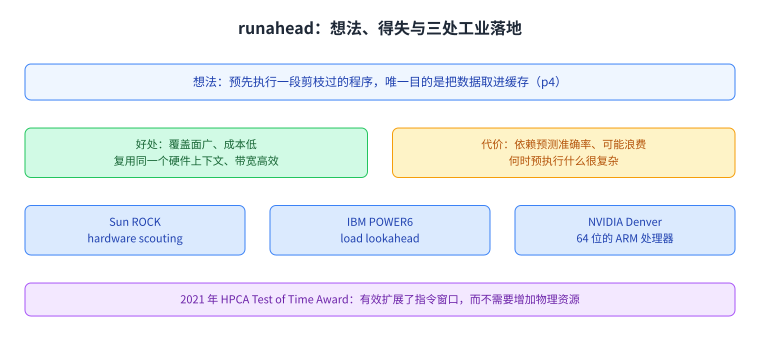
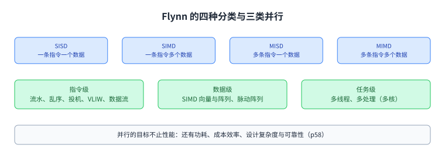
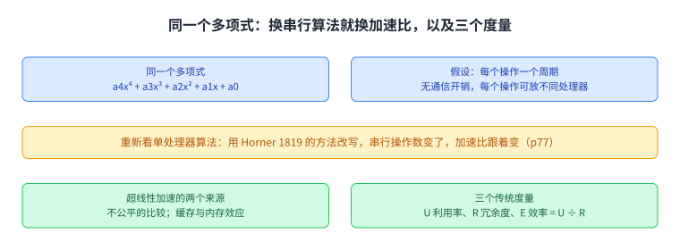
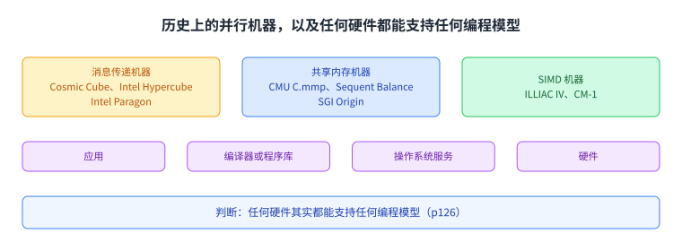

+++
title = "多处理器：加速比的上限，以及任务从哪里来"
lecture = 21
slug = "lecture17a-multiprocessors"
status = "draft"
source_kind = "notes"
source_url = "https://safari.ethz.ch/architecture/fall2022/lib/exe/fetch.php?media=onur-comparch-fall2022-lecture17a-multiprocessors-afterlecture.pdf"
source_title = "Lecture 17a: Multiprocessors (Fall 2022, afterlecture)"
output_mode = "explanation"
+++

> 来源课程：ETH Zürich Computer Architecture（Onur Mutlu 主讲，Fall 2022）；
> 对应讲义：Lecture 17a — Multiprocessors（`onur-comparch-fall2022-lecture17a-multiprocessors-afterlecture.pdf`，126 页）；
> 讲义链接：<https://safari.ethz.ch/architecture/fall2022/lib/exe/fetch.php?media=onur-comparch-fall2022-lecture17a-multiprocessors-afterlecture.pdf> ；
> 上游许可：该课程 wiki 每一页的页脚都带站点级许可块，原文为 CC BY-NC-SA 4.0：<https://creativecommons.org/licenses/by-nc-sa/4.0/deed.en> ；
> 本页由 CourseLingo 用中文重新讲解，按源讲义的推进顺序组织，不是逐字翻译，也不转载原讲义里的任何图片；
> 页内配图全部由我们自绘；原讲义里只有图、没有字的页，我们只如实记下它的标题。
> 本页为非官方材料，与 ETH Zürich 及课程教学团队无隶属关系；如与原文有出入，以原文为准。

本页的事实来自 `_sources/eth-ddca-ca/evidence/eth-ca2022-lecture17a-multiprocessors.pdf.pypdfium2.txt`（pypdfium2 抽取，126 页，37,153 字符），交叉核对用同名的 `.pdf.pypdf.txt`（pypdf 抽取，126 页，36,248 字符）。抽取器是 `_sources/_audit/pdftext_alt.py`。该 PDF 入库前按四道核验过完整性：体积 7,880,241 字节、尾部有 `%%EOF`、不是 2 的整数次幂、也不是 64 KiB 的整数倍（余数 15,921）。仓内自研的 `pdftext*.py` 这一族在前几讲已被实测为不可靠，本页没有采用它们的任何输出。

## 这一讲要解决什么问题

前几讲讲的是内存这条线上的争用，对象是 [[term:DRAM]] 这类共享资源。第 18 讲把干扰量化，并给出调度器的演化；第 19 讲把另外三种手段（数据映射、源限流、应用与线程调度）展开，最后收成一张关于[[term:fairness]]与吞吐的图：四种工具分别动的是顺序、空间、速率与邻居。这一讲换到另一条线上，问的是另一类问题。

两条线之间有一个明确的接点。内存线的结论是「共享会让线程互相拖慢」；到多处理器这一侧，同一件事会变成两个新问题。一个是性能账：讲义在讲 Amdahl 定律的注意事项时，把「N 个处理器之间的争用」直接写成了并行部分不完美的三个扣减项之一（p89）。另一个是**正确性**：多个处理器各有私有缓存，还共享同一个地址空间时，「大家看到的顺序是不是同一个顺序」就成了必须先回答的问题。

讲义在正文开头就把这件事摆出来了：p51 到 p53 是三份读物清单。多处理这部分的必读是 Amdahl 1967 年那篇讲单处理器路线能走多远的文章；**内存一致性**部分的必读是 Lamport 1979 年那篇讲多处理器如何正确执行多处理程序的文章；**缓存一致性**部分的必读是 Papamarcos 与 Patel 在 ISCA 1984 上那篇低开销一致性方案。三篇分别对应这一讲、以及按本课程清单后面两讲要展开的题目。这一讲只在 p63 把一致性与一致性点成「紧耦合多处理器的设计问题」，没有展开它们，本页照这个边界走。

讲义本身的结构分两半。前 40% 是上一个单元（预取）的收尾，主角是 runahead，还附了一段它在前身、工业落地与获奖上的来龙去脉。后半段才是多处理器：分类、加速比的上限、瓶颈、任务分配，以及最后一节「编程模型与硬件执行模型是两件事」。

图里上面两格是两条线的关系，中间几格是这一讲的推进顺序，下面一格是三份必读读物各自通向哪里。看这一页时可以把它当成从「共享更快」走到「共享仍然正确」的那一步。

## 开场那四十页：预取这一单元的收尾

runahead 的想法可以直接用一句话说清（p4）：**预先执行一段被剪枝过的程序，唯一目的是把数据取进缓存**。它纯粹是投机（p5），目标是找出并生成那些如果不提前做、后面就会让执行停下来的缺失；而更高效的做法是只执行那些会产生缺失的指令，讲义点名说 Continuous Runahead 就是这样一个例子（MICRO 2016，best paper session）。

它的得失列在 p7。好处是能预取几乎任何访问模式；成本可以很低，因为它复用同一个硬件上下文，毕竟处理器本来就有执行这段程序的能力；[[term:bandwidth]]带宽上也高效。代价是它依赖分支预测（以及可能的值预测）的准确率，误预测会把线程带离正确的执行路径；它会浪费地投机执行很多指令，还可能占住一个线程上下文；而「什么时候预执行什么」本身很复杂。

这条路后来真的进了芯片。p13 到 p18 列了三处：Sun 的 ROCK 把这件事叫 hardware scouting，IBM 的 POWER6 里有 load lookahead，NVIDIA 的 Denver 也做了，Denver 是 NVIDIA 的第一颗 [[term:CPU]]，也是一颗 64 位的 ARM 处理器。p13 给了一句判词：有效的预取既能改善性能，也能降低硬件成本。

再往后是回顾与展望（p19 到 p25）。2000 年代初的注意力大多放在把指令窗口做大、把机器做得更大更复杂；runahead 换了一条思路，让乱序核保持简单，用自动的投机执行专门做预取，代价是放弃一部分与内存无关的收益。它的前身是 Dundas 与 Mudge 在 ICS 1997 上「在缓存缺失下预执行指令」的想法，以及 Glew 在 1998 年那篇「MLP yes! ILP no!」里的判断。2021 年这篇工作拿到了 HPCA 的 Test of Time Award，获奖词说它有效地极大扩展了指令窗口，而不需要增加物理资源；它开创了动态预取的一个新方向，并列举了 POWER6、Denver 与 ROCK 三处工业影响。

图里中间那条是它进入三颗真实处理器的路径，两边是它的好处与代价。这一节之后，讲义把话题切到多处理器。

## 多处理器长什么样：分类与三类并行

p55 是 Flynn 在 1966 年给出的分类。SISD 是一条指令处理一个数据元素；SIMD 是一条指令处理多个数据元素，例子是阵列处理器与向量处理器；MISD 是多条指令处理同一个数据元素，最接近的形态是脉动阵列处理器与流处理器；MIMD 是多条指令处理多个数据元素，也就是多个指令流，多处理器与多线程处理器都属于这一类。p56 与 p57 分别挂了 SIMD 与 MISD 的讲解视频。

p58 回答为什么要有并行计算机。主目标是性能，可以是执行时间，也可以是任务吞吐，而执行时间受 Amdahl 定律支配。除此之外还有四个目标：降低功耗，因为把 4N 个单元降到 F/4 比 N 个单元跑在 F 更省电；改善成本效率与可扩展性；降低设计复杂度，因为设计一个和 N 个简单单元一样强的单元更难；以及提高可靠性，靠空间上的冗余执行。

p59 把并行分成三类。指令级并行是同一指令流里不同指令可以并行，手段有 [[term:pipeline]] 流水线、乱序执行、[[term:speculation]] 投机执行与 VLIW，另外还有数据流。数据级并行是不同数据可以并行，手段是 SIMD，也就是向量处理与阵列处理，以及脉动阵列与流处理器。任务级并行是不同任务或线程可以并行，形态是多线程与多处理，后者就是多核。

p60 讲这些任务从哪里来。一种是把一个问题显式划分成多个相关任务，也就是并行编程：任务边界自然时容易，比如网页与数据库查询；边界不清时很难。另一种是透明或隐式地划分，比如线程级投机，把一个线程投机地切开。还有一种是让许多独立任务一起跑，进程多时容易，批处理仿真、多用户与云计算都属于这一类；但这一种不会提升单个任务的性能。

图里左边是四种分类，右边是三类并行各自动用什么手段。把这条线记住之后，后面几节的「并行」就能落到具体的层次上。

## 紧耦合：五个设计问题，其中两个是一致性

p62 把多处理器分成两类。松耦合多处理器没有共享的全局地址空间，是一张多计算机网络，通常用消息传递编程，靠显式的发送与接收通信。紧耦合多处理器有共享的全局地址空间，传统的对称多处理、现成的多核与多线程处理器都属于这一类；它的编程模型与单处理器相似，唯一的差别是对共享数据的操作需要同步。

p63 列出紧耦合多处理器的五个设计问题：共享内存的同步，也就是锁、原子操作与屏障怎么处理；**缓存一致性**，也就是各自私有的 [[term:cache]] 缓存了同一个内存地址时怎么保证正确；**内存一致性**，也就是所有内存操作的顺序，以及程序员应当期望硬件提供什么；共享资源的管理；以及通信，靠互连。

p64 把编程一侧的问题也列了五个：负载不均，也就是怎么把一个任务划分成多个；同步，也就是怎么高效地在任务之间同步与通信，手段有锁、屏障、流水线阶段、条件变量、信号量与原子操作；争用的避免与管理；最大化并行度；以及在优化性能的同时保证正确。

p65 是一个附注，讲硬件多线程的三种形态。粗粒度按量子切换，或者按事件切换，比如遇到末级缓存缺失时切换。细粒度逐周期切换，讲义追到 1970 年 CDC 6600 的设计与 1978 年 Burton Smith 那篇流水线共享资源 MIMD 计算机。同时多线程可以同时从多个线程派发指令，好处是提高执行单元的利用率。

图里按地址空间与通信方式两栏对比两类多处理器。紧耦合与单处理器的唯一差别，是对共享数据的操作需要同步。

图里上面是硬件侧的五个设计问题，下面是编程侧的五个问题。其中缓存一致性与内存一致性是这一讲只点名、后面几讲才展开的两个。

## 加速比的上限：Amdahl 与它的三个扣减项

p84 给出 Amdahl 定律：设 f 是可并行部分的比例，N 是处理器数量，加速比等于 1 除以 (1 - f + f/N)。它的直接含义是最大加速比被串行部分卡住，讲义把这件事叫串行瓶颈。p90 用一张曲线图把这个上限画出来，横轴是 f，三条曲线分别是 N 等于 10、100 与 1000。

p89 补上注意事项，这一页是本讲与内存线的接点。第一，并行部分通常不是完美并行的。第二，造成这个不完美有三类开销：同步开销，比如对共享数据的更新；负载不均的开销，也就是并行化不完美；以及**资源共享开销，也就是 N 个处理器之间的争用**。前几讲花了很大力气处理的干扰，在这里变成了加速比公式里的一项扣减。

p94 又把并行部分的瓶颈单独列了一遍，一共四类。同步方面，操纵共享数据的操作无法并行，包括锁、互斥与屏障同步。通信方面，任务之间可能需要彼此的值，共享数据被争用时会导致线程串行化。负载不均方面，并行任务的长度可能不同，原因可能是并行化不完美，也可能是[[term:microarchitecture]]层面的效应。资源争用方面，并行任务共享硬件资源会互相拖延，而复制所有资源（比如内存）太贵，于是会多出一份单独运行时没有的[[term:latency]]延迟。

图里上面是公式与串行瓶颈，下面是三个扣减项。第三条里的争用，就是前几讲反复处理的那件事。

## 那个多项式例子：换一个串行算法，就换了加速比

讲义用一个具体例子讲加速比这件事有多容易被比较方法左右（p73 到 p78）。要算的是 a4x⁴ + a3x³ + a2x² + a1x + a0，假设给定输入 x 与各个系数，每个操作一个周期，没有通信开销，而且每个操作都可以放在不同的处理器上。先问单处理器要多久，假设不做流水线也不并发执行指令。再问三个处理器能快多少。

这个例子的重点在下一页（p77）：如果重新看单处理器的算法，用 Horner 在 1819 年提出的方法改写这个多项式，串行的操作数就变了，于是同一个问题的并行加速比也跟着变。讲义用这一点说明「拿最好的并行算法去比一个弱的串行算法」是不公平的。

p79 接着问：加速比能不能超过 P。答案是能，但通常来自两类原因。一类是不公平的比较，也就是上面那种。另一类是缓存与内存效应：处理器更多意味着缓存或内存更多，缺失更少，于是超过线性的部分来自存储层次的变大。p80 给出三个传统度量：利用率 U 等于并行版本的操作数除以（处理器数乘以时间）；冗余度 R 等于并行版本的操作数除以最好单处理器算法的操作数；效率 E 等于单处理器时间除以（处理器数乘以 P 个处理器的时间），也可以写成 U 除以 R。

图里上面两条是同一问题的两种串行算法，下面是超线性加速的两类来源与三个度量。这一节的用意是提醒读者，加速比这个数字本身要先说清比较的对象。

## 瓶颈长在哪：串行部分与并行部分

p91 解释串行瓶颈从哪来。主要成因是无法并行化的数据操作，例如一个循环里每一步都依赖上一步的 A[i] = (A[i] + A[i-1]) / 2。此外还有别的成因，比如由一个线程准备数据并生成并行任务，这一段通常是串行的。p92 与 p93 举了另一个例子，出自 Suleman 等人在 ASPLOS 2009 上关于用非对称多核加速临界区执行的工作。p97 用的是 MySQL 的例子：打开数据库表这一段是关键路径，把它放进临界区之后，对称多核上的加速比远低于非对称多核。

p95 换了一个角度讲并行部分的瓶颈，这个角度在第 19 讲也出现过：多线程应用里的线程是互相依赖的，它们会同步，于是有些线程落在执行的关键路径上，有些不在；甚至同一个线程内部，有些代码段在关键路径上，有些不在。三种典型的关键路径分别是：被争用的临界区，一次只能有一个线程进入，抢锁的线程要等；屏障的最后一个到达者，其他线程都在等它；流水线里执行最慢那一段的线程。

p100 给出这一讲的判词。如果并行是天然的，难度不大，这类问题被称为「embarrassingly parallel」，多媒体、物理仿真、图形学、大型网页服务器与数据库都算。真正的难度在另外两处：让并行程序正确地工作，以及在瓶颈存在的前提下把性能调好。讲义说并行计算机体系结构的很大一部分工作，就是设计能克服串行与并行瓶颈的机器，同时让程序员写正确且高性能的并行程序这件事变得容易一点。

图里上面是并行部分的四类瓶颈，下面是并行应用的三种关键路径。它们与第 19 讲那三种关键路径是同一组概念，只是这里落在并行程序自己身上。

## 任务分配：静态还是动态，谁来做

p112 先分清两类调度。静态调度在编译期或创建并行任务时做完，调度结果不随运行期信息变化；动态调度在运行期做，会随运行期信息变化。讲义用指令调度做类比，并追问：静态调度器拿不到哪些信息。

p113 把取舍摆开。问题是 N 个任务、P 个处理器、N 大于 P，任务该固定分配还是自适应分配。静态分配的好处是简单，任务不需要搬动；坏处是效率低，负载不平衡时资源用不满。动态分配的好处是负载不平衡时处理器利用得更好；坏处是更复杂，需要搬动任务来平衡负载，而搬动本身有时间开销，还会破坏局部性。

p114 与 p115 用直方图做例子：把一大批值分给 T 个任务，每个任务为自己的值集算一个局部直方图，最后把局部直方图并进全局直方图。接着问两种分配方式什么时候效果一样，以及动态分配怎么实现，答案是任务队列。p116 把软件任务队列的三种形态点出来，集中式、分布式与层次式，并问各自的优缺点。

p117 讲任务窃取：一个处理器的任务队列空了，就去偷另一个处理器队列里的任务。随机选择偷谁效果就不错；还要决定偷几个。好处是动态平衡计算负载，坏处是处理器之间多出通信与同步开销，而且没任务可偷时要能停下来。

p118 问谁来分配。软件做的好处是视野更好，坏处是时间开销更大，而且对动态事件反应慢，比如某个处理器变空闲。硬件做的好处是时间开销低、能更快适应动态事件，坏处是需要改硬件，带来面积甚至能耗开销。p119 给出硬件怎么帮上忙：每一个处理器一个专用任务队列，软件按需填充，硬件负责把任务在队列之间搬动，另外还可以有一个全局队列，形成硬件里的层次式任务分配；讲义把 Carbon 那篇 ISCA 2007 的工作列为选读。p120 用「找迷宫出口」说明还有一类情况：任务本身是运行期生成的，静态分配在这里不成立。

图里左边是静态分配，右边是动态分配，各自列了好处与坏处。取舍的核心是「平衡负载」与「搬动开销」之间的交换。

图里上半是软件任务队列的三种形态与窃取的做法，下半是软硬件两种分配者各自的长短。

## 编程模型与硬件模型是两件事

p122 列出主要的编程模型。讲义这里写的是「五个主要模型」，列表的第一项是带括号的「（顺序）」，其后依次是共享内存、消息传递、数据并行（SIMD）、数据流与脉动阵列；这一页最后还问了有没有混合模型。**按讲义原文，括号里的顺序模型与后面的五项并列列出，而正文写的是五个**，本页如实照录，不替它合并或改写。

p124 把两种通信方式的差别讲清楚。消息传递模型靠显式的消息通信，程序各部分之间是松耦合的，讲义用的类比是打电话或寄信，没有一个所有人都能访问的共享位置。共享内存模型靠内存操作隐式通信，也就是读写，程序各部分之间是紧耦合的，类比是公告板，把信息公开贴在一个共享的地方。讲义提醒说，选哪种模型取决于要解决的问题，受影响的方面包括开销、可扩展性、易编程性、缺陷以及是否匹配底层硬件。

p125 转到硬件一侧。共享内存硬件里所有处理器看到一个全局共享地址空间，每个处理器都能访问全部内存，而且对一个位置的写对别的处理器的读是可见的。消息传递硬件没有全局共享地址空间，发送与接收是处理器之间唯一的通信方式，讲义说这很像今天的工作站网络，也就是集群。

p126 是这一节的落点。在并行计算历史的大部分时间里，编程模型与硬件之间没有分离：消息传递这一侧有 Caltech 的 Cosmic Cube、Intel 的 Hypercube 与 Intel 的 Paragon；共享内存这一侧有 CMU 的 C.mmp、Sequent 的 Balance 与 SGI 的 Origin；SIMD 这一侧有 ILLIAC IV 与 CM-1。但讲义接着给出判断：**任何硬件其实都能支持任何编程模型**，理由是从应用到底层是一条分层链：应用经编译器或程序库，再到操作系统的服务，最后才落到硬件。

图里上面是讲义列出的模型清单，下面是消息传递与共享内存两种通信方式。它记的是这一页的原话与原来的排列方式。

图里上面是按模型分组的历史机器，下面是那条从应用到硬件的分层链。分层的存在，就是那句判断成立的理由。

## 读完应该能回答

1. 这一讲与第 18 讲、第 19 讲的分工分别是什么，共享在多处理器一侧变成了哪两个新问题。
2. runahead 作为基于执行的预取器，它的好处与代价各有哪几条。
3. 它进入了哪三颗真实处理器，2021 年那次获奖的理由是什么。
4. Flynn 的四类机器分别是什么，三类并行各自的常见手段有哪些。
5. 松耦合与紧耦合多处理器的差别是什么，紧耦合的五个设计问题里哪两个属于一致性。
6. Amdahl 定律的公式是什么，并行部分不完美的三个扣减项分别是什么。
7. 那个多项式例子里，换一个串行算法为什么会改变加速比，超线性加速来自哪两类原因。
8. 并行部分的四类瓶颈是什么，任务分配里静态与动态各自的代价是什么。

## 脉络回顾

这一讲是内存线之后的新起点。第 18 讲把干扰量化，第 19 讲把三种手段展开并收成「顺序、空间、速率、邻居」四样东西；这一讲把共享推到多处理器层面，于是同一件事变成两件新的：争用成为 Amdahl 定律里并行部分的一条扣减项，而私有缓存加共享地址空间带来了正确性问题。

上半段是预取单元的收尾。runahead 用剪枝过的投机执行专门做预取，好处是覆盖面广、成本低、带宽高效，代价是依赖预测准确率、可能浪费地执行、以及何时预取什么很复杂。它进了 Sun ROCK 的 hardware scouting、IBM POWER6 的 load lookahead 与 NVIDIA Denver，并在 2021 年拿到 HPCA 的 Test of Time Award。

下半段从分类开始。Flynn 把机器分成 SISD、SIMD、MISD 与 MIMD 四类；并行的目标不止性能，还包括功耗、成本效率、设计复杂度与可靠性；并行本身分为指令级、数据级与任务级三类。多处理器分为松耦合与紧耦合，紧耦合的五个设计问题里有两个就是缓存一致性与内存一致性。

接着是加速比的上限。Amdahl 定律说最大加速比被串行部分卡住；而并行部分通常不完美，扣减项有三类，同步、负载不均与资源争用。讲义的判词是，并行计算体系结构的很大一部分工作，就是克服这两类瓶颈，并让程序员的日子好过一点。

最后两节落到「任务从哪来、谁来分配」与「编程模型不等于硬件模型」。任务分配要在平衡负载与搬动开销之间做交换，做这件事的可以是软件也可以是硬件。编程模型有共享内存与消息传递等几种，硬件也有对应的两种机器模型，但历史机器与那句判断都说明：任何硬件其实都能支持任何编程模型，中间隔着编译器、程序库与操作系统。

## 溯源

- 对应：ETH Zürich Computer Architecture（Onur Mutlu 主讲，Fall 2022），Lecture 17a — Multiprocessors（2022 年 11 月 24 日）。讲义链接：<https://safari.ethz.ch/architecture/fall2022/lib/exe/fetch.php?media=onur-comparch-fall2022-lecture17a-multiprocessors-afterlecture.pdf>
- 上游许可：站点级页脚为 CC BY-NC-SA 4.0。**SA 是传染性的**，所以本页的译文也以同协议发布、且为非商业用途。本页未转载原讲义里的任何图片，配图全部自绘。
- 证据来源：`_sources/eth-ddca-ca/evidence/eth-ca2022-lecture17a-multiprocessors.pdf.pypdfium2.txt`（pypdfium2 抽取，126 页，37,153 字符），交叉核对用同名的 `.pdf.pypdf.txt`（pypdf 抽取，126 页，36,248 字符）。四道完整性核验：7,880,241 字节、尾部有 `%%EOF`、不是 2 的整数次幂、不是 64 KiB 的整数倍。仓内自研的 `pdftext*.py` 这一族在前几讲已被实测为不可靠，本页没有采用它们的任何输出。
- **与第 18 讲、第 19 讲的分工**（正文第一段已显式回指）：第 18 讲把内存干扰量化并给出调度器演化，第 19 讲展开数据映射、源限流与应用到核的映射，两者都属于「怎么让共享更快、更公平」；这一讲属于多处理器线，处理的是「多个处理器一起跑时，程序还对不对、快不快」。**接点由讲义自己给出**：p89 把「N 个处理器之间的争用」列为并行部分不完美的三个扣减项之一，p63 把缓存一致性与内存一致性列为紧耦合多处理器的设计问题，p52 与 p53 把 Lamport 1979 与 Papamarcos 与 Patel 1984 两份读物列成必读。这一讲没有展开这两讲，本页照这个边界走。
- 一处源文自相矛盾，照录不改：p122 的标题写「五个主要模型」，而列表里除带括号的「（顺序）」之外还列了共享内存、消息传递、数据并行、数据流、脉动阵列五项；本页把页面原样与正文的「五个」都写出来，没有替它合并或改写。
- 本讲取材范围是讲义的全文 p1 到 p126，没有 Backup Slides 分节。讲义里只有图、标题或出处的页：分节页 p2、p3、p19、p23、p29、p37、p50、p54、p61、p72、p83、p101、p111、p121；图片页 p4、p5、p13 到 p18、p20 到 p22、p24、p25、p27、p28、p30 到 p36、p38 到 p49、p55 到 p60、p73 到 p82、p84 到 p100、p112 到 p120、p122 到 p126。这些页本页只登记标题、主题或出处，没有替它们复原内容。
- 数字与定义以讲义页面为准：Flynn 四类的定义（SISD／SIMD／MISD／MIMD）、并行的五个目标、三种并行的手段清单、紧耦合的五个设计问题与编程侧的五个问题、Amdahl 的公式与三个扣减项、并行部分的四类瓶颈、任务分配的取舍条目、五篇读物（Amdahl 1967、Flynn 1966、Lamport 1979、Papamarcos 与 Patel 1984、Culler 与 Singh 与 P&H 的章节）、Carbon 的出处（ISCA 2007）、Horner 1819、Dundas 与 Mudge ICS 1997、Glew 1998、以及三颗处理器（Sun ROCK／IBM POWER6／NVIDIA Denver，其中 Denver 是 64 位的 ARM 处理器）。**多项式例子的具体操作数与 p90 曲线上的数值没有写进这一页**，因为讲义那两处只有图，正文没有复述这些数。
- 讲义未展开的推论属于 CourseLingo 的讲解。这类推论有三组：把这一讲与第 18、19 讲的关系写成「同一次共享的两个新问题」（性能账与正确性）；把 p100 的判词读成整讲的收束；以及把「任何硬件都能支持任何编程模型」与 p126 那条分层链连起来讲。
