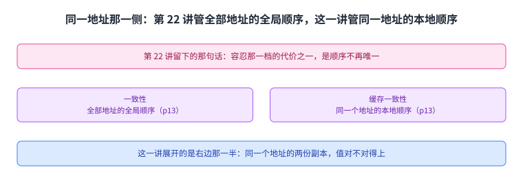
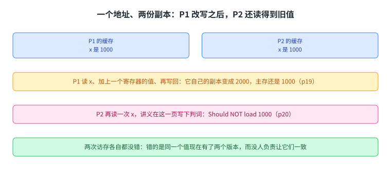
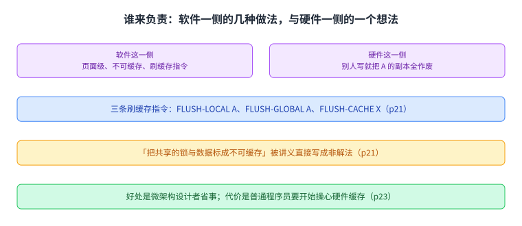
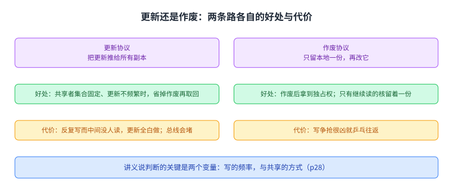
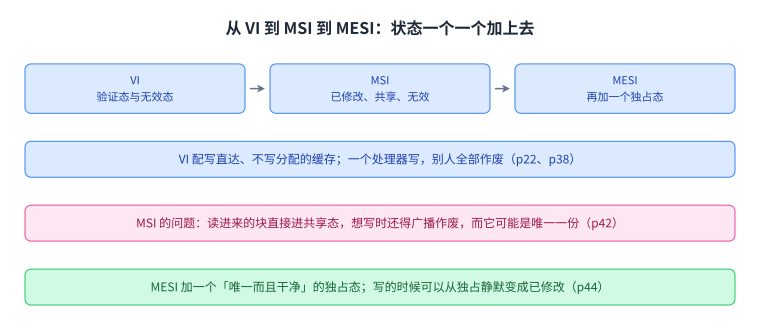
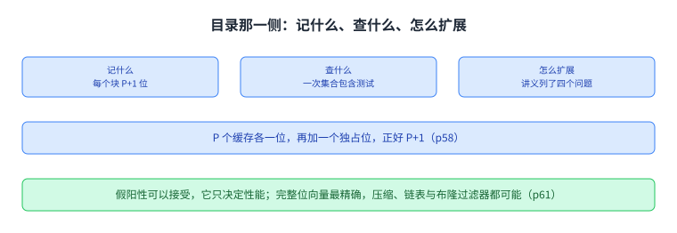
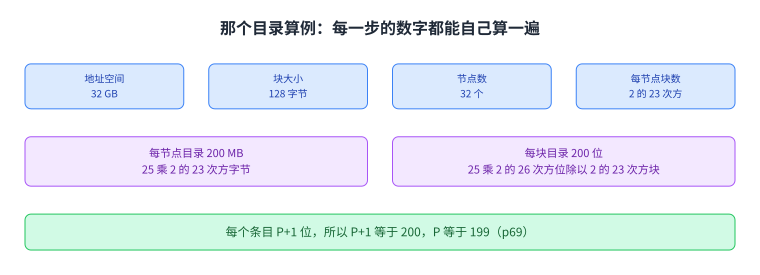
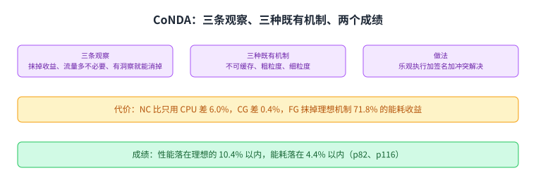
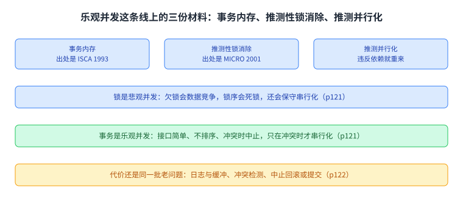

+++
title = "同一个地址的两份副本：缓存一致性"
lecture = 23
slug = "lecture19-cache-coherence"
status = "draft"
source_kind = "notes"
source_url = "https://safari.ethz.ch/architecture/fall2022/lib/exe/fetch.php?media=onur-comparch-fall2022-lecture19-cachecoherence-afterlecture.pdf"
source_title = "Lecture 19: Cache Coherence (Fall 2022, afterlecture)"
output_mode = "explanation"
+++

> 来源课程：ETH Zürich Computer Architecture（Onur Mutlu 主讲，Fall 2022）；
> 对应讲义：Lecture 19 — Cache Coherence（`onur-comparch-fall2022-lecture19-cachecoherence-afterlecture.pdf`，142 页）；
> 讲义链接：<https://safari.ethz.ch/architecture/fall2022/lib/exe/fetch.php?media=onur-comparch-fall2022-lecture19-cachecoherence-afterlecture.pdf> ；
> 上游许可：该课程 wiki 每一页的页脚都带站点级许可块，原文为 CC BY-NC-SA 4.0：<https://creativecommons.org/licenses/by-nc-sa/4.0/deed.en> ；
> 本页由 CourseLingo 用中文重新讲解，按源讲义的推进顺序组织，不是逐字翻译，也不转载原讲义里的任何图片；
> 页内配图全部由我们自绘；原讲义里只有图、没有字的页，我们只如实记下它的标题。
> 本页为非官方材料，与 ETH Zürich 及课程教学团队无隶属关系；如与原文有出入，以原文为准。

本页的事实来自两份独立抽取：主用 `_sources/eth-ddca-ca/evidence/eth-ca2022-lecture19-cachecoherence.pdf.pypdfium2.txt`（`pypdfium2`，142 页、47,287 字符），并与同目录的 `.pypdf.txt`（`pypdf`，142 页、45,348 字符）逐条核对。该 PDF 入库前按四道核验过完整性：体积 9,705,195 字节、尾部有 `%%EOF`、大小不是 2 的整数次幂、也不是 64 KiB 的整数倍（余数 5,867）。两份抽取页数一致，142 页全部可读。

前 73 页是课程自编的正文，之后是一篇 2019 年 ISCA 论文的讲稿，最后回到乐观并发这条线上。那份讲稿自己的目录页（p83）把那一部分分成七节：引言、背景、动机、CoNDA、体系结构支持、评估、结论。

## 这一讲要解决什么问题

讲义第 1 页只有标题与日期：Computer Architecture，Lecture 19: Cache Coherence，2022 年 12 月 1 日。在本仓库的讲次表里它是第 23 讲，紧跟在第 22 讲「内存顺序」之后；不过课程表上这两讲之间还夹着 L18a 到 L18d 四讲研究论文，所以这里的「紧跟」指的是内容上的接续，不是上课日期的相邻。

第 15 页把通信说得很朴素。很多并行程序靠[[term:shared-memory]]通信：一个处理器往某个地址写，另一个处理器随后读它，这一写一读就是两者之间的一次通信。讲义顺势给出要求，每一次读都应当拿到别人最后写入的那个值；紧跟着一个括号里的追问，「最后写入」是什么意思，这件事本身需要同步才能定义。而这一页最后一句才是入口：如果这个地址在两端各自被缓存了呢。

第 16 页把问题写成一句问话：如果多个处理器缓存了同一个块，它们怎么保证自己看到的是同一个状态。这句话里每个词都很普通，但它已经点明了麻烦的性质：问题不在某一个处理器身上，而在「同一份数据同时存在于多处」这件事上。

图里上面一条是通信的原始形态，中间两格是讲义的要求与它括号里的追问，下面两条是这一讲的入口与第 16 页那句问话。这一页可以先只记住那句话：多个处理器缓存了同一个块，怎么保证看到同一个状态。

## 接上第 22 讲：这一讲展开的是同一地址那一侧

先把前面那一讲的结论接上。本仓库第 22 讲在收尾处写下过一句话：被归到「容忍」那一档的手段，代价之一就是顺序不再唯一；那里的三样手段里，缓存这一样被讲成「让一次写在一段时间内看不到」。这一讲就把这一样单独拿出来，问它在**同一个地址**上会变成什么问题。

讲义自己在这一讲的第 3 页留了这条线。那是一页 Recall，它把顺序一致性的两个麻烦列出来：乱序执行让读之间互相错位，也让读与独立的写错位，于是所有处理器很难看到同一个全局顺序；而缓存让一个内存位置同时存在于多个地方，于是「一次写的效果」无法被其他处理器看到，同样让全局顺序难以成立。

第 12 页把账算得更细。它说缓存不只是让全部操作的顺序变复杂，它还让**单个内存位置**上的操作顺序变复杂：一个位置可以同时存在于多个缓存里，于是那些缓存了同一位置的处理器，在有人更新它之后，就很难保证自己手里的值是正确的那一个。

两讲的分工因此可以这样划。第 22 讲处理的是不同地址之间的全局顺序，也就是 [[term:memory-consistency]]；这一讲处理的是同一个地址上的本地顺序，也就是 [[term:cache-coherence]]。讲义在第 13 页把这两句定义写在相邻两行：一致性管的是不同处理器对**全部**内存地址的操作顺序，是全局的；缓存一致性管的是不同处理器对**同一个**内存地址的操作顺序，是每个缓存块上的局部顺序。

那两行读起来容易绕，因为两个名字里都有「一致」两个字。换成一句人话：一个问的是「所有地址合起来有没有一个共同的顺序」，另一个问的是「同一个地址的值在多个副本之间对不对得上」。这一讲讲的是后者。

图里上面一格是第 22 讲留下的那句话，中间两格是讲义第 13 页并排写下的两句定义，下面一条点明这一讲展开的是右边那一半。

## 一个地址、两份副本

讲义用连续四页画了同一个场景（p17 到 p20）。两台处理器 P1 与 P2 各有一份[[term:cache]]，中间是互连网络，下面是主存，地址 x 在主存里存着 1000。

第一页是初始状态，主存里的 x 是 1000。第二页两个处理器先后读 x，两份副本都拿到 1000。第三页 P1 把读到的值加上一个寄存器里的数，再把结果写回 x：它自己的副本变成 2000，而主存里仍然是 1000。第四页 P2 又来读 x，页面右下角跟着一句判词，Should NOT load 1000，也就是这一次读不应当拿到 1000，而按上面的走法它拿到的正是 1000。

这个例子的刺点在于，两次访存各自都没有错。P1 的写没错，它写的是自己缓存里的那一份；P2 的读也没错，它读的也是自己缓存里的那一份。出问题的是「同一个值现在有了两个版本」，而系统里没有谁负责让它们保持一致。

图里上面两格是初始状态，中间两条是讲义第 19 页与第 20 页的推进顺序，最下面一条说两次访存各自都没错。这一页的判词就是这一讲后面所有机制要消除的现象。

## 谁来负责：软件还是硬件

第 21 页把责任摊开问：这件事该由软件管，还是该由[[term:microarchitecture]]这一侧管。

软件这一侧讲义列了几种做法，也顺手否掉了几种。粗粒度的页级一致性有开销；「把共享的锁与数据标成不可缓存」被它直接写成 non-solution，也就是算不上解法；不可缓存与粗粒度组合起来倒是可行。细粒度的那条路它给了一个具体设想：如果 [[term:ISA]] 提供一条刷缓存的指令呢。它举了三条这样的指令。FLUSH-LOCAL A 把含有地址 A 的那个块从本处理器的本地缓存里刷掉或者作废；FLUSH-GLOBAL A 把含有 A 的那个块从其他所有处理器的缓存里刷掉或者作废；FLUSH-CACHE X 把缓存 X 里的所有块刷掉或者作废。

硬件这一侧它说得更短：硬件来管会大大简化软件的活，而一个具体的想法是，某个核写入 A 的时候，把 A 的其它所有副本都作废。

第 23 页把「不做硬件一致性」这条路的得失写清楚了，同时也否掉了另一个看起来很省事的选择。前者的好处是微架构设计者的日子好过，代价是普通程序员的日子难过得多：他开始要操心硬件缓存，才能保住程序的正确性；而纯靠软件保证一致性本身也有开销，例如页保护、基于页的软件一致性与不可缓存。另一个选择是让所有处理器共用一个缓存，这样确实不需要一致性，代价是共享缓存成了瓶颈，而且很难做出低延迟又可扩展的系统。

图里上排两格是讲义第 21 页摊开的两种责任归属，下面三条依次是三条刷缓存指令、被讲义直接写成非解法的那个做法，以及第 23 页给出的得失。

## 一致性要保证的两件事

第 24 页把「维持一致性」拆成两件必须做到的事。一件是写传播：保证一次更新会传播出去。另一件是写串行化：为**同一个**内存位置的所有写，提供一个所有处理器都看到的、一致的顺序。讲义接着说，为了这个写顺序，需要一个全局的串行化点。

这两件事分开看很关键。写传播说的是「更新最终会不会被别人看到」，它是一个「会不会到」的问题，并不规定什么时候到；写串行化说的是「大家看到的先后是不是同一个先后」，它是一个「顺序是否唯一」的问题。只做到第一件，两份副本最后会对上，但中间那段时间里各个处理器看到的先后可以各不相同。

第 25 页给出硬件做这件事的基本想法：某个处理器或缓存把它的写、或者它的更新，广播给其他所有处理器；另一个缓存如果手里有这个位置，就更新自己的本地副本，或者把本地副本作废。

图里上排两格是讲义第 24 页列出的两件事，下面两条依次说明这两件不是同一件事，以及它需要一个全局的串行化点。

## 更新还是作废

第 26 页把广播出去的那个动作拆成两条路。更新协议把更新推给所有副本；作废协议先把副本收成唯一一份，也就是只留本地那一份，然后再改它。同一页还写了读到未命中时的动作：如果本地副本是无效的，就发出请求；如果别的节点手里有副本，就由它返回，否则由内存返回。

第 27 页把写这一侧补齐。两条路都先把块读进缓存，区别在后面一步。更新协议在写本地块的同时，把写进去的数据和地址一起广播给其他持有者，其他节点如果手里有这一块，就更新自己的数据。作废协议在写本地块的同时，广播这个地址的作废消息，其他节点如果手里有这一块，就把它作废。

第 28 页给出取舍，而讲义提醒判断的关键是两个变量：写的频率，以及共享的方式。更新协议的好处只有一行：如果共享者的集合是固定的、更新又不频繁，它省掉了「作废之后再取回」的那笔开销。代价有两行：如果数据被反复写而中间没有别的核读它，那些更新全是白做；而在写直达的缓存策略下，总线可能变成瓶颈。作废协议的好处有两行：作废之后，那个核就拿到了独占的访问权；而且只有那些在每次写之后还继续读的核，才留着一份副本。代价是一行：如果对同一个位置的写争抢很凶，就会出现乒乓往返，也就是不同处理器之间快速地来回作废与重新取回。

图里上排两格是两条路，中间两格是各自的好处，下面两格是各自的代价，最下面一条是讲义给出的两个关键变量。这也是一笔[[term:cross-layer]]的分工：让硬件少广播，还是让程序员少操心。

## 两种做法：监听总线与目录

第 29 页把实现分成两大类。[[term:snoopy-bus]]把全部内存请求的串行化集中在一个点上，处理器之间靠互相观察动作来保持一致；[[term:directory-protocol]]则把每个块的串行化点分散到各个节点上，处理器显式地向目录请求块，目录记录哪些缓存持有每个块，并由它协调作废与更新。第 55 页把这页又重印了一遍，用于复习。

第 36 页把监听这条路讲清楚：所有缓存都去「监听」别的缓存的读写请求，让块保持一致；每个块在每个缓存的标签存储里带一份[[term:coherence-metadata]]。讲义在这里划了边界：如果所有缓存共用一条总线，这件事很容易做，因为每个缓存把自己的读写广播到总线上就行，所以它适合小规模多处理器；它紧跟着问，那想做一台一万个节点的多处理器呢。

第 56 页把两条路的得失并排列出。监听这一侧的好处有三条：缺失延迟处在关键路径上很短，因为请求可以顺着总线直接到内存；全局串行化很容易，因为总线本身通过仲裁就提供了这一点；而且实现简单，总线式的单处理器很容易改过来。代价是一条主项：它依赖广播消息被所有缓存以同一个顺序看到，于是总线就成了单一的串行化点，不可扩展，要用它就得有一条虚拟总线，或者一个全序的互连。

目录这一侧的代价有三条：缺失延迟多了一次间接，请求先到目录再到内存；需要额外的存储空间来记录共享者的集合，不过这个记录可以是近似的，因为假阳性不影响正确性；而要做出高性能，协议与竞争条件的处理会更复杂。好处有两条：不需要向所有缓存广播；可扩展性与互连和目录的存储一样好，比总线好得多。

图里上排两格是两类做法，下面三条依次是监听对总线的依赖、监听这一侧的得失，与目录这一侧的得失。这一页也是第 24 讲的接点：下一讲要展开的正是这两条路对底下那张互连网络提出了什么要求。

## 从 VI 到 MSI 到 MESI

讲义从最简单的协议讲起。第 22 页与第 38 页画的是同一个协议：一个只有两个状态的一致性方案，验证态与无效态，配合一个写直达、不写分配的缓存。局部处理器在块上的动作只有两种，读（PrRd）与写（PrWr）；会在总线上广播的动作也只有两种，BusRd 与 BusWr。这个协议的思路很短：某个处理器写一个块的时候，别人全部作废。

第 39 页问了一句，如果想要写回的缓存呢。答案是需要一个「已修改」状态，于是有了第 40 页的 [[term:MSI]]。MSI 给每个块三个状态。M 表示这一行是唯一被缓存的副本，而且它是脏的；S 表示这一行是可能若干份副本中的一份，而且它是干净的；I 表示这一行不在这个缓存里。读缺失会在总线上发 Read 请求，并转到 S；写缺失会发 ReadEx 请求，并转到 M；当一个处理器监听到别的写者发出的 ReadEx，它必须作废自己的副本；而 S 到 M 的升级可以在不访问内存的情况下完成。

MSI 的问题在第 42 页。假设一个块一开始不在任何缓存里，那么一次读会让它直接进入 S 态，尽管它可能是系统中唯一会被缓存的副本。麻烦在这里：如果这个缓存之后想写它，它还得广播一次「作废」，而系统里其实只有它这一份副本。要是它知道自己手里是唯一的一份，本来可以直接写，省掉那些多余的广播。

第 44 页给出解法 [[term:MESI]]：加一个状态，表示这一份是唯一的缓存副本，而且它是干净的，也就是 E（独占）。块在 BusRd 期间如果没有别的缓存拥有它，就进入这一状态；这个判断可以靠总线上一条线或起来的「共享」信号完成，监听到的缓存如果有副本就把这条信号拉起来。这个协议还有一个很好用的性质：在写的时候，E 到 M 是一次[[term:silent-transition]]，不需要通知任何人。讲义顺带给出两个名字：MESI 也叫 Illinois 协议，出处是 Papamarcos 与 Patel 在 ISCA 1984 上那篇。

第 48 页补了两个方向的名字。从一个所有权唯一的状态（E 或 M）转到 S，叫降级，因为它拿走了属主修改数据的那项权利；从 S 转到所有权唯一的状态，叫升级，因为它把写这一块的能力授予了那个缓存。

图里上排三格是三个协议各自的状态数，两个箭头表示它们是一个接一个加上去的，下面三条依次是 VI 的配置与动作、MSI 的问题，以及 MESI 加的那一个状态解决了什么。

第 51 页把监听的取舍拆成两个问题。第一个问题是，从 M 降级的时候该去 S 还是去 I：如果数据很可能在别人写它之前被重用，就去 S；如果很可能用不上了，就去 I。第二个问题是缓存之间要不要直传，也就是读到缺失时数据该从另一个缓存来还是从内存来。从别的缓存来可能更快，前提是内存慢或者争抢很凶；从内存来更简单，不用先等一等看别人有没有，而且别的缓存上的争抢也更少，代价是 M 降级时必须写回。M 到 S 要写回，是因为 S 要求干净，于是第 51 页最后问：能不能省掉这次写回。它给的答案是一个属主状态，也就是 [[term:MOESI]]：一个缓存持有最新的数据，内存不更新，等所有缓存的副本都被驱逐时再写回内存。

第 52 页把 MESI 的问题再说一次。S 这个状态要求数据是干净的，也就是所有持有该块的缓存与内存都有最新的副本；于是一个处在 M 状态的块遇到 BusRd，就必须写回内存。麻烦在于这次写回可能是多余的，因为另一个处理器也许马上又要写这个块。

第 53 页给两条改进。第一条是不要在 BusRd 时从 M 转到 S，而是把副本作废，并直接把改过的块交给请求方，不更新内存。第二条是仍然从 M 转到 S，但指定一个缓存作为属主，由它在自己被驱逐的时候把块写回，于是「共享」的含义变成了「共享而且可能是脏的」，这就是 MOESI 的一个版本。

第 54 页给这一节的收束。协议可以用更多的状态与预测机制来减少没必要的作废与块传输，而代价是更多的状态与优化更难设计与验证，会带来更多的情形与竞争条件，而且收益是递减的。

图里上排三格是讲义要权衡的三处，下面两条依次是直传与走内存各自的取舍，以及第 54 页的收束。这一节的形状与前面几讲反复出现过的那一种一样：多一个状态就多一份收益，也多一批要照顾的情形。

## 目录那一侧：谁来记谁有副本

第 58 页把目录的思路重新说了一遍：一个逻辑上集中的目录记录每个缓存块的副本都在哪里，缓存去问这个目录来保持一致。它给了一个具体机制：内存里每个缓存块，在目录里存 P+1 个位。其中 P 个位是每个缓存一位，表示这个块在不在那个缓存里；另有一位是独占位，表示某个缓存持有这个块唯一的副本，改动它不需要通知别人。读的时候把对应那个缓存的位置起来，并安排数据的供应；写的时候把持有该块的所有缓存作废，并把它们的位清掉；另外每个缓存的每个块也带一个独占位，这样缓存可以静默地改那个独占的块。

这里 P+1 与它列出的两项是对得上的：P 个缓存各一位，加上一个独占位，正好 P+1 位。

第 60 页把目录的定位说清楚：单条总线装不下之后就必须用它。目录是分布式的，一致性仍然要求对给定的块有单一的串行化点，但这个串行化点的位置可以随块不同，分散在节点或者内存控制器上。于是分析单个块的协议就够了：一个服务端（目录节点）与许多客户端（私有缓存）。目录接收 Read 与 ReadEx 请求，并发出作废请求；作废在监听的方案里是被动的，而在目录方案里是显式的。

第 61 页讲目录的数据结构。要支持作废与请求，关键操作是一次集合包含测试，而这里的假阳性是可以接受的：你只需要知道哪些缓存**可能**有这个块的副本，多余的作废会被忽略，而假阳性的比例决定性能。最精确也最贵的是完整的位向量；压缩表示、链表与[[term:bloom-filter]]都有可能。

第 62 页讲目录的基本操作：接收节点的 Read、ReadEx 与 Upgrade 请求；必要时向共享者发作废或者降级的消息；必要时把请求转发给内存；回复请求方并更新共享状态。协议的设计是灵活的，具体的转发路径取决于实现，例如要不要做缓存之间的直传。

第 63 到 65 页画了三个目录事务：一次读、一次带前任属主的 RdEx、以及写时的竞争处理。第 66 页讲竞争处理里的两个问题。它先说要靠两种办法逃离竞争条件：要么给处在忙碌状态（有待处理的作废）的条目回一个 NACK，让原来的请求方重试；要么把请求排队，并按顺序授予。还有公平性：一次冲突里该偏向哪个请求方，互连的投递顺序与距离都会影响它。而乒乓往返可以用协议优化减少，也可以用更高层的同步来减少，例如把锁与屏障做成组合树，以及把共享数据结构设计得更好。

第 67 页列了四个关于扩展的问题：目录有多大；怎么降低访问目录的延迟；怎么把系统扩展到几千个节点；能不能同时拿到监听与目录两种协议的好处，例如令牌一致性那一类做法。

第 68 页与第 69 页给了一个算例。第 69 页的每一行都能自己算一遍。地址空间 32 GB，块 128 字节，32 个节点，于是每节点的块数是 2 的 35 减 7 减 5 次方，等于 2 的 23 次方。每个节点的目录存储是 200 MB，也就是 25 乘以 2 的 23 次方个字节，化成位是 25 乘以 2 的 26 次方。每个块的目录存储就是 25 乘以 2 的 26 次方位，除以 2 的 23 次方块，等于每块 200 位。而每个目录条目有 P+1 位，所以 P+1 等于 200，P 等于 199。这几个数彼此自洽：32 GB 是 2 的 35 次方字节，128 字节省掉 7 位，32 个节点省掉 5 位，正好是 2 的 23 次方。

图里上排三格是目录要回答的三个问题，下面两条依次是 P+1 位与它列出的两项对得上，以及第 61 页对假阳性的态度与几种数据结构。

图里上排四格是算例的输入，中间两格是由它算出的目录存储，下面一条是结论。这一节里唯一一处需要留意的地方是量纲：字节与位之间差一个 8，讲义把 200 MB 写成 25 乘以 2 的 23 次方字节、再写成 25 乘以 2 的 26 次方位，这两步是同一个数换单位。

## 一致性流量会把 RowHammer 放大

第 70 到 72 页是这一讲的一处短插曲。第 70 页是一个分节页，标题是 Cache Coherence & RowHammer。第 71 页的标题是 Coherence Traffic Exacerbates RowHammer，也就是一致性流量会加重 [[term:RowHammer]]，同一页注明这项工作出现在 ISCA 2022，并附了一个外部链接。第 72 页重复了同一个标题与同一个链接。

这三页上我们只读到标题、那一句判断与那个出处，没有读到论证与数据，所以本页只登记它们，不替它们复原内容。

图里上面一条说这三页上只有三样东西，中间一条是那一句判断，下面一条是出处与本页的登记方式。

## 一个近年的例子：CoNDA

第 73 页起，讲义换成了另一份材料：一篇 2019 年 ISCA 论文的讲稿。第 76 页与第 77 页给出了两份出处，前者是 LazyPIM，后者是这篇 CoNDA。第 79 页先把背景铺开：专用加速器现在到处都有，GPU、FPGA 与 ASIC 都属于这一类，而近数据加速器是 [[term:DRAM]] 技术进步带来的新形态。这段材料要解决的问题与前 73 页是同一个，只是对象换成了近数据加速器。

第 75 页列了[[term:processing-in-memory]]落地要跨过的五个障碍：面向它的应用与软件；编程的容易程度，也就是接口以及编译器与硬件的支持；系统与安全支持，包括一致性、同步、虚拟内存、隔离与通信接口；运行与编译系统，包括自适应调度、数据映射与访问共享控制；以及评估收益与可行性的基础设施。讲义在这一页底下写了一句判断：这些都可以靠改变思路解决。

第 81 页给出三条观察。现有一致性机制抹掉了近数据加速器相当一部分收益；这些机制产生的大部分片外一致性流量是不必要的；而如果机制能对访存有洞察，很多片外流量可以消掉。第 82 页把它变成做法：在做任何一致性检查之前先拿到洞察，然后只做必要的一致性请求。这一页最后给出 CoNDA 的成绩：在性能与能耗上分别落在理想机制的 10.4% 与 4.4% 以内。

第 87 页与第 88 页是两条关于共享的观察。第一条是 [[term:CPU]] 线程经常与近数据加速器访问同一片数据，于是有大量的数据共享；第二条是它们通常不会同时访问同一条缓存行，CPU 线程很少去更新加速器正在处理的数据，讲义给的数字是在连通分量这个应用上，只有 5.1% 的 CPU 访问与加速器的访问撞上。

第 90 页列出三种既有的一致性机制：不可缓存（NC），把加速器的数据标成不可缓存；粗粒度一致性（CG），为整片加速器区域拿到一致性许可；细粒度一致性（FG），也就是传统的一致性协议。三者的代价讲义用数字给出。NC 不提供任何能耗收益，而且比只用 CPU 差 6.0%；CG 拿不到加速器的任何性能收益，比只用 CPU 差 0.4%；FG 抹掉了理想机制 71.8% 的能耗收益。第 94 页还补了一句 NC：它在只用 CPU 的基础上增加了 64.4% 的能耗。

第 101 页给出一个很干净的必要条件：一致性请求只有在同时满足两件事时才必要，一是加速器与 CPU 都访问了同一条缓存行，二是其中至少有一个更新了它。它枚举了三种交错：加速器读而 CPU 写，这是违反；加速器写而 CPU 读，不违反；加速器写而 CPU 也写，不违反。第 102 页用一个时间线上的例子把检查点摆出来：一致性检查只在加速器内核结束的时候做，执行期间不做检查。那个例子分成两段，前一段的结论是「是，把 Z 刷回 DRAM」，后一段的结论是「否，提交加速器的操作」。

第 104 到 107 页讲体系结构支持。硬件里有 CPU 一侧的写集合（CPUWriteSet）、加速器一侧的读集合与写集合（NDAReadSet 与 NDAWriteSet），以及一个一致性解决模块；更新用逐字的脏位掩码标出来。这几个集合用[[term:bloom-filter]]做成的签名表示，它有两个好处：让一致性解决容易做，以及在固定长度的寄存器里放下大量的地址。冲突的时候，CPU 把与加速器读集合匹配的脏缓存行刷出去，加速器把自己的未提交缓存行作废，签名擦掉，加速器重新执行；没有冲突的时候，CPU 里与加速器写集合匹配的干净缓存行被作废，加速器提交它的更新。

第 109 页给出评估配置：模拟器是 Gem5；CPU 一侧 16 个核、8 宽、2 GHz，一级指令与数据缓存各 64 kB、私有、4 路组相联、块 64 字节，二级缓存 2 MB、共享、8 路、块 64 字节，协议用 MESI；加速器一侧 16 个核、1 宽、2 GHz，一级缓存同样 64 kB、私有、4 路、64 字节块，协议也是 MESI；内存是一颗 4 GB 的三维堆叠立方体，每颗 16 个 vault。

图里上排三格是这篇材料的骨架，下面两条依次是三种既有机制的代价，与 CoNDA 自己的两个成绩。这一节里的数字都来自讲稿自己的图表标注，本页只照录。

第 110 页列出应用。Ligra 是轻量多线程图处理框架，讲义用了它的三个图应用，PageRank（PR）、Radii 与连通分量（CC），输入图是 Enron、arXiV 与 Gnutella25。另外还有一个内存内数据库的原型，跑 HTAP 负载，32K 个事务与 128 或 256 个分析查询。

第 111、112 与 114 页给数字。速度上，只用加速器抹掉了理想机制 82.2% 的提升；CoNDA 则保住了大部分收益，落在理想性能的 10.4% 以内。能耗上 CoNDA 落在理想的 4.4% 以内。第 114 页还列了论文里的其它结果：在更大的数据集上有 8.4 倍于只用 CPU、7.7 倍于只用加速器的成绩，比此前最好的一致性机制高 38.3%；硬件开销是加速器签名 512 字节、CPU 签名 2 kB、每页表一位、每个 TLB 条目一位，以及加速器一级缓存上 1.6% 的增加。备份页里还有更细的一笔账：CoNDA 的执行时间分成三块，内核执行、一致性解决的开销占 3.3%、重执行的开销占 8.4%；加速器的写集合里只有很少几个地址（6 个）；碰撞率是 13.4%。

第 116 页是这份材料的结论：一致性是近数据加速器的一个主要系统挑战，高效地处理它，对保住收益至关重要。

## 乐观并发：事务内存与推测性锁消除

讲义最后回到乐观并发这条线，用三份材料串起来，它们都已经在前面几讲中出现过。

第一份是[[term:transactional-memory]]的出处：Herlihy 与 Moss 在 ISCA 1993 上那篇用体系结构支持无锁数据结构的文章（p119）。第 120 页讲动机：让程序员把要原子执行的一段代码写成事务，硬件或软件保证它的原子性；它由两件事驱动，一是基于锁的编程很难，二是阻塞式同步会带来并发度上的损失，讲义也把这一路叫悲观并发。第 121 页把锁与事务并排列出：锁是悲观并发，事务是乐观并发；锁这一侧的问题有四个，欠锁导致数据竞争、锁序导致死锁、阻塞式同步、以及保守的串行化；事务带来的好处也有四个，接口与推理更简单、不需要排序、冲突时中止所以是非阻塞的、以及只在冲突时才串行化。第 122 页把事务内存的三个基本机制写清楚：隔离与冲突管理，也就是按事务跟踪读写并检测冲突；版本管理，也就是记录新值与旧值；原子性，也就是提交新值或者回退到旧值，全做或者全不做。它同时说，这些问题与其它推测并行方案是同一批：日志与缓冲、冲突检测、中止回滚或提交。

第二份是推测性锁消除（p124 与 p125）。它的观察是很多锁其实不必要：写在执行中很少发生，而更新往往落在数据结构里互不相干的部分。做法是投机地假设这把锁不需要，不拿锁就执行临界区，同时在临界区里检查冲突，假设不成立就回滚。出处是 Rajwar 与 Goodman 在 MICRO 2001 上那篇。

图里上排三格是讲义串起来的三份材料，下面三条依次是锁这一侧的问题、事务带来的好处，以及事务内存自己要付的代价。

第三份是推测并行化的概念（p129）：把线程不安全地并行执行，用硬件或软件监视数据依赖有没有被违反；违反了就把出错的线程掐掉重来，没有违反就让线程提交；如果这些线程来自一个本来的顺序，那么提交还要一个一个按顺序来。这一段之后讲义还给三个相关的讲解视频链接（p130 到 p132），本页只登记它们。

## 读完应该能回答

1. 第 22 讲与这一讲在「一致性」这件事上的分工是什么，讲义把两句定义写在哪一页。
2. 一个地址在多个缓存里各存一份时，为什么会读出旧值，讲义那个例子的判词是什么。
3. 一致性要保证的两件事分别是什么，为什么它们不是同一件事。
4. 更新协议与作废协议各自的得失是什么，判断的关键变量是哪两个。
5. 监听总线与目录各自的得失是什么，目录为什么要给每个块 P+1 位。
6. MSI 的问题是什么，MESI 加的那一个状态解决了什么，降级与升级分别指什么。
7. 那个目录算例里每一步的数是怎么来的。
8. CoNDA 的三条观察、三种既有机制的代价，以及它自己的两个成绩。

## 脉络回顾

这一讲接在第 22 讲后面，处理的是同一件事的另一半。第 22 讲那里的结论是顺序不再唯一，账单来自三样手段，缓存这一样被讲成「一次写在一段时间内看不到」；这一讲把这一样单独展开，问的是同一个地址的两份副本对不对得上。讲义在第 13 页把两句定义并排写下，于是两讲的分工很清楚：一讲管全部地址的全局顺序，一讲管同一地址的本地顺序。

讲义的正文是一条从问题到机制的线。第 15 到 20 页用 P1 与 P2 那个例子把现象摆出来：一个地址在两份缓存里各有一份，P1 改写之后 P2 还读得到旧值。第 21 与 23 页问责任归谁，软件一侧有刷缓存指令与那个被否掉的不可缓存方案，硬件一侧的想法是别人写就作废。第 24 页把要求拆成写传播与写串行化。第 25 到 28 页在更新与作废之间做选择。第 29、36 与 56 页把实现分成监听总线与目录，并列出各自的得失。

协议这一侧是一条状态往上加的线。VI 只有两个状态，配写直达与不写分配；MSI 加上已修改态；MESI 再加上一个独占态，于是写的时候可以从独占静默变成已修改。再往后是降级去哪、数据从哪来、要不要一个属主状态这三处权衡，而第 54 页给出一句判词：状态越多越难验证，收益递减。

目录这一侧的关键是记账。每个块 P+1 位，P 个缓存各一位，外加一个独占位；集合包含测试允许假阳性，因为它只决定性能。第 69 页那个算例把每一步都算得出来：32 GB 的地址空间、128 字节的块、32 个节点，得到每节点 2 的 23 次方块、每块 200 位的目录，于是 P 等于 199。

后半段换了两份材料。CoNDA 那份讲的是一致性怎么挡住近数据加速器：片外一致性流量大部分不必要，用乐观执行加签名把它省掉，成绩是落在理想性能的 10.4% 与理想能耗的 4.4% 以内。最后那份回到乐观并发，把事务内存、推测性锁消除与推测并行化串在一条线上，它们与前面几讲里出现过的推测与投机是同一族手段。

## 溯源

- 对应：ETH Zürich Computer Architecture（Onur Mutlu 主讲，Fall 2022），Lecture 19 — Cache Coherence。讲义第 1 页写的是 Computer Architecture / Lecture 19: Cache Coherence / Prof. Onur Mutlu / ETH Zürich / Fall 2022 / 1 December 2022；课程表上这一讲是 W10 的 Thu. Live L19: Cache Coherence。文件名 `lecture19-cachecoherence-afterlecture.pdf` 里 `cachecoherence` 没有连字符，与 `docs/lecture-manifest.md` 第 23 行、以及课程表页面上那个链接的标题（9.3 MB）都一致。

- 讲义链接：<https://safari.ethz.ch/architecture/fall2022/lib/exe/fetch.php?media=onur-comparch-fall2022-lecture19-cachecoherence-afterlecture.pdf> 。

- 上游许可：站点级页脚为 CC BY-NC-SA 4.0。SA 是传染性的，所以本页译文也以同协议发布、且为非商业用途。本页未转载原讲义里的任何图片，配图全部自绘；只有图没有字的页，本页只如实记下标题。

- 证据来源（两份独立抽取，互为核对）：`eth-ca2022-lecture19-cachecoherence.pdf.pypdfium2.txt`（`pypdfium2`，142 页、47,287 字符）与同目录 `.pypdf.txt`（`pypdf`，142 页、45,348 字符），抽取器是 `_sources/_audit/pdftext_alt.py`。四道核验：9,705,195 字节、尾部有 `%%EOF`、不是 2 的整数次幂、也不是 64 KiB 的整数倍（余数 5,867）。仓内自研的 `pdftext*.py` 这一族在前几讲已被实测为不可靠，本页没有采用它们的任何输出。

- 一处取件说明：入库时 `_sources/eth-ddca-ca/evidence/eth-ca2022-lecture19-cachecoherence.pdf` 这个文件是有残缺的，体积 442,368 字节（正好 6.75 个 64 KiB）、尾部没有 `%%EOF`、142 页也读不出来。该文件已按上面的 URL 重新取件并通过四道核验，本页用的是重新取到的那一份。

- 与第 22 讲的分工（正文第二小节已显式回指）：第 22 讲把「容忍」那一档的代价收成一句「顺序不再唯一」，并写明其中缓存这一样是「让一次写在一段时间内看不到」；这一讲把这一样单独展开，处理同一个地址上两份副本的值是否对得上。**两句定义的分界由讲义自己给出**：第 13 页把「一致性管全部地址的全局顺序」与「缓存一致性管同一地址的本地顺序」写在相邻两行。用「同一地址那一侧」来点出这条接续，属于 CourseLingo 的讲解。

- 本讲取材范围是讲义的全部正文（p1 到 p142，其中 p134 起是 Backup Slides）。讲义里只有图、标题或出处的页，本页只登记标题或主题，没有替它们复原内容。这些页是：分节页 p2、p11、p30、p35、p57、p70、p73、p134；图片页与状态机页 p17 到 p20、p22、p32、p33、p37、p38、p41、p43、p45 到 p50、p59、p63 到 p65、p68、p71、p72、p86、p89、p94、p98 到 p100、p102、p104 到 p107、p111、p112、p113、p126 到 p128、p130 到 p132、p136 到 p142。其中 p41 与 p43 是同一张 MSI 状态机，p48 与 p49 是同一张来自 Bonus Lab 6 的 MESI 状态机；p22 与 p38 是同一张 VI 协议的图，p29 与 p55 是同一页「两种缓存一致性方法」的重印，p31 与 p58、p32 与 p59 也都是重印或回忆页。

## 溯源：出入、核不到的地方与补充的解释

- 一处源文自身的计数差，照录不改：p136 与 p137 的柱状图，横轴有 11 组（arXiV、Gnutella、Enron 各三组，HTAP 两组），而图上标注的倍数我们数到 10 个（3.8x、3.1x、4.0x、3.3x、2.4x、3.1x、2.8x、2.2x、2.7x、2.3x）。讲义正文没有说明这 10 个数各自的口径，本页只照录这一串倍数，不推断第 11 组为什么没有标注。同一页还有两句关于能耗的话：互连与 DRAM 的能耗分别增加到 3.1 倍与 4.5 倍。

- 两处抽取层上的问题，不影响结论：p94 与 p112 的文本层里有两段话叠在一起（例如 p94 上是 `CG FG suffers from unnecessarily flushes high amount of unnecessary a large amount of dirty data off-chip coherence traffic`），这是图上多个文本框重叠造成的，两份抽取器给出的结果一致。另外 p79 上 `GPU` 与 `FPGA` 两个词在 `pypdf` 那一份里被粘成了 `FPGAGPU`，按词边界搜那一份会漏掉它们，按页读则两份都能读到。本页对这两页的数字只取能单独读出的那几个（前一种是 0.4%、64.4% 与 6.0%，后一种是 10.4% 与 4.4%）。

- 与课程资源页（readings 页）的一处出入，照录不改：讲义 p14 自己列的读物里，必读是 Culler 与 Singh 的 5.1 节（pp 269 到 283）与 5.3 节（pp 291 到 305）、P&H 的 5.8 节（第 4 版与第 4 修订版 pp 534 到 538）、以及 Papamarcos 与 Patel 那篇 ISCA 1984，推荐里是 Censier 与 Feautrier（1978）、Goodman（ISCA 1983）、Laudon 与 Lenoski（ISCA 1997）、Martin 等（ISCA 2003）与 Baer 与 Wang（ISCA 1988），共 8 条；而课程 wiki 现在的 readings 页把 P&H 写成 5.10 节（pp 466 到 470），并另外把 CoNDA 与 LazyPIM 列进必读与提到的那一栏。两处不一样的地方，本页都如实记下，取讲义 p14 为准来描述这一讲讲义里的清单。

- 本页对源文补充的解释，逐条登记，它们都不是讲义的结论：① 把「写传播」与「写串行化」的差别说成「会不会到」与「先后是不是同一个先后」；② 把 p61 对假阳性的态度说成「它只决定性能，不影响正确性」（讲义原话是假阳性可以接受、多余作废会被忽略、假阳性比例决定性能）；③ 把两讲的分工写成「全局顺序」与「同一地址的本地顺序」这一对说法；④ 把 P+1 位与它列出的两项（P 个缓存位加一个独占位）对上，这一步讲义没有明说；⑤ 把 p69 那个算例的每一步重算一遍（2 的 35 减 7 减 5 次方是 2 的 23 次方、25 乘 2 的 23 次方字节是 200 MB、25 乘 2 的 26 次方位除以 2 的 23 次方块是 200 位），讲义只给了式子与结果；⑥ 把更新与作废的取舍说成「让硬件少广播，还是让程序员少操心」这笔跨层分工，讲义只给了那一页的得失清单；⑦ 把课程表上 L18a 到 L18d 夹在其中这件事写出来，是为了说明「紧跟第 22 讲」指的是内容接续。

- 与下一讲的分工（正文第 7 小节末尾已点出）：本仓库第 24 讲（interconnects）的页面把它的第 3、4 页当成接点，而那两页复习的正是这一讲的监听总线与目录两条路，并写明「snoopy 需要一条虚拟总线或一个全序的互连」就是那一讲的动机。本页按这条线收尾，但「下一讲要展开的正是这两条路对底下那张互连网络提出了什么要求」这一句是我们的编排。

## 溯源：两处说明

- 一处只有图、需要我们给出读法的地方：p19 与 p20 上标着 2000 与 1000 两个数，讲义没有用文字说明哪一个是缓存的副本、哪一个是主存。本页读成缓存的那一份变成 2000、主存那一份仍是 1000，理由是第 20 页那句判词要求 P2 手里留着旧值 1000，也要求确实有人写了 2000。这一条属于 CourseLingo 的解读。

- 一处说明：讲义 p14 的必读里那条 P&H 的页码写的是「第 4 版与第 4 修订版」，与它自己给的章节号一样，本页照录，没有替它换算到别的版次。

- 核不到的地方：本课 `course.toml` 的 `named_systems` 池里一共 36 个名字，按词边界在 142 页的两份抽取里各搜一遍，真正出现过的只有 7 个，就是本页正文里提到的 DRAM 与 RowHammer，以及 GPU、CPU、FPGA、ASIC 与 ISA；池里其余的 29 个名字一次都没有出现（清单见交付说明，不写进正文，免得为了凑点名计数而列出没出现的词）。另一件：p79 那一页上除了 GPU、FPGA、ASIC、NDA、DRAM 与 CPU 之外，没有别的可读的对象名。
