+++
title = "互连：把多个核连起来的那张网"
lecture = 24
slug = "lecture20-interconnects"
status = "draft"
source_kind = "notes"
source_url = "https://safari.ethz.ch/architecture/fall2022/lib/exe/fetch.php?media=onur-comparch-fall2022-lecture20-interconnects-afterlecture.pdf"
source_title = "Lecture 20: Interconnects (Fall 2022, afterlecture)"
output_mode = "explanation"
+++

> 来源课程：ETH Zürich Computer Architecture（Onur Mutlu 主讲，Fall 2022）；
> 对应讲义：Lecture 20 — Interconnects（`onur-comparch-fall2022-lecture20-interconnects-afterlecture.pdf`，123 页）；
> 讲义链接：<https://safari.ethz.ch/architecture/fall2022/lib/exe/fetch.php?media=onur-comparch-fall2022-lecture20-interconnects-afterlecture.pdf> ；
> 上游许可：该课程 wiki 每一页的页脚都带站点级许可块，原文为 CC BY-NC-SA 4.0：<https://creativecommons.org/licenses/by-nc-sa/4.0/deed.en> ；
> 本页由 CourseLingo 用中文重新讲解，按源讲义的推进顺序组织，不是逐字翻译，也不转载原讲义里的任何图片；
> 页内配图全部由我们自绘；原讲义里只有图、没有字的页，我们只如实记下它的标题。
> 本页为非官方材料，与 ETH Zürich 及课程教学团队无隶属关系；如与原文有出入，以原文为准。

本页的事实来自 `_sources/eth-ddca-ca/evidence/eth-ca2022-lecture20-interconnects.pdf.pypdfium2.txt`（pypdfium2 抽取，123 页，38,375 字符），交叉核对用同名的 `.pdf.pypdf.txt`（pypdf 抽取，123 页，37,027 字符）。抽取器是 `_sources/_audit/pdftext_alt.py`。该 PDF 入库前按四道核验过完整性：体积 6,047,420 字节、尾部有 `%%EOF`、不是 2 的整数次幂、也不是 64 KiB 的整数倍（余数 18,108）。仓内自研的 `pdftext*.py` 这一族在前几讲已被实测为不可靠，本页没有采用它们的任何输出。

## 这一讲要解决什么问题

第 21 讲把紧耦合多处理器的设计问题列了五个，最后一个是「通信：互连」。那一讲只点了名，没有展开。这一讲展开的就是它。

它同时也是上一讲的直接下游。讲义第 2 页先把最近几讲的总账摆出来：多处理基础、内存顺序与一致性、缓存一致性。第 3 页与第 4 页复习了两种缓存一致性方法，而这两页的得失里就藏着这一讲的动机。snoopy 那一侧的缺失延迟短，因为请求可以顺着总线直接到内存；全局串行化也容易，因为总线本身就提供仲裁。但它依赖广播消息被所有缓存以同一顺序看到，于是一条总线就是一个单一的串行化点，规模上不去。讲义给出的出路是：需要一条虚拟总线，或者一个**全序的互连**。directory 那一侧不需要广播，所以它「和互连与目录存储一样可扩展」。

也就是说，一致性协议的性能上限与可扩展性，直接由底下那张网决定。这一讲按三根支柱组织：拓扑、路由，以及缓冲与流控；最后落到性能。

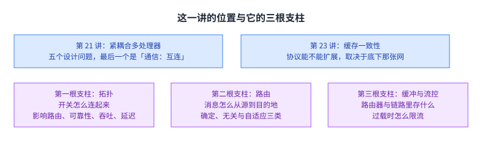

图里上面两格是对第 21 讲与第 23 讲的回指，下面三格是这一讲的三根支柱。看这一页时可以把它当成「多个核连起来」这一步的实现细节。

## 从一致性过来的那条线

讲义第 3 页把两种一致性方法并排复习。snoopy 是基于总线的，它把所有内存请求的串行化集中在一个点上，处理器通过观察别人的动作来保持一致。讲义给的例子是：P1 在总线上发出对 A 的 read-exclusive 请求，P0 看到之后作废自己手里的副本。

directory 则把串行化的责任按块分散到各个节点上。处理器显式地向目录请求块，目录记录哪些缓存持有每个块，并由它来协调作废与更新。讲义给的例子是：P1 向目录要独占副本，目录转去让 P0 作废，等到 P0 的确认之后再回应 P1。

第 4 页把两者的得失列清楚，这一页是本讲的接点。snoopy 的好处是缺失[[term:latency]]处在关键路径上很短，全局串行化容易，而且能直接从总线式单处理器改过来。代价是它依赖广播被所有缓存以同一顺序看到，于是总线成了单一串行化点，不可扩展；要用它就必须有一条虚拟总线，或者一个全序的互连。directory 的代价是缺失延迟多了一次间接，也就是请求先到目录再到内存，另外需要额外存储跟踪持有者集合，协议与竞态也为了高性能变得更复杂；它的好处是不需要广播，可扩展性与互连和目录存储同量级。

这一段给这一讲的问题定了形：拓扑决定能不能提供全序广播，也决定点对点通信的代价；而流控决定在高负载下这两件事还能不能维持。

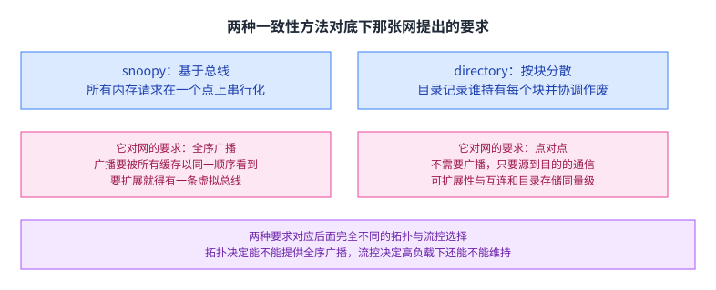

图里左边是 snoopy 需要的全序广播，右边是 directory 只需要点对点。两种要求对应后面完全不同的拓扑与流控选择。

## 互连用在哪里，为什么重要

讲义第 8 页列出互连的用处：处理器与处理器之间，处理器与内存体之间，处理器与缓存体之间，缓存与缓存之间，以及 I/O 设备。也就是说，一台机器里几乎所有「两个部件要说话」的地方都落在这张网上。

第 10 页把重要性分成三个层面。第一是可扩展性与成本：能建多大的系统，加处理器有多容易。第二是性能与[[term:energy-efficiency]]：处理器、缓存与内存之间通信有多快，访存延迟有多长，以及通信花掉多少能量。第三是可靠性与安全：能不能保证消息被送达，或者能不能保证协议真的能工作。

第 13 页到第 15 页给了一个不那么典型的例子：时钟分布网络。问题是时钟信号到达芯片不同部分的时间不一致，会造成时序问题；解决办法是把这张互连设计成让时钟到达各处的延迟大致相等。讲义接着复习了时钟偏斜的后果：它同时抬高了建立时间与保持时间的要求，也就是增加了排序开销，每个周期能做的有用功变少，所以设计者必须把偏斜压到最小。第 15 页挂了 Alpha 21264 的时钟偏斜空间分布当例子。

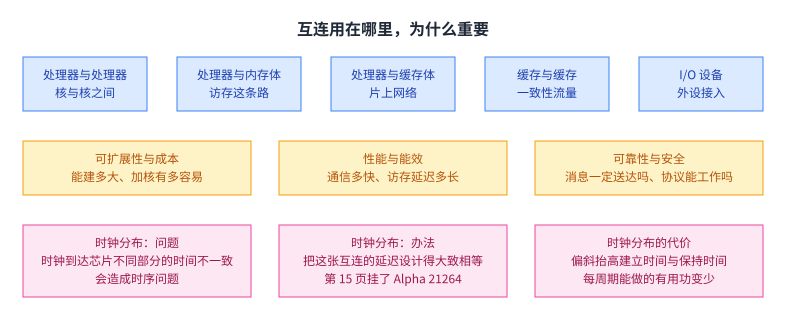

图里上面是五类用法与三个重要性层面，下面是时钟分布网络的三个要点。它说明互连不只是数据通路，也包括像时钟这样只传一个信号的通路。

## 三根支柱与术语

第 17 页把这一讲的骨架摆出来，一共三根支柱。第一根是拓扑，也就是开关怎么连起来，它影响路由、可靠性、吞吐、延迟与建造的难易。第二根是路由算法，也就是消息怎么从源走到目的地，它可以是静态的，也可以是自适应的。第三根是缓冲与流控，也就是路由器与链路里存什么，存整个包还是包的一部分，以及在过载时怎么限流；讲义特别指出，它与路由策略是紧耦合的。

第 18 页到第 20 页给术语。网络接口是把端点接到网络上的模块，它把计算与通信解耦。链路是承载信号的一束线。开关或路由器把固定数目的输入通道接到固定数目的输出通道。通道是路由器之间的一条逻辑连接。节点是网络里的一个路由器或开关。消息是网络客户端的传输单位，比如处理器或内存发出的请求；包是网络的传输单位；flit 是流控单位，名字来自 flow control digit。路由器用 radix 描述，比如两个输入两个输出就是 2 元。网络还分直连与间接：端点在网络里面是直连，在外面是间接；网格是直连的，每个节点既是端点又是开关。

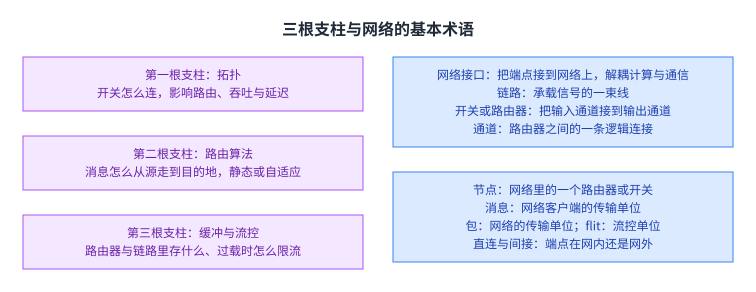

图里左边是三根支柱，右边是这一节定义的一组术语。后面几节都按这三根支柱的顺序展开。

## 怎么评价一张网：性质与度量

第 22 页给拓扑的性质。规则或不规则，看它是不是一张规则图，环与网格都是规则的。路由距离是一条路径上的链路数或者跳数。直径是网络里最大的路由距离。平均距离是所有有效路径跳数的平均值。

第 23 页给两个更宏观的性质。二分带宽的算法是把网络切成两半，把被切断的链路带宽加起来，也就是跨越两半的通道数乘以每条通道的[[term:bandwidth]]；讲义提醒它只对递归拓扑有意义，而且有误导性，因为它不反映开关与路由的效率，更不反映执行时间。阻塞与非阻塞则是另一个维度：如果任意源与目的的排列都能连通，网络就是非阻塞的；否则是阻塞的。还有一个中间形态叫可重排非阻塞，它在切换排列时需要重新调整连接。

第 25 页把评价拓扑的度量列出来：成本；延迟，可以按跳数也可以按纳秒算；争用；此外还有能量、带宽与系统整体性能这些值得一并考虑的指标。

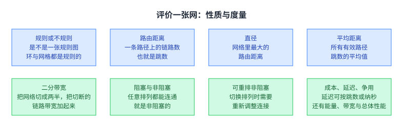

图里上面是四个拓扑性质，下面是五个评价维度。后面比较各种拓扑时，用的就是这几个量。

## 拓扑家族

讲义从最简单的一路排到最复杂的，每一页都给出好处与代价。

总线把所有节点接到一条链路上（p26）。它简单，节点少时成本低，而且做一致性与串行化容易。它的代价是扩展不上去：带宽有限，电气负载还会降低频率；争用高，很快就饱和。

点对点给每一对节点一条专用链路（p27）。它的争用最低，延迟可能也最低，成本不是问题时最理想。代价是成本最高：每个节点要 O(N) 个连接或端口，链路上总共 O(N²) 条；它扩展不上去，而且在芯片上不好布局。

交叉开关给每个目的地一条共享链路（p28）。它允许并发传输到不冲突的目的地，节点数少时可能划算。好处是低延迟高吞吐，代价是贵、O(N²) 不可扩展、N 大时仲裁困难。讲义点名说它被用在核到[[term:cache]]体的网络上，例子是 IBM 的 POWER5 与 Sun 的 Niagara 一代与二代。第 30 页给了 Sun UltraSPARC T2 的实例：它是 8 个核到 8 个 L2 体与 NCU 之间的高带宽接口，四级流水分别是请求、仲裁、选择与传输，每个请求者还有一个两深的队列。第 32 页对比了缓冲与非缓冲两种交叉开关：非缓冲的那一侧仲裁与调度更简单，对变长包的支持也高效，代价是需要 N² 个缓冲。

如果嫌交叉开关贵，讲义在第 33 页给出思路：用多级网络。第 34 页说清了它的形状：多级对数网络是间接网络，在端点之间放多层开关，成本 O(N log N)，延迟 O(log N)，变体很多，包括 omega、butterfly、benes 与 banyan。它比交叉开关限制并发收发对，但比交叉开关便宜。第 36 页与第 37 页区分了两种多级网络：电路交换的那一种，在数据发送之前先把整条源到目的的路径配置好，路径建立之后不需要缓冲；包交换的那一种，包在路由器之间一跳一跳地走，能不能走取决于下一级开关与缓冲的可用性。第 38 页把电路交换与包交换的得失并排列出来：电路交换仲裁快、不需要缓冲，但建立与拆除路径要花时间，而且一条路径不能被多条流共用；包交换不需要建立与拆除的时间，更灵活，不会让链路闲置，但可能要动态切换，因而更慢，还需要处理争用。

讲义还专门讲了三种具体的多级网络。Delta 网络每一对源与目的之间只有一条路径，每一级的路由器都不同，它当年被提出来是为了替代昂贵的交叉开关做处理器与内存之间的互连（Patel，ISCA 1979）。Omega 网络同样只有单一路径，但所有级都一样，它被用在 NYU 的 Ultracomputer 上（Gottlieb 等，1983）；第 43 页顺手讲了它的一个妙用：把发往同一共享内存位置的多个操作在网络里合并，比如把 fetch-and-add 合并起来，这样做能降低同步延迟。Butterfly 与 omega 等价，也是间接网络，被用在 BBN 的 Butterfly 上；它的冲突会造成讲义所说的 tree saturation，而把路由选择随机化有帮助。

直接拓扑这一侧，讲义讲了六种。环把每个节点连到另外两个节点上（p46）：它便宜，成本 O(N)，但延迟高，也是 O(N)，不容易扩展，二分带宽还是常数。讲义说它被用在 Intel 的 Haswell 与 Larrabee、IBM 的 Cell 以及今天许多商用系统上。单向环的平均跳数是 N/2；双向环能降低延迟、改善可扩展性，代价是注入策略稍微复杂一点。层次环更可扩展、延迟更低，代价是更复杂；讲义挂了两篇自己的后续工作，主题是用 deflection routing 做的多半缓冲层次环，并提到真实系统里也在用它。第 49 页的例子是 Intel 在 2021 年的 Alder Lake。

网格给每个节点连上北东南西四个邻居（p54）：成本 O(N)，平均延迟 O(sqrt(N))，在片上容易布局，链路规则而且等长，路径多样性也好；它被用在 Tilera 的 100 核芯片与很多片上网络原型上。环面解决的是网格在边缘不对称的问题：网格的性能对任务被放在边缘还是中间很敏感（p55）。环面在这个问题上更好，路径多样性与二分带宽都比网格高，代价是成本更高、片上更难布局、链路长度也不相等。

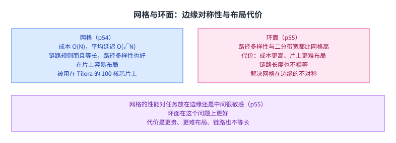

图里左边是网格、右边是环面：两者的差别就在边缘的对称性与布局代价上。

树与胖树这一侧（p57）：平面层次拓扑的延迟是 O(log N)，适合局部流量，成本 O(N) 而且容易布局，缺点是根可能成为瓶颈；胖树就是为了避免这个问题，CM-5 用的是它。第 58 页说 CM-5 的胖树基于 4x2 的开关，包交换，向上走的时候随机路由，并且在硬件里支持合并、多播与归约操作。

最后是超立方（p60）：它是一个 N 维立方，延迟 O(log N)，路由器的元数 O(log N)，链路数 O(N log N)；好处是低延迟，坏处是在二维或三维里很难布局。第 61 页给了一个真实例子：Caltech 的 Cosmic Cube 是一台 64 节点的消息传递机器。

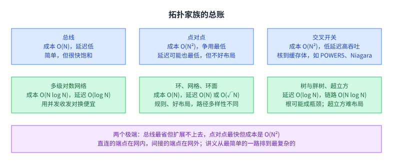

图里按成本从低到高把几类拓扑排开，每一格写上它的延迟与代价。这一页可以先记住两个极端：总线最省但扩展不上去，全连接最快但成本是 O(N²)。

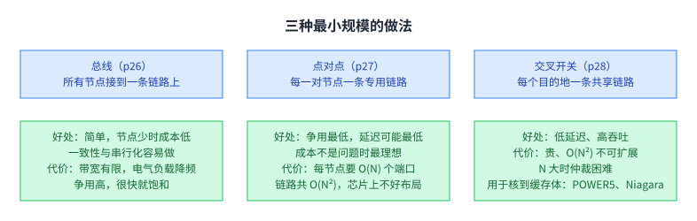

图里三格是三种最基础的做法，各自列了好处与代价。交叉开关那一格还附了它在真实系统里的两个用处。

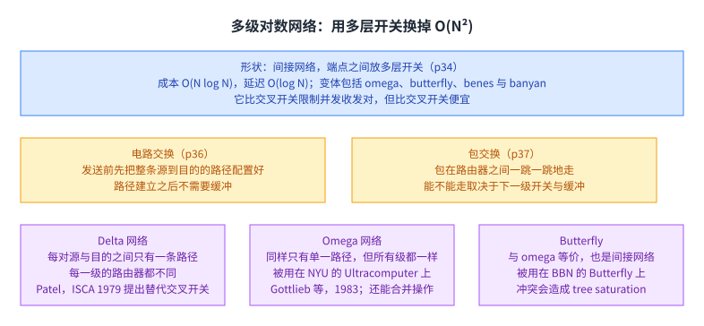

图里上面是多级网络的形状与代价，中间是电路交换与包交换的差别，下面是三种具体的多级网络。

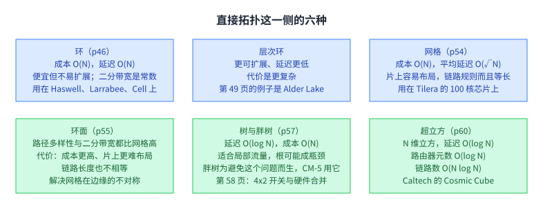

图里每一种拓扑都给出成本与延迟两个量，并标出讲义点到的真实系统。这一节所有数字都来自讲义页面。

## 路由：消息怎么从源走到目的地

路由分两层讲。第 64 页讲机制，一共三种。算术机制用简单的算术在规则拓扑里决定路径，网格与环面里的维序路由就是这一类。源端指定由源为路径上每个开关指定输出端口，好处是开关简单，可以直接把头里的输出端口剥掉而无需控制状态，坏处是头部很大。查表机制用索引去查表得到输出端口，好处是头部小，坏处是开关更复杂。

第 65 页讲算法，也分三类。确定性算法对同一对源与目的总选同一条路径。无关算法会选不同路径，但不看网络当时的状态。自适应算法会根据网络状态选不同的路径；它适应的方式可以是局部或全局反馈，也可以限定在最小路径或允许非最小路径。

第 66 页展开确定性路由。所有同源与目的对的包走同一条路径，典型做法是维序路由：先走完 X 维再走 Y 维，也就是 XY 路由，它被用在 Cray 的 T3D 与很多片上网络里。好处是简单，而且无死锁，因为资源分配里不会出现环；坏处是可能造成高争用，也不利用路径多样性。

第 67 页讲死锁：网络里没有前进，成因是资源的循环依赖，每个包都在等下游另一个包占着的缓冲。第 68 页给出四种处置：让路由不成环，比如维序路由；不让循环依赖形成，办法是限制包能做的「转弯」；加缓冲做逃逸路径；以及检测到之后打破它，比如抢占缓冲。第 69 页专门讲限制转弯的做法，叫 turn model：先分析包在网络里能往哪些方向转，再找出这些转弯能形成哪些环，然后只禁掉刚好够打破环的那几个转弯（Glass 与 Ni，ISCA 1992）。

第 70 页讲无关路由的代表，Valiant 算法。目标是平衡网络负载，做法是随机选一个中间目的地，先把包路由到那里，再从那里路由到目的地；两段都可以用维序路由。好处是把负载随机化、平衡了，坏处是路径不再最小，包的延迟可能增加。讲义给了两个优化：只在高负载时这么做；以及把中间节点限制在附近，比如同一个象限里。

第 72 页讲自适应路由的两种。最小自适应让路由器用网络状态，比如下游缓冲的占用情况，来挑一个「有生产力」的输出端口，也就是能让包更接近目的地的端口；好处是知道本地拥塞，坏处是最小性限制了能达到的链路利用率与负载均衡。完全非最小自适应则根据网络状态把包「误送」到没有生产力的端口上，好处是网络利用率与负载均衡更好，坏处是必须保证不会活锁。第 73 页补了自适应路由的一个实际用途：绕开故障链路与路由器。确定性路由处理不了故障部件，而自适应可以改路由表把故障路由禁掉，前提是故障已经被检测出来。第 74 页挂了 Fattah 等人在 NOCS 2015 上的保证送达路由算法当例子。

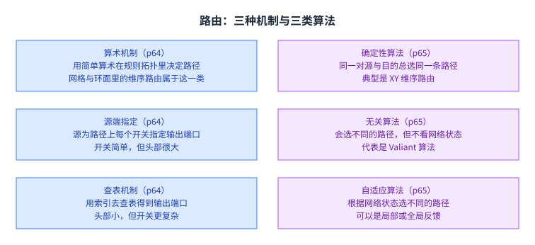

图里左边是三种实现机制，右边是三类算法取向。机制解决「怎么算」，算法解决「怎么选」。

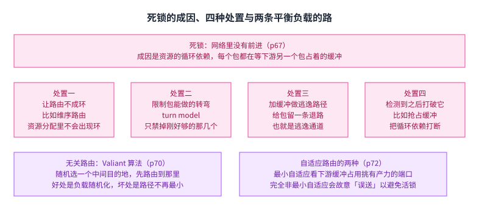

图里上面是死锁的成因与四种处置，下面是 Valiant 算法与两种自适应路由。它们分别回答「怎么不出环」与「怎么把负载摊开」。

## 缓冲与流控：从存储转发到虚拟通道

第 78 页先给包的格式：头部带路由与控制信息，载荷带数据，错误码一般放在尾部，这样可以在出去的路径上生成。

第 79 页把争用这件事说清楚：两个包同时要用一条链路时，只有三个选择，缓冲一个、丢掉一个，或者误送一个。讲义把误送叫 deflection，它正是后面无缓冲路由的基础。

第 80 页列出五种流控方法：电路交换、无缓冲的包或 flit 级方法、存储转发、虚拟直通，以及虫洞。第 81 页复习电路交换：它的资源分配粒度很大，想法是为一条流跨多个开关预先分配资源，因此需要先发一个探针把路径建起来；好处是不需要缓冲，没有争用，流的性能被隔离，而且能处理任意大小的消息，坏处是链路利用率低，两条流不能共用一条链路，而且建链有握手开销。

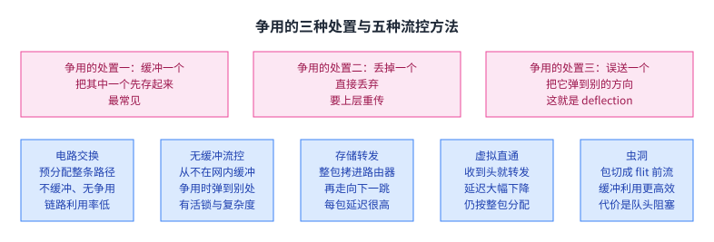

图里上面是处理争用的三种选择，下面是五种流控方法与它们各自付出什么、换来什么。

无缓冲的 deflection 路由来自 Baran 在 1962 年与 1964 年的工作，讲义在第 82 页给出关键想法：包从不在网络里被缓冲，两个包争同一条链路时，其中一个被弹到别的方向。第 83 页说明它的实现：输入缓冲被整个去掉，包改而暂存在流水线锁存器与网络链路上；这也是 Moscibroda 与 Mutlu 在 ISCA 2009 上那篇工作的主张。第 84 页列出它的三个问题：活锁、路由器复杂度，以及高负载下的性能与拥塞。后面几页挂了这条线上的后续工作：CHIPPER 这个低复杂度无缓冲偏转路由器（HPCA 2011）、MinBD 这种最少缓冲的偏转路由（NOCS 2012）、用偏转路由做的多半缓冲层次环（SBAC-PAD 2014）、一篇八年研究的总结，以及无缓冲互连在真实系统里的落地。

有缓冲这一侧，讲义讲了三级递进。存储转发最直接（p94）：整个包先被完整拷进路由器，再走向下一跳，流控单位就是整个包；代价是每包延迟很高，而且每个节点都要为整包准备缓冲。直通改进了一步（p95）：只要头部收到、资源分配好就开始转发，延迟大幅下降；但它仍然按整包分配缓冲与通道带宽，所以包一大又出问题。第 96 页追问输出端口被堵时怎么办：可以让尾部继续走，把整条消息吸收进一个开关里，而这需要能装下最大包的缓冲；在高争用下它会退化成存储转发。

虫洞是第三步（p97）：把包切成更小的 flit，flit 按虫洞的方式在网络里前进，体跟着头、尾跟着体，是流水化的；头被堵住，整个包就停住；路由信息只放在头部，体与尾靠路由器里的状态跟着头走。讲义说它相对存储转发有两个好处：延迟更低，缓冲利用更高效；也有两个限制：长消息的延迟几乎与距离无关，这是好事，但队头阻塞是坏事。第 98 页把队头阻塞说清楚：头 flit 因为争用不能前进时，另一个虫即使链路空着也不能走。

第 101 页给出解法，虚拟通道：在一条物理通道上多路复用多条通道，也就是把输入缓冲切成多个缓冲，让它们共享同一条物理通道（Dally，ISCA 1990）。第 105 页列了虚拟通道的其它用途：避免死锁，比如在某些转弯上强制切到另一组虚拟通道以打破资源的循环依赖；给虚拟通道排顺序，比如保留一条走无死锁路由的逃逸通道并保证每个 flit 都能公平访问它，以及让地址包与数据包走不同的虚拟通道以避免协议级死锁；还有给流量类别分优先级。

第 108 页讲下游怎么把自己的缓冲可用性告诉上游，三种做法。信用式让上游知道下游有多少缓冲，下游把信用传回上游，代价是上游的信令开销大，flit 越短信令越多。开关式也就是 XON/XOFF，下游给上游一个开关信号。ACK/NACK 让上游乐观地发，缓冲要等到确认或否认才能释放，缺点是缓冲空间利用率低。第 109 页补了信用式的一个关键量：往返信用延迟，也就是从某个缓冲变空到它能处理下一个 flit 之间要等的时间；缓冲很少时吞吐会显著下降，所以缓冲要按信用周转来定大小。

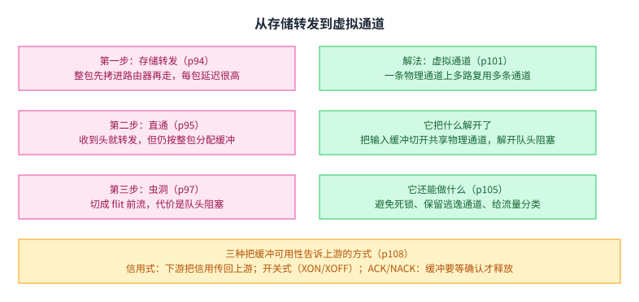

图里左边是三级递进与它们各自的问题，右边是虚拟通道这个解法与它的其它用途，最下面一格是三种缓冲可用性的通知方式。

## 性能：延迟与吞吐各自从哪里来

第 113 页用一张图把这件事拆开。延迟这一侧：最小延迟由拓扑决定，也由路由算法决定，零负载延迟则由拓扑、路由与流控三者共同决定。吞吐这一侧同样分成三份：一部分由拓扑给，一部分由路由给，一部分由流控给。图上还定义了饱和吞吐，也就是延迟趋于无穷时对应的注入率。

第 114 页给理想延迟：它只来自源到目的的线延迟，其中 D 是曼哈顿距离，v 是传播速度，L 是包大小，b 是通道带宽，公式是 D 除以 v 加上 L 除以 b。第 115 页说明为什么实际延迟更长：专用连线不现实，长线必须分段并在中间插入路由器，于是公式多出两项，跳数 H 乘以路由器延迟，再加一项争用造成的延迟。

第 116 页给负载与延迟的关系曲线：横轴是注入负载占容量的比例，纵轴是延迟，曲线从左端的零负载延迟一路平缓到饱和点后陡然上升。第 117 页与第 118 页给了这条曲线的实例，出处是 Grot 等人关于 express cube 拓扑的工作。第 119 页到第 121 页挂了这条线上的两项后续工作：多落点 express 通道（HPCA 2009）与建立在它之上的 Kilo-NoC，后者是面向千节点芯片的异构片上网络，入选 IEEE Micro 的 Top Picks。

第 122 页给网络性能的度量：包延迟的平均与最大值、往返延迟、饱和吞吐，以及应用级的执行时间与系统级的作业吞吐；讲义特别注明，作业吞吐会受到线程与应用之间[[term:interference]]的影响。

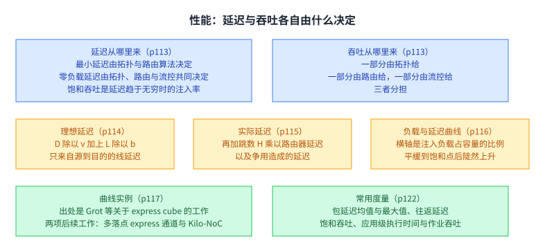

图里上面是延迟与吞吐各自的来源分解，中间是两个延迟公式，下面是负载与延迟的曲线与常用度量。

## 与本课程其它讲的连接

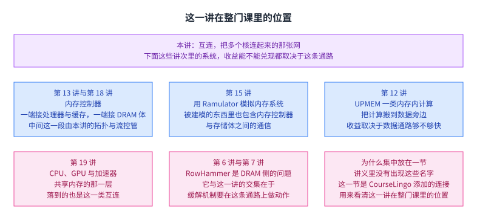

这一讲讨论的那张网，在这门课的其它几讲里都出现过，只是角度不同。第 13 讲与第 18 讲讲的内存[[term:memory-controller]]，它的一端就接着处理器与缓存，另一端接着[[term:dram]]体，中间这一段正是这一讲的拓扑与流控在管。第 15 讲用 Ramulator 那样的模拟器评估内存系统时，被建模的东西里也包含内存控制器与存储体之间的通信。第 12 讲讲过的 UPMEM 一类[[term:processing-in-memory]]系统，把计算搬到数据旁边，它的收益有多少能被兑现，同样取决于数据通路够不够快。第 19 讲里 [[term:cpu]]、GPU 与[[term:accelerator]]共享内存的那一层，落到的也是这一类互连。而第 6 讲与第 7 讲的[[term:rowhammer]]是[[term:dram]]侧的可靠性问题，它与这一讲的交集在于：缓解机制常常要在内存控制器与存储体之间的这条通路上做动作。

上面这一段是 CourseLingo 添加的连接，不是讲义内容，讲义里没有出现这些名字；本页把它们集中放在一节里，是为了让读者看清这一讲在整门课里的位置。

## 脉络回顾

这一讲展开的是第 21 讲五个设计问题里的最后一个：通信与互连。它同时也是缓存一致性那一讲的下游，因为一致性协议的成败直接取决于底下那张网能不能提供全序广播、点对点通信要花多少代价。

讲义把内容组织成三根支柱。拓扑是开关怎么连，它影响路由、可靠性、吞吐、延迟与建造难易；路由是消息怎么走，分确定、无关与自适应三类；缓冲与流控是在路由器与链路里存什么、过载时怎么限流。术语那一节还给了网络接口、链路、开关、通道、节点、消息、包与 flit 这组基本词，以及直连与间接的区分。

拓扑这一节是一条从便宜到贵的谱。总线最省，但带宽有限、电气负载会降频、很快饱和。点对点争用最低，但成本是 O(N²)。交叉开关在中间，靠给每个目的地一条共享链路换来并发，代价同样是 O(N²)，真实系统里用在核到缓存体的网络上。再往上走是多级对数网络，成本 O(N log N)、延迟 O(log N)，用限制并发收发对换来便宜，具体形态有 delta、omega 与 butterfly，其中 omega 还能在网络里合并操作以降低同步延迟。直接拓扑这一侧有环、层次环、网格、环面、树与胖树、超立方，各自在成本、延迟、布局难度与路径多样性之间取舍。

路由这一节的重点是死锁。成因是资源的循环依赖，处置办法有四种，其中限制转弯的 turn model 最巧妙：只禁掉刚好够打破环的那几个转弯。为了平衡负载还有两条思路：Valiant 算法随机选一个中间目的地绕一下，或者用自适应的路由方式根据网络状态选路，后者还能绕开故障部件。

流控这一节是一条改进链。存储转发要为整包缓冲，延迟高；直通一收到头就开始转发，但资源仍按整包分配；虫洞把包切成 flit，缓冲利用率与延迟都更好，代价是队头阻塞；虚拟通道在一条物理通道上多路复用多条通道，把队头阻塞解开，顺便还能用来避免死锁、给流量分类。下游把缓冲可用性告诉上游有三种做法，信用式、开关式与确认式。

最后是性能。延迟的最小值由拓扑与路由决定，实际值要多加跳数与争用两项；吞吐同样由拓扑、路由与流控三者分担；把两者画在一张图上，就是那条从零负载延迟平缓爬升、到饱和点陡然上升的曲线。

## 读完应该能回答

1. 这一讲对应第 21 讲五个设计问题里的哪一个，它与缓存一致性那一讲的接口在哪。
2. snoopy 与 directory 两种一致性方法各自对底下那张网提出了什么要求。
3. 互连在机器里的五类用法，以及讲义给的三个重要性层面。
4. 时钟分布网络为什么也算互连，时钟偏斜的代价是什么。
5. 三根支柱分别是什么，消息、包与 flit 的区别是什么。

6. 二分带宽怎么算，为什么讲义说它有误导性。
7. 总线、点对点、交叉开关、多级对数网络在成本与延迟上各是什么量级。
8. 死锁的成因是什么，turn model 的思路是什么。
9. 存储转发、直通、虫洞、虚拟通道各自解决了什么、付出了什么。
10. 理想延迟与实际延迟的公式差在哪两项。

## 溯源

- 对应：ETH Zürich Computer Architecture（Onur Mutlu 主讲，Fall 2022），Lecture 20 — Interconnects。讲义链接：<https://safari.ethz.ch/architecture/fall2022/lib/exe/fetch.php?media=onur-comparch-fall2022-lecture20-interconnects-afterlecture.pdf>
- 上游许可：站点级页脚为 CC BY-NC-SA 4.0。**SA 是传染性的**，所以本页的译文也以同协议发布、且为非商业用途。本页未转载原讲义里的任何图片，配图全部自绘。
- 证据来源：`_sources/eth-ddca-ca/evidence/eth-ca2022-lecture20-interconnects.pdf.pypdfium2.txt`（pypdfium2 抽取，123 页，38,375 字符），交叉核对用同名的 `.pdf.pypdf.txt`（pypdf 抽取，123 页，37,027 字符）。四道完整性核验：6,047,420 字节、尾部有 `%%EOF`、不是 2 的整数次幂、不是 64 KiB 的整数倍。仓内自研的 `pdftext*.py` 这一族在前几讲已被实测为不可靠，本页没有采用它们的任何输出。
- **与第 21 讲、第 23 讲的分工**（正文已显式回指）：第 21 讲把紧耦合多处理器的设计问题列了五个，互连是第五个「通信」，那一讲只点名；这一讲展开它。讲义自己的衔接也摆在第 2 页到第 4 页：先总结多处理基础、内存顺序与缓存一致性，再复习两种一致性方法，而第 4 页那句「snoopy 需要一条虚拟总线或一个全序的互连」就是这一讲的动机。
- **一节由 CourseLingo 添加的内容**：「与本课程其它讲的连接」整节是我方添加，讲义里没有出现 DRAM、Ramulator、UPMEM、GPU 这些名字，也没有跨讲的对照。写入理由见那一节末尾的说明；这一段不是对讲义的复述。
- 本讲取材范围是讲义的全文 p1 到 p123，其中 p123 是重复的封面页，没有 Backup Slides 分节。讲义里只有图、标题或出处的页：分节页 p5、p7、p17、p21、p45、p63、p75、p111、p112；图片页 p9、p11、p13 到 p16、p20、p24、p26 到 p32、p34 到 p37、p40、p41、p46 到 p50、p53 到 p63、p70、p78、p80、p82、p83、p91 到 p93、p98 到 p100、p103、p104、p106、p107、p109、p110、p113、p116 到 p118、p122；纯链接与出处页 p6、p12、p33、p42 到 p44、p51、p52、p58、p59、p71、p74、p85 到 p90、p94 到 p97、p101、p102、p105、p108、p114、p115、p119 到 p121。这些页本页只登记标题、主题或出处，没有替它们复原内容。
- 数字与定义以讲义页面为准：五类互连用法、三个重要性层面、三根支柱、八个基本术语、四个拓扑性质与五个评价维度、各类拓扑的成本与延迟量级、三种路由机制与三类路由算法、四种死锁处置、五种流控方法、三种缓冲可用性通知方式、两个延迟公式、以及各项工作的出处（Goodman ISCA 1983、Papamarcos 等 ISCA 1984、Censier 与 Feautrier IEEE ToC 1978、Patel ISCA 1979、Gottlieb 等 1983、Glass 与 Ni ISCA 1992、Valiant 1981 与 1982、Dally ISCA 1990、Baran 1962 与 1964、Moscibroda 与 Mutlu ISCA 2009、CHIPPER HPCA 2011、MinBD NOCS 2012、层次环 SBAC-PAD 2014、Fattah 等 NOCS 2015、Grot 等 HPCA 2009、Kilo-NoC ISCA 2011、Wentzlaff 等 IEEE Micro 2007、Nawathe 等 JSSC 2008、Seitz CACM 1985、Hillis 与 Tucker CACM 1993、Dally 与 Towles 2004）。**第 116 页那条负载与延迟曲线上的具体数值没有写进这一页**，因为讲义那一页只有图，正文没有复述。
- 讲义未展开的推论属于 CourseLingo 的讲解。这类推论有三组：把这一讲写成第 21 讲的最后一个设计问题与第 23 讲的下游；把「总线不可扩展」与「需要全序互连」读成整讲的动机；以及把流控那一节读成一条从存储转发到虚拟通道的改进链。
