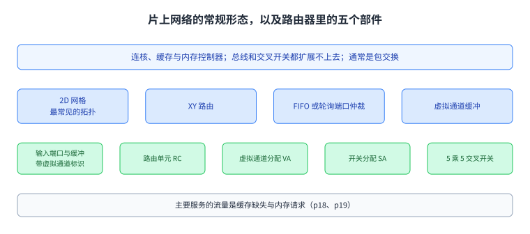
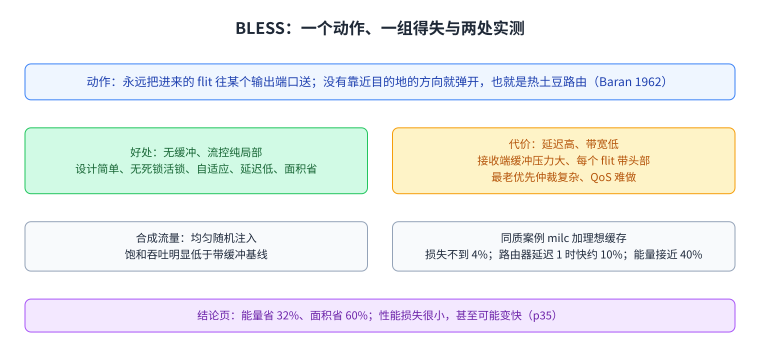
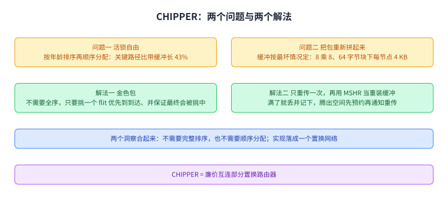
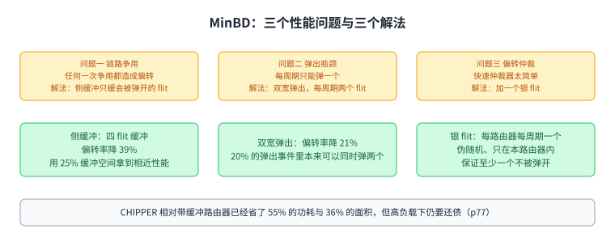
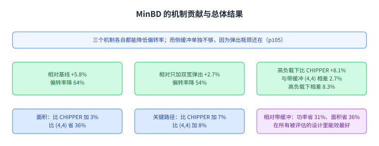
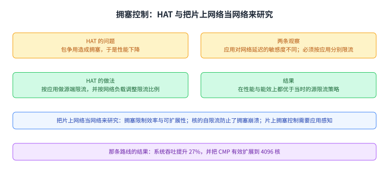
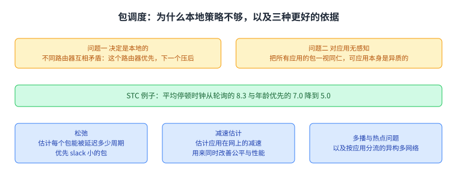
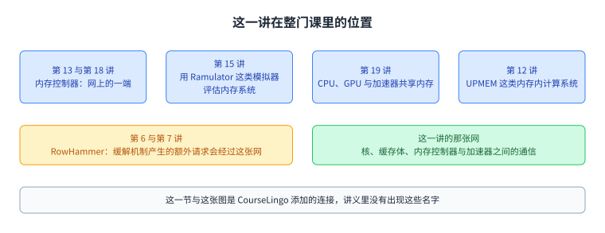

+++
title = "片上网络：把互连塞进一颗芯片之后，什么变了"
lecture = 25
slug = "lecture21-on-chip-networks"
status = "draft"
source_kind = "notes"
source_url = "https://safari.ethz.ch/architecture/fall2022/lib/exe/fetch.php?media=onur-comparch-fall2022-lecture21-onchipnetworks-afterlecture.pdf"
source_title = "Lecture 21: On-Chip Networks (Fall 2022, afterlecture)"
output_mode = "explanation"
+++

> 来源课程：ETH Zürich Computer Architecture（Onur Mutlu 主讲，Fall 2022）；
> 对应讲义：Lecture 21 — On-Chip Networks（`onur-comparch-fall2022-lecture21-onchipnetworks-afterlecture.pdf`，280 页，正文 p1 到 p175）；
> 讲义链接：<https://safari.ethz.ch/architecture/fall2022/lib/exe/fetch.php?media=onur-comparch-fall2022-lecture21-onchipnetworks-afterlecture.pdf> ；
> 上游许可：该课程 wiki 每一页的页脚都带站点级许可块，原文为 CC BY-NC-SA 4.0：<https://creativecommons.org/licenses/by-nc-sa/4.0/deed.en> ；
> 本页由 CourseLingo 用中文重新讲解，按源讲义的推进顺序组织，不是逐字翻译，也不转载原讲义里的任何图片；
> 页内配图全部由我们自绘；原讲义里只有图、没有字的页，我们只如实记下它的标题。
> 本页为非官方材料，与 ETH Zürich 及课程教学团队无隶属关系；如与原文有出入，以原文为准。

本页的事实来自 `_sources/eth-ddca-ca/evidence/eth-ca2022-lecture21-on-chip-networks.pdf.pypdfium2.txt`（pypdfium2 抽取，280 页，90,893 字符），交叉核对用同名的 `.pdf.pypdf.txt`（pypdf 抽取，280 页，87,936 字符）。抽取器是 `_sources/_audit/pdftext_alt.py`。该 PDF 入库前按四道核验过完整性：体积 8,102,242 字节、尾部有 `%%EOF`、不是 2 的整数次幂、也不是 64 KiB 的整数倍（余数 41,314）。仓内自研的 `pdftext*.py` 这一族在前几讲已被实测为不可靠，本页没有采用它们的任何输出。

## 这一讲要解决什么问题

第 24 讲把互连的通用原理讲了一遍（[[term:simulation]]里的建模也一样要经过它）：拓扑、路由、流控与性能，并把「总线与交叉开关不可扩展」列成了整讲的动机。这一讲把同一套原理搬进一颗芯片，于是要回答的是同一个问题在两个物理约束下的差别。

讲义在第 20 页把这两组差别并排摆出来。片内的好处是核间延迟低、没有引脚约束，而且布线资源既丰富又低功耗，于是能拿到很高的带宽，全局协调也更简单。片内的约束是二维基板限制了容易实现的拓扑；能耗与功耗成为核心关切，因此复杂的算法不受欢迎、大缓冲也不受欢迎；而逻辑面积与金属层又反过来限制了布线资源能用多少。

第 21 页把「成本在哪里」这件事说得更直接。片外的成本是通道、引脚、连接器与线缆；片内的成本是存储与开关，因为线本身是充裕的。这一句解释了后面所有设计的取向：片内网络会走「很多条宽通道、更少的缓冲」这条路。同一页还给了两个物理细节：片内距离短所以延迟低；但片上 RC 线每 1 到 2 毫米就要插一个中继器，而中继器里可以顺手放逻辑。负载也换了：片外是大规模并行应用跨芯片的流量，片内是多核的缓存与内存流量。

图里左右两栏对比片内与片外在成本、约束与负载上的差别。这一页可以先记住一句话：片上不缺线，缺的是面积与功耗预算，而缓冲正好同时吃这三样。

## 片上网络长什么样

第 18 页给出片上网络的常规形态。它连接的是核、缓存与内存控制器这些部件，因为总线和交叉开关都扩展不上去。它通常是包交换的。2D 网格是最常见的拓扑。XY 路由配上先进先出或者轮询的端口仲裁很常见，虚拟通道缓冲也很常见。它主要服务的流量是缓存缺失与内存请求。

第 19 页把路由器内部拆开：输入端口带缓冲与虚拟通道标识，中间是一个 5 乘 5 的交叉开关，控制逻辑分成三级，分别是路由单元、虚拟通道分配器与开关分配器。这一页的部件划分在后面几节反复出现，因为说到底，这一讲要优化的就是这块逻辑与它带的[[term:cache]]缓冲。

图里上面是 2D 网格上的路由器与处理单元，下面是路由器内部的五个部件。后面所有做减法的方案，动的都是这里面的缓冲与仲裁。

## 为什么盯上缓冲

第 25 页承认缓冲的必要性：缓冲是拿到高网络[[term:bandwidth]]吞吐的前提，因为它增加了网络里可用的带宽；同一页用三条曲线显示，缓冲越小，延迟随注入率上升得越早。所以问题不是「缓冲好不好」，而是「它有多贵」。

第 26 页把三笔账算清楚。第一笔是能量：读写的动态能量，以及没被占用时也在漏的静态能量。第二笔是复杂度与延迟：缓冲管理逻辑、虚拟通道分配、基于信用的流控都要为此存在。第三笔是面积，而这一笔有具体数字：在 TRIPS 原型芯片里，输入缓冲占掉了片上网络总面积的 **75%**。

第 27 页于是把这一讲上半段的问题列成一串：不要缓冲会损失多少吞吐，延迟会怎么变；在什么注入率以下可以用无缓冲路由；真实场景会不会落在这个区间以下；能省多少能量；面积与复杂度能降多少。

图里上面是缓冲的必要性与它的三笔代价，下面是由此提出的四个问题。这一讲上半段就是这四个问题的答案。

## 无缓冲路由：BLESS

BLESS 的想法只有一个动作（p28）：永远把进来的 flit 往某个输出端口送。如果没有能靠近目的地的方向，就送到另一个方向，这个 flit 就被「弹开」了，讲义把它追溯到 Baran 在 1962 年提出的热土豆路由。

第 29 页给出它的仲裁结构，分两步：先给所有进来的 flit 排一个序，再按这个顺序为每个 flit 找一个当时空闲的最好的输出端口。第 30 页说明 FLIT-BLESS 的规则：每个 flit 独立路由，用最老优先的仲裁，而且它可以套用在大多数拓扑上，只要满足两个条件，每个路由器的输出端口数不少于输入端口数，以及每个路由器都能从其它任何路由器到达。它的流控完全是局部的，输入端口空着就注入；它没有死锁，因为每个 flit 永远在动；它也没有活锁，前提就是那个最老优先的排序。

第 31 页把得失列全。好处是没有缓冲、流控纯局部、设计简单（不需要信用流、不需要虚拟通道）、没有死锁与活锁、有自适应性（包会被弹到拥塞区域旁边绕过去）、路由器延迟更低、面积更省。代价是延迟变高、带宽变低、接收端的缓冲压力变大、每个 flit 都要带头部信息、最老优先的仲裁很复杂，而且服务质量变得很难做。

实测给在两个地方。合成流量那一页是坏消息（p32）：在均匀随机注入下，BLESS 的饱和吞吐明显低于带缓冲的基线。同质案例研究那一页是好消息（p33 与 p34）：在 milc 这一组中等强度的基准上，配上理想的缓存，BLESS 的性能损失很小，在密集网络里不到 4%；如果路由器延迟压到 1 个周期，它甚至能比基线快约 10%；能量上的改善接近 40%。第 34 页还给了两条观察：平均注入率其实并不极高，也就是核本身会自我限流；而对突发与临时热点，可以把网络链路当成缓冲来用。

第 35 页的结论很硬：在很宽的应用与网络设置范围内，片上网络不需要缓冲；能量省下 32%（即使在密集网络与理想缓存下），面积省下 60%；路由器与网络设计显著简化；性能损失很小，甚至可能变快。讲义把它称为重新思考片上网络设计的一个有力理由，并把服务质量、不同流量类别与能耗管理列成后续方向。

图里上面是那个动作与它的得失，下面是合成流量与同质案例两处实测结果。无缓冲的账算得通，代价是复杂度被推到了别处。

## CHIPPER：把无缓冲路由做实用

BG 系列的问题在这一页被点名（p37）：活锁、随之而来的路由器复杂度、高负载下的性能与拥塞，以及服务质量与公平性。CHIPPER 处理的是前两个。

第 40 页先复述了 BLESS 的收益：能量省约 40%，面积省约 40%，性能平均只损失约 4%。但它有两个没解决的复杂度：关键路径很长，重装缓冲很大。第 41 页把无缓冲路由器必须解决的两个问题列出来：一是必须保证无活锁，包不能被永远弹下去；二是必须在到达端把包重新拼起来。

代价在第 43 页量化。为了活锁自由，flit 要按年龄排序，再按年龄顺序分配输出端口，这两件事让关键路径比带缓冲的路由器长 43%。为了重装，缓冲要按最坏情况定大小，在 8 乘 8 的网格、64 字节缓存块的配置下是每个节点 4 KB。

第 49 页给出第一个洞察：其实不需要全序。只要做到两件事就够，挑一个 flit 一直优先到它到达，以及保证任何一个 flit 最终都会被挑中。讲义把被挑中的那个叫金色包，并说部分有序就已经足够。第 50 页说清怎么挑：金色包要保持足够久，久到能保证送达，也就是按最大无争用延迟来定；同时挑选要在所有可能的包编号之间轮转，为了简单就用一个静态的轮转计划。第 51 页把两个洞察合起来：不需要完整排序，也不需要顺序分配。

第 52 页到第 55 页给出实现。在两输入的路由器里，第一步挑出一个「赢家」，金色 flit 优先，否则随机；第二步把赢家送到它想要的输出端口，另一个被弹开。四输入时，每个小块独立做决定，也就是说弹开的决定是分布式的，整套逻辑最后落成一个置换网络，带来的好处是流水线更短。

第二个问题是重装。第 57 页说明缓冲为什么大：最坏情况下每个节点都往同一个接收者发包，而每个节点都可能有包在途，于是需要 O(N) 的空间。第 58 页说明缓冲小了会死锁：重装缓冲满了就弹不出去，弹不出去就不能继续注入，网络很快就满。第 59 页的「先预约再发」会给每个请求都加上延迟。第 60 页的「乐观发送加否认重传」不会在最好情况下加延迟，但会给所有包带上重传开销，而且可能反复重传。

第 61 页给出解法，叫只重传一次：接收者在缓冲满时把包丢掉，并记下丢的是哪一个；等空间腾出来，接收者先把空间预约好，使重传一定能成功，然后通知发送者重传。第 62 页再往前一步：既然缓存缺失本来就要用 MSHR 记录未完成的事务，那就把 MSHR 当成重装缓冲用，于是网络变成真正的无缓冲网络。第 64 页把两个解法对应到两个问题上，CHIPPER 这个名字也在这里给出，全称是「廉价互连部分置换路由器」。

评估方面，结果在第 69 页到第 71 页：低到中等强度的负载下性能损失很小；功率上，去掉缓冲带来大幅节省，图上标的降幅是 **54.9%** 与 **73.4%**，从 BLESS 到 CHIPPER 还有一点小幅节省；面积上 CHIPPER 保住了 BLESS 的节省，图上标的是 **-36.2%** 与 **-29.1%**，而关键路径回到了与带缓冲路由器可比的水平，图上标的是 +1.1% 与 -1.6%。第 72 页的结论说得很清楚：无缓冲偏转路由器此前复杂且不实用，CHIPPER 用金色包把关键路径压短、用只重传一次让重装不死锁、用缓存缺失缓冲当重装缓冲，于是在面积与功耗大幅降低的同时，频率与带缓冲路由器可比，性能损失很小。

图里上面是两个必须解决的问题与它们原来的代价，下面是对应的两个解法。这一节的思路是「把全序换成部分有序，把重传换成只重传一次」。

方法学放在这里：多程序负载用 CPU2006、服务器与桌面程序，8 乘 8 共 64 核，39 组同质与 10 组混合；多线程负载用 SPLASH-2、16 线程、4 乘 4 共 16 核；带缓冲基线是 2 周期路由器、每通道 4 条虚拟通道、每条 8 个 flit；无缓冲基线是 FLIT-BLESS；指令轨迹驱动、128 项乱序窗口、64 KB 一级缓存、理想二级缓存、XOR 映射；硬件用 Verilog 建模，用商用 65 纳米库综合，交叉开关、缓冲与链路用 ORION。

图里上面是它动手之前的两笔代价，下面是它在面积、关键路径与功率上的结果。两组数字放在一张图里，才能看出它省下的到底是哪一部分。

## MinBD：只留一点点缓冲

无缓冲的问题在第 77 页被重新点出：在高网络利用率下，无缓冲偏转路由会造成不必要的链路与路由器穿越，降低吞吐与应用性能，还增加动态功耗。CHIPPER 相对带缓冲路由器已经省了 55% 的功耗与 36% 的面积，但它仍然要在高负载上还债。MinBD 的目标就是降低偏转率。

第 81 页把三个性能问题列清楚。第一是链路争用：没有缓冲可以暂存流量，于是任何一次链路争用都会造成一次偏转。第二是弹出瓶颈：每个路由器每周期只能弹出一个 flit，于是同时到达的 flit 只能被弹开。第三是偏转仲裁：实用的快速仲裁器使用的优先级方案太简单，会做出不必要的偏转。

第一个解法是侧缓冲（p84 到 p87）：输入缓冲之所以贵，是因为它把所有 flit 在每一跳都缓起来，动态能量高，而做大又带来静态能量与面积。所以只加一个小小的缓冲，只缓那些本来会被弹开的 flit。做法是每周期最多从输出端拿掉一个被弹开的 flit，放进一个小的先进先出侧缓冲，等有位置再重新注入流水线。效果是：在这种按 flit 粒度的取舍下，一个四 flit 的侧缓冲把偏转率降低了 **39%**；而相对带缓冲路由器，这个缓冲用得更值，用 25% 的缓冲空间拿到了相近的性能。

第二个解法是双宽弹出（p89 到 p91）：在全部弹出事件里有 20% 的情况下本来可以同时弹出两个 flit，但只有一个端口，于是其余的必须偏转，并造成额外争用；把弹出宽度做成每周期两个 flit，偏转率降低 **21%**。第三个解法是加一个银 flit（p93 到 p98）：金色包保证了前进，但其余 flit 靠随机仲裁会缺少协调，讲义用一个两阶段的小例子说明两个 flit 可能同时被弹开；于是再加一级优先级，每个路由器每周期挑出一个银 flit，挑选是伪随机而且只在本路由器内，这样每周期至少有一个 flit 不会被弹开。

评估方法在第 102 页到第 104 页：64 核与 16 核两种模型，核、缓存与片上网络联合的周期级模型，基于 SGI Origin 的目录缓存一致性协议，64 KB 一级缓存与理想二级缓存，性能指标是加权加速比，负载是 75 组随机挑选的多程序 SPEC CPU2006 并按平均注入率分档；对比的路由器包括带缓冲的 (8,8)、(4,4) 与 (4,1) 三种、CHIPPER，以及一种带输入缓冲与偏转逻辑、按多周期粗粒度切换模式的混合路由器 AFC；共同参数是 2 周期路由器延迟、1 周期链路延迟与 2D 网格。第 105 页的结论是三个机制各自都能降低偏转率，而侧缓冲单独还不够，因为弹出瓶颈还在；合起来相对基线高 5.8%，相对只有双宽弹出高 **2.7%**，偏转率分别降低 64% 与 54%。第 106 页给总体性能：在高负载下比 CHIPPER 高 **8.1%**，与带缓冲的 (4,4) 相差 **2.7%**（高负载下 8.3%），并且用 25% 的缓冲空间拿到与 (4,1) 相近的性能。第 107 页到第 109 页给功率与面积：缓冲在基线路由器里占功率的很大一块，在 MinBD 里这块变得很小；动态功率随偏转路由上升，但在 MinBD 里相对 CHIPPER 下降；面积只比 CHIPPER 增加 3%，相对 (4,4) 减少 **36%**；关键路径比 CHIPPER 增加 7%、比 (4,4) 增加 8%。第 110 页的结论说，MinBD 在功率与面积上相对带缓冲路由器分别省 **31%** 与 **36%**，在高负载下相对无缓冲路由器提升 **8.1%**，把两者的性能差距补上了一半，并且在所有被评估的设计里能效最好。

图里上面是三个性能问题，下面是三个对应的解法与各自的数字。它的立场不是回到带缓冲，而是「只缓该缓的那一个 flit」。

图里每一项是一个机制与它带来的变化，最后一格是合起来的结果。这张图要说明的是：三个机制不能互相替代。

## 拥塞控制与限流

偏转路由把复杂度从路由器里挪走之后，拥塞这件事还得有人管。讲义在第 112 页介绍 HAT。问题很直接：包在片上网络里争用，形成[[term:interference]]与拥塞，于是性能下降。它的两条观察是：有些应用比另一些对网络延迟更敏感；而要让性能达到峰值，不同应用必须被限流的程度不同。做法叫异构自适应限流，两件事：按应用做源端限流，以及按网络负载调整限流比例。结果是在性能与能效上都优于当时的源限流策略。

这一节还挂了另一条线，是把片上网络当成网络来研究（p120 到 p123）。讲义给的结论包括：这是把一个传统网络问题放到了新语境里，而独特的设计需要新的解法；拥塞限制了效率与可扩展性，而核自身的限流特性防止了拥塞崩溃；片上拥塞控制需要应用感知；他们那个应用感知的控制器给出了更高效的网络层，系统吞吐提升 27%，并且把 CMP 有效地扩展到了 4096 核。

图里上面是 HAT 的问题、观察与做法，下面是那条把片上网络当网络研究的路线的结论。

## 到了服务质量与调度这一层

第 126 页把包调度的问题摆出来：给定一个输出端口，该选哪个包？路由器要在互相竞争的 flit 之间排优先级，而要回答的问题包括选哪个输入端口、哪条虚拟通道、哪个应用的包。常见策略是虚拟通道之间轮询、最老优先或它的近似、以及给某些虚拟通道更高优先级。在多核环境下更好的策略是用应用的特征。

第 133 页说明为什么常见策略不够：轮询与年龄优先都是路由器本地的决定，于是不同路由器之间会做出互相矛盾的判断，一个应用的包可能在这个路由器被优先、到下一个路由器又被压后；而且它们对应用无感知，把所有应用的包一视同仁，可应用本身是异质的。第 134 页到第 138 页用一个 STC 的例子把效果量出来：按应用的批次与排序来调度，能把平均停顿时钟从轮询的 8.3 与年龄优先的 7.0 降到 5.0。

再往前走一步是「松弛」这个概念（p141）。一个包的松弛是它在路由器里可以被延迟多少个周期而不显著影响应用性能，讲义把它叫本地网络松弛；松弛的来源是内存级并行之类容忍延迟的机制，比如一个包带来的延迟被同时未完成的缓存缺失掩盖掉了。基于松弛的包调度就是估计每个包的松弛，然后优先松弛小的包。

这一节还挂了三条后续工作（p142、p143、p144）：用模型估计应用在片上网络里的减速，以便同时改善公平与性能；用无缓冲网络支持自适应多播并缓解热点；以及异构的多片上网络设计，按应用特征把流量分到不同的网络上。

图里上面是常见策略的两个问题，下面是用应用批次与排序换来的停顿数字，以及三种更好的调度依据。

## Kilo-NoC：把服务质量限制在芯片的一小块

第 149 页给出动机：芯片级的极端规模集成，上面有核、缓存体、加速器与输入输出逻辑，还要一张片上网络；今天是一百个核上下，不久的将来会有一千个以上的主体。要求在第 150 页列为四条：效率高（面积与能量）、性能好、以及有强的服务保证。

问题在第 151 页：在每个路由器里都做服务质量支持太贵，缓冲、仲裁与记账都要付出代价。目标是低成本地给出保证。做法是两条：把共享资源隔离在网络的一个区域里，只在这个区域内提供服务质量支持；同时把拓扑设计成让应用能够不互相干扰地访问这个区域。第 154 页那句总结很精炼，叫「无需全网服务质量支持的全网保证」。

要这么做的前提是拓扑的直径要低，于是讲义用了多落点快速通道（p155 到 p161）。它的形状是一对多的拓扑，直径只有 2 跳，每一行与每一列有 k 条通道；好处也正是低直径与一对多，代价是不对称，以及仲裁控制的复杂度上升。

最后的配方在第 162 页到第 171 页。它把服务质量支持限制在专用的区域里，芯片其余部分是「无服务质量」的；靠高度互连的拓扑来隔离流量；再配上特殊的路由规则来管理干扰。这样一来，服务质量复杂度只落在芯片的一小部分上；无服务质量的那些区域则用优化的流控来降低缓冲需求。第 167 页的参数表给的规模是 15 纳米工艺、1024 个 tile，其中 256 个是集中节点。

图里上面是动机与要求，中间是传统做法的问题与它的两条思路，下面是多落点快速通道与最终配方。这一节回答的是「上千个主体时，服务保证还付得起吗」。

## 与本课程其它讲的连接

这一讲的那张网，在这门课的其它几讲里也出现过。第 13 讲与第 18 讲的[[term:memory-controller]]是网上的一个端点，它把一个 [[term:CPU]] 侧的请求变成对 [[term:DRAM]] 体的访问；而这一讲关心的正是这些请求在核、缓存体与内存控制器之间怎么走。第 15 讲用 Ramulator 那样的模拟器评估内存系统时，被建模的通信同样要经过这张网。第 19 讲里 CPU、GPU 与加速器共享内存的那一层，落到片上就是这张网上的流量隔离问题。第 12 讲讲过的 UPMEM 一类内存内计算系统，把计算搬到数据旁边，通信量会从「取数据」变成「搬结果」，这对片上网络是另一种负载。第 6 讲与第 7 讲的 [[term:RowHammer]] 是 DRAM 侧的可靠性问题，它不在这张网上，但缓解机制产生的额外请求会经过它。

上面这一段是 CourseLingo 添加的连接，不是讲义内容；讲义里没有出现这些名字，本页把它们集中放在一节里，是为了让读者看清这一讲在整门课里的位置。

图里四格是这门课里与这张网相连的四讲，另外两格是 RowHammer 与这张网本身。这张图是理解「片上网络为什么值得单独一讲」的最短路径。

## 脉络回顾

这一讲把第 24 讲的通用互连原理搬进了一颗芯片，并由此改写了整讲的取向。片内没有引脚约束、布线丰富，于是带宽可以很高；但面积与功耗成了硬约束，而缓冲正好同时吃面积、吃能量、吃复杂度。讲义给的数字是：在 TRIPS 原型芯片里，输入缓冲占了片上网络总面积的 75%。

于是上半段是一场针对缓冲的减法。BLESS 把缓冲整个去掉，每个 flit 独立路由，争用就弹开；代价是延迟变高、带宽变低，而活锁与重装两个问题都推给了路由器实现。合成流量下它的饱和吞吐明显低于基线，但在同质案例里性能损失不到 4%，路由器延迟压到 1 个周期时甚至快约 10%，能量省下接近 40%，结论页给出能量 32% 与面积 60%。

CHIPPER 把这两个问题各自解掉。它用金色包把「全序」换成「部分有序」，于是不需要排序也不需要顺序分配，关键路径从比带缓冲长 43% 变成可比；它用「只重传一次」加上把 MSHR 当重装缓冲，解决了小缓冲死锁，也让网络变成真正无缓冲。代价账与结果账合起来看，它保住面积节省的同时把功率大幅降下来。

MinBD 反过来承认「一点缓冲是值得的」。它只缓那些本来会被弹开的 flit，用一个四 flit 的侧缓冲把偏转率降 39%；把弹出宽度做成每周期两个 flit，再降 21%；再加一个银 flit 保证每周期至少一个 flit 不被弹开，解决随机仲裁造成的无谓偏转。三者合起来在高负载下比 CHIPPER 高 8.1%，与带缓冲的 (4,4) 相差 2.7%，面积只多 3%，并且在被评估的设计里能效最好。

下半段从「怎么送得快」转到「怎么送得公平」。HAT 按应用限流并按网络负载调整限流比例；把片上网络当网络来研究的那条线得出应用感知是必需的，并给出 27% 的系统吞吐提升与扩展到 4096 核的结果。包调度这一节说明本地的轮询与年龄优先会互相矛盾且对应用无感知，用应用批次与排序能把平均停顿时钟从 8.3 与 7.0 降到 5.0，再往前走则是用「松弛」与减速估计来排序。最后 Kilo-NoC 用一句话回答了规模问题：不必全网都支持服务质量，把它限制在一个专用区域、再配一个低直径的拓扑就够了。

## 读完应该能回答

1. 片上与片外互连在约束、成本与负载上各有什么差别，为什么片上把缓冲当成头号目标。
2. 片上网络的常规形态是什么，路由器里有哪五个部件。
3. 缓冲带来的三笔代价分别是什么，TRIPS 那个数字是多少。
4. BLESS 的动作是什么，它的好处与代价各有哪些。
5. CHIPPER 面对的哪两个问题，它用金色包与只重传一次分别解决了什么。
6. MinBD 的三个机制各是什么，各自把偏转率降了多少。
7. 为什么本地的轮询与年龄优先调度不够，应用感知与松弛分别怎么做。
8. Kilo-NoC 为什么要把服务质量限制在一块区域里，多落点快速通道解决了什么。

## 溯源

- 对应：ETH Zürich Computer Architecture（Onur Mutlu 主讲，Fall 2022），Lecture 21 — On-Chip Networks（2022 年 12 月 8 日）。讲义链接：<https://safari.ethz.ch/architecture/fall2022/lib/exe/fetch.php?media=onur-comparch-fall2022-lecture21-onchipnetworks-afterlecture.pdf>
- 上游许可：站点级页脚为 CC BY-NC-SA 4.0。SA 是传染性的，所以本页的译文也以同协议发布、且为非商业用途。本页未转载原讲义里的任何图片，配图全部自绘。
- 证据来源：`_sources/eth-ddca-ca/evidence/eth-ca2022-lecture21-on-chip-networks.pdf.pypdfium2.txt`（pypdfium2 抽取，280 页，90,893 字符），交叉核对用同名的 `.pdf.pypdf.txt`（pypdf 抽取，280 页，87,936 字符）。四道完整性核验：8,102,242 字节、尾部有 `%%EOF`、不是 2 的整数次幂、不是 64 KiB 的整数倍。抽取器是 `_sources/_audit/pdftext_alt.py`；仓内 `pdftext*.py` 的输出本页一律未采用。
- 与第 24 讲的分工：第 24 讲讲片外的互连原理与约束（引脚、封装、跨板走线），这一讲把同一套原理搬到片内。讲义自己在 p20 与 p21 对比片内与片外，并在 p25 到 p27 用它推出四个问题，p26 的「TRIPS 里输入缓冲占 75% 面积」是上半段的杠杆。
- 取材范围：正文 p1 到 p175（p175 为重复封面页）；p176 起是讲义自己标注的 Backup Slides for Additional Information，不计入。讲义里只有图、标题或出处的页约 90 页（分节页 p3、p6、p17、p39、p66、p76、p112、p125；图片页与纯链接页分布在 p4 到 p174 之间的各个分节里），本页只登记标题、主题或出处，没有替它们复原内容。
- 数字以讲义页面为准：片内与片外的两组差别；路由器五个部件；缓冲的三笔代价与 TRIPS 的 75%；BLESS 的两步仲裁与合成流量的饱和吞吐下降、同质案例的 4% 与 10% 与 40%、结论页的 32% 与 60%；CHIPPER 的 43% 与 4 KB 与图上的 54.9%、73.4%、-36.2%、-29.1%、+1.1%、-1.6%；MinBD 的 55%、36%、20%、39%、25%、21%、64%、54%、5.8%、2.7%、8.1%、8.3%、3%、7%、8%、31%；HAT 的三条与那条路线的 27% 与 4096；STC 例子的 8.3、7.0 与 5.0；Kilo-NoC 的 1024 与 256。各项工作的出处按页面照录，包括 Baran 1962、Kroft ISCA 1981、Gratz 等 ICCD 2006、Moscibroda 与 Mutlu ISCA 2009、Fallin 等 HPCA 2011 与 NOCS 2012、Chang 等 SBAC-PAD 2012、Nychis 等 SIGCOMM 2012、Das 等 MICRO 2009 与 ISCA 2010、Mishra 等 DAC 2013、Grot 等 HPCA 2009 与 ISCA 2011 等。**图上的数值（54.9%、73.4%、-36.2%、-29.1%、+1.1%、-1.6% 等）是从图上标签读出来的**，讲义正文没有复述这些数，本页按图标注。
- 「与本课程其它讲的连接」一节与它的配图是 CourseLingo 添加的内容，讲义里没有出现 CPU、DRAM、Ramulator、UPMEM、CPU 这些名字，也没有跨讲的对照。讲义未展开的推论还有两组：把上半段读成一场针对缓冲的减法、下半段读成从「送得快」到「送得公平」的转向；以及把 Kilo-NoC 的那句总结读成规模问题的答案。
