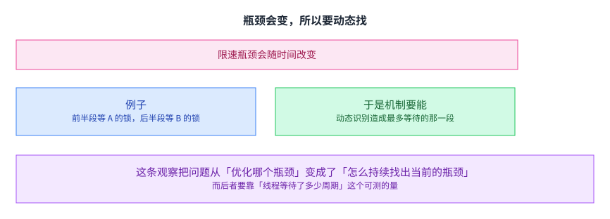

+++
title = "为什么要有不一样的东西：异构与专门化"
lecture = 26
slug = "lecture22-parallelism-heterogeneity"
status = "draft"
source_kind = "notes"
source_url = "https://safari.ethz.ch/architecture/fall2022/lib/exe/fetch.php?media=onur-comparch-fall2022-lecture22-parallelism-heterogeneity-bottleneck-acceleration-beforelecture.pdf"
source_title = "Lecture 22: Parallelism and Heterogeneity (Fall 2022, beforelecture)"
output_mode = "explanation"
+++

> 来源课程：ETH Zürich Computer Architecture（Onur Mutlu 主讲，Fall 2022）；
> 对应讲义：Lecture 22 — Parallelism and Heterogeneity（`onur-comparch-fall2022-lecture22-parallelism-heterogeneity-bottleneck-acceleration-beforelecture.pdf`，173 页）；
> 讲义链接：<https://safari.ethz.ch/architecture/fall2022/lib/exe/fetch.php?media=onur-comparch-fall2022-lecture22-parallelism-heterogeneity-bottleneck-acceleration-beforelecture.pdf> ；
> 上游许可：该课程 wiki 每一页的页脚都带站点级许可块，原文为 CC BY-NC-SA 4.0：<https://creativecommons.org/licenses/by-nc-sa/4.0/deed.en> ；
> 本页由 CourseLingo 用中文重新讲解，按源讲义的推进顺序组织，不是逐字翻译，也不转载原讲义里的任何图片；
> 页内配图全部由我们自绘；原讲义里只有图、没有字的页，我们只如实记下它的标题。
> 本页为非官方材料，与 ETH Zürich 及课程教学团队无隶属关系；如与原文有出入，以原文为准。

本页的事实来自两份独立抽取：主用 `_sources/eth-ddca-ca/evidence/eth-ca2022-lecture22-parallelism-heterogeneity.pdf.pypdfium2.txt`（`pypdfium2`，173 页、67,779 字符），并与同目录的 `.pypdf.txt`（`pypdf`，173 页、64,828 字符）逐条核对。该 PDF 入库前按四道核验过完整性：体积 11,607,159 字节、尾部有 `%%EOF`、大小不是 2 的整数次幂、也不是 64 KiB 的整数倍（余数 7,287）。两份抽取页数一致。

这一份的取件过程值得单独记一笔：第一次下载得到的文件是 614,400 字节（正好是 150 个 4 KiB 块），尾部没有 `%%EOF`，内容是二进制碎片。而当时 `curl` 的返回码是 0。也就是说，失败是静默的。四道校验把它拦住了，重下之后得到上面那个正确体积。这一条正好说明「取件必须校验」不是形式：如果不看尾部与体积，接下来的一切都会建在一个残缺的文件上。

## 这一讲要解决什么问题

前面几讲讲的是「怎么把延迟藏起来」与「藏不住之后顺序会怎样」。这一讲换了个角度问：为什么一台机器里要有好几种性质不同的部件。

讲义先把术语对齐：异构与不对称是同一个意思，与同构和对称相对。它的核心想法是：不要把所有资源都做成一样的，而是让其中一些不一样，各自擅长不同的活。

讲义说这是一个很一般的[[term:microarchitecture]] 设计概念，连生活里也到处是。而这一讲要展开的是它在多核上的那一面。

这里还要对第 20 讲做一句接续性的回指。

我在本仓库第 20 讲里写过：讲义把对付内存延迟的手段细分成三档，缓存与预取叫延迟隐藏，多线程、乱序与 runahead 才叫延迟容忍。那一讲讲的是隐藏，第 22 讲讲的是容忍的后果。

这一讲要接的是另一头：那三档的划分，最后落在不同性质的硬件上，而这一讲讲的就是那些硬件为什么不同。

换句话说，前面那个分法回答的是「处理器可以怎么应付延迟」，而这一讲回答的是「为什么应付延迟的部件不止一种」。两讲合起来，才把「一台机器由什么组成」这件事说完整。

## 为什么要不对称：因为负载的需求差得很远

讲义给的理由分两层。

一层是负载的行为本来就不同：不同应用不同，同一应用的不同阶段不同，甚至同一应用在不同时刻也可能不同（因为输入变了、或者发生了动态事件）。它列出的差异维度很具体：局部性、分支的可预测性、指令级并行度、数据依赖、程序里的串行比例、以及瓶颈在哪。

另一层更根本：对称设计的本质是一刀切，而一个尺寸要同时套住所有负载与所有指标，是很难的。讲义在这里还点了一句：这条困难对[[term:cache]]、内存与互连同样成立，而不只对核成立。讲义的说法是「非常困难」，并且指出这条困难适用于很多部件：核、缓存、内存、控制器、互连、磁盘、服务器，以及算法与策略。

所以这不是多核特有的问题，只是它在多核上最显眼。

## 不对称把「定制」变成可能

讲义把两种做法的后果分开写。

同构的做法对不同的负载行为都只能折中，于是能耗与性能都不最优。

异构的做法让处理需求与资源对上：把代码放到最合适的部件上跑。

「最合适」在这里是有两面的：讲义同时写了「能耗最低」与「性能够用」。这两个要求同时写出来，说明它不是一个纯性能的优化。它承认了有些活不需要跑那么快，而把这些活交给小部件本身就是一种节省。

## 而前面几讲里其实到处都是它

讲义列了一串此前已经见过的例子，它们分布在很不同的层次上。

处理器侧：CRAY-1 把标量[[term:pipeline]] 与向量流水线放在一起；现代处理器把通用指令与单指令多数据扩展放在一起；还有一些设计把访存与执行拆成两个部件。

内存侧：按线程簇给不同的访存调度政策；按行给不同的[[term:refresh]] 率；把子阵列切成快慢两段；以及[[term:heterogeneous-memory]] 那一类混合内存。这条清单里的每一项都改动了[[term:DRAM]] 的用法，而不只是改动缓存。

这份清单的作用是说明：异构不是一个新点子，而是一条一直存在的做法。 前面那些讲里它已经反复出现过，只是没有把它当成一个独立的主题来讲。这一讲要问的是它在多核上会变成什么样。

## 它站在通用与专用之间

讲义给了一个定位，把三件事排在一条线上。

纯粹的通用是针对所有负载用同一个设计。纯粹的专用是针对每个负载做一个设计。而不对称是若干个针对一组负载优化的子设计拼在一起。

两端各有代价：通用则处处不优，专用则不通用。讲义说不对称的目标是拿到通用的可用性，也拿到专用的好处。

这句「两端各有代价」正是这一讲反复出现的那种取舍。而它给的解法不是选一端，而是把两端拼在一个芯片上。

## 代价落在哪：设计、管理与切换

讲义把优势与代价并排列出。

优势：能同时优化多个指标；能更好地适应负载行为；能在通用的可用性下拿到专用的好处。

代价：设计与验证更复杂；把工作调度到不对称的部件上更麻烦；以及在部件之间切换本身有开销。

最后那条最容易被忽略。讲义甚至指出切换开销可能导致性能下降，也就是说切换得多会把收益抵消掉。这与前面讲预取时那条「侵略性太强反而更差」是同一形状的顾虑：一个机制带来的收益与它带来的开销会互相拉扯，而最优不在极端。

## 而今天它已经到处都是

讲义列了商用系统里的例子：集成 [[term:CPU]] 与 GPU 的系统（它举的是 Intel 的 SandyBridge）、手机里的 CPU 加一堆硬件加速器、异构多核系统（ARM 的 big.LITTLE 与 IBM 的 Cell）、以及 CPU 加 FPGA 的系统。

讲义还区分了一件事值得留意：CPU 与 GPU 的差异不只在微架构上，还在执行模型与指令集上。而大小核那种差异只在微架构里（它们共用同一套 [[term:ISA]]）。

这个区分决定了移植的代价。 同一套指令集的大核小核之间，代码可以直接搬；而执行模型不同的一对部件之间，代码要重写。所以虽然两者都叫「异构」，它们的工程含义差得很远。

## 多核那一面：想要 N 倍，拿到的是别的

讲义把多核的处境说得很直接：我们想要 N 个核带来 N 倍性能，而实际拿到的是串行瓶颈加上并行部分里的各种瓶颈。

串行那部分是阿姆达尔定律说的那件事。并行那部分不完美，讲义把原因分成三条：同步开销（比如对共享数据的更新）、负载不均（并行化不完美）、以及资源争用（N 个请求互相抢资源）。

把三条分开列是有意义的，因为它们要用不同的办法治。而下一节会看到，这一讲后面那些机制主要对付的是第一条与传统串行部分之外的那些东西。

## 而被串行化的不只是串行段

讲义把「被串行化的代码段」的来源列全了，一共四类：阿姆达尔意义上的串行部分、临界区、屏障、以及流水线程序里的限速级。它们都会减少性能、限制扩展、并且浪费能量。

这一页很重要，因为后面那些机制正是按这四类分头治的。 尤其是后三类：它们不是「程序本来就不能并行」，而是并行结构自身带来的。

这个区别决定了它们能不能被消除。串行部分往往是算法决定的，很难改；而临界区、屏障与限速级是「为了正确或为了组织并行」而存在的，所以可以用别的手段去缩短它们，而不必改变算法。这一讲后面那些机制，走的正是这条路。

## 大核与小核：两种设计取向

讲义把两类核的差别列成一条对照。

大核：乱序执行、取指宽（例如四路）、流水线深、分支预测强（例如混合预测器）、功能单元多。

小核：顺序执行、取指窄（例如两路）、流水线浅、预测简单、功能单元少。

而这一页最关键的一行是那句面积效率：大核大约是两倍性能换四倍面积。换句话说，在同样的面积预算下，选大核还是选小核其实是在[[term:bandwidth]] 之外的另一笔账：换的是并行度。

这一条是后面所有算术的起点。 它说明大核的价格不是线性的，所以不能靠单纯加大核来解决问题：你每加一个大核，付出的面积可以换好几个小核。这也解释了为什么「异构」在这里不是审美选择，而是一笔可以算的账。

## 两头都不对，于是把它们拼在一起

讲义先算了两笔账。

都赛大核：单线程与串行段快，但并行段的吞吐低（同样面积下核数少）。

都赛小核：并行段吞吐高，但单线程很差。

于是它的想法出得很自然：在同一个芯片上两种都放。

具体方案是一个大核加很多个小核，也就是不对称多核。它的算术也很直白：串行段交给大核去跑，并行段用小核与大核一起跑。把它翻译成一个[[term:accelerator]] 的视角：大核是给串行段准备的专用部件。前面那条面积效率正好解释了为什么是「一个」大核：多放几个大核，小核的数量就撑不住了。

## 把阿姆达尔定律改一改

讲义给了一个针对不对称多核的简化式子。它的三个假设是：串行部分由大核执行；并行部分由小核与大核一起执行；以及大核相对小核有一个加速比。式子里的参数就是可并行比例、大核数量、小核数量与那个加速比。

而引入这个式子之后，立刻多出一个新问题：大核该给串行段用，还是给并行段用。

这个问题看起来只是分工，但它其实是这一讲后半部分的主线。因为「串行段」不止一种（上一节列了四类），而且哪一类在限速会随时间变。

## 瓶颈会变，所以要动态找

讲义给了一条关键观察：限速的那个瓶颈会随时间改变。

它用一个链表程序的例子说明：程序的前半段在 A 这个链表上操作，后半段在 B 上操作。于是前半段等的是 A 上的锁，后半段等的是 B 上的锁。同一个程序，两个阶段限速的东西不一样。

这条观察把问题从「优化哪个瓶颈」变成了「怎么持续找出当前的瓶颈」。而后者要靠一个可测的量：讲义用的是线程等待了多少周期。

## 三段递进：加速临界区、识别瓶颈、按效用决策

讲义把这条线讲成三步，每一步解开上一步的一个限制。

第一步只加速临界区：把它送到大核上执行。讲义报的收益是相对等面积的对称多核快三成多，相对等面积的不对称多核快两成多，并且改善了十二个工作负载里七个的扩展性。

第二步发现瓶颈不止临界区：屏障、流水线限速级同样会造成等待。于是机制改成动态识别造成最多线程等待的代码段并加速它。讲义报的结果是比第一步的做法快一成半、比单纯的不对称多核快三成多，并且能加速屏障那类第一步做不了的负载。

第三步指出在多应用共存时还要比一比：该加速瓶颈，还是加速落后的线程；该加速哪一个应用。 它给的做法是算一个把「能加速多少」与「有多关键」合起来的效用值，只加速效用最高的那些。

这三步的递进方式值得留意：每一步都不是把上一步做得更快，而是发现上一步的假设不成立。 第一步假设「串行瓶颈就是临界区」，第二步推翻它；第二步假设「有一个应用」，第三步推翻它。这与前面讲连续 runahead 时那个形状是一样的：有时候进步靠的不是把事做强，而是找出原来的做法漏掉了什么。

## 读完应该能回答

1. 异构与不对称是什么意思，讲义为什么说对称设计很难。
2. 不对称拿到什么、付出什么，代价里哪一条最容易被忽略。
3. CPU 与 GPU 的异构，与大小核的异构，差别在哪一个层面上。
4. 多核「想要 N 倍、拿到别的」里，并行部分不完美的三个原因是什么。
5. 被串行化的代码段有哪四类，后三类为什么值得单独看。
6. 大核的面积效率大约是多少，这个数为什么是后面所有算术的起点。
7. 那一讲那条线的三步各自推翻上一步的什么假设。

## 脉络回顾

这一讲是「并行」这条线的转折点。前面的第 20、21、22、23 讲都在讲「怎么让很多东西一起工作」，而这一讲换了个方向问：为什么有些东西本来就不该长成一样的。它接住的是前面几讲里已经反复出现的一堆例子（按行定刷新率、把子阵列切快慢、混合内存、按线程簇分政策），把那些散落的做法收成一个主题。而这条线紧接着的第 27 讲讲的是异构里最主要的两类部件，第 30 讲则把其中的思路推到两个极端。

本讲留下的三件工具会一直用。第一件是那个批评本身：对称设计是一刀切，而一个尺寸套不住所有负载与所有指标，所以差异可以当资源用。第二件是那笔算术，也就是大核大约两倍性能换四倍面积；有了这个数，后面所有关于「放几个大核、放几个小核」的讨论才有依据。第三件是那三步递进（先只加速临界区、再动态识别瓶颈、最后按效用决定加速谁），它的形状比它的结论更重要：每一步都不是把上一步做得更快，而是发现上一步的假设不成立。

要分清的是，留下来复用的是这三件工具，不是某一个具体机制：临界区加速、按等待周期识别瓶颈、按效用决策，各自只在一类负载上有效。下一讲会挑出异构里最主要的两类部件，也就是宽执行的部件与靠大量线程换吞吐的部件，把它们各自怎么工作讲一遍。

## 溯源

- 对应：ETH Zürich Computer Architecture（Onur Mutlu 主讲，Fall 2022），Lecture 22 — Parallelism and Heterogeneity。

- 讲义链接：<https://safari.ethz.ch/architecture/fall2022/lib/exe/fetch.php?media=onur-comparch-fall2022-lecture22-parallelism-heterogeneity-bottleneck-acceleration-beforelecture.pdf> 。文件名是 `beforelecture`，与 `docs/lecture-manifest.md` 第 26 行一致。

- 上游许可：站点级页脚为 CC BY-NC-SA 4.0。SA 是传染性的，所以本页译文也以同协议发布、且为非商业用途。本页未转载原讲义里的任何图片，配图全部自绘；只有图没有字的页，本页只如实记下标题。

- 证据来源（两份独立抽取，互为核对）：`eth-ca2022-lecture22-parallelism-heterogeneity.pdf.pypdfium2.txt`（`pypdfium2`，173 页、67,779 字符）与同目录 `.pypdf.txt`（`pypdf`，173 页、64,828 字符）。四道核验：11,607,159 字节、尾部有 `%%EOF`、不是 2 的整数次幂、也不是 64 KiB 的整数倍（余数 7,287）。

- 取件过程的一处实测（这一条写在这里供以后核对）：第一次下载得到 614,400 字节，正好是 150 个 4 KiB 块，尾部没有 `%%EOF`，内容是二进制碎片，而 `curl` 的返回码为 0。重下之后得到 11,607,159 字节且尾部正常。所以这一份的四道校验里，「尾部有 `%%EOF`」那一道是实际起作用的那一道：体积那两道（非 2 的幂、非 64 KiB 整数倍）在 614,400 上也都通过，只有尾部这一道把它拦住了。

- 与第 20 讲的关系（这一讲正文里已经写明，这里再记一次以便核对）：第 20 讲把对付内存延迟的手段分成降低、隐藏、容忍三档。本页接的是那条线的另一头：三档的划分最后落在不同性质的硬件上，而这一讲讲的是那些硬件为什么不同。 这一句接续是 CourseLingo 的讲解，不是讲义的原话；讲义本身只在第 10 页列了一串此前的异构例子。

- 本讲取材范围是讲义的全部正文（173 页，讲义没有附录分节）。包括：异构与不对称的术语对齐与核心想法；对称设计「一刀切」的困难与负载行为的四个层面差异；不对称带来的定制与两面含义（能耗最低、性能够用）；此前的异构例子清单；它在通用与专用之间的定位；优势与代价（含切换开销）；商用例子与 CPU 加 GPU 和大小核在层面上的区别；多核「想要 N 倍」与三个并行瓶颈；被串行化代码段的四类；大核小核的设计对照与面积效率；赛大核与赛小核的两笔账；一个大核加多个小核的方案；不对称多核下修改过的阿姆达尔式子；限速瓶颈随时间改变这条观察；这条线的三步（加速临界区、动态识别瓶颈、按效用决策）及其各自的说法与收益；以及最后用不对称换能效那一节（多层核、按阶段挑核、它的优势与问题）。

- 数字与定义以讲义页面为准。讲义未展开的推论属于 CourseLingo 的讲解。这类推论分三组：把「大核两倍性能四倍面积」讲成后面所有算术的起点，并据此解释为什么方案是「一个」大核；把被串行化代码段的后三类单独拿出来，讲成「它们不是算法决定的，所以可以用别的手段缩短」；以及把这条线的三步递进讲成「每一步都不是把上一步做得更快，而是发现上一步的假设不成立」。本讲与前后讲次的对应关系，除了上面那条与第 20 讲的接续之外，其余属于我们的编排。

- 一处说明：讲义有多页只有标题与图或只有图（例如第 2、5、11 到 21、25、28、29、34、35、37 到 46、48、50 到 52、57、59、61、62、66、71、75、76、79、80、83、85 到 94、96、98、99、101、102、105 到 108、111 到 115、117 到 120、123、124、128 到 131、133 到 141、144 到 146、148 页），文字层留下的是标题与零散标签。本页对这些页只依据可见的标题与文字描述，未依据图示复原结构，也未替讲义补数字或公式。
