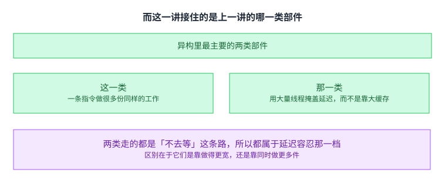
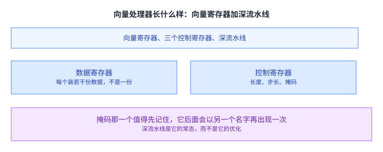
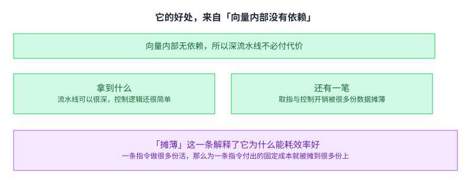
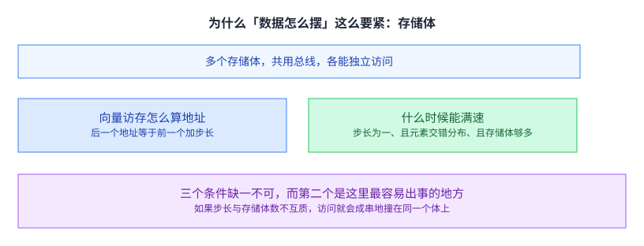
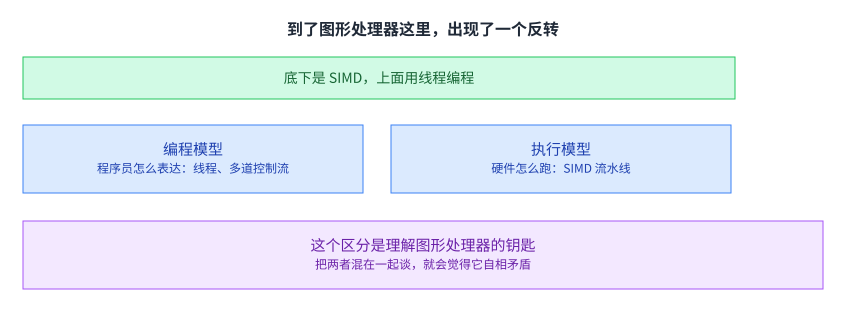
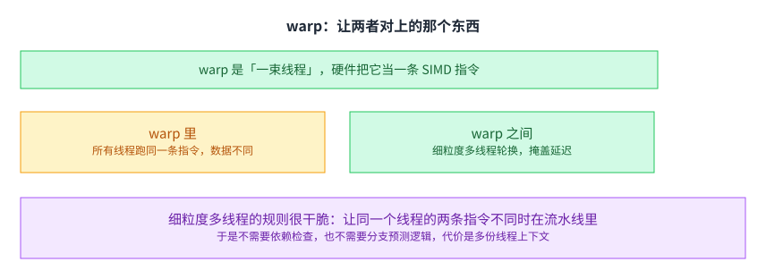

+++
title = "一条指令做很多份：从向量机器到图形处理器"
lecture = 27
slug = "lecture25-simd-gpu"
status = "draft"
source_kind = "notes"
source_url = "https://safari.ethz.ch/architecture/fall2022/lib/exe/fetch.php?media=onur-comparch-fall2022-lecture25-simd-processors-and-gpu-beforelecture.pdf"
source_title = "Lecture 25: SIMD Processors and GPUs (Fall 2022, beforelecture)"
output_mode = "explanation"
+++

> 来源课程：ETH Zürich Computer Architecture（Onur Mutlu 主讲，Fall 2022）；
> 对应讲义：Lecture 25 — SIMD Processors and GPUs（`onur-comparch-fall2022-lecture25-simd-processors-and-gpu-beforelecture.pdf`，146 页）；
> 讲义链接：<https://safari.ethz.ch/architecture/fall2022/lib/exe/fetch.php?media=onur-comparch-fall2022-lecture25-simd-processors-and-gpu-beforelecture.pdf> ；
> 上游许可：该课程 wiki 每一页的页脚都带站点级许可块，原文为 CC BY-NC-SA 4.0：<https://creativecommons.org/licenses/by-nc-sa/4.0/deed.en> ；
> 本页由 CourseLingo 用中文重新讲解，按源讲义的推进顺序组织，不是逐字翻译，也不转载原讲义里的任何图片；
> 页内配图全部由我们自绘；原讲义里只有图、没有字的页，我们只如实记下它的标题。
> 本页为非官方材料，与 ETH Zürich 及课程教学团队无隶属关系；如与原文有出入，以原文为准。

本页的事实来自两份独立抽取：主用 `_sources/eth-ddca-ca/evidence/eth-ca2022-lecture25-simd-gpu.pdf.pypdfium2.txt`（`pypdfium2`，146 页、52,337 字符），并与同目录的 `.pypdf.txt`（`pypdf`，146 页、50,647 字符）逐条核对。该 PDF 入库前按四道核验过完整性：体积 8,969,447 字节、尾部有 `%%EOF`、大小不是 2 的整数次幂、也不是 64 KiB 的整数倍（余数 56,551）。两份抽取页数一致。

## 这一讲要解决什么问题

先把这一讲的位置说清楚。

讲义把这类并行叫数据并行：并发来自「对不同的数据做同一个操作」。它举的例子是两个向量的点积，并且立刻把它与另外两类并行分开：一类是数据流（并发来自不同的操作同时做），另一类是线程并行（并发来自不同的控制流同时跑）。

三种并行的来源不同，所以它们适合的机器也不同。这一讲讲的是第一种，也就是[[term:accelerator]] 那一类机器最擅长的东西。

这里可以先说一句这一讲的组织方式，免得读到中间失去线索。讲义走的是这样一条路：先看数据并行对应的机器长什么样（阵列与向量），再看它在现代处理器里被压缩成了什么样子（指令集里的一块扩展），最后看它在图形处理器里被伪装成了什么样子（用线程编程的 SIMD）。三个阶段讲的是同一件事，区别只在于接口被藏到哪里去了。

## 而这一讲接住的是上一讲的哪一类部件

这里要对上一讲做一句接续性的回指。

我在本仓库第 26 讲里讲过：异构就是不对称、也就是专门化，而它要回答的是「为什么一台机器里要有好几种性质不同的部件」。

这一讲接的就是那个问题的下一半：异构里最主要的两类部件，各自是怎么工作的。

一类是宽执行的部件：一条指令做很多份同样的工作；这是[[term:microarchitecture]] 层面的一种并行来源。另一类是靠大量线程换吞吐的图形处理器：它掩盖延迟的办法是同时做很多件事，而不是靠大缓存把延迟降下来。

这两类走的都是「不去等」这条路，所以它们都属于第 20 讲里那个延迟容忍那一档。 区别在于它们是靠做得更宽，还是靠同时做更多件。而这一讲会把这两条路都走一遍，并指出它们最后在同一个地方汇合。顺带说一句：图形处理器之所以能靠线程换吞吐，是因为它有大量可并行的像素与线程，也就是把[[term:latency]] 藏在别的线程的执行里。

## 先把四种机器摆开

讲义用了那套经典分类：一条指令一份数据、一条指令多份数据、多条指令一份数据、以及多条指令多份数据。

这一讲关心的那一格是第二种，而它在讲义里又分成两种：阵列处理器与向量处理器。这里的「处理器」指的是执行单元的组织方式，而不是一颗完整的 CPU。

第三格很少见，但讲义指出它有一个具体的近似物（脉动阵列那一类）。把分类法当真去问「哪些格是空的、哪一格为什么空」，本身就能看出问题。

## 两种做法：用空间，还是用时间

讲义给了一个很好用的对偶。

阵列处理器用不同的执行单元在同一时刻处理不同元素，也就是用空间。

向量处理器用同一个执行单元在连续的时刻处理不同元素，也就是用时间。

这个对偶的价值在于它说明两件事可以互相替代。于是同一套「数据并行」的想法，可以落在很不一样的硬件上。而这也解释了后面那个反转：图形处理器看起来像多线程机器，底下却是阵列那一支。

## 向量处理器长什么样

它需要三样东西。

向量数据寄存器：每个装若干份数据，而不是一份。控制寄存器：至少三个，分别管长度（这一趟做多少份）、步长（相邻元素在内存里隔多远）、以及掩码（哪些元素该做这次运算）。走深[[term:pipeline]] 的运算单元：每个流水级处理一个不同的元素。

掩码那一个值得先记住，因为它后面会以另一个名字再出现一次，而讲义专门跨了十几页把两件事指认为同一件。

## 它的好处，来自「向量内部没有依赖」

讲义把优势归到一条根上：向量内部的元素之间没有依赖。

于是流水线可以做得非常深、非常宽，而不会付深流水线通常要付的代价（深流水线要处理相关、要处理分支，而在向量里这两样都不存在）。另外，每条指令本身产生很多工作，取指与控制的开销被摊薄。

「摊薄」这一条解释了它为什么能耗效率好：一条指令做很多份活，那么为一条指令付出的固定成本就被摊到很多份上。这与前面几讲讲过的「把固定开销摊薄就能省能」是同一个形状，也就是[[term:energy-efficiency]] 那条老账。

## 它的代价有两条，而且很硬

第一条：它只对规则的并行有效。如果并行是不规则的（讲义举的例子是在链表里找一个关键字），向量操作会非常低效。

第二条：访存带宽很容易成为瓶颈。讲义给了两个原因：计算与访存的比例没维持住，或者数据没有恰当地映射到存储体上。

第二条那两个原因都指向同一件事：数据怎么摆。 所以向量机器这一节的大量篇幅用在了存储体与地址映射上，而那不是细节，而是它的主战场。这一条的根在[[term:DRAM]] 那边：存储体是内存的物理组织方式，而地址映射是它的软件面孔。

## 为什么「数据怎么摆」这么要紧

内存被分成若干可以独立访问的存储体，它们共用地址与数据总线（这是为了省引脚）。一个周期可以启动并完成一次访问，所以只要若干次访问落在不同存储体上，就能同时进行。

对一个 CUDA 风格的宽访存来说，地址是这样算的：后一个地址等于前一个地址加步长。

而讲义给了满速的三个条件：步长为一、连续元素交错分布在各存储体上、并且存储体的数量不少于访存的延迟。三个条件缺一不可，而第二个是这里最容易出事的地方：如果步长与存储体数不互质，访问就会成串地撞在同一个存储体上，于是「同时访问」退化成了「排队」。

讲义后来还列了减少这类冲突的几种办法，其中一条是把地址到存储体的映射随机化。这一条值得留意，因为它承认了一件事：冲突的根源是映射太规则，所以解法是把规则破坏掉一点。

## 四个配套机制，各治一个具体的难题

讲义给了四个配套机制。

链接：把一个运算单元的结果直接送给下一个，而不必先写回寄存器再读出。条带挖掘：数据比向量寄存器长的时候，把循环切成几趟。收集与散布：处理下标本身是算出来的那种访存（间接访问）。掩码：处理「有些元素不该做这次运算」的情况。

四个机制分别对付：延迟、长度、地址不规则、以及条件执行。值得留意的是四个里没有一个是「换个更快的硬件」。 它们都是在承认「向量很宽」这个前提下，把随之而来的四个麻烦各自收拾掉。这个形状在整门课里反复出现：一个机制变宽变快之后，麻烦会从别的地方长出来。

## 而现代处理器把它做成了指令集里的一小块

向量机器后来没有留在通用处理器里，而它的一部分想法以另一副面孔回来了：[[term:ISA]] 里的单指令多数据扩展。一条指令同时对若干份较短的数据做同一个运算，讲义把这类运算叫打包运算。

它借用了「一条指令做多份活」这个基本想法，丢掉了「整台机器为向量而设计」这件事。讲义举的例子是把四份八位数据一起相加，而为了让八位之间不进位，运算单元本身要改。

这一步的意义在于它把一条指令线里的并行度挖了出来。 前面几讲讲的是怎么从多个线程或多条指令里找并行，而这里找的是同一条指令内部、同一份数据宽度内部的并行。这是一个很不一样的地方，也是它能塞进一颗通用 [[term:CPU]] 的原因。

## 到了图形处理器这里，出现了一个反转

讲义指出：图形处理器的流水线底下就是一条单指令多数据流水线，可是它不用单指令多数据指令来编程，而是用线程来编程。

要看懂这个反转，得把两件事分开。

编程模型指的是程序员怎么表达代码，比如顺序、数据并行、数据流、多线程。执行模型指的是硬件在底下怎么跑，比如乱序执行、向量处理器、阵列处理器、多处理器。

这个区分是理解图形处理器的钥匙。 把两者混在一起谈，就会觉得它自相矛盾：明明是多线程编程，怎么底下是单指令多数据。而分开之后，那句话就变成了「它给程序员的是一套多线程的外壳，给硬件的是另一套执行的方式」，一点都不矛盾。

## warp：让两者对上的那个东西

一组执行同一条指令、但数据不同的线程被动态地编成一个 warp，硬件就把它们当成一条单指令多数据指令来跑。

而在 warp 之间，用的是[[term:fine-grained-multithreading]]：每个周期从一个不同的线程取指。讲义给的规则很干脆：让同一个线程的两条指令不同时在流水线里。

这条规则带来的好处很直接：既然同一线程只有一条指令在流水线里，那就不需要指令之间的相关检查，也不需要分支预测逻辑，那些本来会是气泡的周期被用来跑别的线程的指令。

注意这条规则把一个常见的东西换掉了：在普通处理器里，解决延迟的常用手段是预测（猜分支往哪走、猜值是多少），而这里的手段是换一个线程。预测有猜错的代价，而换线程没有。 这条区别值得记住，因为它解释了图形处理器为什么能在没有复杂预测逻辑的前提下把流水线填满。

代价是多份线程上下文要存在芯片上，也就是[[term:bandwidth]] 与面积。这与前面讲细粒度多线程时那条「用上下文换掉预测逻辑」是同一笔买卖。

## 这样换来两个好处

讲义指出，把线程编成 warp 这件事带来了两个好处。

好处一：每个线程可以被单独对待，于是它可以按一条标量流水线独立执行、独立中断、独立重启。讲义说这一条让图形处理器在很多方面更像多条指令多份数据的机器。

好处二：线程可以灵活编组，于是硬件能动态地挑出那些真正在跑同一条指令的线程，把单指令多数据的好处拿到最大。

第二条好处正是后面那一批机制的根据。如果线程的编组是固定的，那么分歧就只能等着；而如果编组是动态的，那么就可以在分歧之后重新编一次。

## 代价是控制流分歧，而它其实是老问题换了个名字

一个 warp 里的线程如果分支到不同的路径，那条单指令多数据的流水线就没法一次都做完，只能把路径一条条地走。讲义把这件事叫分支分歧。

而它接着提醒读者：这与前面讲的掩码执行是同一件事。 一个 warp 里只有一部分线程该做这次运算，和一条向量指令里只有一部分元素该做这次运算，在硬件上要处理的是同一个问题。

讲义专门跨了十几页把这两件事指认为同一件，而这一步的价值在于：认出来之后，向量机器那边积累的办法就可以搬过来用。

顺着这两个好处，讲义后面还讲了一批围绕 warp 的机制，例如在分歧之后把真正在做同一件事的线程重新合并成一个新 warp，以及在调度上分两级来应对长延迟操作。而在那一批机制的背后，有一条量是可以直接算的：一个 warp 里有多少线程真的在做同一件事。这个比例越低，浪费越大。

这一讲的最后落在几个真实例子上，其中包括一块把矩阵乘加做成硬件的部件。它把这一讲的两条线索接在了一起：宽执行（一条指令做很多份）与专用化（为一种运算做一块专门的硬件），正好是上一讲那两个词。

## 读完应该能回答

1. 数据并行、数据流与线程并行，三者的并发来源分别是什么。
2. 阵列处理器与向量处理器在时间与空间上怎么分，这个对偶为什么有用。
3. 向量处理器的好处归结到哪一条根上，代价有哪两条。
4. 满速访存的三个条件是什么，其中哪一个最容易出问题。
5. 四个配套机制分别对付什么。
6. 图形处理器那个反转是什么，要用哪一组区分才能看懂它。
7. 分支分歧与前面的哪一件事是同一个问题。

## 脉络回顾

这一讲是「并行」这条线里最具体的一段。第 26 讲讲的是为什么要有多种性质的部件；这一讲讲的是其中最主要的两类，也就是一条指令做很多份的那一类，以及靠大量线程掩盖延迟的那一类。而这条线还有两段：第 28 讲会讲图形处理器上的编程（把这一讲的执行模型落到怎么写代码）；第 30 讲会把这一讲那个时空对偶的两端各推到一个极端（一端是把并行交给编译器，另一端是把计算铺成一片阵列）。

本讲留下的三件工具会一直用。第一件是时空对偶：同一件活可以用「多个单元在同一时刻各做一份」来做，也可以用「同一个单元在连续几个时刻各做一份」来做，两者可以互相替代。第二件是把编程模型与执行模型分开看；有了这组区分，图形处理器那句「底下是单指令多数据、上面用线程编程」就不再自相矛盾。第三件是一个指认：控制流分歧与前面那个掩码执行是同一个问题，所以向量机器那边积累的办法可以搬过来用。

要分清的是，留下来复用的是这三件工具，不是某一种机器：阵列处理器、向量处理器、图形处理器各自只在一类程序形状上占优，而它们共同的短板都是不规则的并行。下一讲会接着讲那两类部件里后一类的编程，也就是图形处理器上的代码到底该怎么写。

## 溯源

- 对应：ETH Zürich Computer Architecture（Onur Mutlu 主讲，Fall 2022），Lecture 25 — SIMD Processors and GPUs。

- 讲义链接：<https://safari.ethz.ch/architecture/fall2022/lib/exe/fetch.php?media=onur-comparch-fall2022-lecture25-simd-processors-and-gpu-beforelecture.pdf> 。文件名是 `beforelecture`，与 `docs/lecture-manifest.md` 第 27 行一致。

- 上游许可：站点级页脚为 CC BY-NC-SA 4.0。SA 是传染性的，所以本页译文也以同协议发布、且为非商业用途。本页未转载原讲义里的任何图片，配图全部自绘；只有图没有字的页，本页只如实记下标题。

- 证据来源（两份独立抽取，互为核对）：`eth-ca2022-lecture25-simd-gpu.pdf.pypdfium2.txt`（`pypdfium2`，146 页、52,337 字符）与同目录 `.pypdf.txt`（`pypdf`，146 页、50,647 字符）。四道核验：8,969,447 字节、尾部有 `%%EOF`、不是 2 的整数次幂、也不是 64 KiB 的整数倍（余数 56,551）。

- 与上一讲和第 20 讲的关系（正文里已经写明，这里再记一次以便核对）：第 26 讲讲的是「为什么要有多种性质的部件」，本页接的是其中最主要的两类，也就是宽执行的 SIMD 部件与靠线程换吞吐的图形处理器。第 20 讲把对付延迟的手段分成降低、隐藏、容忍三档，而宽执行与多线程都属于容忍那一档。这两条接续的措辞属于 CourseLingo 的讲解；讲义本身在第 4 页只把本讲定位为「利用数据并行」。

- 本讲取材范围是讲义的全部正文（146 页，讲义没有附录分节）。包括：数据并行与另外两类并行的对照；那套四种机器的分类法与其中两种近似物；阵列与向量的时空对偶；向量寄存器与三个控制寄存器；向量处理器的三条优势与两条代价；存储体、地址计算与满速的三个条件；减少存储体冲突的几种办法；链接、条带挖掘、收集散布、掩码四个配套机制；现代指令集里的单指令多数据扩展与打包运算；编程模型与执行模型这组区分；warp 与细粒度多线程的规则、好处与代价；线程可单独对待与可灵活编组这两个好处；分支分歧以及它与掩码执行是同一个问题；以及最后那批围绕 warp 的机制与两个真实处理器的例子。

- 数字与定义以讲义页面为准。讲义未展开的推论属于 CourseLingo 的讲解。这类推论分三组：把「四个配套机制里没有一个是换更快的硬件」抽成「机制变宽之后麻烦会从别处长出来」这个形状；把四种机器的分类讲成「把分类法当真去看哪些格是空的，本身就能发现问题」；以及把「认出手法其实是同一个问题」讲成「认出来之后办法就可以搬过来用」。本讲与前后讲次的对应关系，除了上面那两条接续之外，其余属于我们的编排。

- 一处说明：讲义有多页只有标题与图或只有图（例如第 4、5、7 到 10、18、20、24、27、30 到 39、42、43、45、47、48、50、51、53、55、58、60 到 65、68、69、71 到 77、80、81、84、86 到 88、91 到 95、97、98、100、102、104 到 112、121 到 123、125、127 到 135、137 到 139 页），文字层留下的是标题与零散标签。本页对这些页只依据可见的标题与文字描述，未依据图示复原结构，也未替讲义补数字或公式。
