+++
title = "GPU 编程：怎么把活派给另一颗芯片"
lecture = 28
slug = "lecture26-gpu-programming"
status = "draft"
source_kind = "notes"
source_url = "https://safari.ethz.ch/architecture/fall2022/lib/exe/fetch.php?media=onur-comparch-fall2022-lecture26-gpuprogramming-beforelecture.pdf"
source_title = "Lecture 26: GPU Programming (Fall 2022, beforelecture)"
output_mode = "explanation"
+++

> 来源课程：ETH Zürich Computer Architecture（Juan Gómez Luna 与 Onur Mutlu 主讲，Fall 2022）；
> 对应讲义：Lecture 26 — GPU Programming（`onur-comparch-fall2022-lecture26-gpuprogramming-beforelecture.pdf`，120 页）；
> 讲义链接：<https://safari.ethz.ch/architecture/fall2022/lib/exe/fetch.php?media=onur-comparch-fall2022-lecture26-gpuprogramming-beforelecture.pdf> ；
> 上游许可：该课程 wiki 每一页的页脚都带站点级许可块，原文为 CC BY-NC-SA 4.0：<https://creativecommons.org/licenses/by-nc-sa/4.0/deed.en> ；
> 本页由 CourseLingo 用中文重新讲解，按源讲义的推进顺序组织，不是逐字翻译，也不转载原讲义里的任何图片；
> 页内配图全部由我们自绘；原讲义里只有图、没有字的页，我们只如实记下它的标题。
> 本页为非官方材料，与 ETH Zürich 及课程教学团队无隶属关系；如与原文有出入，以原文为准。

本页的事实来自 `_sources/eth-ddca-ca/evidence/eth-ca2022-lecture26-gpu-programming.pdf.pypdfium2.txt`（pypdfium2 抽取，120 页，38,123 字符），交叉核对用同名的 `.pdf.pypdf.txt`（pypdf 抽取，120 页，36,670 字符）。抽取器是 `_sources/_audit/pdftext_alt.py`。该 PDF 入库前按四道核验过完整性：体积 3,806,862 字节、尾部有 `%%EOF`、不是 2 的整数次幂、也不是 64 KiB 的整数倍（余数 5,774）。仓内自研的 `pdftext*.py` 这一族在前几讲已被实测为不可靠，本页没有采用它们的任何输出。

## 这一讲要解决什么问题

第 24 讲与第 25 讲讲的是「网」：数据在多个部件之间怎么走，以及怎么让这张网既快又公平。这一讲换到使用者的位置，回答的是**怎么写代码去用另一颗芯片**，也就是把 GPU 当成一个[[term:accelerator]]来用。也就是说，前面几讲讲结构，这一讲讲编程模型与它对着的那种硬件。

讲义自己的路线是三条：先看一颗具体 GPU 的算力从哪里来，再看编程模型（批量同步与 SPMD），最后看性能考量与协作计算。第 39 页把主要瓶颈摆出来，正好把这一讲与前面几讲接上：主要瓶颈是全局内存访问与 [[term:CPU]] 与 GPU 之间的数据传输，其余才是占用率、合并访存、数据复用、SIMD 利用率、原子操作与传输重叠。第 21 页说得更直接：这颗芯片不是白拿的，仍然有瓶颈，一是 CPU 与 GPU 之间的传输（走 PCIe 或 NVLink），二是 [[term:DRAM]] 带宽（GDDR5、GDDR6 或 HBM2）。

一句话概括这一讲的立场：算力来自数量巨大的简单线程与它们的延迟容忍，而把数据运到位、让这些线程不闲置，才是写程序时真正要操心的事。

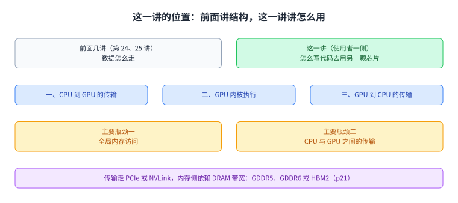

图里上面是这一讲与前面几讲的接点，中间是 GPU 计算的三步，下面是讲义点名的两类瓶颈。整讲的其余部分都在对付这两类瓶颈。

## 例子里的一颗 GPU：算力从哪里来

讲义先用两台相隔八年的 GPU 把量级摆出来，两页都用「NVIDIA 的说法」与「一般说法」对照。

2009 年的 GTX 285（p5 到 p8）在 NVIDIA 的说法里有 **240 个流处理器**，用到「SIMT 执行」这个词；换成一般说法，它是 **30 个核**，每个核里有 **8 个 SIMD 功能单元**。每个核里有 64 KB 的存储专门放线程上下文，也就是寄存器。**32 个线程一组共享同一条[[term:pipeline]]指令流，这样的一组叫一个 warp**；最多 32 个 warp 同时交错执行，最多能存 1024 个线程上下文。整颗芯片是 30 个核，也就是 **30,720 个线程**。

2017 年的 V100（p10 到 p12）在 NVIDIA 的说法里有 **5120 个流处理器**；换成一般说法是 **80 个核**，每个核 64 个 SIMD 功能单元，此外还有专门为机器学习做的功能单元，NVIDIA 把它们叫 tensor core。单精度 **15.7 TFLOPS**，双精度 **7.8 TFLOPS**，深度学习 **125 TFLOPS**。第 9 页用一张曲线把这条演化线画出来，横轴是流处理器数量，纵轴是 GFLOPS，点分别是 GTX 285（2009）、GTX 480（2010）、GTX 780（2013）、GTX 980（2014）、P100（2016）与 V100（2017）。

这些算力靠什么被用起来，答案在第 14 页到第 17 页。warp 是一组执行同一条指令、但作用在不同数据上的线程；warp 级的细粒度多线程让同一时刻流水线里每个线程只有一条指令在飞，于是不需要互锁；把不同 warp 的执行交错起来，就能把长[[term:latency]]延迟藏掉。所有线程的寄存器值都留在寄存器堆里，所以这种细粒度多线程能容忍很长的延迟，上百万像素就是这么被伺候的。第 17 页给了一个小例子：一台每 warp 32 线程、8 条 lane 的机器，每周期发射一个 warp，能完成 24 个操作。

第 18 页是一张术语对照表，值得单独记：向量长度在 NVIDIA 叫 warp 大小、在 AMD 叫 wavefront 大小，说的是在一条 SIMD 功能单元上锁步并行的线程数；流水化的功能单元在 NVIDIA 叫流处理器或 CUDA 核；一组 N 个流处理器构成的 SIMD 功能单元，在 GTX 285 里 N 是 8，在 Fermi 里是 16；而 GPU 核这个说法对应的是流多处理器，在 AMD 叫计算单元，里面有一个或多个 warp 调度器与一条或多条 SIMD 流水线。

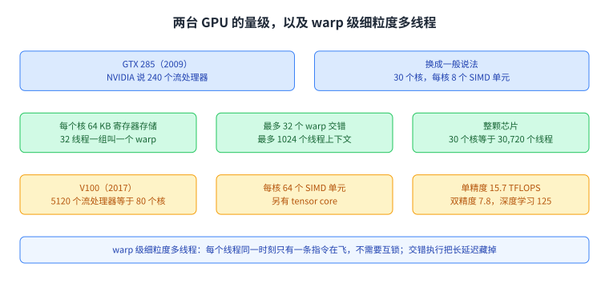

图里左边是 GTX 285 与 V100 的数字，右边是 warp 的定义与细粒度多线程的三条性质。这些数字后面还会用到，因为「多少个线程在飞」直接决定占用率。

## 编程模型：批量同步与 SPMD

讲义先回头看了一眼向量处理器的老问题（p20）：只有当并行是规则的，也就是数据级或 SIMD 并行时，它才工作得好；一旦并行不规则，比如在链表里找一个键，效率就很低。GPU 能被通用起来，靠的是给 SIMD 处理器配一个更容易写的编程模型（p21）：把 SIMD 处理器的编程方式变成 SPMD。这件事让高性能计算走进了普通机器，单位算力的价格也降了下来。适合它的负载很多，矩阵、图像处理与深度神经网络都在其中；但这不是白拿的，需要新的编程模型，算法要重新实现与重新思考。

CPU 与 GPU 是两种设计哲学（p22）：CPU 是少数几个乱序核，GPU 是大量顺序的、靠细粒度多线程切换的核。

GPU 计算本身分三步（p23）：先把数据从 CPU 传到 GPU，再在 GPU 上执行内核，最后把结果传回 CPU。程序结构也随之分成两半（p24）：串行或只有适度并行的部分留在 CPU 上，大规模并行的部分交给 GPU 上的内核，内核用 `Kernel<<<nBlk, nThr>>>(args)` 这样的形式启动。

第 25 页复习 SPMD：单一份过程或程序、多份数据。讲义特别强调它是一种编程模型，而不是一种计算机组织。每个处理单元执行同一段过程，只是作用在不同数据上；过程之间可以在某些点上同步，比如屏障。本质上，多条指令流执行同一个程序，而每条程序在运行时可以走不同的控制流路径。许多科学应用本来就是这样编的，跑在 MIMD 的多处理器上；而今天的 GPU 用相似的方式编程，跑在 SIMD 的硬件上。

第 26 页把 CUDA 与 OpenCL 的模型讲清楚：它是 SIMT 或 SPMD，是**批量同步**编程，也就是内核之间只有全局的、粗粒度的同步。主机通常是 CPU，负责分配内存、拷贝数据、启动内核；设备通常是 GPU，负责执行内核。内核的组织是网格（OpenCL 里的 NDRange）与块（work-group）；块内有共享内存与同步；最小单位是线程（work-item）。第 27 页补上一个重要的性质，叫透明可扩展性：硬件可以自由决定线程块怎么调度，每个块相对于其它块的执行顺序可以是任意的。

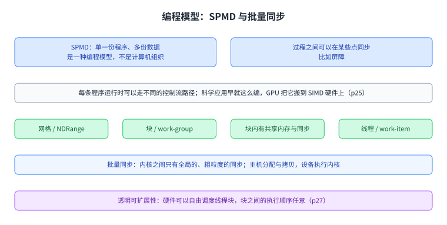

图里左边是 SPMD 的三条性质，右边是 CUDA 与 OpenCL 模型的分层与透明可扩展性。这一页决定后面所有优化能做什么、不能做什么。

## 一次典型的 CUDA 程序长什么样

第 29 页给出程序的骨架。主机侧的 main 有五步：在设备上分配空间，把数据从主机传到设备，设置执行配置也就是块数与线程数，启动内核，再把结果从设备传回主机。内核侧用 `__global__` 声明，自动变量被透明地放进寄存器，共享内存用 `__shared__` 声明，块内同步用 `__syncthreads()`。这一串按需重复。

第 30 页把 API 列出来：分配用 `cudaMalloc`，拷贝用 `cudaMemcpy` 并指明方向，启动用 `kernel<<<块数, 线程数>>>(参数)`，释放用 `cudaFree`，显式同步用 `cudaDeviceSynchronize`。

第 31 页到第 34 页讲索引。图像是二维结构，高度乘宽度，元素记作 `Image[j][i]`。它在内存里按行主序摆放，所以 `Image[j][i]` 等于 `Image[j * width + i]`，步长就是宽度。用一维网格时，一个 GPU 线程管一个像素，全局编号是 `blockIdx.x * blockDim.x + threadIdx.x`，讲义举的例子是 6 乘 4 加 1 等于 25。用二维网格时，块本身是二维的，行的算法是 `blockIdx.y * blockDim.y + threadIdx.y`，例子是 1 乘 2 加 1 等于 3；列的算法是 `blockIdx.x * blockDim.x + threadIdx.x`，例子是 0 乘 2 加 1 等于 1；于是落到 `Image[3][1]`，在内存里是 3 乘 8 加 1。

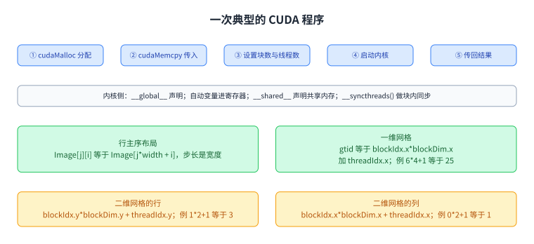

图里上面是主机侧的五步与内核侧的写法，下面是行主序布局与一维、二维两种索引。索引算对是后面所有优化的前提。

## 硬件结构：从流处理器阵列到流多处理器

第 35 页到第 37 页把硬件结构复习一遍。最外层是流处理器阵列，出自 Tesla 那一代。里面是流多处理器，块会被切成 warp，每个 warp 是 32 个线程的一条 SIMD 单元。流多处理器在别的叫法里就是计算单元，里面有 SIMD 流水线；流处理器就是向量 lane，NVIDIA 叫 CUDA 核。讲义给了一张按代排列的规模表：Tesla（2007）是 30 乘 8，Fermi（2010）是 16 乘 32，Kepler（2012）是 15 乘 192，Maxwell（2014）是 24 乘 128，Pascal（2016）是 56 乘 64，Volta（2017）是 80 乘 64。

这张表与第 2 节那两台 GPU 的数字是对得上的：GTX 285 属于 Tesla 那一代，V100 属于 Volta 那一代，所以前者的「30 个核、每个核 8 个 SIMD 单元」就是 30 乘 8，后者是 80 乘 64。

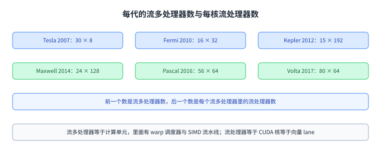

图里每一格是一代产品与它的两个数字。把乘法算出来，就能把「NVIDIA 的说法」与「一般说法」对上。

## 性能考量之一：访存

第 39 页把性能这一节的问题列全，其中第一项就是访存：延迟隐藏与占用率、合并访存、数据复用与共享内存。

第 41 页给出占用率的定义，它是活跃 warp 的比例；之所以关心它，是因为细粒度多线程靠交错执行来藏长延迟，活跃的 warp 越多，能藏的延迟越多。第 42 页给出一组典型的流多处理器资源：每个流多处理器最多 64 个 warp、最多 32 个块、寄存器 256 KB、共享内存 64 KB。占用率由三个量决定：每块的线程数（程序员定）、每线程的寄存器数（编译期可知）、每块的共享内存（程序员定）。

第 43 页讲合并访存：访问全局内存时，希望并发线程访问的是邻近的地址；当同一个 warp 里的所有线程访问同一条[[term:cache]]行时，[[term:bandwidth]]利用率达到峰值。第 44 页与第 45 页用两组访问模式图对比不合并与合并的情况。

第 46 页与第 47 页讲数据布局：是结构体数组（AoS），还是数组结构体（SoA）。讲义给的判断是 CPU 偏好 AoS，GPU 偏好 SoA，原因是两者的访问方式不同，一个是线性访问，一个是带步长的访问。第 47 页引用了一项关于异构计算数据布局转换的工作，用吞吐与步长的曲线说明这一点。

第 48 页与第 49 页讲数据复用与分块：邻近线程访问同一批内存位置时，可以先把输入切成能放进共享内存的块，用 `__shared__` 声明一块局部数据，装载之后用 `__syncthreads()` 同步，再从共享内存里取用。

共享内存本身还有一层细节（p50 到 p53）。它是分 bank 的交错内存，每个 bank 每周期能服务一个地址；NVIDIA 的 GPU 通常有 32 个 bank，连续的 32 位字被分到连续的 bank 上，于是 bank 编号就是地址对 32 取模。bank 冲突只可能发生在同一个 warp 内部，不同 warp 之间不会有冲突。线性寻址也就是步长为 1 时没有冲突，随机寻址按一比一也没有冲突；而步长为 2 会造成两路冲突，步长为 8 会造成八路冲突。要减少冲突，讲义给了三个方向：填充、随机化映射，以及哈希函数，并分别引了 1991 年与 2016 年的工作。

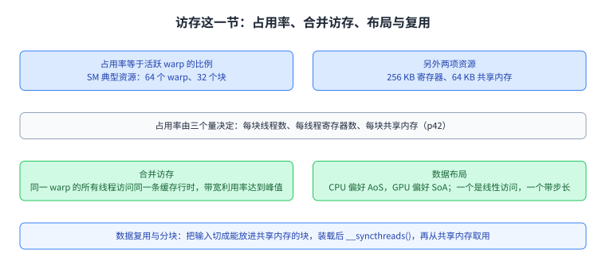

图里四格分别是占用率、合并访存、布局选择与数据复用。它们回答的是同一个问题：数据怎么进到线程手边。

图里上面是分 bank 的规则与无冲突的两种寻址，下面是冲突的例子与三个缓解方向。

## 性能考量之二：SIMD 利用率与分支发散

第 55 页解释分支发散从哪里来。GPU 用一条 SIMD 流水线是为了在控制逻辑上省面积，代价是把多个标量线程编成一组 warp；当同一个 warp 里的线程走到不同的执行路径上，就发生了分支发散。讲义补了一句：这本质上与条件执行、谓词执行、掩码执行是同一件事，也就是前面讲向量掩码时见过的那个问题。

第 56 页用一段小代码说明 warp 内发散：如果线程编号对 2 取模为 0 走这一支，否则走另一支，那么两条路径都要被执行，SIMD 利用率就掉下来了。第 57 页给出一个无发散的改写：让条件变成线程编号小于 32 与否，两条路径处理的是各自的数据，于是所有活跃线程仍属于同一个 warp。

第 58 页到第 61 页用一个向量归约把两种映射摆在一起。朴素的映射每一步让线程按 `t % (2*stride) == 0` 参与，参与线程越来越稀疏，不同步长下活跃线程落在不同 warp 里，SIMD 利用率低。无发散的映射把步长反过来从块大小折半到 2，条件是 `t < stride`，于是每次参与的都是编号连续的一段线程，正好落在同一个 warp 里，利用率高。两页都给了代码。

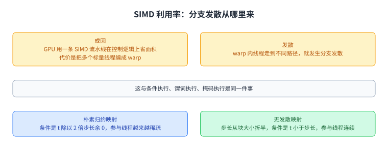

图里上面是发散的成因与它对利用率的影响，下面是两种归约映射与各自的活跃线程分布。

## 性能考量之三：原子操作

第 63 页说清原子操作什么时候必要：当多个线程可能同时更新同一个内存位置时。CUDA 里的写法是 `atomicAdd`，往下是 PTX 的原子加法指令，再往下一段 SASS 展示了用加载链接与条件存储实现的循环；讲义注明原生的原子操作覆盖 32 位整数与 32 位、64 位的比较交换。

第 64 页定义了一个量，叫 warp 内冲突度，指的是一个 warp 里有几个线程更新同一个内存位置，取值在 1 到 32 之间。冲突度为 1 时更新可以并发完成，大于 1 时就只能串行。第 65 页用直方图做例子：直方图统计的是落在各个区间里的数据个数，每个像素读完、算完，就对相应的区间投一票，而这一票就是一次原子加。第 66 页指出自然图像里的冲突很频繁。

第 67 页给出优化办法，叫私有化：每个块先在共享内存里维护一份自己的子直方图，最后再把它们合并到全局直方图里。讲义引了一项 2013 年关于 GPU 暂存内存上原子加法性能建模的工作。

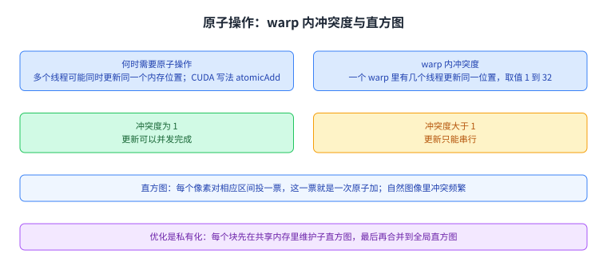

图里上面是冲突度的定义与两种后果，下面是直方图的投票与私有化方案。同一节的两个数字 1 到 32 与 32 个 bank 不是一回事，前者说的是冲突的线程数。

## 性能考量之四：CPU 与 GPU 之间的数据传输

第 69 页把[[term:data-movement]]传输分成同步与异步两种形态，并引入流，也就是命令队列：一个流里的操作按顺序执行。一次典型的流程是 CPU 到 GPU 的传输、内核执行、GPU 到 CPU 的传输；内核执行这一侧有 D 个输入数据实例与 B 个块；默认流则是没有显式分流的做法。

第 70 页给异步传输的算法：把计算分成若干条流，每条流处理 D 除以流数的数据实例与 B 除以流数的块。讲义还给了两条估算式：如果内核时间 tE 大于等于传输时间 tT，也就是内核占主导，那么并行度就受内核限制；反过来如果传输占主导，并行度就受传输限制。

第 71 页给结论与例子：那些在不同数据实例上有独立计算的应用能从异步传输里获益，视频处理就是一个例子。这一页引用了一项 2012 年关于消费级 GPU 上异步数据传输性能模型的工作。

图里上面是同步与异步两种形态，中间是分成若干条流的算法，下面是两条估算式与一个例子。

## 协作计算：从「各算各的再合并」到统一内存

第 73 页之后换了主题。前面的做法都是「CPU 算一部分、GPU 算一部分，最后合并」，这一节讲让两者真正协作起来。

基础还是那三步（p74）：设备分配、主机到设备的拷贝、内核启动、同步、设备到主机的拷贝，对应 `cudaMalloc` 与 `cudaMemcpy`。

第 75 页与第 76 页讲统一内存。统一虚拟地址是前提；CUDA 6.0 起有统一内存，CUDA 8.0 加上 Pascal 之后还有 GPU 缺页。写法上把 `cudaMalloc` 换成 `cudaMallocManaged`，拷贝也换成一个普通的 `memcpy`，编程因此简单很多。

第 77 页给出第一个关键性质：内核启动是异步的，所以 CPU 在等 GPU 完成的同时可以继续干活。讲义说这是传统上利用异构性最高效的方式。只要在启动内核之后、同步之前那一小段里插进 CPU 的工作，两者就在并行。

第 78 页讲更细粒度的异构：Pascal 与 Volta 的统一内存带来了 CPU 与 GPU 之间的内存一致性，以及系统范围的原子操作，于是 CPU 侧的 `output[x] = input[y]` 这样的普通写、以及 `output[x+1].fetch_add(1)` 这样的原子操作，都能和 GPU 内核一起正常工作。第 79 页到第 81 页把各家的对应写法列出来：CUDA 8.0 之后是 `cudaMallocManaged` 与 `atomicAdd_system`；OpenCL 2.0 之后是共享虚拟内存，用 `clSVMAlloc` 并带 `CL_MEM_SVM_FINE_GRAIN_BUFFER` 与 `CL_MEM_SVM_ATOMICS` 两个标志，再用 C++11 的原子操作与 `memory_scope_all_svm_devices`；C++AMP 这一路用 HSA 的统一内存空间与平台原子操作。

第 82 页到第 84 页把协作模式分成三类：数据划分、粗粒度任务划分与细粒度任务划分，三种都能用，区别在粒度与同步的多少。

第 85 页与第 86 页用直方图把差别讲透。老一代的做法是 CPU 与 GPU 各算一份直方图，最后再合并。有了系统范围的原子操作之后，两者可以直接往**同一份**直方图里投票，于是不再需要合并这一步。

第 87 页到第 93 页是 Bézier 曲面的例子。Bézier 曲面由 4 乘 4 个控制点定义，用参数化的非有理形式与 Bernstein 多项式，双三次曲面的 m 与 n 都等于 3。协作实现里，曲面被切成瓦片，由 GPU 的块或 CPU 的线程各算一部分，先是静态分配；第 92 页给出带统一内存的版本，第 93 页给出动态版本：用 `atomicAdd_system` 在一个共享的瓦片计数器上领任务，配合 `__syncthreads()` 同步，领完所有瓦片就退出循环。

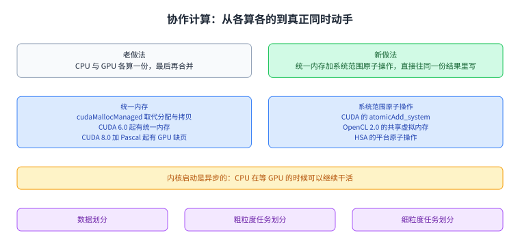

图里上面是老做法与新做法的区别，中间是统一内存与系统范围原子操作带来的能力，下面是三种协作模式。这一节是整讲后半段的地基。

## 协作的收益：五个案例与一条反面经验

讲义用一组案例把协作的收益量出来，方法都一样：让一部分工作分给 CPU，横轴是分给 CPU 的比例，纵轴是执行时间，看最低点比只用 GPU 快多少。

Bézier 曲面在 AMD 的 Kaveri（4 个 CPU 核加 8 个 GPU 计算单元）上最多比只用 GPU 快 **47%**；曲面是 300 乘 300，控制点 4 乘 4，图上还给了 12 乘 12、8 乘 8、4 乘 4 三种控制点密度。在 NVIDIA 的 Jetson TX1（4 个 ARMv8 加 2 个流多处理器）上，4 乘 4 控制点的配置相对只用 GPU 快 **17%**。

矩阵填充这一项在 Jetson TX1 上给出 **29%**：矩阵大小 4000 乘 4000，填充为 1；填充的用途是内存对齐与近方阵转置，而传统上只能做非原地的。第 97 页说明有了 Pascal 与 Volta 的统一内存之后，原地方案成为可能，因为相邻的同步与一致内存让 CPU 与 GPU 可以交替动手。

流压缩在 Jetson TX1 上快 **25%**，在 Kaveri 上最多比只用 GPU 快 **82%**；它的规模是 2 MB 的数组、过滤掉 50% 的元素。

广度优先搜索这一项快 **15%**。它的动机是前沿很小的时候 GPU 资源用不满（p102）；做法是维护持久线程块，用原子操作做块间同步，从而避免为一个很小的前沿重新启动内核（p103 到 p105）；协作的版本按前沿大小选择设备，小前沿交给 CPU、大前沿交给 GPU（p107 与 p108）。第 112 页补上统一内存带来的两个额外好处：不再需要重新启动内核或 CPU 线程，而且 CPU 与 GPU 有可能同时处理同一个前沿。

单源最短路径比广度优先搜索算得更多，最多比只用 GPU 快 **22%**。

最后一个案例是六足机器人 OSCAR 上的自运动补偿与运动物体检测（p114 到 p117）。场景是救援与不平地形带来的强自运动；算法是 RANSAC，用来拟合平面流模型。它的循环里有两个阶段是 SISD 的、一个是 SIMD 的，也就是拟合、评估与比较；协作的做法是利用迭代之间的独立性，把一个迭代分配给一个 CPU 线程与一个 GPU 块。讲义最后给出 Chai 基准套件：8 个数据划分、3 个粗粒度任务划分与 3 个细粒度任务划分的基准。

这一节的标题里还有一条反面经验值得单独记：**最优的设备数量并不总是最大值**。第 98 页与第 101 页都是在说这件事，把工作分出去是为了让两边的长处都用上，而不是越多越好。

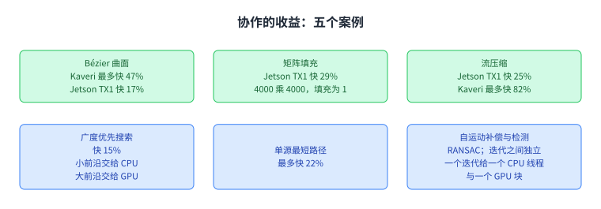

图里每一格是一个案例与它在两台平台上的数字。读这张图要注意横轴：收益来自把一部分工作挪到 CPU，而不是让两边都满负荷。

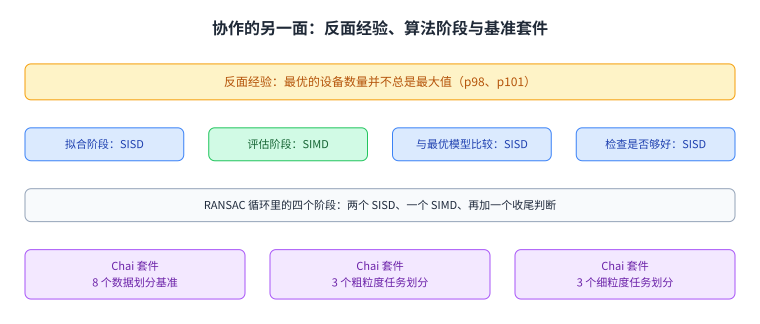

图里上面是那条反面经验与它的两个观察点，下面是 RANSAC 的四个阶段与 Chai 套件的构成。

## 脉络回顾

这一讲把前几讲的结构知识换成了使用者的视角：怎么写代码去用另一颗芯片。它的骨架是三条线。

第一条是算力从哪里来。GTX 285 用 NVIDIA 的说法是 240 个流处理器、换成一般说法是 30 个核每核 8 个 SIMD 功能单元；V100 是 5120 个流处理器、80 个核每核 64 个 SIMD 单元，单精度 15.7 TFLOPS。这些算力靠 warp 级的细粒度多线程被用起来：32 个线程共享一条指令流，最多 32 个 warp 交错执行，寄存器值都留在寄存器堆里，于是长延迟可以被藏掉。

第二条是编程模型。SPMD 是一种编程模型而不是计算机组织，它与 SIMD 硬件之间的桥是批量同步：内核之间只有粗粒度的全局同步，网格与块构成层次，块内有共享内存与同步。硬件可以自由调度块，这叫透明可扩展性。

第三条是性能考量，讲义按瓶颈从大到小排：访存这一侧有占用率、合并访存、数据布局与分块复用，还有共享内存的分 bank 与冲突；计算这一侧有 warp 内的分支发散，用无发散的映射可以把向量归约的利用率提上去；同步这一侧有原子操作与 warp 内冲突度，直方图用私有化来化解；最后是 CPU 与 GPU 之间的传输，用流把传输与计算重叠起来，是否值得做取决于内核时间与传输时间谁占主导。

后半段是协作计算。统一内存把分配与拷贝简化掉，异步的内核启动让 CPU 在等 GPU 时能继续干活，而 Pascal 与 Volta 基础上的内存一致性与系统范围原子操作让两者可以真正同时动手，甚至往同一份直方图里投票。五个案例量出的收益从 15% 到 82% 不等，而括号里的那条经验同样重要：最优的设备数量并不总是最大值。

## 读完应该能回答

1. 这一讲与第 24、25 讲的分工是什么，讲义点名的两类主要瓶颈是哪两类。
2. GTX 285 与 V100 在「NVIDIA 的说法」和「一般说法」下各是多少核与多少 SIMD 单元。
3. warp 是什么，warp 级细粒度多线程为什么能容忍长延迟。
4. SPMD 为什么被称为编程模型而不是计算机组织，批量同步指的是什么。
5. 一次典型的 CUDA 程序在主机侧有哪五步，二维数据的行主序索引怎么算。
6. 占用率由哪三个量决定，合并访存要求什么。
7. 分支发散从哪里来，向量归约的两种映射差别在哪。
8. 统一内存与系统范围原子操作各解决了什么问题，协作的收益与那条反面经验分别是什么。

## 溯源

- 对应：ETH Zürich Computer Architecture（Fall 2022），Lecture 26 — GPU Programming（`lecture26-gpuprogramming-beforelecture.pdf`，120 页）。讲义链接：<https://safari.ethz.ch/architecture/fall2022/lib/exe/fetch.php?media=onur-comparch-fall2022-lecture26-gpuprogramming-beforelecture.pdf>。首页署名为 Juan Gómez Luna 与 Onur Mutlu。
- 上游许可：站点级页脚为 CC BY-NC-SA 4.0。SA 是传染性的，所以本页的译文也以同协议发布、且为非商业用途。本页未转载原讲义里的任何图片，配图全部自绘。
- 证据来源：`_sources/eth-ddca-ca/evidence/eth-ca2022-lecture26-gpu-programming.pdf.pypdfium2.txt`（pypdfium2 抽取，120 页，38,123 字符），交叉核对用同名的 `.pdf.pypdf.txt`（pypdf 抽取，120 页，36,670 字符）。四道完整性核验：3,806,862 字节、尾部有 `%%EOF`、不是 2 的整数次幂、不是 64 KiB 的整数倍。抽取器是 `_sources/_audit/pdftext_alt.py`；仓内 `pdftext*.py` 的输出本页一律未采用。
- 与第 24、25 讲的接口：这两讲讲的是互连与片上网络，也就是「数据怎么走」；这一讲讲的是「怎么写代码去用另一颗芯片」，而它点名的两类瓶颈（CPU 与 GPU 之间的传输、对 DRAM 带宽的依赖）正是那两讲的主题在使用者一侧的投影。接口由讲义自己给出：p21 与第 39 页两处都在讲这两类瓶颈。
- 取材范围：全文 p1 到 p120，其中 p120 是重复的封面页，没有 Backup Slides 分节。讲义里只有标题、图、代码或出处的页：分节页 p4、p19、p28、p38、p40、p54、p62、p68、p73；纯图或代码页 p6 到 p12、p14 到 p17、p31 到 p37、p43 到 p53、p55 到 p61、p63 到 p67、p69 到 p71、p74 到 p81、p85 到 p87、p90、p92、p93、p95、p97、p99、p103 到 p105、p110 到 p112、p115 到 p119；出处页 p3、p47、p53、p67、p71、p118。这些页本页只登记标题、主题或出处，没有替它们复原内容。
- 数字以讲义页面为准：GTX 285 的 240、30、8、64 KB、32、32、1024、30,720；V100 的 5120、80、64、15.7、7.8、125；第 9 页演化线的六款产品与年份；术语表里 N 等于 8 与 16；第 17 页的 32 线程 8 lane 与 24 个操作；第 42 页的 64、32、256 KB、64 KB；共享内存的 32 个 bank；第 64 页的 1 到 32；协作案例里的 47%、17%、29%、25%、82%、15%、22%，以及 300 乘 300、4 乘 4、4000 乘 4000、2 MB、50%；Chai 套件的 8、3、3。**第 47 页、第 91 页、第 96 页、第 100 页与第 109 页的曲线数值没有写进这一页**，因为那几页只有图，正文没有复述坐标。
- 讲义未展开的推论属于 CourseLingo 的讲解。这类推论有三组：把这一讲写成「前面讲结构、这一讲讲怎么用」的使用者一侧；把性能那一节按「访存、计算、同步、传输」四类重新归拢；以及把协作那一节读成「从各算各的到真正同时动手」的演进。
