+++
title = "闪存：当存储不再是电容，而是一块浮栅里的电荷"
lecture = 29
slug = "lecture27-flash-memory"
status = "draft"
source_kind = "notes"
source_url = "https://safari.ethz.ch/architecture/fall2022/lib/exe/fetch.php?media=onur-comparch-fall2022-lecture27-flashmemory-beforelecture.pdf"
source_title = "Lecture 27: Flash Memory (Fall 2022, beforelecture)"
output_mode = "explanation"
+++

> 来源课程：ETH Zürich Computer Architecture（Onur Mutlu 主讲，Fall 2022）；
> 对应讲义：Lecture 27 — Flash Memory（`onur-comparch-fall2022-lecture27-flashmemory-beforelecture.pdf`，306 页）；
> 讲义链接：<https://safari.ethz.ch/architecture/fall2022/lib/exe/fetch.php?media=onur-comparch-fall2022-lecture27-flashmemory-beforelecture.pdf> ；
> 上游许可：该课程 wiki 每一页的页脚都带站点级许可块，原文为 CC BY-NC-SA 4.0：<https://creativecommons.org/licenses/by-nc-sa/4.0/deed.en> ；
> 本页由 CourseLingo 用中文重新讲解，按源讲义的推进顺序组织，不是逐字翻译，也不转载原讲义里的任何图片；
> 页内配图全部由我们自绘；原讲义里只有图、没有字的页，我们只如实记下它的标题。
> 本页为非官方材料，与 ETH Zürich 及课程教学团队无隶属关系；如与原文有出入，以原文为准。

本页的事实来自 `_sources/eth-ddca-ca/evidence/eth-ca2022-lecture27-flash-memory.pdf.pypdfium2.txt`（pypdfium2 抽取，306 页，88,365 字符），交叉核对用同名的 `.pdf.pypdf.txt`（pypdf 抽取，306 页，85,543 字符）。抽取器是 `_sources/_audit/pdftext_alt.py`。该 PDF 入库前按四道核验过完整性：体积 7,895,295 字节、尾部有 `%%EOF`、不是 2 的整数次幂、也不是 64 KiB 的整数倍（余数 30,975）。仓内自研的 `pdftext*.py` 这一族在前几讲已被实测为不可靠，本页没有采用它们的任何输出。

## 这一讲要解决什么问题

前面那条很长的内存线讲的都是 [[term:DRAM]]：它怎么读、怎么刷新、怎么调度、干扰与服务质量怎么处理。这一讲第一次离开 DRAM，换到闪存。两者在系统里的位置是同一层，都用来存数据，但物理机制完全不同。

讲义自己给了这个对比，就在第 28 页，标题叫「电荷存储的极限」。它把两种器件并排写出来：**闪存用的是浮栅里的电荷，[[term:DRAM]] 用的是电容里的电荷加上晶体管的漏电**；两者的共同后果是「存储单元越做越小，可靠地把电荷读出来就越难」。同一页之后，第 125 页在讲读干扰时又把这层意思铺开：所有被持续缩小的存储器都容易受读干扰，包括 DRAM、SRAM 与硬盘。

不过这一讲的重心与 DRAM 那几讲很不一样。DRAM 那几讲问的是「怎么算得快、怎么分得公平」，这一讲讲的是错误与寿命：闪存的噪声来自编程、擦除、读取与时间，而且这些错误按擦写次数指数增长。讲义第 29 页的摘要把目标说得明白：用实验刻画建立可靠的错误模型，再基于模型做出提高可靠性与寿命的技术。

这一讲的结构也因此是一串「错误类型 → 机制刻画 → 补救手段」：先看闪存怎么工作，再看四类错误从哪里来，然后依次处理保持错误、编程干扰、读参考电压、读干扰、数据保持，最后换到 3D 闪存与温度。

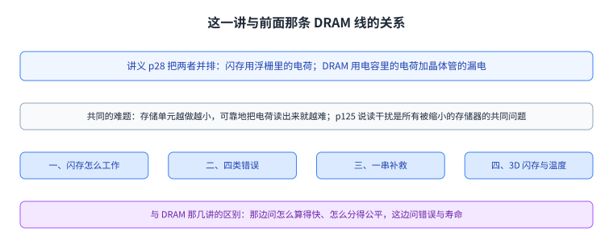

图里上面两格是讲义给出的 DRAM 与闪存对比，下面几格是这一讲的推进顺序。把这一页记住，后面每一节都能放回这条线上。

## NAND 闪存是怎么工作的

讲义在第 2 页到第 25 页用一组图把物理基础讲完。

闪存的存储单元是一个浮栅晶体管（p5）：它在控制栅与沟道之间多了一层浮栅，电荷就存在这一层里。存进去多少电荷，决定了这个晶体管被打开所需的阈值电压 Vth（p6）。读出数据靠的是比较：给控制栅加一个读电压 Vread 等于 2.5 伏（p7），如果单元的 Vth 高于它就不导通，低于它就导通，读出来就是一个比特。而一行里不是所有的单元都要被读，其余单元要加一个更高的通过电压 Vpass 等于 5 伏（p8），保证它们无论是哪个状态都导通，电流才能顺利走过这一串单元。第 9 页给出整页读出的样子：被读的那条字线加 2.5 伏，其余字线加 5 伏，[[term:sense-amplifier]]在列方向上把结果读出来。第 4 页说明阵列的组织方式是块、页、行列，感放大器在下方。

第 10 页用一组图区分 NAND 与 NOR 两种排布。第 11 页到第 13 页引入分布的概念：单元的 Vth 不是一个值，而是一个分布，用概率密度函数描述；判断存的是什么，就靠在两个分布之间放一条读参考电压 Vref。

第 14 页讲多值单元：一个单元存两个比特，于是有四个状态，擦除态记作 11，另外三个编程态记作 10、00、01，三个状态之间各需要一条读参考电压。第 18 页说明这两个比特是分两步写进去的：先写低位页，把单元写到一个临时状态，再写高位页，把它推到最终的三个编程态之一。第 19 页给出与页的对应关系：低位与高位各自还有偶数页与奇数页之分。

第 20 页到第 23 页讲平面与 3D 两条路线。平面闪存靠缩小单元、拉近单元间距来提升密度，而这样做会伤害可靠性；3D 闪存改为堆叠层数，讲义在这一页用感叹号写明：3D 的可靠性「还没有被好好研究」。第 21 页给出 3D 的结构：多层字线加多条位线；第 22 页说明 3D 单元用的是电荷陷阱而不是浮栅；第 23 页给出 3D 的组织方式，第 219 页还专门画了两者的截面差别，一个是导体浮栅，一个是绝缘体电荷陷阱。

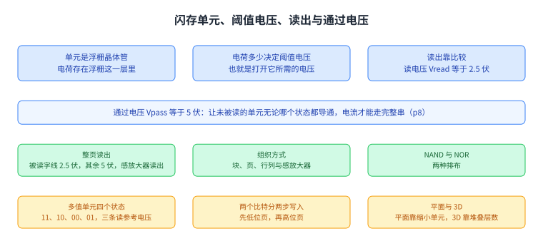

图里从单元结构一路排到整页读出。这四步是后面所有错误机制的舞台。

## 读参考电压为什么会变

第 15 页给出这一讲最关键的一条物理事实：阈值电压会随时间下降。图上画的是保持损失前后的两条分布，编程态的分布整体向左移动。

第 16 页说明后果：当分布向左移动而读参考电压固定不动时，就会产生原始比特错误。第 17 页给出解法：存在一个**最优读参考电压**，它让原始比特错误最少，而这个最优值要跟着分布一起移动。第 87 页把这个最优值的来源写成公式：读参考电压处的错误等于左侧分布漏过来的部分加上右侧分布漏过来的部分，两条分布有各自的均值与方差时，就能算出使总错误最小的那个点。

第 88 页给出可用的做法：每隔约一千次擦写做一次阈值电压漂移学习，先按已知数据写入样本单元、再写入相邻单元并测出受害单元在干扰后的阈值电压，从而刻画平均漂移；预测时就把默认读参考电压加上模型预测的平均漂移。第 89 页给出效果：原始比特错误率降低 64%，擦写寿命提升 30%（用的是 32k 位 BCH 码，可接受的误码率是 2 乘 10 的负 3 次方）。

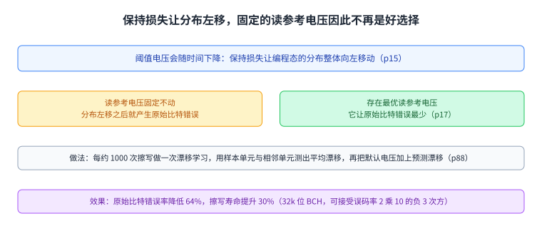

图里上面是分布左移这件事，下面是固定的读参考电压与最优读参考电压的差别，以及预测带来的两个数字。

## 错误从哪里来：四类错误

第 33 页给出一个贯穿全讲的指标：**不可纠正比特错误率**，定义是经过纠错之后仍然错误的比特比例；要保证存储级的可靠性，它要低于 10 的负 15 次方。同一页用一张图说明缩放与多值化让这个目标越来越难：从单值单元一路到三比特单元，耐久度从十万次擦写掉到一千次，而所需纠错能力从每千字节四位一路涨到二十四位（图上的具体数字是 100k、10k、5k、3k、1k 与 4、8、15、24 位，我按图标注）。

第 32 页给出一组对照：闪存能提供的擦写次数是「几千次」，而把整盘容量每天写十遍、连续五年所需要的擦写次数超过五万次。

第 43 页把错误分成四类。前三类由常见的闪存操作造成：读错误、擦除错误与编程干扰错误。第四类由单元随时间失去电荷造成，也就是保持错误，它与[[term:retention-time]]直接相关；讲义特别指出，一个错误是否发生取决于要求的保持时间，而且在多值闪存里更麻烦，因为判断状态所需的阈值电压窗口更窄。第 44 页用一张图把这四类错误放回使用过程：每个擦写周期里先擦块、再写页，然后经历一段保持时间，最后读页。

第 47 页给出四类错误各自的测法：擦除错误数没能被擦回 11 状态的单元；编程干扰错误比较整块编程后的数据与刚刚写完时的数据；读错误连续读同一个块并比较相邻两次读出的数据；保持错误比较写入的数据与一段时间后读出的数据，短期在室温下测，长期放在 125 摄氏度的烤箱里测。

第 48 页给出三条结论：**原始比特错误率随擦写次数指数增长**；保持错误是主要来源，在一年保持时间的配置下占**超过 99%**；而且它随要求的保持时间变长而增加。第 49 页解释机制：电子从浮栅里漏出去，编程得越满的单元漏得越多，而且阈值电压更可能只移动一个窗口而不是移动多个；第 50 页补上取值相关性，00 与 01 这两个编程得最满的状态最容易受到保持噪声影响。

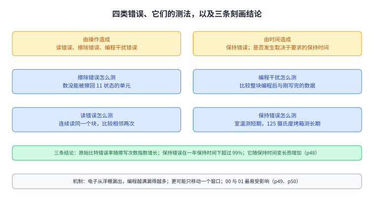

图里上面是四类错误的来源，中间是各自的测法，下面是保持错误为主、且随擦写次数指数增长这三条结论。

## 第一条补救：定期刷新

既然保持错误是主要来源，而且它随时间累积，第 53 页给出的第一条补救就是**定期[[term:refresh]]**：按擦写磨损程度调整周期，擦得越多刷得越勤，并且把原地重写与重映射两种刷法组合起来。

第 54 页给出这套做法，名字叫闪存纠正与刷新（FCR）。它的想法是定期读每个页，用较弱的[[term:ecc]]纠错码把错误纠出来，然后要么把它重映射到新的物理页，要么原地重新编程，而这个动作必须在错误超过纠错能力之前完成。还有一个优化：把刷新速率适应到已经经历的擦写次数上。

第 55 页把两个关键问题摆开。怎么刷：重映射到别的页、原地重新编程，或者两者混合。什么时候刷：用固定周期，还是让周期跟着保持错误的严重程度走。第 56 页讲清原地重编程的两面：好处是不需要重映射，于是不产生额外的擦除操作；坏处是它会增加编程错误的发生，因为重编程是把单元电压往右推，而这正是修好保持错误的手段。

结果在第 57 页与第 58 页。第 57 页把寿命画成柱状图：不刷新是基线，重映射式与混合式都在其上，而自适应速率的 FCR 给出最高寿命，图上标的最大提升是 46 倍；旁边还标了一个 4 倍，对照的是「靠更强的纠错码」能拿到的寿命。第 58 页给出能量代价：自适应速率刷新的能量增加在触发每天一次刷新之前低于 1.8%，图上标的几条曲线分别在 7.8%、5.5%、2.6%、1.8% 与 0.4%、0.3% 附近（按图标注）。

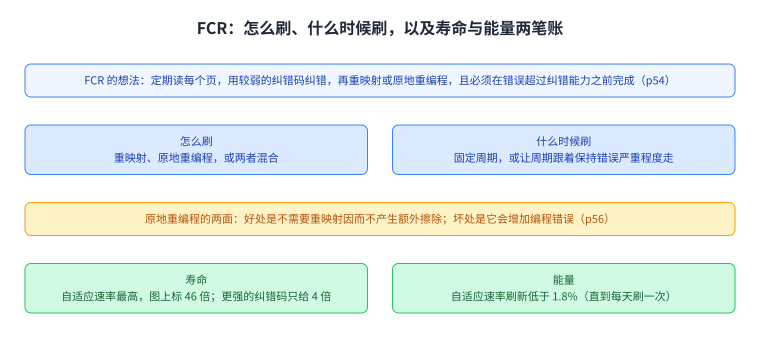

图里上面是 FCR 的想法与两个关键问题，中间是原地重编程的两面，下面是寿命与能量两组数字。

## 把分布与干扰建成模型

要做出好的补救，先得能预测。第 65 页把三连问摆出来：不同编程态的阈值电压分布随寿命怎么变，能不能准确地建模并预测这个变化，能不能据此做出纠正机制。

第 66 页与第 67 页给出答案：分布可以按高斯分布加白噪声建模，准确率约 95%；而由擦写次数造成的畸变可以建模并预测成擦写次数的指数函数，准确率超过 95%。第 66 页还给出两个方向：随擦写次数增加，分布整体右移，同时变得更宽。

第 75 页讲第二类可预测的错误，编程干扰：一个单元被编程时，相邻单元的电压会因为寄生电容耦合而被无意地改变，于是存进去的数据可能变样；它的方向是把邻居的电压往右推。讲义特别指出，一旦保持错误被压下去，这类错误就可能变成主要来源。

第 78 页给出传统模型：受害单元的电压变化等于上下左右与对角邻居电压变化按各自的耦合电容加权求和。讲义给它的评价是不准确，而且需要知道耦合电容。第 79 页给出新模型的想法：用实测去刻画邻居单元电压变化对受害单元的影响，再把它拟合成一个线性回归模型，系数由实测得到。第 80 页补充特征提取与最大似然估计的做法。第 81 页给出几条物理结论：正上方邻居的干扰最强，紧邻对角的是第二强，更远的邻居也有影响，而受害单元自己的电压对干扰有负向影响。第 83 页给出模型精度：96.8%，同样是在 2Y 纳米的芯片上用读重试特性测出来的。

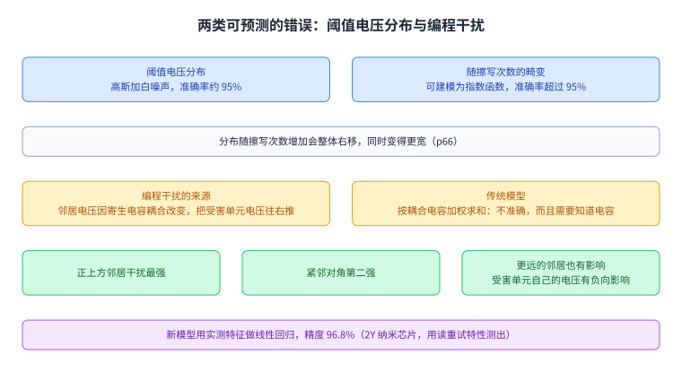

图里上面是分布随擦写次数右移并变宽，下面是编程干扰的来源、几条物理结论与两个精度数字。

## 邻居辅助纠错

第 112 页先把已有观察收一遍：正上方邻居在编程时对受害单元影响最大；而判断一个单元的值只用一套读参考电压，这套电压是按所有单元的总体分布定的。

第 113 页给出新观察：紧邻单元取值不同的那些单元，它们的阈值电压分布明显不一样，因为邻居的取值决定了漂移的大小。推论很直接：如果知道紧邻单元的值，就能按条件分布找出一套更准的读参考电压。

第 116 页把这件事的意义说清楚：用总体分布算出来的最优电压会带来更多错误，而用条件分布算出来的更好，因为两个状态的条件分布彼此离得更远。

第 118 页给出机制，叫邻居辅助纠错（NAC）：先用总体分布的读参考电压把页读出来并缓存；如果纠错失败，就去读紧邻的那一页，然后用「假定某个紧邻取值」对应的读参考电压重读，把缓存里相应单元的值替换掉，再跑一次纠错。第 119 页给出流程上的两个要点：只在纠错失败时才触发邻居辅助读，而且按优先级顺序尝试不同的紧邻取值，直到纠错通过为止。

图里上面是总体读与条件读的差别，下面是 NAC 的四步流程。它只在纠错失败时付出代价。

## 读干扰：把通过电压调低一点

第 125 页之后换到第三类错误。第 132 页与第 133 页把机制演出来：反复读某一页以外的其它页时，被加在那些字线上的高通过电压会带来弱编程效应，把未读页里单元的值改掉。讲义把这件事叫读干扰。

第 134 页的摘要给了两条结论与两个数字。结论一：把通过电压稍微调低就能大幅减少读干扰错误，而有些单元比另一些更容易受读干扰。结论二：有两类应对，一类是在线缓解，另一类是失败后恢复。在线的那一类叫**通过电压调优**，它按块动态地找一个更低的通过电压，使闪存寿命提升 21%；恢复的那一类叫**读干扰导向的错误恢复**，它选择性地纠正那些更容易受读干扰的单元，把原始比特错误率最多降低 36%。

代价与收益之间的取舍在第 140 页与第 141 页讲得很清楚。纠错码的能力是按高保持时间预留的，而保持时间越长，没有被用掉的那部分纠错能力就越少；读参考电压调低会引入读错误，但如果把这两件事对起来，就能用那部分闲置的纠错能力去吸收读错误，同时把读干扰压到最小。第 141 页把今天的做法与这个想法对照：今天保守地把通过电压设得很高，于是没有读错误，但在每个刷新周期结束时积累下更多读干扰错误；新想法是动态地把通过电压调到闲置纠错能力允许的程度，如果读错误真的超出纠错能力，就用更高的通过电压重读一次。

第 142 页给出调优的三个步骤，按块每天做一次：先估出闲置的纠错能力，再激进地把通过电压降下去直到读错误超出纠错能力，然后逐步加回来直到读错误刚好低于纠错能力。第 143 页给出评估：19 条真实工作负载的输入输出轨迹、假设刷新周期是 7 天；代价方面，512 GB 的盘需要 128 KB 存储来记录每块的通过电压设置与最坏情况页，平均每天的调优开销是 24.34 秒。

第 146 页给出第二条观察：有些单元天生更容易受读干扰，它们的阈值电压更高；被读干扰 25 万次之后，易受干扰的那些会掉到擦除态，而不易受干扰的只掉到第一个编程态。第 147 页给出恢复机制的做法：由一次不可纠正的错误触发，先把故障块里有效数据备份出来，再对故障页故意做十万次读干扰，比较干扰前后的阈值电压，据此挑出易受影响的单元，并用漂移的大小去猜它们原本的状态，这样一来总错误数在 100 万次读干扰下最多降低 36%，剩下的交给纠错码。

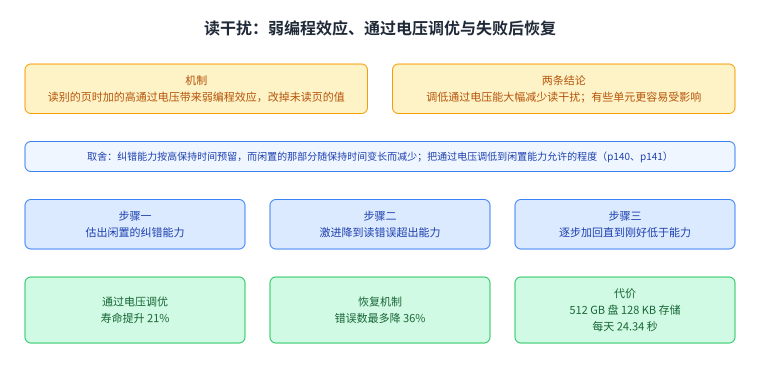

图里上面是弱编程效应的机制，中间是两笔账的取舍，下面是调优的三个步骤与恢复机制的两个数字。

## 数据保持：老数据为什么读得慢

第 150 页之后的这一节从一个现象出发：老数据读起来更慢。第 153 页到第 155 页把因果链拆开：保持损失让阈值电压向左移动，于是最优读参考电压也随之移动；如果读的时候还用原来那套电压，第一次读就会失败，接着触发读重试，而读重试要花时间。第 165 页把这条因果链点明：最优电压会因为保持损失随时间变化。

第 166 页给出第一个机制，叫**保持优化读**。它有两个部件：一个在线预优化算法，用来学习和记录最优读参考电压，每天在后台跑一次；以及一个更简单的读重试技术，当记录下来的最优值过时时，就用更低的电压做读重试。

第 177 页给出第二个机制，叫**保持失败恢复**。它的想法是从单元的漏电速度去猜它原本的状态，分三步：先找出有风险的单元，再区分漏得快与漏得慢的单元，最后猜出原始状态。

第 180 页把这一节的结论收成两条数字：保持优化读让读[[term:latency]]延迟缩短 71%；保持失败恢复在纠错之前把错误减少 50%，从而在失败之后还能把数据找回来。

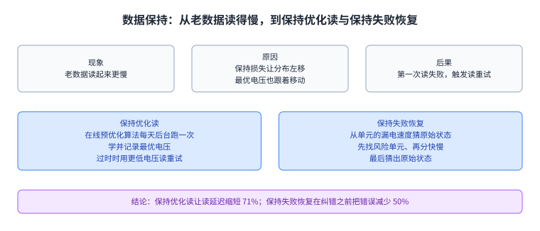

图里上面是从保持损失到读延迟的因果链，下面是两个机制各自的做法与数字。

## 换到 3D 闪存：错误特征不一样

第 224 页的摘要把这一节的问题说清楚：3D 闪存的错误特征还没有被好好研究。它的第一条贡献是用真实 3D 芯片做刻画，得到三条结论：层与层之间的工艺差异带来 21 倍的错误率差别；早期保持损失很突出，编程之后 3 小时错误率就上升 10 倍；以及保持干扰，也就是保持损失的量与邻居单元的状态相关，这在平面闪存里没有被观察到过。

第二条贡献是建模：一个原始比特错误率的差异模型，以及一个保持损失模型。第 238 页给出后者的形状：一个可以在线使用的简单线性模型，把最优读参考电压、原始比特错误率的对数、以及分布的均值与标准差，都表示成保持时间的对数与擦写次数的函数；它的模型误差小于一个电压台阶，调整后的决定系数大于 89%。

第三条贡献是三个缓解机制（p241 到 p246）。**层差异感知读**为每一层学一个电压偏移，用一个表存起来，每颗芯片只需要层数乘二字节的存储，平均把原始比特错误率降低 43%；**层交错 RAID** 把可靠性差的层上的页与可靠性好的层上的页编到同一组里，也把高位页与低位页编在一起，存储开销低于 0.8%，把最坏情况下的原始比特错误率降低 66.9%；**保持模型感知读**在线学习保持损失模型，用写入时间戳与读取时间戳算出保持时间，用 800 KB 记录每个块的编程时间，把原始比特错误率平均降低 51.9%。第 247 页给出系统层面的结果：三个机制合起来让闪存寿命延长 85%，或者把纠错码的存储开销降低 79%。第 248 页把它们总结为：寿命提升 1.85 倍，或者纠错开销降低 78.9%。

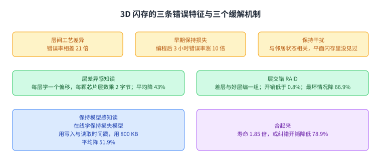

图里上面是三条刻画结论与它们的数字，下面是三个机制各自的做法与效果。它们的共同点是：都在线学一个模型或一张表。

## 用写入热度换寿命

第 255 页的摘要给出另一条思路。前提是已经知道的一件事：用刷新去放宽保持时间，可以让闪存耐久度提升 50 倍。问题是频繁刷新本身会吃掉这五十倍里的大部分。它的关键观察是：对写入频繁的数据，刷新是不必要的，因为那些数据很快就会被重写。

于是有了按写入热度管理保持时间（WARM）的两个想法：在盘内把写热的页与写冷的页在物理上分区，然后对两组施加不同的策略，包括垃圾回收、磨损均衡与刷新。第 256 页与第 257 页画出两种做法的差别：传统做法把热页与冷页混在同一个块里，于是这个块无法放宽保持时间；分区之后，只有热页的块就可以放宽。

结果在第 255 页：不使用刷新的 WARM 把寿命提升 3.24 倍；加上自适应刷新的 WARM 提升 12.9 倍，比只用刷新高 1.21 倍。

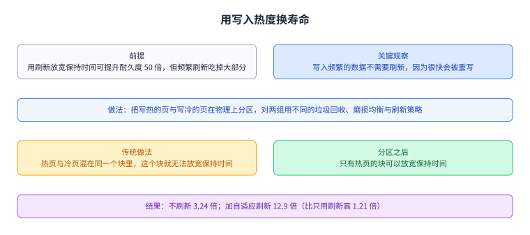

图里上面是传统做法与分区做法的差别，下面是三个倍率。这一节的立场是：不是所有数据都需要被同样地保护。

## 温度与自恢复

最后一节回到 3D 闪存，处理两个此前没有被报告过的因素（p268）：自恢复与温度。

第 281 页到第 283 页给出三条刻画结果。把两次擦写之间的空闲时间从 1 分钟拉长到 2.3 小时，保持损失的速度会放慢 40%，这就是自恢复。把编程温度从 0 摄氏度升到 70 摄氏度，编程差异改善 21%。把存储温度从 70 摄氏度降到 0 摄氏度，保持损失的速度放慢 58%。

第 288 页到第 292 页把它们并进一个统一模型，名字叫自恢复与温度统一模型：电压等于编程后的初始电压加上保持损失造成的漂移，其中漂移这一项由三个部件构成，分别是编程差异部件、自恢复与保持部件，以及温度缩放部件；温度缩放用的是阿伦尼乌斯关系，并把一个重要参数从 1.1 电子伏特校准到 1.04 电子伏特。这个模型的预测错误率是 4.9%。

第 296 页到第 301 页给出基于这个模型的机制，名字叫 HeatWatch。它需要追踪四样东西：用盘内已有的温度传感器拿到盘温；记录最近二十次整盘写入的时间戳，因为自恢复效应在二十个擦写周期之后就不明显了；用盘上已有的擦写计数与每个块的写入时间戳算出保持时间；再用周期采样在线微调模型参数，以吸收芯片之间的差异。它的存储开销是 1 TB 盘里 DRAM 的 0.16%，延迟开销低于闪存读延迟的 1%。效果在第 303 页：它比当时最好的方案再多 24% 的寿命，相对固定读参考电压的方案把寿命提升 3.85 倍。

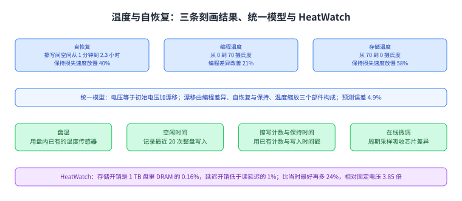

图里上面是三条刻画结果，中间是统一模型的三个部件与它的 4.9% 误差，下面是 HeatWatch 追踪的四样东西与它的开销和效果。

## 与本课程其它讲的连接

这一讲的那条线在这门课里出现过两次。第一次是 DRAM：讲义自己把两者并排比较，闪存用浮栅电荷、DRAM 用电容电荷加漏电，而两者共同的难题是单元缩小之后可靠读出越来越难；第 125 页还指出读干扰是「所有被缩小的存储器」的共同问题，并点名了 DRAM、SRAM 与硬盘。第二次是可靠性这件事本身：DRAM 那一侧有 [[term:RowHammer]] 这样的可靠性问题，闪存这一侧则是保持错误、编程干扰与读干扰；两边的手段也相似，都是先做实验刻画、再建模型、最后用模型去做在线决策。

在存储层次上，闪存与 Optane 这一类存储级内存所处的位置相邻，都在内存与磁盘之间，区别在于闪存以块为单位擦除、以页为单位读写，而读参考电压会随时间和磨损移动。上层是发出请求的 [[term:CPU]] 与文件系统，这一讲讨论的读重试与刷新对它们表现为延迟与寿命。而第 15 讲讲过的 Ramulator 这类模拟器，评估的是 DRAM 那一侧的内存系统；把它与这一讲的错误模型放在一起看，就能明白一节课为什么把内存与存储分成两条线来教。

上面这一段是 CourseLingo 添加的连接，不是讲义内容；讲义里出现的池内名字只有 DRAM、SRAM 与 FPGA（实验平台用的两块 FPGA 板），其余名字是我为了让读者看清这一讲在整门课里的位置而补的。

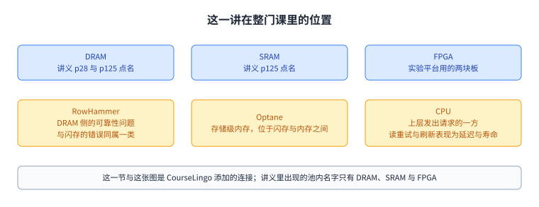

图里上面三个名字来自讲义，下面三个是我方补的。它说明这一讲虽然是第一次离开 DRAM，却仍落在同一条存储层次上。

## 读完应该能回答

1. 讲义在哪一页把闪存与 DRAM 并排比较，两者共同的难题是什么。
2. 闪存单元靠什么存数据，读电压与通过电压各是多少伏、各起什么作用。
3. 多值单元有哪四个状态，两个比特是怎么分两步写进去的。
4. 阈值电压会随时间往哪个方向移动，固定的读参考电压为什么会因此变差。
5. 四类错误分别是什么，哪一类占主导，它随擦写次数怎么增长。
6. FCR 的两个关键问题是什么，原地重编程的好处与坏处各是什么。
7. 邻居辅助纠错的依据是什么，它什么时候才被触发。
8. 3D 闪存的三条错误特征与三个缓解机制分别是什么。

## 脉络回顾

这一讲是这门课第一次离开 DRAM。讲义第 28 页自己给出了对比：闪存靠浮栅里的电荷，DRAM 靠电容里的电荷与晶体管的漏电，而两者共同面对的是「单元越做越小、可靠读出越难」。但重心完全不同：DRAM 那几讲问怎么算得快与分得公平，这一讲讲错误与寿命。

物理基础那一节把舞台搭好：浮栅里的电荷决定阈值电压，读出靠把读电压 2.5 伏与通过电压 5 伏加在字线上，多值单元用四个状态存两个比特、分两步写入，而平面闪存靠缩小单元、3D 闪存靠堆叠层数，后者会伤害可靠性并且在当时还没有被好好研究。

整讲的骨架是「错误类型 → 机制刻画 → 补救手段」。三类操作错误加一类时间错误构成本讲的四类错误，其中保持错误是主要来源，在一年保持时间下超过 99%，而且原始比特错误率随擦写次数指数增长。围绕这四类错误，讲义给出了一串手段：定期刷新的 FCR 用弱纠错码加原地重编程或重映射，把寿命做到最高 46 倍而能量代价低于 1.8%；阈值电压分布用高斯加白噪声建模到约 95%，编程干扰用线性回归建模到 96.8%；邻居辅助纠错把总体分布的最优读电压换成条件分布的最优读电压；读干扰用调低通过电压并使用闲置纠错能力来对付，寿命提升 21%、错误率最多降 36%；数据保持这一侧，保持优化读让读延迟缩短 71%，保持失败恢复在纠错之前把错误减半。

最后两节换到 3D 与温度。3D 闪存的三条新特征是层间差异带来 21 倍错误率差别、编程后 3 小时错误率涨 10 倍、以及此前没被观察到的保持干扰；三个缓解机制分别降低 43%、66.9% 与 51.9% 的错误率，合起来把寿命提升 1.85 倍或把纠错开销降低 78.9%。写入热度那一侧，把热页与冷页分开之后，不刷新就有 3.24 倍、加自适应刷新有 12.9 倍。温度与自恢复这一侧，统一模型把编程差异、自恢复与温度三件事并进一个公式，预测误差 4.9%，而 HeatWatch 用盘内已有的传感器与时间戳去喂这个模型，换来 3.85 倍寿命与很小的开销。

## 溯源

- 对应：ETH Zürich Computer Architecture（Onur Mutlu 主讲，Fall 2022），Lecture 27 — Flash Memory（`lecture27-flashmemory-beforelecture.pdf`，306 页）。讲义链接：<https://safari.ethz.ch/architecture/fall2022/lib/exe/fetch.php?media=onur-comparch-fall2022-lecture27-flashmemory-beforelecture.pdf>
- 上游许可：站点级页脚为 CC BY-NC-SA 4.0。SA 是传染性的，所以本页的译文也以同协议发布、且为非商业用途。本页未转载原讲义里的任何图片，配图全部自绘。
- 证据来源：`_sources/eth-ddca-ca/evidence/eth-ca2022-lecture27-flash-memory.pdf.pypdfium2.txt`（pypdfium2 抽取，306 页，88,365 字符），交叉核对用同名的 `.pdf.pypdf.txt`（pypdf 抽取，306 页，85,543 字符）。四道完整性核验：7,895,295 字节、尾部有 `%%EOF`、不是 2 的整数次幂、不是 64 KiB 的整数倍。抽取器是 `_sources/_audit/pdftext_alt.py`；仓内 `pdftext*.py` 的输出本页一律未采用。
- 与那条 DRAM 线的接口：讲义自己在 p28 把两者并排比较（浮栅电荷对电容电荷加漏电），在 p125 把读干扰说成所有被缩小的存储器（DRAM、SRAM、硬盘）的共同问题，在 p231 与 p219 对比平面与 3D 单元的电荷存储方式。
- 添加内容：「与本课程其它讲的连接」整节是我方添加，讲义里没有出现 RowHammer、Optane、Ramulator、CPU 这些名字；池内名字里只有 DRAM、SRAM 与 FPGA 出现在讲义中（FPGA 是实验平台的两块板）。
- 取材范围：全文 p1 到 p306，没有 Backup Slides 分节。讲义里有大量只有图、代码或出处的页（第 2 到 25 页的背景图、各节的 Agenda 页、每篇工作的出处页与结果图页），本页只登记标题、主题或出处，没有替它们复原内容。图上的数值（耐久度的 100k／10k／5k／3k／1k 与 4／8／15／24 位、FCR 寿命图上的 46 倍与 4 倍、能量图上的 7.8%／5.5%／2.6%／1.8%／0.4%／0.3%、p247 图上的 85% 与 79%）是从图上标签读出来的，讲义正文没有逐条复述这些坐标，我按图标注。
- 数字以讲义页面为准：读电压 2.5 伏与通过电压 5 伏、四类状态与两次写入、21 倍与 10 倍与 3 小时、超过 99% 与指数增长、95% 与 96.8% 与 89%、64% 与 30%、46 倍与 4 倍与 1.8%、43% 与 66.9% 与 51.9% 与 0.8% 与 800 KB 与 1.85 倍与 78.9%、3.24 倍与 12.9 倍与 1.21 倍、40% 与 21% 与 58% 与 4.9% 与 0.16% 与 1% 与 3.85 倍与 24%。
