+++
title = "两个极端：把并行交给编译器，或者把计算铺成阵列"
lecture = 30
slug = "lecture28-vliw-systolic"
status = "draft"
source_kind = "notes"
source_url = "https://safari.ethz.ch/architecture/fall2022/lib/exe/fetch.php?media=onur-comparch-fall2022-lecture28-vliw-systolic-array-architectures-beforelecture.pdf"
source_title = "Lecture 28: VLIW and Systolic Array Architectures (Fall 2022, beforelecture)"
output_mode = "explanation"
+++

> 来源课程：ETH Zürich Computer Architecture（Onur Mutlu 主讲，Fall 2022）；
> 对应讲义：Lecture 28 — VLIW and Systolic Array Architectures（`onur-comparch-fall2022-lecture28-vliw-systolic-array-architectures-beforelecture.pdf`，122 页）；
> 讲义链接：<https://safari.ethz.ch/architecture/fall2022/lib/exe/fetch.php?media=onur-comparch-fall2022-lecture28-vliw-systolic-array-architectures-beforelecture.pdf> ；
> 上游许可：该课程 wiki 每一页的页脚都带站点级许可块，原文为 CC BY-NC-SA 4.0：<https://creativecommons.org/licenses/by-nc-sa/4.0/deed.en> ；
> 本页由 CourseLingo 用中文重新讲解，按源讲义的推进顺序组织，不是逐字翻译，也不转载原讲义里的任何图片；
> 页内配图全部由我们自绘；原讲义里只有图、没有字的页，我们只如实记下它的标题。
> 本页为非官方材料，与 ETH Zürich 及课程教学团队无隶属关系；如与原文有出入，以原文为准。

本页的事实来自两份独立抽取：主用 `_sources/eth-ddca-ca/evidence/eth-ca2022-lecture28-vliw-systolic.pdf.pypdfium2.txt`（`pypdfium2`，122 页、37,158 字符），并与同目录的 `.pypdf.txt`（`pypdf`，122 页、36,101 字符）逐条核对。该 PDF 入库前按四道核验过完整性：体积 8,473,126 字节、尾部有 `%%EOF`、大小不是 2 的整数次幂、也不是 64 KiB 的整数倍（余数 18,982）。两份抽取页数一致。

讲义从第 83 页起是附录（关于快速宽取指引擎与分支预测干扰的补充材料），本页取材落在正文的 p1 到 p82。

## 这一讲要解决什么问题

这一讲把上一讲那个对偶的两端各推到一个极端。

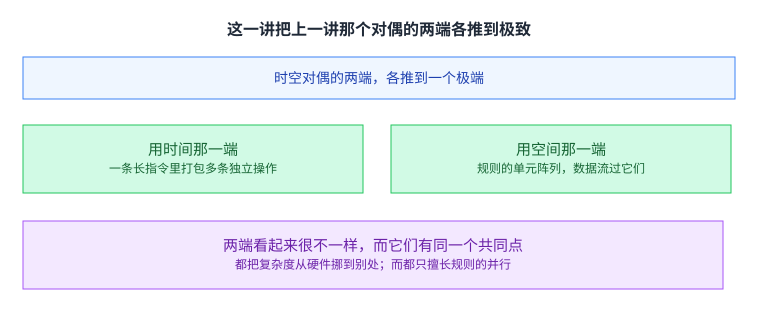

我在本仓库第 27 讲里写过那个时空对偶：阵列处理器用空间（多个单元在同一时刻各做一份），向量处理器用时间（同一个单元在连续几个时刻各做一份）。

这一讲的两半正好落在那两端，而且各自都推到了极端。

一半是 VLIW，它落在「用时间」那一端。它的做法是把多条彼此独立的操作打包成一条很长的指令，让硬件一次取下、一次发射。这里「用时间」的意思是：在一个周期里同时开始好几件不同的活，而这几件活是横向铺开的。

另一半是脉动阵列，它落在「用空间」那一端，而且比第 27 讲里那些阵列走得更远：不是一个执行单元对多份数据，而是一整片规则的单元，数据像心跳一样一格一格地流过它们。

两端看起来很不一样，而它们有同一个共同点：都把复杂度从硬件挪到了别处。 VLIW 挪给了编译器，脉动阵列挪给了设计与编程。而两者也都只擅长规则的并行，也都因此换来了[[term:energy-efficiency]] 上的好处。

## 先看这一讲在一串办法里的位置

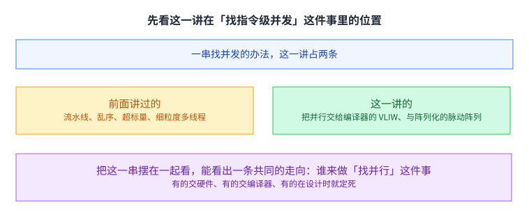

讲义先列了一串「找指令级并发」的办法：[[term:pipeline]] 化、[[term:fine-grained-multithreading]]、乱序执行、数据流、超标量、VLIW、脉动阵列、解耦访存执行、以及单指令多数据。

这一讲讲的是其中两条。前面那些讲里已经出现过流水线、乱序、超标量与细粒度多线程。

把这一串摆在一起看，能看出一条共同的走向：谁来做「找并行」这件事。 有的交给硬件（乱序执行、超标量），有的交给编译器（VLIW），有的在设计时就定死（脉动阵列）。这一讲的两半正好是后两种。

## VLIW 与超标量的区别，就在「谁来查依赖」

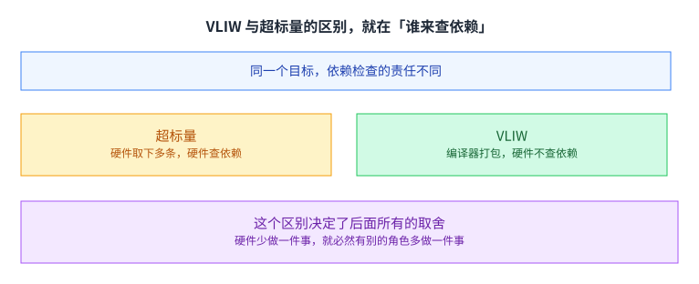

讲义把两者并排对照。

超标量：硬件取下多条指令，并且硬件检查它们之间的依赖。这一支属于[[term:speculation]] 那一大类：把判断放在运行期、由硬件来做。

VLIW：编译器把彼此独立的指令打包成一个更大的包，硬件取下这个包并行执行，而且不需要在包内做依赖检查。

这个区别决定了后面所有的取舍。硬件少做一件事，就必然有别的角色多做一件事。 这句话在这一讲里被用了两次：VLIW 那次是把活推给编译器，脉动阵列那次是把活推给设计者。

## 长指令里装的是什么

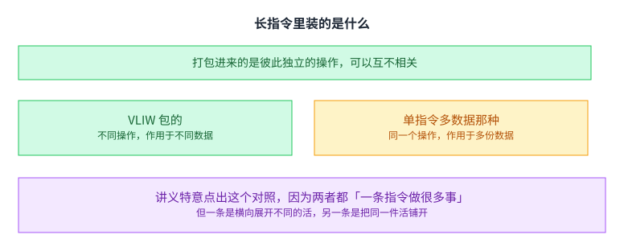

一条长指令由编译器把多条彼此独立的指令打包而成，而且这些指令在逻辑上可以毫无关系。

这与单指令多数据形成鲜明对照：后者是同一个操作作用在多份数据上。

讲义特意点出这个对照，因为两者都「一条指令做很多事」，但一条是横向展开不同的活，另一条是把同一件活铺开。这个区别决定了它们对程序形状的要求完全不同：单指令多数据要的是（同一操作的）数据并行，而 VLIW 要的是（任意操作的）指令级并行。

## 锁步执行：一个卡住，全都卡住

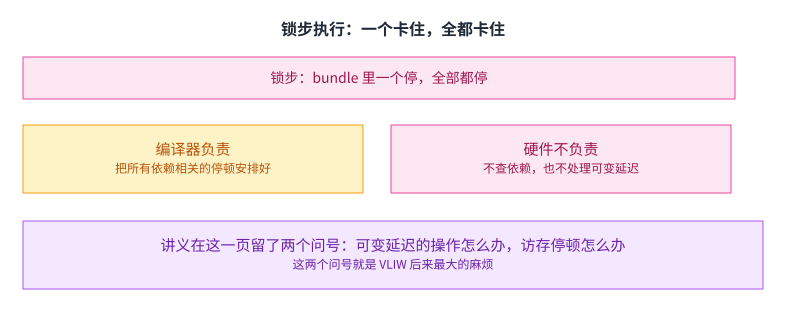

讲义给了一条很硬的性质：长指令里的任何一个操作停顿，所有并行操作都跟着停顿。

在真正的 VLIW 机器里，与依赖相关的停顿全部由编译器处理，硬件不做依赖检查。

而讲义在这一页留了两个问号：可变延迟的操作怎么办，访存停顿怎么办。

这两个问号就是 VLIW 后来最大的麻烦。 编译器可以在编译期安排好固定延迟的操作，但访存的延迟是变化的、而且通常很长。锁步意味着整条包要等那个最慢的操作，于是它最需要宽容的地方恰恰最不容忍。

## 它的哲学：聪明的编译器，笨的机器

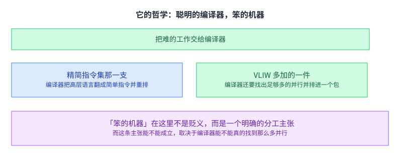

讲义把它归到与精简指令集同一支哲学上：让编译器做那些难的工作，硬件只做很少的翻译与译码。

精简指令集那一支的做法是编译器把高层语言翻成简单指令、并为性能把指令重排。而 VLIW 在这一条之外多加了一件：编译器还要找出足够多的并行，并把它们排进同一个包。

「笨的机器」在这里不是贬义，而是一个明确的分工主张。而这条主张能不能成立，取决于编译器能不能真的找到那么多并行，以及找到的并行能不能在真实程序里持续存在。

## 这笔买卖的两面

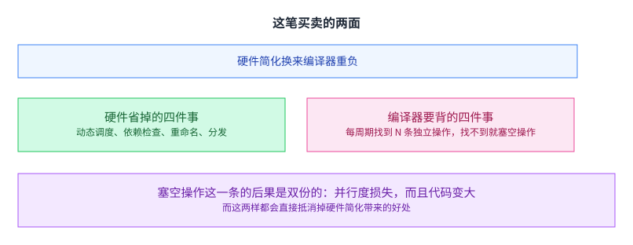

好处是硬件大幅简化。讲义列了四件省掉的事：不需要动态调度硬件、不需要包内依赖检查、不需要寄存器重命名、取指之后也不需要把指令分发给不同的功能单元。

代价全压在编译器那一侧：它每个周期都要找到 N 条彼此独立的操作，找不到就得塞空操作。

塞空操作这一条的后果是双份的：并行度损失，而且代码变大。 而这两样都会直接抵消掉硬件简化带来的好处。这一条也解释了为什么 VLIW 在通用计算上一直没有赢：通用程序里的指令级并行，平均而言并不足以把每一条包都填满。

## 而它其余的麻烦都来自「静态」这两个字

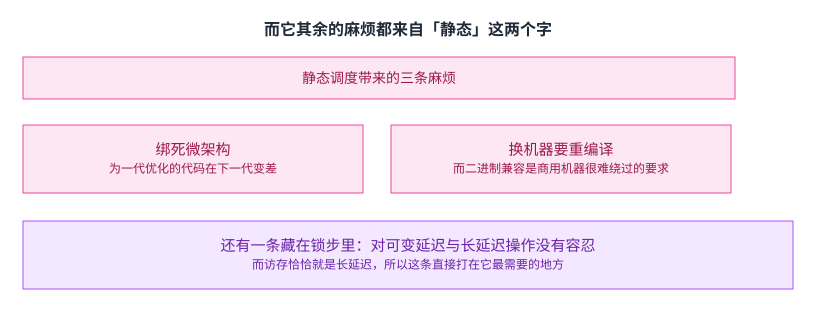

讲义把 VLIW 的短板列了一串，而它们可以归到一个根上：调度是编译期定死的。

于是它与那一代的[[term:microarchitecture]] 绑得很紧：为上一代优化的代码在下一代上会变差，而且换机器必须重编译。这与[[term:cache]] 那种「硬件自适应」的路线正好相反。而二进制兼容恰恰是商用机器很难绕过的要求——这也解释了为什么那些真正卖出去的 VLIW 机器，大多需要用某种翻译层来兼容既有的指令集。

还有一条藏在锁步里：它对可变延迟与长延迟操作没有容忍。而访存恰恰就是长延迟，所以这一条直接打在它最需要的地方。

## 而它并没有白讲：两条线索留了下来

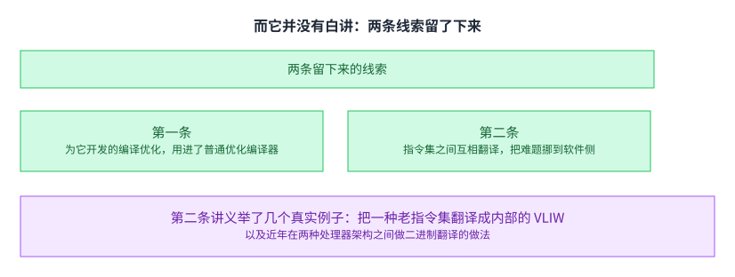

讲义在 VLIW 这一半的最后给了两条线索。

第一条：为 VLIW 开发的那些编译优化，后来大多被用进了面向超标量的优化编译器。也就是说，那批技术没有随架构一起消失，而是换了宿主。

第二条：把一种 [[term:ISA]] 翻译成另一种实现指令集的这件做法。讲义举了几个真实例子：把一种既有的商用指令集翻译成内部的 VLIW，以及在两种处理器架构之间做二进制翻译。

第二条线索值得多想一层。它说明「谁来承担复杂度」这个问题可以有第三种答案：既不压在硬件上，也不压在编译器上，而是压在运行时的翻译层上。而这个答案的代价也很清楚：翻译本身要花时间与功耗。

## 脉动阵列：心脏、血液与细胞

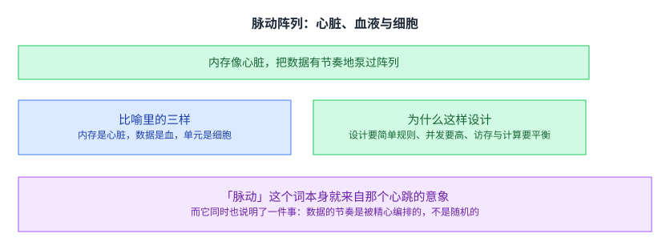

讲义用了那位提出者自己的比喻：内存是心脏，数据是血，处理单元是细胞。 数据从内存里以有节奏的方式流出，穿过许多处理单元之后再回到内存。

它给的设计目标是三条：设计要简单规则（独一份的部件尽量少）、并发要高、以及访存与计算要平衡。

「脉动」这个词本身就来自那个心跳的意象。而它同时说明了一件事：数据的节奏是被精心编排的，不是随机的。 这一点是后面所有优缺点的来源。

## 它和流水线差在哪

讲义专门列了几条区别。

这里的一个单元是一个完整的处理单元，而不是一个流水级；阵列结构可以是非线性、多维的；连接可以是多方向的、速度也可以不同；而单元还可以带本地存储、执行一个内核（而不是只执行指令的一小段）。

第一点与第二点合起来说明：它的「空间」是真的二维空间，而不是「把一条流水线加深」。这一点让它超出了前面那些讲的框架，也解释了为什么它需要一个不同的编程模型。

## 它擅长的活：卷积，以及把矩阵乘铺在阵列上

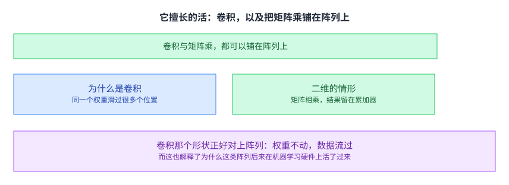

讲义用卷积做例子，因为它是滤波、模式匹配、相关、多项式求值这些活的基本形状（讲义还顺带指出，卷积网络里可以有成百上千层这样的运算）。

而二维的情形是把两个矩阵相乘，结果留在各个单元的累加器里。

卷积那个形状正好对上阵列：权重不动，数据流过。 同一个权重滑过很多个位置，而每个位置的计算可以交给一个单元。这也解释了为什么这类阵列后来在机器学习硬件上活了过来：那类运算的形状天生就是规整的。

## 它的优点与代价，其实是同一条性质的两面

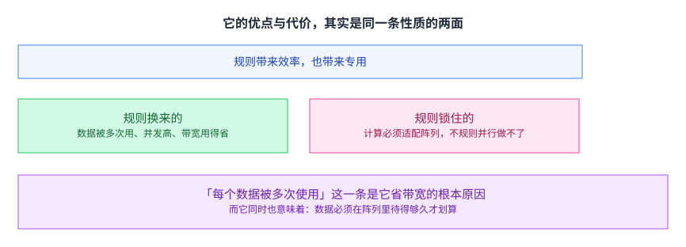

优点：每个数据被多次使用（减少取回）、并发高、设计规则（数据流与控制流都规则）、以及把计算与访存[[term:bandwidth]] 平衡起来。带宽在这里是被省下来的那一项，而这一条也可以用[[term:operational-intensity]] 那个量来读：每个数据被用多次，就等于把计算强度抬高了。

缺点：它比较专用。计算必须能对上单元的组织与功能，而且不擅长不规则的并行。

「每个数据被多次使用」这一条是它省带宽的根本原因。而它同时也意味着：数据必须在阵列里待得够久才划算。 如果每个数据只用一次，那么让它绕经阵列反而更贵。这又是那种「收益与规模成正比」的形状。

## 从一台实验机器到一个时代的硬件

讲义给了一老一新两组例子。

老的那台是八十年代中期那台线性阵列计算机：十个单元，每个单元是一颗 10 Mflop 的可编程处理器，接在通用主机上，配了高层语言与优化编译器，被大量用来加速视觉与机器人任务。

后来那些是把矩阵运算做成阵列硬件的机器学习加速器。讲义列了那条产品线从第一代到第四代的规模变化，并指出第四代在 2021 年达到每芯片 250 TFLOPS（第三代是 90）。它还把同一个思路推到了整片晶圆那么大的规模。

同一个设计想法，隔了三十多年重新成为主流。 而原因不在器件，而在负载：当年需要它的负载是视觉与机器人，而今天的负载是矩阵运算，后者对规则性的要求比前者更强。

## 读完应该能回答

1. VLIW 与脉动阵列分别落在上一讲那个时空对偶的哪一端。
2. VLIW 与超标量的区别在哪一件事上，这个区别决定了什么。
3. 锁步执行是什么意思，它给 VLIW 带来什么麻烦。
4. VLIW 的哲学与精简指令集那一支是什么关系，它多加了哪一件。
5. VLIW 的麻烦为什么可以归到「静态」这两个字上。
6. 脉动阵列里「脉动」这个意象说明了什么。
7. 脉动阵列的优点与缺点为什么是同一条性质的两面。

## 脉络回顾

这一讲是全课里关于「怎么找并行」这条线的收束点之一。前面几讲分别讲过：用流水线把一条指令流加深、用乱序执行在硬件里找并行、用细粒度多线程在多个线程之间换、用单指令多数据与图形处理器把同一件活铺开。这一讲补上的是这条线的两个端点：把找并行完全交给编译器（VLIW），以及把并行的形状在设计时就固定成一片阵列（脉动阵列）。

这两端与后面几讲的关系也要说清。这一讲的两半各自留下了后续：VLIW 那一半留下的线索是「把一种指令集翻译成另一种」，而那件事在最后一讲讲虚拟内存时还会以另一个面貌出现，也就是「抽象与实现之间的那层翻译该放在哪里」。脉动阵列那一半留下的线索是「为一种运算形状做一块专门的硬件」，而这正是往后所有加速器共同的做法。

本讲留下的三件工具会一直用：一是「谁来承担复杂度」这个提问方式（硬件、编译器、翻译层、还是设计者）；二是「锁步与宽容」这组对立（任何把多个操作绑在一起的做法，都要回答其中最慢的那个怎么办）；三是「数据被多次使用」这个判据（它同时解释了省带宽、也解释了为什么专用硬件必须让数据待得够久）。

要分清的是，留下来复用的是这三件工具，不是这两类机器本身：VLIW 作为一种独立架构在通用计算上没有成功，脉动阵列作为一种通用模型也没有；它们的想法分别以「编译器优化」与「专用加速器」的形式活了下来。下一讲会讲另一条完全不同的线，也就是存储层次向下的那一端。

## 溯源

- 对应：ETH Zürich Computer Architecture（Onur Mutlu 主讲，Fall 2022），Lecture 28 — VLIW and Systolic Array Architectures。

- 讲义链接：<https://safari.ethz.ch/architecture/fall2022/lib/exe/fetch.php?media=onur-comparch-fall2022-lecture28-vliw-systolic-array-architectures-beforelecture.pdf> 。文件名是 `beforelecture`，与 `docs/lecture-manifest.md` 第 30 行一致。

- 上游许可：站点级页脚为 CC BY-NC-SA 4.0。SA 是传染性的，所以本页译文也以同协议发布、且为非商业用途。本页未转载原讲义里的任何图片，配图全部自绘；只有图没有字的页，本页只如实记下标题。

- 证据来源（两份独立抽取，互为核对）：`eth-ca2022-lecture28-vliw-systolic.pdf.pypdfium2.txt`（`pypdfium2`，122 页、37,158 字符）与同目录 `.pypdf.txt`（`pypdf`，122 页、36,101 字符）。四道核验：8,473,126 字节、尾部有 `%%EOF`、不是 2 的整数次幂、也不是 64 KiB 的整数倍（余数 18,982）。

- 与第 27 讲的关系（正文里已经写明，这里再记一次以便核对）：第 27 讲给了时空对偶（阵列用空间、向量用时间）。本页把两端各推到一个极端：VLIW 落在「用时间」那一端（一个周期里横向展开多条不同的活），脉动阵列落在「用空间」那一端（一整片规则的单元，数据流过）。这一条对照也可以从[[term:transformation-hierarchy]] 的角度看：两者都是在同一层里换取并行度的不同摆法。需要说明的是，讲义本身没有把这两者摆在一起做这个对照：它在第 2 页把 VLIW 与脉动阵列列在同一串「找并发的办法」里，随后分两半各讲一半。所以「这一讲的两半正好是那个对偶的两端」这个说法属于 CourseLingo 的讲解，不是讲义的原话。

- 本讲取材范围是讲义的正文（p1 到 p82），附录（p83 之后的备份幻灯片，内容是快速宽取指引擎与分支预测干扰）不计入。包括：那一串找并发的办法与这一讲在其中的位置；VLIW 与超标量在依赖检查责任上的区别；长指令由编译器打包而成、包内指令可以互不相关、以及它与单指令多数据的对照；锁步执行与它引出的两个问号；VLIW 与精简指令集同源的哲学；硬件简化与编译器重负两侧的条目；静态调度带来的三条麻烦；VLIW 留下来的两条线索（编译优化被沿用、指令集之间的翻译）与讲义举的几个翻译实例；脉动阵列的心脏与血的比喻、它的三条设计目标、它与流水的四点差别；卷积与二维矩阵乘两个例子；它的优点与缺点；以及一老一新两组实例（八十年代那台线性阵列计算机，与后来把矩阵运算做成阵列硬件的加速器及其规模变化）。

- 数字与定义以讲义页面为准。讲义未展开的推论属于 CourseLingo 的讲解。这类推论分三组：把「硬件少做一件事、就必然有别的角色多做一件事」抽成这一讲的共同形状，并用它把 VLIW 与脉动阵列连起来；把「静态调度」讲成 VLIW 其余短板的共同根，并据此解释为什么那些真正卖出去的 VLIW 机器大多需要翻译层；以及把「每个数据被多次使用」讲成一个双向判据（既是省带宽的原因，也说明数据必须待得够久才划算）。本讲与前后讲次的对应关系，除了上面那条与第 27 讲的对照之外，其余属于我们的编排。

- 一处说明：讲义有多页只有标题与图或只有图（例如第 7、11、15、19、23、24、26、29 到 33、40、42、45 到 55、60 到 62、64、65、67、70 到 82 页里的若干页），文字层留下的是标题与零散标签。本页对这些页只依据可见的标题与文字描述，未依据图示复原结构，也未替讲义补数字或公式。
